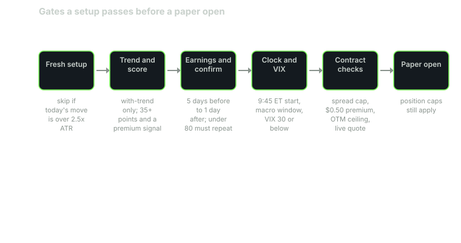

Phantom scans its watchlist many times a day. Most of what it sees never reaches Discord. That is by design.

A setup can score well and still be thrown out. The bots run a long series of gates. Some run before the score is final. Some run at the moment a paper trade would open. The trade-opening step alone has dozens of named skip checks.

This post walks through the ones that matter most, in roughly the order a setup meets them.

## Before the score: has it already moved?

The first check is a velocity skip. If the stock has already moved more than 2.5 times its normal daily range today (measured with ATR), the setup is skipped.

The idea is simple. A move that big has already happened. Chasing it is a different trade.

## Trade with the trend

Trade-with-trend is on by default. When the broad market trend is up, Phantom takes no PUTs. When it is down, it takes no CALLs.

The market trend is scored from three things: SPY against its 20-day average, market breadth, and SPY's daily change.

This gate removes a whole class of countertrend trades.

## The score bar

Next comes the scoring bar, covered in detail in the scoring post:

- At least 35 points.
- At least 3 agreeing signals, or 2 when one is a premium signal.
- At least one premium signal, always.

## Earnings blackout

The scanner skips any ticker from 5 days before its earnings report to 1 day after. Earnings can gap a stock far past a stop, and options are often priced for the event.

Tickers that have been suspended are skipped too.

## Confirm on the next scan

A setup scoring under 80 has to prove itself. It must appear again, in the same direction, on the next scan. If it flips from CALL to PUT, or the reverse, it is thrown away.

HIGH setups, at 80 or above, do not wait.

This filters out setups that only exist for one snapshot.

## Regular hours only

Phantom's scanner runs from premarket, but paper trades only open during regular hours, 9:30 a.m. to 4:00 p.m. ET.

## The first 15 minutes are blocked

The opening 15 minutes are blocked. The earliest open is 9:45 a.m. ET.

Spreads and prices are often at their least settled right after the open.

## The macro-event window

Around scheduled macro events, there is a no-entry window of 30 minutes before and 30 minutes after. A setup that lands inside that window is skipped.

## Entry cutoffs

Each trade type stops taking new entries at a set time:

- Day trades: 3:00 p.m. ET.
- Weeklies and LEAPs: 3:30 p.m. ET.

Scalps have their own fixed windows, which close at 3:45 p.m. ET.

## The VIX gate

The VIX is the market's gauge of expected volatility. Phantom checks it at the moment of entry:

- **VIX above 30:** skip the trade.
- **VIX above 25:** take it at one quarter size.
- **VIX above 20:** take it at half size.

Separately, the score itself is multiplied by 0.85 when the VIX is above 25. So high volatility hits a setup twice: a lower score, and a smaller position if it still passes.

## Spread caps

The bid-ask spread is the gap between what buyers pay and what sellers ask. A wide spread costs you on the way in and again on the way out.

Each type has a maximum spread, as a percent of the option's price:

- Scalps: 3%
- Default (day trades): 4%
- Weeklies: 7%
- LEAPs: 10%

Long-dated options often trade with wider spreads than short-dated ones, and the caps reflect that.

## Minimum premium

The option must cost at least $0.50. Very cheap contracts tend to have spreads that are large relative to their price.

## The out-of-the-money ceiling

There is a dynamic out-of-the-money limit per ticker. On top of that sits an absolute ceiling: the strike can be no more than 2.5% out of the money.

Contracts with 0 to 2 days to expiration that are out of the money are blocked entirely.

## No live quote, no trade

If the bot cannot get a live quote for the contract, it does not open the trade. It does not guess a price from stale data.

## Position caps

Each trade type has a limit on open paper positions:

- Day trades: 15
- Scalps: 8
- Weeklies: 8
- LEAPs: 5

All bots together are capped at 25 open positions. When a cap is full, new setups wait.

## A few more

Other checks run as well. A signal that has measured negative edge can be suppressed. An implied-volatility check compares the contract's IV against the 80th percentile of its last 30 days. Each of these can stop an open.

## Why this matters to you

When you see a quiet channel, it usually does not mean the bot is broken. It means:

- The market trend ruled out one direction.
- Or volatility was too high.
- Or spreads were too wide.
- Or the setup did not repeat on the next scan.

A quiet day is the gates doing their job.

It also means a card in Discord has already survived a lot. That is not a promise it will work. It means the obvious reasons not to take it were checked first.

Remember that every trade the bots open is on a paper account. The gates shape what gets paper-traded. They do not guarantee results.

## Sources

- Phantom Traders bot code (October 2026)
- Cboe, [VIX Index overview](https://www.cboe.com/tradable_products/vix/)
- Options Industry Council (OCC), [options education](https://www.optionseducation.org/)

*Educational content, not financial advice. Signals are paper-traded.*
