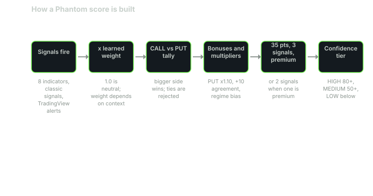

Every Phantom signal starts as a pile of points. The bot does not ask "is this a good chart?" It asks two narrower questions. How many points say up? How many say down?

This post walks through how those points are earned, adjusted and checked before anything reaches Discord. It covers Phantom Bot, the main scanner. Bullseye uses a different, simpler scorer.

## Two tallies, not one

Phantom keeps two running totals for each ticker: CALL points and PUT points. Each signal that fires adds to one side. When every signal is counted, the bigger side wins and sets the direction.

Two rules follow from that:

- A tie is rejected.
- A ticker with no signals is rejected.

The score is additive. It is not a percentage, and it has no hard cap at 100. Some summaries show it as "score/100" for familiarity, but a strong setup can run past 100. Read it as points, not percent.

## What can add points

Eight indicators were ported from public TradingView scripts. Each one has fixed base points:

| Indicator | What fires | Base points |
|---|---|---|
| Gaps | New gap up (CALL) or down (PUT); a gap being filled counts the other way | 15 new, 10 filled |
| UT Bot | Close crosses its ATR trailing stop | 15 |
| EMA stack | 50 EMA crosses the 200 (golden or death cross); 20 > 50 > 100 > 200 fan; price vs the 200 when no fan | 20, 8, 5 |
| AlgoAlpha Zero Lag | Entry re-cross; trend change | 15, 20 |
| Trend Reversal Probability | High reading (above 84%); extreme (above 98%) | 15, 20 |
| QQE MOD | Buy or sell signal | 15 |
| MACD_X | Trend; counter-trend; divergence | 12, 8, 18 |
| LuxAlgo SMC (structure breaks only) | Swing CHoCH; swing BOS; internal CHoCH; internal BOS | 20, 15, 10, 8 |

Classic signals add to the same tallies:

- RSI (20 or 8 points)
- Bollinger band touch (20)
- MACD (15)
- Volume surge (15)
- Stochastic, Williams %R, an inside-day breakout and a multi-timeframe RSI read

TradingView alerts count too. Each fresh alert from the last 30 minutes adds 15 points, up to five per ticker.

One signal is switched off by default. A Donchian channel breakout tested as anti-predictive, so it no longer scores.

## Points times a learned weight

Base points are not the final word. Each signal's points are multiplied by a learned weight before they count. A weight of 1.0 is neutral. Above 1.0 means the signal has earned more trust. Below 1.0 means less.

Weights can depend on context:

- **Market regime:** uptrend, downtrend, choppy, stretched overbought or stretched oversold.
- **VIX bucket:** low (below 15), normal (15 to 25) or high (above 25).
- **Time of day:** open, midday or close.

When several context weights exist, Phantom combines them with a geometric mean. If none exist, it uses the signal's overall weight. If that is missing too, the weight is 1.0. How the weights are learned is its own post.

## Adjustments after the tally

Once the raw sides are summed, a series of adjustments runs in order:

1. **PUT boost.** The PUT side is multiplied by 1.10.
2. **Agreement bonus.** If three or more signals agree, add 10 points.
3. **Cluster boost.** If the exact combination of three or more signals has a measured edge of at least 2 percentage points, at least 15 past samples, and held up in both halves of its test window, the score is multiplied up. The boost is capped at 1.30x. It never penalizes.
4. **Regime bias.** Risk-on markets multiply CALLs by 1.2 and PUTs by 0.7. Risk-off reverses that. Choppy markets multiply both sides by 0.7. Neutral leaves both at 1.0. A stretched market uses 1.1 or 0.75 depending on side.
5. **High VIX.** Above 25, the score is multiplied by 0.85.
6. **Momentum-chase penalty.** Multiplied by 0.85 when it applies.
7. **Per-ticker direction bias.** Each ticker has a favored side, which gets 1.05. The other side gets 0.90.
8. **Promoted rules.** Specific strategy rules can block a setup or boost it.
9. **Trend-tilt bonus.** Plus 8 points, tied to trend signals such as a new gap, UT Bot, a Zero Lag trend change and swing structure breaks.
10. **Time of day.** A final time-of-day multiplier.

Two optional layers can run afterward. A machine-learning blend (70% rule score, 30% model) applies only when a trained model is loaded. A news check can veto a setup or add 5 points, only when it is switched on.

## The bar a setup must clear

After all that, the winning side must pass three checks:

- **Score of at least 35.**
- **At least 3 agreeing signals.** Two are enough when one of them is a premium signal. That override is on by default.
- **At least one premium signal.** No exceptions.

Premium signals are the stronger reads. They include a new gap (gap-and-go), UT Bot, a golden or death cross, a Zero Lag trend change, an extreme Trend Reversal Probability reading, QQE MOD, MACD_X divergence and swing structure breaks (CHoCH and BOS).

There are more gates after scoring, such as trading with the market trend and avoiding earnings. Those are covered in the entry gates post.

## Confidence tiers

The final score sets the tier:

- **HIGH:** 80 or more. Posts to #day-trades with a role ping.
- **MEDIUM:** 50 to 79. Posts to #day-trades.
- **LOW:** below 50. Goes to #screener-drops instead.

When the machine-learning blend is active, the tiers are recalculated at 80 and 65.

One more rule matters here. A setup scoring under 80 must show up again, in the same direction, on the next scan. If it flips direction, it is discarded. HIGH setups skip that wait.

## A worked example

The numbers below are **illustrative**. They are made up to show the arithmetic. They follow the real rules but are not from a real trade.

Say ticker XYZ fires five signals on one scan.

CALL side:

- QQE MOD buy: 15 points, weight 1.1 = 16.5
- MACD_X trend buy: 12 points, weight 1.0 = 12.0
- Classic MACD: 15 points, weight 1.0 = 15.0
- Volume surge: 15 points, weight 0.9 = 13.5
- CALL total: **57.0**

PUT side:

- Trend Reversal Probability high reading, pointing down: 15 points, weight 1.0 = 15.0
- PUT boost x1.10: **16.5**

CALL wins, 57.0 to 16.5. Four signals agree, so add 10. The score is now 67.0. Assume no cluster boost, a neutral regime, normal VIX, and every other multiplier at neutral.

Now check the bar:

- 67.0 is above 35.
- Four agreeing signals is above three.
- QQE MOD is a premium signal.

The result is a MEDIUM CALL. Because it is under 80, it must repeat as a CALL on the next scan before it counts.

Change one input and the outcome changes. In a risk-on market, 67.0 x 1.2 = 80.4. That is HIGH, so it posts without waiting. In a choppy market, 67.0 x 0.7 = 46.9. It still clears 35, but it is LOW, so it lands in #screener-drops.

Same chart. Three different results. That is the point of the context layers.

## What to take from this

You do not need to rebuild the math to use the signals. Keep three ideas:

- A score is points from agreeing signals, adjusted for the market. It is not a probability.
- A premium signal is always required.
- The same setup can score very differently in different regimes.

All Phantom signals are traded on a paper account. Scores describe how strongly signals agree. They do not promise an outcome.

## Sources

- Phantom Traders bot code (October 2026)
- Original indicator authors' public TradingView pages, including [LuxAlgo](https://www.tradingview.com/u/LuxAlgo/) and [AlgoAlpha](https://www.tradingview.com/u/AlgoAlpha/)
- Cboe, [VIX Index overview](https://www.cboe.com/tradable_products/vix/)

*Educational content, not financial advice. Signals are paper-traded.*
