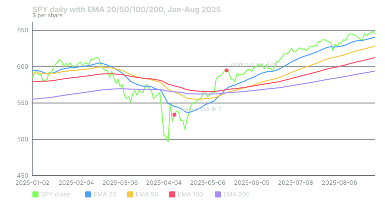

## What it measures

A moving average smooths price so you can see the trend underneath the noise. Short averages follow price closely. Long averages move slowly and show the bigger picture.

The EMA stack puts four of them on one chart: 20, 50, 100 and 200 days. Then it asks three questions.

- **Are the averages lined up?** When the 20 is above the 50, the 50 above the 100, and the 100 above the 200, every timeframe agrees the trend is up. That is a bullish "fan." The reverse order is a bearish fan.
- **Did the 50 just cross the 200?** Crossing up is the famous golden cross. Crossing down is the death cross.
- **Is price above or below the 200?** This is the simplest long-term trend filter there is.

The bots compute this on daily bars, using closing prices.

## How it is calculated

An EMA, or exponential moving average, gives recent days more weight than old ones.

1. Pick a length, n. The weight on today's close is k = 2 ÷ (n + 1).
2. Start with the simple average of the first n closes.
3. Each day after that: EMA = close × k + yesterday's EMA × (1 − k).

For the 200-day EMA, k = 2 ÷ 201, about 0.01. Today's close moves it by about 1% of the gap between price and the average. That is why it moves so slowly.

The signals then compare the four EMAs.

- **Golden cross:** yesterday the 50 was at or below the 200. Today it is above.
- **Death cross:** yesterday the 50 was at or above the 200. Today it is below.
- **Bullish fan:** 20 > 50 > 100 > 200. **Bearish fan:** 20 < 50 < 100 < 200.
- **Price vs 200:** today's close above or below the 200-day EMA.

## When it fires in the bots

| Signal | How often it fires | Points |
|---|---|---|
| Golden cross | Once, on the day of the cross | +20 CALL |
| Death cross | Once, on the day of the cross | +20 PUT |
| Bullish fan | Every day the order holds | +8 CALL |
| Bearish fan | Every day the order holds | +8 PUT |
| Close above the 200 | Every day, only if the bullish fan is not firing | +5 CALL |
| Close below the 200 | Every day, only if the bearish fan is not firing | +5 PUT |

The last two rows avoid double counting. When the fan is already bullish, price is almost always above the 200. So the bots score the fan and skip the weaker +5.

The golden and death crosses are premium signals. A setup needs at least one premium signal before it can post. The crosses also qualify for the bots' 8-point trend bonus.

The points are multiplied by a learned weight before they count. For these signals the weight starts at 1.0. It changes only as the bots' own paper trades build a record.

## Worked example

SPY, January to August 2025. Daily bars from Yahoo Finance. The EMAs below use every bar since January 2022, so they are fully warmed up.

The year started with a bullish fan. It broke on March 4, when SPY fell and the 20 dropped below the 50. From then the order was mixed.

**April 11, 2025: death cross.**

- April 10: EMA 50 = $566.13, EMA 200 = $565.69. The 50 was above.
- April 11: EMA 50 = $564.87, EMA 200 = $565.37. The 50 is now below. **+20 PUT.**
- Close: $533.94. That is below the 200 at $565.37. The fan was mixed, so the price check also counts. **+5 PUT.**
- Total from this indicator: 20 + 5 = **25 PUT points.**

**May 19, 2025: golden cross.**

- May 16: EMA 50 = $562.82, EMA 200 = $563.66. The 50 was below.
- May 19: EMA 50 = $564.07, EMA 200 = $563.97. The 50 is now above, by ten cents. **+20 CALL.**
- Close: $594.85, above the 200. The fan was still mixed, because the 50 sat below the 100 ($568.44). **+5 CALL.**
- Total: **25 CALL points.**

**June 3, 2025: bullish fan.**

- EMA 20 = $582.14, EMA 50 = $572.24, EMA 100 = $572.10, EMA 200 = $566.31.
- 582.14 > 572.24 > 572.10 > 566.31. **+8 CALL**, and it kept firing every day the order held.
- From this day the +5 for price above the 200 stops counting.

Now look at the timing. SPY's lowest close of the spring was $496.48 on April 8. The death cross came three days after that low. By the golden cross on May 19, SPY was already about 20% above the April 8 close. Moving-average crosses confirm a move. They rarely catch the start of one.

## How to read it yourself

Add four EMAs to a daily chart: 20, 50, 100 and 200. Then check them in this order.

1. **Price vs the 200.** Above it, the long-term trend is up. Below it, down. This is the background for everything else.
2. **The fan.** Clean order means all four timeframes agree. Tangled lines mean the market is changing its mind.
3. **The gap between the 50 and the 200.** A cross with the lines ten cents apart, like May 19, is fragile. Lines that are spreading apart show a trend gaining strength.
4. **The slope of the 200.** A cross while the 200 is still falling is weaker than one where it has flattened or turned.

## Known weaknesses

**Lag.** This is built in. A 200-day average needs months of price to turn. Both crosses in the example came long after the turning point.

**Whipsaw near a cross.** When the 50 and 200 run close together, they can cross back and forth within days. Each cross scores 20 points.

**The result depends on how much history is loaded.** An EMA starts from a simple average of its first n closes. Start the calculation on a different day and you get slightly different values. With four years of history, the golden cross printed on May 19. In a replication that rebuilds the averages each day from only the last 250 bars, about a year, it printed on May 22 and again on May 23. Your charting platform, with decades of history, may disagree with both by a day or two.

**The bar may not be finished.** The bots scan during the session. Mid-session, today's close is just the latest price. A cross that shows at noon can be gone by the close.

**Fan points add up quietly.** The fan fires every day it holds. In a long uptrend that is a steady +8 on the CALL side, which tilts the score toward calls whether or not anything new happened.

## Credit

Exponential moving averages are standard tools with no single author. The 20/50/100/200 set is a common community template on TradingView. The golden and death cross are long-standing market terms. The bots' scoring rules, including the no-double-count rule, are their own.

## Sources

- Yahoo Finance, SPY historical data: https://finance.yahoo.com/quote/SPY/history/
- TradingView, Exponential Moving Average: https://www.tradingview.com/support/solutions/43000592270-exponential-moving-average/
- Phantom Traders bot code (October 2026)

*Educational content, not financial advice. Signals are paper-traded.*
