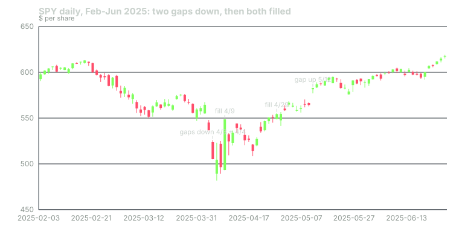

## What it measures

A gap is empty space on the chart. One bar ends, and the next bar starts somewhere else, with no trading in between.

The bots use a strict version of that idea. A gap only counts when today's whole range clears yesterday's range. For a gap up, today's low must sit above yesterday's high. For a gap down, today's high must sit below yesterday's low.

That is not the same as "opened above yesterday's close." A stock can open sharply lower, trade back into yesterday's range by lunch, and leave no gap at all under this definition.

The indicator tracks two events:

- **A new gap.** Price jumped and did not look back.
- **A filled gap.** A later bar travelled all the way back across the empty space to the far side.

The bots compute this on daily bars.

## How it is calculated

Step one is a size filter, so that tiny gaps are ignored.

1. Take the high minus the low of each of the 14 bars before today. Average them. That is the average daily range.
2. Multiply by 0.30. That is the minimum gap size.

Step two is the gap test.

- **Gap up:** today's low minus yesterday's high is at least the minimum. The gap zone runs from yesterday's high up to today's low.
- **Gap down:** yesterday's low minus today's high is at least the minimum. The zone runs from today's high up to yesterday's low.

Step three is the fill test. The bots keep every gap from the last 50 bars that is still open.

- A gap up is filled when a later bar's low reaches yesterday's high, the bottom edge of the zone.
- A gap down is filled when a later bar's high reaches yesterday's low, the top edge of the zone.

A partial fill does not count. Price has to cross the whole zone. Each gap can be filled only once. Gaps older than 50 bars are dropped.

## When it fires in the bots

| Event | What happened | Points |
|---|---|---|
| New gap up | Today's low cleared yesterday's high by the minimum | +15 CALL |
| New gap down | Today's high stayed below yesterday's low by the minimum | +15 PUT |
| Gap up filled | Price fell back through an open gap up | +10 PUT |
| Gap down filled | Price rose back through an open gap down | +10 CALL |

Notice the direction of the fill signals. A filled gap scores against the original gap.

The logic is simple. A gap up says buyers were eager enough to skip a whole price zone. If price later falls back through that zone, those buyers have given it all back. The bots read that as a bearish reversal. A filled gap down is the mirror: sellers drove price through empty space, and buyers took it all back.

New gaps count as premium signals. A setup needs at least one premium signal before it can post. New gaps also qualify for the bots' 8-point trend bonus. Fills do neither.

The points are multiplied by a learned weight before they count. For this indicator the weight starts at 1.0. It changes only as the bots' own paper trades build a record.

## Worked example

SPY, February to June 2025. Daily bars from Yahoo Finance.

**April 3, 2025: new gap down.**

- The 14 bars before April 3 had an average range of $8.535.
- Minimum gap: 0.30 × 8.535 = $2.56.
- April 2 low: $554.81. April 3 high: $547.97.
- Gap: 554.81 − 547.97 = $6.84.
- 6.84 is at least 2.56, so this is a new gap down. **+15 PUT.**
- The open zone runs from $547.97 to $554.81.

**April 4, 2025: another new gap down.**

- Average range: $8.459. Minimum: 0.30 × 8.459 = $2.54.
- April 3 low: $536.70. April 4 high: $525.87.
- Gap: 536.70 − 525.87 = $10.83. **+15 PUT.**
- The new zone runs from $525.87 to $536.70.

**April 7: no gap.** SPY opened at $489.19, well below the April 4 low of $505.06. But it traded up to $523.17 that day. The bar overlapped April 4's range, so it does not count.

**April 9, 2025: gap down filled.**

- April 7 and April 8 highs were $523.17 and $524.98. Both stayed under $536.70, so the April 4 gap was still open.
- On April 9, SPY's high reached $548.62.
- 548.62 is above 536.70, the top of the April 4 zone. **+10 CALL.**
- SPY closed at $548.62, up from $496.48 the day before.

**April 29, 2025: the older gap fills too.** The April 3 zone topped out at $554.81. No high between April 10 and April 28 reached it; the best was $553.55. On April 29 the high was $555.45. Another **+10 CALL**.

**May 12, 2025: new gap up.** Low $577.04, prior high $567.50. Gap: $9.54. Minimum: 0.30 × 8.294 = $2.49. **+15 CALL.**

These points are one input. Whether a setup posted on any of these days depended on every other signal and gate that day.

## How to read it yourself

TradingView has a built-in Gaps indicator. Its default minimal deviation, 30%, uses the same size rule as the bots.

Then ask three questions of every gap.

1. **Did the bar's whole range clear the prior bar?** An opening gap that trades back into yesterday's range is not a gap here.
2. **Is the zone still open?** Look left for unfilled boxes. Those are the levels the fill test is watching.
3. **What filled it, and how fast?** A fill one day later is a sharp rejection. A fill three weeks later, like April 29, is often just a market recovering.

Context matters more than the gap itself. A gap down on a market-wide shock, like April 2025, is not the same event as a gap on one company's news.

## Known weaknesses

**The bar may not be finished.** The bots scan during the session. When they do, today's daily bar is still forming. A new gap at 10 a.m. can be filled by 2 p.m., and a fill can appear and vanish within the day. What you see on the closed chart may not match what a mid-session scan saw.

**Big market days produce clusters.** April 3 and April 4 each scored +15 PUT. Then April 9 and April 29 each scored +10 CALL. In a violent week, the indicator fires on both sides within days.

**Fills are all-or-nothing.** A gap that is 95% filled scores nothing. A gap that is barely touched on its far edge scores the full 10 points.

**The memory is short.** After 50 bars, an open gap is forgotten. A level traders still watch can drop out of the calculation.

**The size filter moves.** The minimum gap was $2.56 on April 3 and $4.15 by April 9, because the average range grew. The same dollar gap can count one week and not the next.

**No volume, no news.** The indicator cannot tell an earnings gap from a holiday-thin open. The bots do skip tickers around earnings, but the gap logic itself knows nothing about why price moved.

## Credit

The gap and size logic follows TradingView's built-in **Gaps** indicator. Its "Minimal Deviation (%)" input defaults to 30% of the average high-low range of the last 14 bars. The bots' port adds the 50-bar memory and the fill-as-reversal scoring.

## Sources

- Yahoo Finance, SPY historical data: https://finance.yahoo.com/quote/SPY/history/
- TradingView, Gaps indicator: https://www.tradingview.com/support/solutions/43000675999-gaps/
- Phantom Traders bot code (October 2026)

*Educational content, not financial advice. Signals are paper-traded.*
