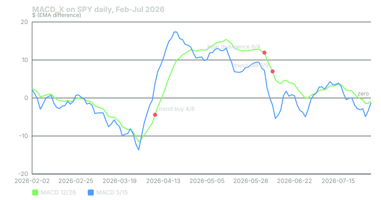

## What it measures

The MACD measures momentum as the distance between a fast and a slow moving average. When the fast average pulls above the slow one, momentum is up. When it falls below, momentum is down.

MACD_X runs two of them side by side.

- **The slow MACD:** 12-day EMA minus 26-day EMA. This is the classic MACD.
- **The fast MACD:** 5-day EMA minus 15-day EMA. It reacts in days, not weeks.

Comparing them tells you whether short-term momentum is turning before, with, or against the bigger picture. MACD_X also looks for divergence: price making a new extreme while momentum does not.

The bots compute this on daily bars, using closing prices. MACD values are in dollars, so they scale with the price of the stock.

## How it is calculated

An EMA weights recent closes more heavily. For a length n, today's EMA = close × 2 ÷ (n + 1) + yesterday's EMA × (1 − 2 ÷ (n + 1)).

- Slow MACD = EMA(12) − EMA(26).
- Fast MACD = EMA(5) − EMA(15).

No signal line or histogram is used. The signals come from zero crosses, crosses between the two lines, and turning points.

For divergence, the bots find turning points with a five-bar rule. A pivot low is a close lower than the two closes before it and the two after it. A pivot high is the mirror. The same rule finds pivots on the slow MACD line.

## When it fires in the bots

| Signal | Condition | Points |
|---|---|---|
| Trend buy | Fast MACD crosses above zero; slow MACD is below zero, rising, and below the fast line | +12 CALL |
| Trend sell | Fast MACD crosses below zero; slow MACD is above zero, falling, and above the fast line | +12 PUT |
| Counter-trend buy | Fast MACD crosses above the slow MACD while the fast line is below zero | +8 CALL |
| Counter-trend sell | Fast MACD crosses below the slow MACD while the fast line is above zero | +8 PUT |
| Bullish divergence | Last two price pivot lows: lower low. Last two slow-MACD pivot lows: higher low | +18 CALL |
| Bearish divergence | Last two price pivot highs: higher high. Last two slow-MACD pivot highs: lower high | +18 PUT |

For divergence, the more recent of the two latest pivots must be no more than 10 bars old.

Only divergence is a premium signal. A setup needs at least one premium signal before it can post.

The points are multiplied by a learned weight before they count. For these signals the weight starts at 1.0. It changes only as the bots' own paper trades build a record.

## Worked example

SPY, February to July 2026. Daily bars from Yahoo Finance.

**March 31, 2026: counter-trend buy.** Both lines were deep below zero during the March selloff.

- Yesterday: fast −13.679, slow −11.491. Fast was below slow.
- Today: fast −10.162, slow −10.783. Fast is now above slow.
- Fast is still below zero. **+8 CALL.** SPY closed at $650.34.

The same signal had also fired on March 25.

**April 8, 2026: trend buy.**

- Fast MACD went from −0.528 to +3.839. It crossed above zero.
- Slow MACD was −4.408, up from −6.600. Rising: yes.
- Slow is below zero: yes. Slow (−4.408) is below fast (3.839): yes.
- All four conditions hold. **+12 CALL.** SPY closed at $676.01.

**June 4, 2026: bearish divergence.**

- Price pivot highs: May 14 close $748.17, then June 2 close $759.57. A higher high.
- Slow MACD pivot highs: May 14 at 15.424, then June 2 at 12.840. A lower high.
- Price pushed higher on less momentum. The latest pivot, June 2, is two bars old. That is within 10. **+18 PUT.** SPY closed at $757.09.

Why June 4 and not June 2? A pivot needs two closes after it to be confirmed. June 3 and June 4 supplied them.

**June 9, 2026: trend sell, on top of the divergence.**

- Fast MACD went from +0.015 to −1.907. It crossed below zero.
- Slow MACD was 7.001, down from 8.461. Falling, above zero, and above the fast line.
- **+12 PUT** for the trend sell, plus **+18 PUT** for the divergence, which was still active. That is 30 PUT points from MACD_X alone. SPY closed at $737.05.

The bearish divergence fired on every session from June 4 to June 16, nine days in a row. It stopped only when the June 2 pivot became more than 10 bars old.

Whether a setup posted on any of these days depended on every other signal and gate that day.

## How to read it yourself

Plot two MACDs on a daily chart: 12/26 and 5/15. You can hide the signal lines.

1. **Find the zero line.** Above it, the averages say up. Below it, down.
2. **Watch the fast line lead.** When it crosses zero while the slow line is still on the other side but turning, momentum is shifting. That is the trend entry.
3. **Treat counter-trend crosses as early and fragile.** A fast line crossing the slow line deep below zero, as on March 31, is a bounce signal, not a trend.
4. **Check divergence by eye.** Mark the two latest closing highs or lows and the matching MACD peaks or troughs. Make sure they line up in time.

## Known weaknesses

**Divergence is confirmed late and lasts long.** A pivot needs two later bars, so divergence shows up at least two days after the turning point. Then it keeps firing for up to 10 bars, adding 18 points each day.

**The pivots do not have to match.** The bots compare the last two price pivots with the last two MACD pivots, wherever they fall. In early December 2025, a bearish divergence fired from price pivots on November 12 and 28 against MACD pivots on November 3 and 12. A trader would not draw that as one divergence.

**Both divergences can fire at once.** On December 31, 2025 and several days in September 2026, the bullish and bearish checks were both true. They cancel out in direction but both add points.

**The fast line whipsaws.** A 5/15 MACD crosses zero often in a flat market. Trend sells fired on January 20, February 4 and February 12, 2026, while SPY's close stayed between $677.58 and $695.49.

**Dollar units.** MACD is a price difference. A reading of 10 on SPY is not comparable to 10 on a $50 stock.

**The bar may not be finished.** The bots scan during the session. Crosses on a live bar can undo themselves by the close.

## Credit

The dual-MACD trend and counter-trend design comes from **Dreadblitz**'s open-source "Double MACD Buy and Sell" script on TradingView. The version the bots port is titled "DOBLE MACD X." Its divergence check is the bots' own simplified five-bar version. The MACD itself was developed by Gerald Appel.

## Sources

- Yahoo Finance, SPY historical data: https://finance.yahoo.com/quote/SPY/history/
- Dreadblitz, Double MACD Buy and Sell: https://www.tradingview.com/script/5cV2hGJk-Double-MACD-Buy-and-Sell/
- Phantom Traders bot code (October 2026)

*Educational content, not financial advice. Signals are paper-traded.*
