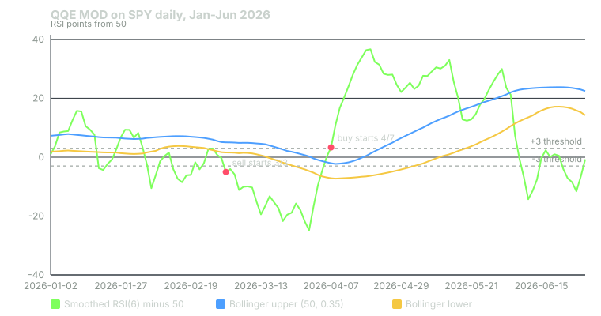

## What it measures

QQE MOD is a momentum indicator. At its core is the RSI, which rates recent gains against recent losses on a 0 to 100 scale. Above 50, gains have been winning. Below 50, losses have.

A raw RSI is jumpy, especially a fast one. QQE MOD smooths it, then builds a slower trailing line from it, then wraps that line in Bollinger Bands. A signal needs momentum to clear two hurdles at once: a fixed threshold around 50, and the upper or lower band.

When both hurdles are cleared, the original indicator paints a blue bar for buy or a red bar for sell. The bots count those bars.

The bots compute this on daily bars, using closing prices.

## How it is calculated

The bots use the original defaults.

**Step 1: a fast RSI.** RSI over 6 bars, with Wilder smoothing.

**Step 2: smooth it.** Take a 5-bar EMA of that RSI. Call it the smoothed RSI.

**Step 3: measure how much it moves.** Each day, take the absolute change in the smoothed RSI. Average those changes with an 11-bar EMA (2 × 6 − 1). Multiply by the QQE factor, 3.0. That is the band distance.

The original script averages the changes twice before multiplying. The bots' port averages them once. So the bots' trailing line can differ slightly from what TradingView draws.

**Step 4: the trailing line.** Like a trailing stop, it sits below the smoothed RSI in an uptrend and only moves up. In a downtrend it sits above and only moves down. It flips sides when the smoothed RSI crosses it.

**Step 5: the Bollinger Bands.** Subtract 50 from the trailing line. Over the last 50 bars, take its average (the basis) and its standard deviation.

- Upper band = basis + 0.35 × standard deviation.
- Lower band = basis − 0.35 × standard deviation.

**Step 6: the secondary QQE.** The original runs a second QQE with factor 1.61 and threshold 3. With the default settings, its smoothed RSI is the exact same series as the first one. The 1.61 factor only changes the second trailing line, which the bots do not use.

## When it fires in the bots

- **Buy:** smoothed RSI − 50 is above +3, **and** smoothed RSI − 50 is above the upper band. **+15 CALL.**
- **Sell:** smoothed RSI − 50 is below −3, **and** smoothed RSI − 50 is below the lower band. **+15 PUT.**

This is a state, not an event. It fires on every bar the condition holds.

QQE MOD is a premium signal. A setup needs at least one premium signal before it can post.

The points are multiplied by a learned weight before they count. For this indicator the weight starts at 1.0. It changes only as the bots' own paper trades build a record.

## Worked example

SPY, January to June 2026. Daily bars from Yahoo Finance.

**March 3, 2026: sell begins.**

- Smoothed RSI − 50: −5.035.
- Bollinger basis: 3.326. Band half-width: 1.719. Lower band: 3.326 − 1.719 = 1.607.
- −5.035 is below −3, and below 1.607. **+15 PUT.**
- SPY closed at $680.33.

The sell state held every day through April 1 as SPY fell. On April 2 the reading was −4.539, but the lower band had dropped to −6.516, so neither condition set was met.

**April 7, 2026: buy begins.**

- Smoothed RSI − 50: 3.329.
- Bollinger basis: −4.607. Band half-width: 2.543. Upper band: −4.607 + 2.543 = −2.064.
- Check one: 3.329 is above +3. Yes.
- Check two: 3.329 is above −2.064. Yes.
- Both hold. **+15 CALL.** SPY closed at $659.22.

Notice which hurdle was harder. The upper band was below zero, because the trailing line had spent a month in negative territory. The +3 threshold was the binding test, and the reading cleared it by 0.329.

The buy state then held every day through May 18. SPY closed at $738.65 that day. On May 19 the reading was 12.828 against an upper band of 16.091, and the buy state ended.

Now look at January and February on the chart. SPY's close stayed between $677.58 and $695.49. Over those 39 sessions, QQE MOD read buy on 14, sell on 10, and neither on 15. Each buy or sell day added 15 points to one side.

Whether a setup posted on any of these days depended on every other signal and gate that day.

## How to read it yourself

QQE MOD is open source on TradingView. Load it on a daily chart with the defaults: RSI 6, smoothing 5, factors 3 and 1.61, threshold 3, Bollinger 50 and 0.35.

1. **Read the colour.** Blue bars are the buy state. Red bars are the sell state. Grey is neither.
2. **Check where the bands sit.** If the bands are far above zero, a sell only needs the reading to drop below −3. If they are far below zero, a buy only needs +3. The bands follow recent history, so the hurdle moves.
3. **Watch the run, not the bar.** A single blue bar in a choppy market means little. A run of blue bars that survives a pullback says more.
4. **Pair it with structure.** QQE MOD tells you momentum direction. It does not tell you where support or resistance is.

## Known weaknesses

**It fires most days.** On SPY from January 2025 through September 2026, the condition held on 272 of 437 sessions: 160 buy days and 112 sell days. A signal that is on most of the time carries less information per day.

**Fast RSI, fast flips.** An RSI over 6 bars reacts to two or three days of movement. In a flat market it crosses ±3 often. That is the January and February pattern above.

**Moving hurdles.** Because the bands track the trailing line's last 50 bars, the same reading can count one week and not the next. On April 2, a reading of −4.539 did not count as a sell, while −5.035 did on March 3.

**Port differences.** The bots average the RSI's movement once, not twice. The bands and trailing line can therefore differ a little from the original on TradingView. The buy and sell tests themselves are the same.

**The bar may not be finished.** The bots scan during the session. A mid-day reading uses an incomplete bar and can change by the close.

## Credit

QQE MOD is by TradingView user **Mihkel00**, who modified **Glaz**'s earlier QQE script and added the Bollinger filter and the secondary QQE. It is open source on TradingView.

## Sources

- Yahoo Finance, SPY historical data: https://finance.yahoo.com/quote/SPY/history/
- Mihkel00, QQE MOD: https://www.tradingview.com/script/TpUW4muw-QQE-MOD/
- Phantom Traders bot code (October 2026)

*Educational content, not financial advice. Signals are paper-traded.*
