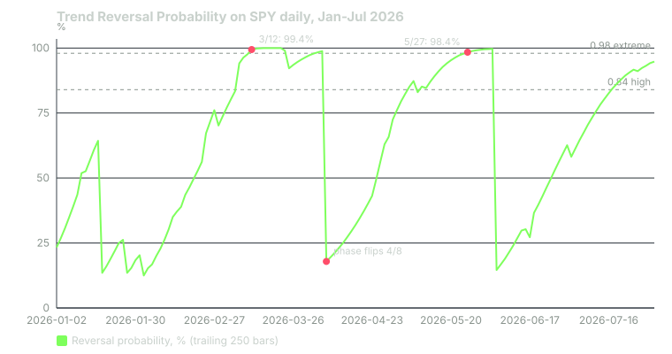

## What it measures

Trends do not last forever. Some run a week. Some run two months. Most land somewhere in between.

Trend Reversal Probability asks a simple question: is the current trend old compared with the trends that came before it? If most past trends ended after about 10 bars, and this one is 26 bars old, a reversal is "due."

The indicator turns that comparison into a number between 0 and 1. Above 0.84 is high. Above 0.98 is extreme.

Keep one thing in mind. This is a clock. It measures how long a phase has lasted. It does not measure how far price has moved.

The bots compute this on daily bars.

## How it is calculated

**Step 1: the oscillator.** Take the midpoint of each bar, (high + low) ÷ 2. Subtract its 34-bar simple average from its 5-bar simple average. This is the same construction as the Awesome Oscillator.

**Step 2: an RSI of the oscillator.** Each day, note how much the oscillator rose or fell. Average the rises and the falls separately with a 20-bar Wilder average. Turn them into an RSI-style reading, then subtract 50. The result swings around zero.

- Above zero: a bullish phase.
- Below zero: a bearish phase.

**Step 3: the phase clock.** Count the bars since that line last crossed zero. Every time it crosses, record how long the finished phase lasted.

**Step 4: the z-score.** z = (bars in the current phase − average past phase length) ÷ standard deviation of past phase lengths.

**Step 5: the probability.** Feed z into the normal distribution's cumulative function. A z of 1 gives about 0.84. A z of 2 gives about 0.98. That is where the two thresholds come from.

## When it fires in the bots

The signal points against the current phase. A long bearish phase suggests a bullish reversal, so it scores CALL. A long bullish phase scores PUT.

- **Probability above 0.84:** +15 points, opposite the current phase.
- **Probability above 0.98:** +20 more points.

Above 0.98, both conditions are true at once. So an extreme reading adds 15 + 20 = **35 points** to one side.

Only the extreme level is a premium signal. A setup needs at least one premium signal before it can post.

The signal fires on every bar the condition holds, not just the first one. A long phase can add points day after day.

The points are multiplied by a learned weight before they count. For this indicator the weight starts at 1.0. It changes only as the bots' own paper trades build a record.

## Worked example

SPY, January to July 2026. Daily bars from Yahoo Finance. Each day's value here is computed from the trailing 250 bars, about one year, which is roughly the history a daily scanner works from. Over this period the window held 10 to 18 finished phases.

**March 12, 2026: extreme, bullish.**

- The line was at −22.37. SPY was in a bearish phase.
- That phase was 26 bars old.
- The 16 finished phases in the window averaged 9.625 bars, with a standard deviation of 6.518.
- z = (26 − 9.625) ÷ 6.518 = 16.375 ÷ 6.518 = 2.512.
- Probability = normal CDF(2.512) = 0.994.
- 0.994 is above 0.84 and above 0.98. The phase is bearish, so the reversal is bullish. **+15 CALL and +20 CALL, 35 points.**
- SPY closed at $666.06.

The reading was early. SPY kept falling. It closed at $631.97 on March 30, about 5.1% lower. The probability stayed above 0.84 on every session from March 9 to April 7, and above 0.98 on 11 of them. The bearish phase finally ended on April 8, when the line crossed zero. SPY closed at $676.01 that day.

**May 27, 2026: extreme, bearish.**

- The line was at +1.31. SPY was in a bullish phase, 34 bars old.
- Past phases averaged 11.538 bars, standard deviation 10.529.
- z = (34 − 11.538) ÷ 10.529 = 2.133. Probability = 0.9835.
- **+15 PUT and +20 PUT, 35 points.** SPY closed at $750.46.

SPY rose to $759.57 by June 2. The phase ended on June 5, when SPY closed at $737.55.

The chart looks like a saw. The probability climbs steadily as a phase ages, then drops to near zero the day the line crosses. That shape is the clock at work.

Whether a setup posted on any of these days depended on every other signal and gate that day.

## How to read it yourself

The indicator is open source on TradingView. Add it to a daily chart with oscillator length 20.

1. **Read the phase first.** Is the line above or below zero? That tells you which way a reversal would go.
2. **Then read the probability as "how old is this phase."** 0.98 means unusually old, not 98% sure to reverse tomorrow.
3. **Look for price confirmation.** A high reading plus a break in price structure is more useful than a high reading alone.
4. **Watch the reset.** When the line crosses zero, the probability collapses. That cross is the actual phase change. The probability before it was a warning.

## Known weaknesses

**It is early by design.** An old trend can keep getting older. In March 2026 the extreme reading came on March 12. The low close came on March 30, 12 sessions and 5% later.

**It counts time, not distance.** A phase that drifts sideways for 30 bars scores the same as one that falls 10%.

**Small samples move the numbers.** With about a year of data, the average and standard deviation rest on 10 to 18 phases. When one old phase drops out of the window, they jump. On March 25, 2026, the standard deviation went from 10.1 to 15.9 overnight, and the probability fell from 0.990 to 0.922 with no change in price direction.

**Your chart will disagree.** On TradingView, the script keeps every phase since the start of your chart. The bots' version only sees the bars it is given. The same day can show a different probability.

**The bell curve is a rough fit.** Phase lengths are lopsided: many short ones, a few long ones. Treating them as normally distributed can make a long phase look rarer than it really is.

**Points pile up.** Because it fires every bar, one long phase can add 15 or 35 points to the same side for weeks.

## Credit

Trend Reversal Probability is by **AlgoAlpha**, published open source on TradingView under the Mozilla Public License 2.0. The bots port its oscillator, phase clock and probability, and use the original 0.84 and 0.98 alert levels.

## Sources

- Yahoo Finance, SPY historical data: https://finance.yahoo.com/quote/SPY/history/
- AlgoAlpha, Trend Reversal Probability: https://www.tradingview.com/script/7gnQovYe-Trend-Reversal-Probability-Algoalpha/
- Phantom Traders bot code (October 2026)

*Educational content, not financial advice. Signals are paper-traded.*
