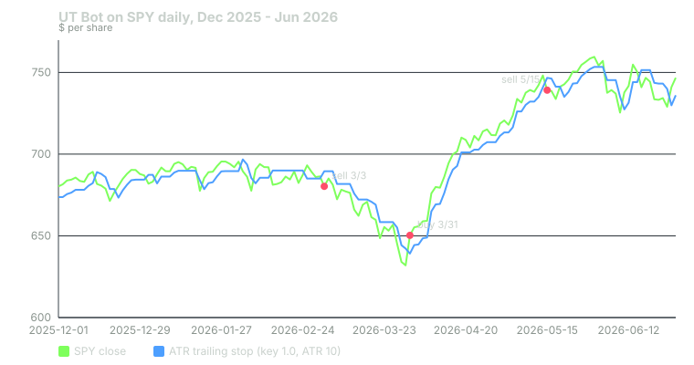

## What it measures

UT Bot is a trailing stop that follows price around. When price is rising, the stop sits below it and only moves up. When price is falling, the stop sits above it and only moves down.

A signal happens when price closes through the stop. That flips the stop to the other side. A close up through the stop is a buy. A close down through it is a sell.

The distance between price and the stop comes from volatility. Quiet markets get a tight stop. Wild markets get a loose one.

The bots compute this on daily bars, using closing prices.

## How it is calculated

**Step 1: measure volatility.** UT Bot uses the Average True Range (ATR) over 10 bars.

- The true range of a bar is the largest of three numbers: high minus low, high minus the prior close, and the prior close minus the low.
- The ATR is a Wilder-smoothed average of the true range. Each day: new ATR = (old ATR × 9 + today's true range) ÷ 10.

**Step 2: set the distance.** Distance = key value × ATR. The bots use a key value of 1.0, so the distance is exactly one ATR.

**Step 3: move the stop.** Each day, compare today's close and yesterday's close with yesterday's stop.

- **Both closes above the stop:** new stop = the higher of yesterday's stop and (close − distance). The stop can rise but never fall.
- **Both closes below the stop:** new stop = the lower of yesterday's stop and (close + distance). The stop can fall but never rise.
- **Price just crossed up:** the stop resets to close − distance.
- **Price just crossed down:** the stop resets to close + distance.

**Step 4: flag the cross.** A buy fires when yesterday's close was below yesterday's stop and today's close is above it. A sell is the mirror.

## When it fires in the bots

- **UT Bot buy:** +15 points to the CALL side.
- **UT Bot sell:** +15 points to the PUT side.

UT Bot is a premium signal. A setup needs at least one premium signal before it can post. It also qualifies for the bots' 8-point trend bonus.

The points are multiplied by a learned weight before they count. For this indicator the weight starts at 1.0. It changes only as the bots' own paper trades build a record.

UT Bot is the one indicator in this series that both bots use. Phantom Bot adds the 15 points to its additive score. Bullseye also scores it at 15 points, inside a score it scales to 100.

## Worked example

SPY, December 2025 to June 2026. Daily bars from Yahoo Finance.

**March 3, 2026: sell.**

- Yesterday's close: $686.38. Yesterday's stop: $685.04. Price was above the stop.
- Today's close: $680.33. That is below $685.04. The close crossed down. **+15 PUT.**
- ATR(10) today: $9.22.
- New stop: 680.33 + 1.0 × 9.22 = $689.55. The stop is now above price.

Through March, SPY kept falling. Each day both closes stayed below the stop, so the stop could only move down.

**March 31, 2026: buy.**

- Yesterday's close: $631.97. Yesterday's stop: $642.24. Price was below the stop.
- Today's close: $650.34. That is above $642.24. **+15 CALL.**
- ATR(10) today: $11.20. Volatility had grown since March 3.
- New stop: 650.34 − 1.0 × 11.20 = $639.14. The stop is now below price.

Through April and early May, SPY rose. The stop ratcheted up behind it.

**May 15, 2026: sell.**

- Yesterday's close: $748.17. Yesterday's stop: $740.90.
- Today's close: $739.17, below $740.90. **+15 PUT.**
- ATR(10): $7.57. New stop: 739.17 + 7.57 = $746.74.

Between the March 3 sell and the March 31 buy, SPY's close fell from $680.33 to $650.34, about 4.4%. Between the March 31 buy and the May 15 sell, it rose from $650.34 to $739.17, about 13.7%. Those are price moves, not trade results. Whether a setup posted on any of these days depended on every other signal and gate that day.

Now look at the left side of the chart. From December 12, 2025 to March 3, 2026, UT Bot flipped 11 times. SPY's close stayed between $671.40 and $695.49 the whole time. Each of those flips added 15 points to one side or the other.

## How to read it yourself

UT Bot is open source on TradingView. The default settings match the bots: key value 1, ATR period 10, Heikin Ashi off. Put it on a daily chart.

Then read it in three steps.

1. **Which side of the stop is price on?** That is the current state, regardless of when the last signal fired.
2. **How far away is the stop?** It is one ATR at the moment of the flip. A close one ATR beyond the last flip shows real follow-through. A close that barely crossed often crosses back.
3. **Is the market trending or ranging?** Count the flips over the last two months. Many flips inside a flat range mean the stop is too tight for current conditions.

The key value is the main dial. A key of 2 or 3 sits farther from price, flips less, and gives back more before it flips. The bots use 1.0.

## Known weaknesses

**Whipsaw in ranges.** This is the big one. With a stop only one ATR away, a sideways market produces a flip every week or two. On SPY from January 2025 through September 2026, UT Bot flipped 60 times in 437 sessions.

**Lag at turns.** The stop is behind price by design. The March 31 buy came after SPY had already bounced from $631.97 to $650.34. The May 15 sell came after a stall, and SPY then went on to new highs. UT Bot flipped back to a buy on May 21.

**Volatility jumps change the distance.** The ATR grew from $9.22 to $11.20 during March. A bigger ATR pushes the stop farther away, so the indicator becomes slower right after a volatile stretch.

**The bar may not be finished.** The bots scan during the session. Mid-session, today's close is just the latest price. A cross at 11 a.m. can reverse by the close. Closed bars do not change, but the live bar can.

**It knows only price.** UT Bot has no view on trend direction beyond its own stop. A buy in a falling market and a buy in a rising market look identical.

## Credit

UT Bot was created by TradingView user **Yo_adriiiiaan**. The widely used "UT Bot Alerts" version, which adds buy and sell alerts, is by **QuantNomad**. Both are open-source scripts on TradingView. The bots port the alerts version's logic with its default inputs.

## Sources

- Yahoo Finance, SPY historical data: https://finance.yahoo.com/quote/SPY/history/
- QuantNomad, UT Bot Alerts: https://www.tradingview.com/script/n8ss8BID-UT-Bot-Alerts/
- Yo_adriiiiaan, UT Bot (original): https://www.tradingview.com/script/whJATyGU-UT-Bot/
- Phantom Traders bot code (October 2026)

*Educational content, not financial advice. Signals are paper-traded.*
