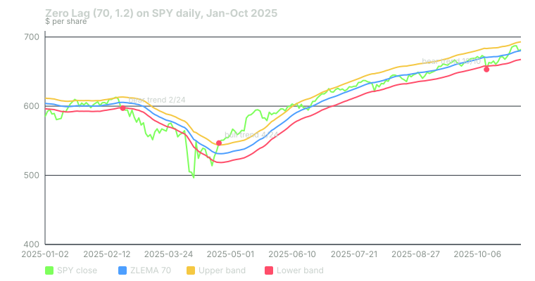

## What it measures

Every moving average lags. It averages old prices, so it turns after price has already turned.

A zero-lag EMA, or ZLEMA, tries to cut that delay. It feeds the average a price that has been pushed forward by recent momentum. The result hugs price more tightly than a plain EMA of the same length.

AlgoAlpha's Zero Lag Trend Signals indicator wraps that line in volatility bands. Price closing outside a band declares a new trend. Price crossing back over the middle line, while the trend holds, marks an entry.

The bots compute this on daily bars.

## How it is calculated

The bots use the original defaults: length 70, band multiplier 1.2.

**Step 1: the lag.** Lag = (70 − 1) ÷ 2, rounded down = 34 bars.

**Step 2: the adjusted price.** Adjusted price = close + (close − the close 34 bars ago). If price is rising, this sits above today's close. If falling, below.

**Step 3: the ZLEMA.** ZLEMA = a 70-bar EMA of the adjusted price.

**Step 4: the band width.** Take the 70-bar Average True Range (ATR). Find its highest value over the last 210 bars (70 × 3). Multiply by 1.2.

**Step 5: the bands.** Upper band = ZLEMA + width. Lower band = ZLEMA − width.

**Step 6: the trend.**

- Close crosses above the upper band: trend becomes up.
- Close crosses below the lower band: trend becomes down.
- Otherwise, the trend stays what it was.

## When it fires in the bots

There are two kinds of signal.

**Trend change.** The trend just flipped.

- Bullish trend change: **+20 CALL.**
- Bearish trend change: **+20 PUT.**

**Entry.** The trend has been the same for at least two bars, and price re-crosses the ZLEMA in that direction.

- Bullish entry: close crosses up through the ZLEMA, trend up today and yesterday. **+15 CALL.**
- Bearish entry: close crosses down through the ZLEMA, trend down today and yesterday. **+15 PUT.**

Think of a trend change as "the regime just changed." Think of an entry as "price dipped to the middle line inside an established trend and came back."

Trend changes are premium signals. A setup needs at least one premium signal before it can post. They also qualify for the bots' 8-point trend bonus. Entries are not premium.

The points are multiplied by a learned weight before they count. For this indicator the weight starts at 1.0. It changes only as the bots' own paper trades build a record.

## Worked example

SPY, January to October 2025. Daily bars from Yahoo Finance, with history back to January 2022 so the 210-bar window is full.

**February 24, 2025: bearish trend change.** SPY closed at $597.21, below the lower band at $597.76, after closing at $599.94 the day before. Trend flips to down. **+20 PUT.**

**April 24, 2025: bullish trend change.** Here is the arithmetic.

- Highest 70-bar ATR in the last 210 bars: $10.639. That high reading came from the early-April selloff.
- Band width: 10.639 × 1.2 = $12.77.
- ZLEMA: $531.37.
- Upper band: 531.37 + 12.77 = $544.14.
- Previous close: $535.42. That is at or below $544.14.
- Close: $546.69. That is above $544.14.
- The close crossed the upper band. Trend flips from down to up. **+20 CALL.**

**June 23, 2025: bullish entry.** The trend had been up since April 24. SPY closed at $600.15, above the ZLEMA at $598.75, after closing at $594.28 below it. **+15 CALL.** The same pattern fired again on August 12, August 28, September 10 and September 30.

**October 10, 2025: bearish trend change.** SPY fell from $671.16 to $653.02. The lower band was $657.77. **+20 PUT.**

Notice the band width. It was $7.72 in February. After the April spike in volatility it jumped to $12.77, and it stayed there into February 2026. The highest-ATR rule remembers the worst stretch of the last 210 bars.

Also notice what came after October 10. The trend stayed down for six months. During most of that time, through February 2026, SPY's close stayed between $652.53 and $695.49. The bearish entries kept firing as price wobbled around the ZLEMA. The bullish trend change did not come until April 8, 2026.

Whether a setup posted on any of these days depended on every other signal and gate that day.

## How to read it yourself

The indicator is open source on TradingView. Load it on a daily chart with length 70 and multiplier 1.2.

1. **Read the trend from the last band break,** not from where price is now. Price can sit above the ZLEMA for weeks while the indicator still says the trend is down.
2. **Check the band width.** Wide bands mean a trend change needs a big move. If the width is left over from a crash months ago, the indicator will be slow to call a new trend.
3. **Treat entries as pullback signals.** An entry says price touched the middle line and bounced, inside a trend that is already established. It says nothing about whether the trend is young or old.
4. **Ignore the multi-timeframe table for this purpose.** The original shows trends on several timeframes. The bots use only the daily calculation.

## Known weaknesses

**Volatility memory.** Because the band uses the highest ATR of the last 210 bars, one violent month sets the band width for most of a year. Calm markets afterward need large moves to flip the trend.

**Sticky trends in ranges.** A sideways market can leave the last trend in place for months. Entries then fire in the direction of a stale trend, as the bearish entries did from November 2025 to February 2026.

**The ZLEMA still lags.** The adjustment reduces lag but does not remove it. The April 24 trend change came 11 sessions after SPY's April 8 closing low.

**It needs a lot of history.** The bots' version starts producing signals after 215 bars. But the highest-ATR window is only full after about 280 bars: 70 for the ATR and 210 for its highest value. Before that, the bands come from a shorter stretch, and the trend state can differ from a chart with more history.

**The bar may not be finished.** The bots scan during the session. A band break at noon can close back inside the band.

## Credit

Zero Lag Trend Signals (MTF) is by **AlgoAlpha**, published open source on TradingView under the Mozilla Public License 2.0. The zero-lag EMA idea itself is usually credited to John Ehlers and Ric Way. The bots port the daily logic only.

## Sources

- Yahoo Finance, SPY historical data: https://finance.yahoo.com/quote/SPY/history/
- AlgoAlpha, Zero Lag Trend Signals (MTF): https://www.tradingview.com/script/tHK4O1Fi-Zero-Lag-Trend-Signals-MTF-AlgoAlpha/
- Phantom Traders bot code (October 2026)

*Educational content, not financial advice. Signals are paper-traded.*
