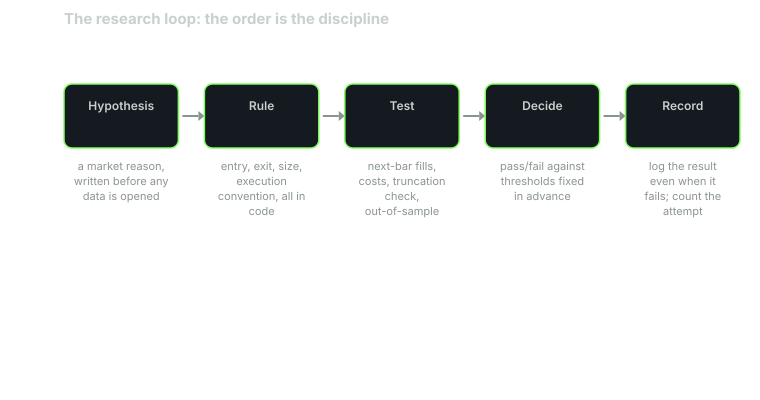

---
{
  "title": "The Research Loop: Hypothesis, Rule, Test, Decide",
  "duration": "16 min",
  "free": false,
  "status": "published",
  "quiz": [
    {"q": "Why must the hypothesis be written before the data is opened?", "opts": ["Because data licences require it", "Because it saves compute", "Because a hypothesis formed after seeing the data is a description of that data, and the test that follows is no longer a test", "Because reviewers ask for it"], "correct": 2, "explain": "If you look first and hypothesise second, the hypothesis was fitted to the sample, and running the rule on the same sample confirms the fit rather than testing a claim."},
    {"q": "Over 2016-2025 SPY's mean next-day return was +0.098% after a down day and +0.032% after an up day, Welch t = 1.40, p = 0.16. The correct decision is:", "opts": ["Do not proceed on this evidence; a p of 0.16 means the difference is comfortably inside sampling noise", "Trade it; the after-down mean is three times larger", "Lower the threshold until p is below 0.05", "Test on 2015 to add data"], "correct": 0, "explain": "The difference could arise by chance about one time in six. Searching for a threshold that makes p small is the multiple-comparisons trap of lesson 7. The honest decision is a recorded fail."},
    {"q": "What belongs in the 'Rule' step that does not belong in the 'Hypothesis' step?", "opts": ["The economic reason", "The expected Sharpe", "The ticker", "The execution bar, the exit and the cost assumption"], "correct": 3, "explain": "The hypothesis says why a pattern might exist. The rule says exactly what is traded, when it is filled and what it costs. Mixing the two lets the rule drift toward what the data shows."},
    {"q": "The 'Decide' step is made against thresholds fixed before the test. Why?", "opts": ["So the thresholds match the results", "So that the same result cannot be read as a pass when you like the rule and a fail when you do not", "Because thresholds cannot be changed in code", "So the test runs faster"], "correct": 1, "explain": "A threshold chosen after the result is a rationalisation. The gate stack in lesson 12 exists to fix thresholds once, in writing."},
    {"q": "A rule fails its test. The correct record is:", "opts": ["Delete it and move on", "Rerun with a different exit until it passes", "Log the hypothesis, the rule, the test window, the result and the fail, and count it as one trial against the family", "Keep it as a discretionary filter"], "correct": 2, "explain": "The failed trial is evidence about the family of rules and a count that the deflated Sharpe in lesson 7 needs. Un-logged failures are how a researcher runs 40 trials and reports the one that passed as if it were the first."}
  ],
  "task": "Write one hypothesis about SPY in the form 'because X, Y should happen after Z', then write the rule that would test it, before opening any data."
}
---

## The loop and why the order matters

Every strategy you will ever run passed through four steps, whether or not you noticed them: you believed something about the market, you turned it into a rule, you tested the rule, and you decided what to do with the result. The discipline this course teaches is to do those steps in that order, once, and to write each one down before starting the next. The order is the whole method. Reverse any two steps and the test stops being a test.


*Figure: the research loop. Hypothesis and rule are written before any data is opened; test and decide run against thresholds fixed in advance; record logs every attempt including the failures. Source: course design, no data plotted.*

## Hypothesis

A hypothesis is a claim about why a pattern should exist, written in a form that could be false. "SPY mean-reverts" is not a hypothesis; it has no mechanism and no horizon. "Because index funds and volatility-targeting strategies rebalance after a large down day, SPY should earn a positive excess return over the following one to three sessions" is one: it names a cause, an effect and a window, and it could be wrong.

The hypothesis is written before you open the data. This is the step people skip, and skipping it is how most backtests go wrong. If you look at a chart first, you will see something, and the hypothesis you write afterwards will be a description of what you saw. The test that follows then confirms that the data contains what you saw in the data. That is not evidence about the future; it is evidence that you can read a chart.

A hypothesis also tells you what a fail looks like, which is the thing you most need to know before you start. If the claim is "positive excess return over one to three sessions after a down day", then a mean next-day return indistinguishable from the unconditional mean is a fail, and it is a fail regardless of what a tweaked version of the rule might show.

## Rule

The rule turns the hypothesis into a sentence a computer can execute, with everything lesson 1 demanded: data, threshold, execution bar, exit, and now cost assumption. "After a down day" becomes "if today's adjusted close is below yesterday's". "Positive return over one to three sessions" becomes an entry at the next open and an exit at the open after that, or after three sessions, chosen now, not after seeing which is better. The cost is stated as basis points per side (lesson 5).

Write the rule so that it has as few free parameters as possible and so that each parameter's value is chosen from the hypothesis, not from the data. A threshold of "one down day" comes from the mechanism (rebalancing happens daily). A threshold of "a down day of at least 0.83%" comes from nowhere unless you have already looked, and if you have already looked you have started fitting.

The rule step is also where you write down the sample window and the split. For this course the window is 2016-01-04 to 2025-12-30, with 2015 as warm-up for indicators, and the out-of-sample rules of lesson 8 apply. Fix that now, because the temptation to extend or trim the window after seeing the equity curve is strong and always looks reasonable at the time.

## Test

The test runs the rule on the data with the conventions of lessons 4 through 6: next-bar execution, adjusted prices, costs charged on every side, and a check that the signals do not change when the data is truncated. The output is a set of numbers (lesson 9): expectancy, Sharpe with its convention stated, drawdown, trade count, and a significance measure appropriate to the claim.

The test is the only step where the data is allowed to speak, and it speaks once. You do not get to run it, look, adjust the rule and run it again while calling the second run a test. You may do that, and sometimes you should, but the second run is research, the rule has one more fitted parameter, and the trial count that lesson 7's deflated Sharpe needs has gone up by one.

## Decide

The decision is made against thresholds you wrote before the test. Pass thresholds for this course are collected in lesson 12; for a hypothesis-level test the bar is lower and simpler: is the effect in the predicted direction, is it larger than the sampling noise, and does it survive the cost assumption? If yes, the rule proceeds to the full stack. If no, the result is logged as a fail and the rule is retired, in writing.

The decision step is where the researcher's judgement re-enters, and it re-enters in exactly one place: whether to believe the number. It does not re-enter as "the number is small but the idea is good, so let's try a different exit". The idea being good was the hypothesis; the test just told you the idea did not produce the effect.

## Record

Whatever the decision, write down the hypothesis, the rule, the window, the result and the verdict, in one place, with a date. A research log is the only defence against the two failures that erase most edges: forgetting that you already tested this and it failed, and forgetting how many things you tested before one passed. Lesson 7 needs that count as an input.

## Worked example

The hypothesis, written before any data was opened: because volatility-targeting and rebalancing flows lean against the previous session's move, SPY should earn a higher next-session return after a down day than after an up day, over 2016 to 2025.

The rule: condition on the sign of today's adjusted close-to-close return; measure the next session's close-to-close return. This is a hypothesis test, not a strategy, so there is no execution convention yet; if the effect exists, lesson 4's conventions turn it into one.

The data: the adjusted SPY bars from lesson 2 (Yahoo Finance chart API, 2,765 daily rows, 2015-01-02 to 2025-12-30), restricted to 2016-01-04 to 2025-12-30.

```python
import pandas as pd
from scipy.stats import ttest_ind
adj = pd.read_csv("spy_adjusted.csv", parse_dates=["date"], index_col="date")
r = adj["close"].pct_change()
nxt = r.shift(-1)                      # next session's return, aligned to today
w = slice("2016-01-01", "2025-12-31")
after_down = nxt.loc[w][r.loc[w] < 0].dropna()
after_up = nxt.loc[w][r.loc[w] > 0].dropna()
print(len(after_down), after_down.mean())   # 1111  0.000976
print(len(after_up), after_up.mean())       # 1395  0.000317
print(ttest_ind(after_down, after_up, equal_var=False))  # t=1.399  p=0.162
```

There were 1,111 down days and 1,395 up days in the window (six sessions closed exactly unchanged and are in neither group). The mean next-day return was +0.0976% after a down day and +0.0317% after an up day; the unconditional mean was +0.0620%. The difference, +0.0659 percentage points, is in the predicted direction and looks large: three times the after-up mean.

Now the noise. Daily SPY returns in this window have a standard deviation of about 1.1%. The standard error of a mean over 1,111 observations is 1.1% / sqrt(1111) = 0.033%, and over 1,395 it is 0.029%. The standard error of the difference is sqrt(0.033² + 0.029²) = 0.044%. The observed difference of 0.066% is 1.5 standard errors; Welch's t-test gives t = 1.40 and p = 0.16. A difference this large or larger would appear by chance about one time in six if there were no effect at all.

The decision, against the threshold written before the test (p below 0.05, direction as predicted): fail. The direction is right, the magnitude is inside sampling noise, and nothing here has been charged a cost yet.

What you must not do next is what the data invites you to do. Conditioning on two consecutive down days gives 473 observations with a mean next-day return of +0.149% and a t-statistic against zero of 2.19. That looks like a pass. It is not one, because it is the second thing you tried on the same sample, chosen after seeing the first result. It is a new hypothesis, it needs its own out-of-sample test, and the trial count is now two. Lesson 7 shows how quickly that count destroys the meaning of a t of 2.

The record: hypothesis as above; rule as above; window 2016-01-04 to 2025-12-30; result t = 1.40, p = 0.16; verdict fail; one trial logged, a second variant noted but untested.

## Table

The four steps, what each produces, and the failure mode when it is skipped or reordered.

| Step | Written output | Uses the data? | Failure if skipped or reordered |
|---|---|---|---|
| Hypothesis | Cause, effect, horizon, what a fail looks like | No | Rule becomes a description of the sample; test confirms the description |
| Rule | Data, threshold, execution bar, exit, cost, window, split | No | Parameters drift toward whatever the chart showed |
| Test | Metrics with conventions stated; truncation check | Yes, once | Re-running after looking turns the test into fitting; trial count is under-counted |
| Decide | Pass or fail against thresholds fixed in advance | No | Same number read as pass or fail depending on attachment to the idea |
| Record | Log entry with date, result, verdict, trial count | No | Failed variants are forgotten and re-tested; the one pass in forty is reported as the first |

## Sources

- Harvey, C. R., Liu, Y., Zhu, H. (2016). "...and the Cross-Section of Expected Returns." Review of Financial Studies 29(1). https://doi.org/10.1093/rfs/hhv059
- Bailey, D. H., Borwein, J., López de Prado, M., Zhu, Q. J. (2014). "Pseudo-Mathematics and Financial Charlatanism." Notices of the AMS 61(5). https://doi.org/10.1090/noti1105
- SciPy documentation, `scipy.stats.ttest_ind` (Welch's test with `equal_var=False`): https://docs.scipy.org/doc/scipy/reference/generated/scipy.stats.ttest_ind.html
- Yahoo Finance, SPY historical data: https://finance.yahoo.com/quote/SPY/history/
