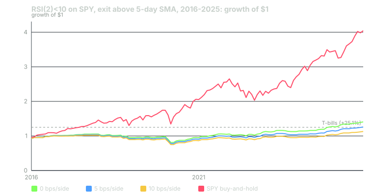

---
{
  "title": "Costs and Slippage: Why 0.1% Kills Most Edges",
  "duration": "18 min",
  "free": false,
  "status": "published",
  "quiz": [
    {"q": "The RSI(2) rule on SPY trades about 22 sides a year. At 10 basis points per side, the annual cost drag is:", "opts": ["0.22%", "2.2%", "22%", "10%"], "correct": 1, "explain": "22 sides × 0.10% = 2.2% of capital per year, charged whether or not the trades win. Against a gross CAGR of 3.49% that is most of the edge."},
    {"q": "SPY's quoted spread is about one cent on a price near $620. The half-spread cost of crossing it is roughly:", "opts": ["0.8 bps", "0.08 bps", "8 bps", "1.6 bps"], "correct": 1, "explain": "One cent on $619.71 is 0.16 bps for the full spread; a marketable order pays half of that, 0.08 bps. SPY is the cheapest instrument you will ever trade, which is why the course charges 5 to 10 bps as a stress test rather than an estimate."},
    {"q": "Under the square-root impact model, a $100 million order in SPY (2025 ADV about $44.8 billion, daily volatility 1.13%) costs roughly:", "opts": ["0.5 bps", "53 bps", "5.3 bps", "0.05 bps"], "correct": 2, "explain": "Participation is 100e6 / 44.76e9 = 0.00223; its square root is 0.0473; times 1.13% daily volatility gives 0.0535%, about 5.3 bps. The same model gives 0.53 bps for a $1 million order."},
    {"q": "Why is the cost charged on the change in position rather than on the position?", "opts": ["Because holding a position is free apart from financing; you pay only when you cross the spread to change it", "Because pandas cannot multiply by the position", "Because costs are tax-deductible", "Because brokers charge per day held"], "correct": 0, "explain": "The spread and impact are paid at each fill. A position that is unchanged from yesterday incurred no fill today, so `pos.diff().abs()` is the right base."},
    {"q": "Three rules score Sharpe 0.37, 0.93 and 0.99 gross. After 20 bps per side they score -0.04, 0.84 and 0.76. What separates the survivors?", "opts": ["Higher gross Sharpe", "Fewer sides per year: 5 and 12 against 22, so the same per-side cost takes a smaller share of a larger per-trade edge", "They trade a different ticker", "They use MOC orders"], "correct": 1, "explain": "The cost of a rule is its turnover times the per-side cost. The two trend rules earn more per trade and trade less often, so the same 20 bps removes a fraction of their edge instead of all of it."}
  ],
  "task": "Add a cost parameter to your lesson-4 backtest and run it at 0, 5, 10 and 20 bps per side; record the annual turnover in sides and the CAGR at each level."
}
---

## What a fill costs

Every time a rule changes its position it crosses the market, and crossing the market is not free. The cost has three parts, and a backtest that omits any of them is measuring a strategy nobody can run.

The spread. A marketable order buys at the ask and sells at the bid. The cost of one side is half the quoted spread. For SPY the spread is one cent most of the day; at the 2025 average close of $619.71 that is 0.16 basis points for the full spread and 0.08 bps for one side. For a mid-cap stock it is ten to thirty times that; for an option it is hundreds.

Commission and fees. Most US retail brokers charge zero commission on ETFs, but regulatory fees (the SEC transaction fee and FINRA's trading activity fee) apply to sells, and some brokers route orders in exchange for payment, which shows up as a worse fill rather than a line item.

Impact. Your order moves the price against you in proportion to how large it is relative to what the market trades. The standard empirical model (Almgren, Thum, Hauptmann and Li, 2005) is a square-root law: impact in return terms is roughly the daily volatility times the square root of your order as a fraction of average daily volume, times a constant near one. For a $1 million order in SPY, with 2025 average daily dollar volume of $44.76 billion and daily volatility of 1.13%, participation is 2.23e-5, its square root is 0.00473, and impact is about 0.53 bps. For $100 million it is 5.3 bps. For $1 million in a stock that trades $50 million a day, it is 1.13% × sqrt(0.02) = 16 bps.

The sum is the per-side cost. Charge it on every side. In code that means charging it on the absolute change in position, not on the position: a position that did not change today crossed nothing.

```python
def backtest(adj, signal, cost_bps=0.0):
    o2o = adj["open"].shift(-1) / adj["open"] - 1
    pos = signal.shift(1).fillna(0)
    turnover = pos.diff().abs().fillna(pos.abs())      # 1 on each side crossed
    return (pos * o2o - turnover * cost_bps / 1e4).dropna()
```

A per-side cost in basis points is a simplification: it ignores that impact scales with size and that the spread widens at the open and in fast markets. It is the right simplification for a first pass because it makes the cost a single number you can sweep, and the sweep tells you the one thing that matters: at what cost does the edge disappear.

## Why 10 basis points is the number to fear

Ten basis points per side is a small number and a large one. It is small because SPY's actual spread cost is one hundredth of it. It is large because a rule that trades twice a week pays it a hundred times a year, and 100 × 0.10% is 10% of capital. Very few rules on a liquid index have 10% a year of gross edge to give.

The arithmetic is turnover times cost. Turnover is the number of sides per year. Cost is the per-side charge. The product is a drag on CAGR that is paid whether the rule wins or loses. A rule survives if its gross annual edge is comfortably larger than that drag; "comfortably" because the gross edge is an estimate with error bars and the drag is not.

This is why a rule's expectancy per trade is the number to compare against cost, not its win rate or its Sharpe. The running example's expectancy per round trip is +0.339% gross. A round trip at 10 bps per side costs 0.20%. The rule keeps 0.139% per trade, less than half of what it appeared to earn. At 20 bps per side it keeps -0.061% and is dead.

## Worked example

Three rules from earlier lessons, all on the adjusted SPY bars from lesson 2 (Yahoo Finance chart API, 2,765 rows, 2015-01-02 to 2025-12-30), tested 2016-01-04 to 2025-12-30 with next-open execution, at five cost levels:

- RSI(2) below 10, exit at the first close above the 5-day SMA (the course's running example; RSI uses Wilder smoothing).
- Close above the 200-day SMA (lesson 4).
- 5-day SMA above the 20-day SMA (a fast crossover, included for its higher turnover).

```python
def rsi(close, n=2):
    d = close.diff(); up = d.clip(lower=0); dn = (-d).clip(lower=0)
    au = up.ewm(alpha=1/n, adjust=False).mean(); ad = dn.ewm(alpha=1/n, adjust=False).mean()
    return 100 - 100 / (1 + au / ad)

def rsi_signal(adj, entry=10, exit_sma=5):
    r = rsi(adj["close"]); sma = adj["close"].rolling(exit_sma).mean()
    state, out = 0, []
    for rv, c, s in zip(r, adj["close"], sma):
        if state == 0 and rv < entry: state = 1
        elif state == 1 and c > s: state = 0
        out.append(state)
    return pd.Series(out, index=adj.index)

sig = rsi_signal(adj)
for bps in (0, 2, 5, 10, 20):
    r = backtest(adj, sig, bps).loc["2016":"2025"]
    print(bps, round(((1 + r).prod() ** (252 / len(r)) - 1) * 100, 2))
```

The RSI(2) rule crossed 220 sides in ten years, 22 a year, over 110 round trips with an average hold of 5.1 calendar days. Its gross CAGR was 3.49% and its gross Sharpe 0.37. At 5 bps per side the annual drag is 22 × 0.05% = 1.10% and the CAGR falls to 2.35% (the compounding makes the observed drop 1.14 points). At 10 bps the drag is 2.20% and the CAGR is 1.23%. At 20 bps the drag is 4.40%, the CAGR is -0.99%, and the Sharpe is -0.04.

The SMA200 rule crossed 51 sides in ten years (5.1 a year, 26 round trips). Its gross CAGR of 11.11% falls to 10.82% at 5 bps, 10.53% at 10 bps and 9.95% at 20 bps: a 1.16-point drop at the level that erased the RSI rule entirely.

The 5/20 crossover crossed 124 sides (12.4 a year, 63 round trips). Gross CAGR 10.79%, falling to 10.11% at 5 bps, 9.42% at 10 and 8.07% at 20.


*Figure: month-end growth of $1 for RSI(2)<10 / exit above SMA5 on SPY at 0, 5 and 10 bps per side, against SPY buy-and-hold (open-to-open, dividend-adjusted) and the cumulative 3-month T-bill return (+25.1%). 2016-01-04 to 2025-12-30. Source: Yahoo Finance chart API for SPY; FRED series DGS3MO for T-bills.*

Note what the chart shows about the cash line. At 5 bps the rule finished at +26.1%, one point above the +25.1% that T-bills paid over the same decade. At 10 bps it finished at +12.9%, below cash. Lesson 10 makes that comparison a formal gate.

## Table

The cost sweep. CAGR and annualised Sharpe (daily, no risk-free subtraction) per rule per cost level, 2016-01-04 to 2025-12-30.

| Rule | Sides / yr | Round trips | Gross CAGR / Sharpe | 2 bps | 5 bps | 10 bps | 20 bps |
|---|---|---|---|---|---|---|---|
| RSI(2)<10, exit > SMA5 | 22.0 | 110 | 3.49% / 0.37 | 3.03% / 0.33 | 2.35% / 0.27 | 1.23% / 0.17 | -0.99% / -0.04 |
| Close > SMA200 | 5.1 | 26 | 11.11% / 0.93 | 10.99% / 0.92 | 10.82% / 0.91 | 10.53% / 0.88 | 9.95% / 0.84 |
| SMA5 > SMA20 | 12.4 | 63 | 10.79% / 0.99 | 10.52% / 0.97 | 10.11% / 0.93 | 9.42% / 0.88 | 8.07% / 0.76 |
| SPY buy-and-hold | 0 | 1 | 15.05% / 0.90 | same | same | same | same |

Two things to take from the table. The rank order of the three rules does not change with cost, but the RSI rule's distance from zero does: it is the only one whose survival depends on the cost assumption, which makes the cost assumption the most important line in its report. And none of the three rules beat buy-and-hold on CAGR at any cost level, which is a benchmark question (lesson 10), not a cost question.

## Choosing the cost to charge

Charge more than you expect to pay. For SPY, 5 bps per side is roughly sixty times the half-spread; it is a stress test, and a rule that cannot pass it has no margin for the things the model leaves out: wider spreads at the open (where next-bar execution fills), fast markets, latency, and the days your order is larger than usual because a signal fired on a volatile day. For single stocks, start at 10 bps and raise it with size. For anything with a spread you can see on the screen, measure the spread on the days the rule actually trades, not on average days, because a mean-reversion rule by construction trades on the wide-spread days.

Report the number you charged next to every result. A Sharpe without a cost assumption is not a result.

## Sources

- Tóth, B., Lempérière, Y., Deremble, C., de Lataillade, J., Kockelkoren, J., Bouchaud, J.-P. (2011). "Anomalous Price Impact and the Critical Nature of Liquidity in Financial Markets." Physical Review X 1(2), 021006 (the square-root impact law). https://doi.org/10.1103/PhysRevX.1.021006
- Frazzini, A., Israel, R., Moskowitz, T. J. (2018). "Trading Costs." SSRN Working Paper 3229719. https://doi.org/10.2139/ssrn.3229719
- FRED, 3-Month Treasury Bill Secondary Market Rate, series DGS3MO: https://fred.stlouisfed.org/series/DGS3MO
- Yahoo Finance, SPY historical data: https://finance.yahoo.com/quote/SPY/history/
