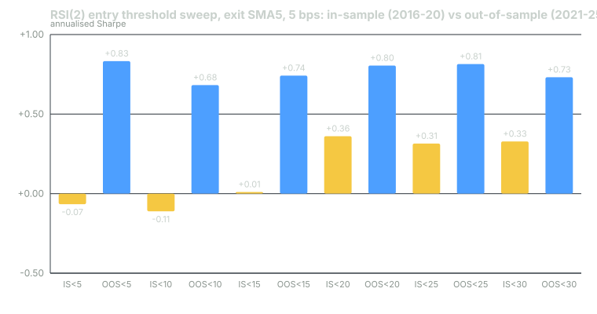

---
{
  "title": "Overfitting: Parameter Sweeps, Multiple Comparisons and the Deflated Sharpe",
  "duration": "20 min",
  "free": false,
  "status": "published",
  "quiz": [
    {"q": "Across a 24-point grid the Spearman correlation between in-sample and out-of-sample Sharpe was -0.15. What does that mean for the practice of picking the best in-sample parameters?", "opts": ["It works; the best in-sample point had a good out-of-sample Sharpe", "The in-sample ranking carried no information about the out-of-sample ranking; picking the top was no better than picking at random", "Out-of-sample data is unreliable", "The grid was too small"], "correct": 1, "explain": "A rank correlation near zero (here slightly negative) means the order of the 24 points in-sample told you nothing about their order out-of-sample. The best in-sample point did fine out-of-sample, but so did the median point and the worst."},
    {"q": "The expected maximum Sharpe among N=24 trials with no true edge, given the observed spread of Sharpes across the grid, was 0.44 annualised. The best in-sample Sharpe was 0.36. Therefore:", "opts": ["The best trial beats the noise ceiling", "The grid needs 48 points", "Sharpe is the wrong metric", "The best trial is below what pure noise would produce from 24 tries; the sweep found nothing"], "correct": 3, "explain": "The deflated Sharpe compares the best observed Sharpe against the maximum you would expect from that many tries on noise. 0.36 is under 0.44; the deflated Sharpe probability was 0.43, far from the 0.95 needed."},
    {"q": "Why must failed trials be counted in N even though they were never reported?", "opts": ["For tax purposes", "Because the expected maximum of N draws grows with N whether or not you kept the losers; hiding them does not change the odds you faced", "Because failed trials have higher Sharpe", "They need not be; only reported trials count"], "correct": 1, "explain": "If you tried 24 things and report one, the reported one is the maximum of 24 draws. Its expected value under no edge is the expected maximum of 24, not of one."},
    {"q": "All 24 grid points had a positive Sharpe over 2021-2025 and only 14 of 24 over 2016-2020. This tells you:", "opts": ["The rule improved with age", "Out-of-sample data has less noise", "The period, not the parameter, drove the result: 2021-2025 was a good regime for the whole family", "Costs fell"], "correct": 2, "explain": "When every point in a grid moves together, the movement belongs to the market regime, not to any parameter choice. It is why a single out-of-sample period is one observation, not a verdict."},
    {"q": "Which number is required by the deflated Sharpe that a standard Sharpe report omits?", "opts": ["The number of trials and the variance of Sharpe across them", "The ticker", "The risk-free rate", "The win rate"], "correct": 0, "explain": "The deflated Sharpe's null is the expected maximum over N trials with the observed dispersion. Without N and the variance, no correction for selection is possible."}
  ],
  "task": "Count every backtest you have run on your current idea, including variants you abandoned, and write the number down; that is your N."
}
---

## The problem is not the sweep

Sweeping parameters is not the sin. Running the RSI threshold at 5, 10, 15, 20, 25 and 30 and the exit SMA at 3, 5, 10 and 20 is exactly how you learn whether a rule is robust to its own settings. The sin is what happens next: reading the grid, picking the best cell, and reporting that cell's number as if it were the only thing you ran.

The best of 24 numbers is not a sample from the same distribution as one number. If the 24 trials had no edge at all and their Sharpe ratios were noise around zero, the best of them would still be well above zero, and the more you try the higher it gets. This is the multiple-comparisons problem, and it is the mechanism by which a researcher with no edge produces a backtest with a 1.5 Sharpe in an afternoon. Bailey, Borwein, López de Prado and Zhu (2014) put a formula on it: for N independent trials with Sharpe standard deviation σ across trials, the expected maximum Sharpe under the null is approximately

E[max SR] ≈ σ × [(1 - γ) Z⁻¹(1 - 1/N) + γ Z⁻¹(1 - 1/(N·e))]

where γ ≈ 0.5772 is the Euler-Mascheroni constant and Z⁻¹ is the inverse standard normal CDF. For N = 24, the bracket is about 1.98: the best of 24 noise trials sits two trial-standard-deviations above zero on average.

## In-sample ranking reproduces and predicts nothing

There is a second, quieter failure. Suppose you resist reporting the best cell and instead use the in-sample grid to choose which cell to trade going forward. That is a prediction: the cell that ranked first in-sample will rank well out-of-sample. It is testable, and on this data it fails.

The setup: the running example's grid, 6 entry thresholds × 4 exit lengths = 24 rules, each backtested on the adjusted SPY bars from lesson 2 with next-open execution and 5 bps per side, split at the end of 2020: in-sample 2016-01-04 to 2020-12-31 (1,259 sessions), out-of-sample 2021-01-04 to 2025-12-30.

```python
from scipy.stats import spearmanr
grid = []
for thr in (5, 10, 15, 20, 25, 30):
    for ex in (3, 5, 10, 20):
        r = backtest(adj, rsi_signal(adj, thr, ex), 5)
        s = lambda x: x.mean() / x.std() * 252 ** 0.5
        grid.append({"thr": thr, "exit": ex,
                     "is": s(r.loc["2016":"2020"]), "os": s(r.loc["2021":"2025"])})
g = pd.DataFrame(grid)
print(spearmanr(g["is"], g["os"]).correlation)     # -0.148
print(g.loc[g["is"].idxmax()])                     # thr 20, exit 5: is 0.361, os 0.805
```

The Spearman rank correlation between in-sample and out-of-sample Sharpe across the 24 cells was -0.15. The in-sample order carried no information about the out-of-sample order. The best in-sample cell (entry below 20, exit above SMA5, Sharpe 0.36) did score 0.80 out-of-sample, which looks like a success until you see that the median cell scored 0.66 and the worst in-sample cell (entry below 5, exit above SMA10, in-sample -0.35) scored 0.70. The best out-of-sample cell (entry below 5, exit above SMA20, 0.85) ranked 12th of 24 in-sample, with an in-sample Sharpe of 0.10.

The in-sample ranking is perfectly reproducible: run the code again and you get the same order. It is also useless: it does not predict which parameters will do well next. Those two properties are independent, and the first is often mistaken for the second.

## The deflated Sharpe ratio

The deflated Sharpe ratio (Bailey and López de Prado, 2014) asks one question: given that you ran N trials and are reporting the best, what is the probability that its true Sharpe exceeds the maximum you would expect from N trials with no edge? It takes the observed Sharpe, subtracts the expected maximum under the null, and converts the difference to a probability using the standard error of a Sharpe ratio, which depends on the sample length and on the skew and kurtosis of the returns. A result is considered to survive selection when that probability is at least 0.95.

Everything in the formula works in per-period (daily) units, not annualised. The annualised numbers are for reading; the test is done on daily Sharpes.

## Worked example

The best in-sample cell from the grid above: entry RSI(2) below 20, exit at the first close above the 5-day SMA, 5 bps per side, in-sample 2016-01-04 to 2020-12-31.

The inputs, all computed from the grid and the best cell's daily returns:

- N = 24 trials.
- T = 1,259 daily observations.
- Observed daily Sharpe of the best cell, SR = 0.022729 (annualised 0.022729 × √252 = 0.361).
- Variance of the daily Sharpe across the 24 trials = 0.000198; standard deviation σ = 0.014056.
- Skewness of the best cell's daily returns, γ₃ = -1.923.
- Kurtosis (non-excess), γ₄ = 41.84.

Step 1, the null's expected maximum. Z⁻¹(1 - 1/24) = Z⁻¹(0.95833) = 1.7317. Z⁻¹(1 - 1/(24e)) = Z⁻¹(0.98467) = 2.1606. Bracket = (1 - 0.5772) × 1.7317 + 0.5772 × 2.1606 = 0.7322 + 1.2471 = 1.9793. SR₀ = 0.014056 × 1.9793 = 0.027821 daily, or 0.442 annualised.

Step 2, the test statistic. Numerator: (SR - SR₀) × √(T - 1) = (0.022729 - 0.027821) × √1258 = -0.005092 × 35.468 = -0.1806. Denominator: √(1 - γ₃·SR + (γ₄ - 1)/4 · SR²) = √(1 + 1.923 × 0.022729 + 10.21 × 0.000517) = √(1 + 0.04371 + 0.00528) = √1.04899 = 1.0242. Statistic = -0.1806 / 1.0242 = -0.1763.

Step 3, the probability. DSR = Φ(-0.1763) = 0.430.

```python
from scipy.stats import norm, skew, kurtosis
N, sd_sr = 24, g_daily_sr.std()                      # daily Sharpes of the 24 trials
sr0 = sd_sr * ((1 - 0.5772) * norm.ppf(1 - 1/N) + 0.5772 * norm.ppf(1 - 1/(N * np.e)))
sr = r_best.mean() / r_best.std(); T = len(r_best)
g3, g4 = skew(r_best), kurtosis(r_best, fisher=False)
dsr = norm.cdf((sr - sr0) * np.sqrt(T - 1) / np.sqrt(1 - g3 * sr + (g4 - 1) / 4 * sr ** 2))
print(round(sr0 * 252 ** 0.5, 3), round(dsr, 3))     # 0.442  0.430
```

Reading it: the best in-sample Sharpe of 0.36 is below the 0.44 that 24 noise trials with this much dispersion would be expected to produce as their maximum. The probability that the best cell has a true Sharpe above that noise ceiling is 43%. The pass threshold is 95%. The sweep found nothing that survives its own size. For comparison, the probabilistic Sharpe of the same cell against a null of zero, ignoring selection, is 0.78: still a fail, but a much less decisive one, which is the amount of false comfort the un-deflated number was offering.

## Chart


*Figure: annualised Sharpe of RSI(2)<threshold / exit above SMA5 on SPY at 5 bps per side, in-sample 2016-01-04 to 2020-12-31 (yellow) against out-of-sample 2021-01-04 to 2025-12-30 (blue), for thresholds 5, 10, 15, 20, 25, 30. Source: Yahoo Finance chart API for SPY.*

The chart makes the regime point visible. Every threshold scored between 0.68 and 0.83 out-of-sample and between -0.11 and 0.36 in-sample. The parameter moved the bar by tenths; the period moved every bar by seven tenths. Across the full grid, 14 of 24 cells were positive in-sample and 24 of 24 out-of-sample, with medians of 0.05 and 0.66. Whatever the family of rules earned in 2021-2025, it earned because of what SPY did in those years, not because of any threshold. That is also why one out-of-sample period is one observation; lesson 8 is about getting more than one.

## What to do instead

Fix the parameters from the hypothesis before the sweep, and treat the sweep as a robustness check: if the neighbourhood around your chosen cell is flat, the rule is not sensitive to the setting; if the chosen cell is a spike, you have found noise. Count every trial, including the ones you did not keep, and report N with every result. Compute the deflated Sharpe on the best cell and treat 0.95 as the bar. And do not choose parameters by in-sample rank when you can show, as here, that the rank predicts nothing.

## Sources

- Bailey, D. H., López de Prado, M. (2014). "The Deflated Sharpe Ratio: Correcting for Selection Bias, Backtest Overfitting and Non-Normality." Journal of Portfolio Management 40(5). https://doi.org/10.3905/jpm.2014.40.5.094
- Bailey, D. H., Borwein, J., López de Prado, M., Zhu, Q. J. (2017). "The Probability of Backtest Overfitting." Journal of Computational Finance 20(4). https://doi.org/10.21314/JCF.2016.322
- Harvey, C. R., Liu, Y., Zhu, H. (2016). "...and the Cross-Section of Expected Returns." Review of Financial Studies 29(1). https://doi.org/10.1093/rfs/hhv059
- SciPy documentation, `scipy.stats.spearmanr` and `scipy.stats.norm`: https://docs.scipy.org/doc/scipy/reference/generated/scipy.stats.spearmanr.html
