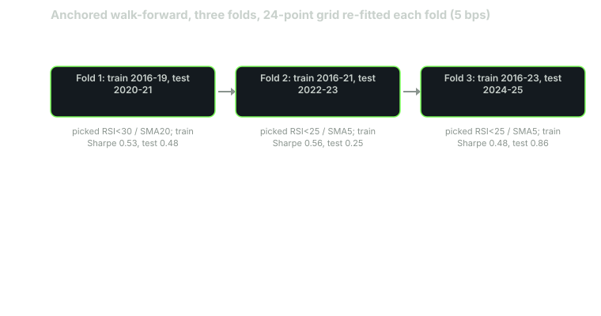

---
{
  "title": "Out-of-Sample and Walk-Forward: Splits, Folds and What Counts as Replication",
  "duration": "18 min",
  "free": false,
  "status": "published",
  "quiz": [
    {"q": "An anchored walk-forward with three folds re-fitted the 24-point grid on each training window. The chosen parameters were RSI<30/SMA20, then RSI<25/SMA5, then RSI<25/SMA5. What does the change between folds tell you?", "opts": ["The rule improved", "Fold 1 was mis-specified", "The optimum is unstable across training windows, which is itself evidence that the in-sample optimum is noise", "Nothing; parameters always change"], "correct": 2, "explain": "If a rule had a stable true optimum, adding two years of data would not move it from (30, 20) to (25, 5). Movement of the optimum across folds is the walk-forward version of lesson 7's Spearman of -0.15."},
    {"q": "The stitched out-of-sample Sharpe over 2020-2025 was 0.51 from the re-fitted rule and 0.45 from the fixed default (RSI<10 / SMA5). The re-fitting added:", "opts": ["A large, reliable improvement", "0.06 of Sharpe over six years, which is well inside the standard error of a six-year Sharpe estimate (about 0.4)", "Nothing, because 0.51 is below 1", "A worse drawdown only"], "correct": 1, "explain": "Lo (2002) gives the standard error of an annualised Sharpe estimated over n years as roughly 1/sqrt(n) for a Sharpe near zero. Over six years that is 0.41. A 0.06 difference is noise."},
    {"q": "Why does this course use anchored (expanding) rather than rolling training windows?", "opts": ["With only ten years and about eleven trades a year, a rolling four-year window holds around 44 trades, too few to fit anything; anchoring uses every trade available at the decision date", "Rolling windows are illegal", "Anchored windows always produce higher Sharpe", "Rolling windows cannot be coded in pandas"], "correct": 0, "explain": "The choice is about trade count. A fit on 44 trades is a fit on noise. Anchoring is the honest choice for a low-frequency rule with a short history; rolling suits high-frequency rules where regimes matter more than sample size."},
    {"q": "Which of these is replication, in the sense the course requires before a rule trades?", "opts": ["The same rule scoring well on the same data twice", "The same rule scoring well on a second instrument or a second era that was not used to write it, with the same sign and a similar magnitude", "A higher Sharpe after adding a filter", "A positive Sharpe in-sample"], "correct": 1, "explain": "Replication is evidence from data the rule never saw, including data that did not exist when the rule was written. Re-running the same test is reproduction, which lesson 7 showed is not the same thing."},
    {"q": "Fold 2 (test 2022-2023) scored 0.25 with 28 trades. Fold 3 (test 2024-2025) scored 0.86 with 25 trades. Which claim is supported?", "opts": ["The rule works in bear markets and bull markets alike", "The rule should be traded only in years like 2024", "Fold 3 proves the edge", "Each fold's Sharpe has a standard error near 0.7, so neither fold on its own distinguishes the rule from zero; the evidence is the sign agreement across all three folds and the stitched series"], "correct": 3, "explain": "Two-year Sharpe estimates are very noisy. What a walk-forward gives you is several independent looks; the pattern across them is the evidence, not any single fold."}
  ],
  "task": "Split your rule's history into three anchored folds, record the parameters each training window selects, and note whether they agree."
}
---

## Why a split is not enough

Lesson 7 ended with one out-of-sample period and one warning: a single period is one observation. Every one of the 24 grid cells scored better in 2021-2025 than in 2016-2020, so the out-of-sample number told you about the period at least as much as about the rule. The fix is to get several independent looks at the rule on data it did not see, and to compare what those looks agree on.

Out-of-sample testing is the general idea: hold back data the rule was not fitted on and measure there. Walk-forward is the disciplined form: divide the history into consecutive folds, fit on everything before each fold, test on the fold, and stitch the test segments into one out-of-sample record. The stitched record is what a trader who had followed the procedure in real time would have earned, including the parameter changes they would have made along the way.

## How to split

Three choices, each with a reason.

Time order, never random. Financial data is autocorrelated and regimes cluster in time; a random split puts April 2020 in the training set and March 2020 in the test set and leaks the crash both ways. Folds are contiguous blocks in date order.

Anchored or rolling. An anchored (expanding) window trains on everything from the start to the fold; a rolling window trains on a fixed number of years before it. Rolling adapts faster to regime change and forgets faster; anchored uses every trade available. The deciding factor is the trade count. The running example fires about 11 round trips a year; a rolling four-year window would fit 24 parameter cells on about 44 trades, and 44 trades cannot rank 24 cells (lesson 7 showed that 1,259 sessions, with between 23 and 136 trades per cell, could not). With ten years of daily data and a low-frequency rule, anchored is the honest choice.

How many folds. More folds means more independent looks and shorter test windows. A test window needs enough trades for its Sharpe to mean something, and the standard error of an annualised Sharpe estimated over n years is roughly 1/√n (Lo, 2002, for Sharpe near zero and independent returns). A two-year fold has a standard error near 0.7; a one-year fold near 1.0. With ten years, three folds of two test years each, after a four-year initial training window, is about the most the data supports. Five one-year folds would each be noise.

The folds used here: train 2016-2019, test 2020-2021; train 2016-2021, test 2022-2023; train 2016-2023, test 2024-2025.

## Worked example

The running example's family (RSI(2) entry threshold in {5, 10, 15, 20, 25, 30}, exit SMA length in {3, 5, 10, 20}), on the adjusted SPY bars from lesson 2 (Yahoo Finance chart API, 2,765 rows, 2015-01-02 to 2025-12-30), next-open execution, 5 bps per side. On each fold the cell with the highest training Sharpe is selected and run on the test window.

```python
folds = [("2016", "2019", "2020", "2021"), ("2016", "2021", "2022", "2023"), ("2016", "2023", "2024", "2025")]
sharpe = lambda x: x.mean() / x.std() * 252 ** 0.5
cache = {(t, e): backtest(adj, rsi_signal(adj, t, e), 5) for t in (5, 10, 15, 20, 25, 30) for e in (3, 5, 10, 20)}
oos = []
for a0, a1, b0, b1 in folds:
    best = max(cache, key=lambda k: sharpe(cache[k].loc[a0:a1]))
    seg = cache[best].loc[b0:b1]; oos.append(seg)
    print(best, round(sharpe(cache[best].loc[a0:a1]), 2), round(sharpe(seg), 2))
stitched = pd.concat(oos)
print(round(sharpe(stitched), 2), round(sharpe(cache[(10, 5)].loc["2020":"2025"]), 2))
```

Fold 1 trained on 2016-2019 and selected entry below 30 with exit above SMA20 (training Sharpe 0.53). On the 2020-2021 test it scored 0.48, CAGR 7.4%. The fixed default (entry below 10, exit above SMA5) scored 0.27 on the same window.

Fold 2 trained on 2016-2021 and selected entry below 25 with exit above SMA5 (training 0.56). On 2022-2023 it scored 0.25, CAGR 2.4%. The default scored 0.22.

Fold 3 trained on 2016-2023 and selected entry below 25, exit above SMA5 again (training 0.48). On 2024-2025 it scored 0.86, CAGR 10.5%. The default scored 0.92.

The stitched out-of-sample record, 2020-01-02 to 2025-12-30 (1,506 sessions): total return +47.4%, CAGR 6.7%, annualised volatility 15.0%, Sharpe 0.51, maximum drawdown -29.1% on 2020-03-20. The fixed default over the same 1,506 sessions: +33.9%, CAGR 5.0%, volatility 12.6%, Sharpe 0.45, maximum drawdown -23.4%.

Now read it with the error bars. Six years of out-of-sample data gives a Sharpe standard error near 1/√6 = 0.41. The re-fitted procedure scored 0.51 and the fixed rule 0.45; the 0.06 gap is a seventh of a standard error. Re-fitting bought nothing measurable, and it bought a deeper drawdown, because fold 1 selected the widest entry (below 30) and the slowest exit (SMA20), the combination that sat longest in the March 2020 decline.

The selected parameters also moved: (30, 20), then (25, 5), then (25, 5). Adding 2020-2021 to the training set changed the optimum in both dimensions. A rule with a real, stable optimum does not do that. This is lesson 7's Spearman of -0.15 seen from another angle.

What the walk-forward does establish is narrower and worth having: all three test folds were positive, for the re-fitted rule and for the fixed default, across a crash year, a bear year and two bull years. That is sign agreement across three independent looks. It is not proof of an edge (each look has a standard error near 0.7), and lesson 9 will show the stitched drawdown alone fails a gate. It is the kind of evidence that earns a rule the next test, not a live allocation.

## Chart


*Figure: the anchored three-fold walk-forward for the RSI(2) family on SPY at 5 bps per side. Each box is one fold; the note gives the cell selected on the training window and the Sharpe on training and test. Source: Yahoo Finance chart API for SPY, 2016-01-04 to 2025-12-30.*

## What counts as replication

Reproduction is running the same test on the same data and getting the same number. It is necessary (lesson 2's data checks exist so that it is possible) and it proves nothing about the future. Replication is the effect appearing again in data the rule did not see. Three grades, in ascending order of strength:

Held-out time. The walk-forward above. The rule was written on early data and tested on later data. Weakest, because the researcher saw the whole history when choosing the family and the folds.

Held-out instrument. The same rule, unchanged, on an instrument that was not used to write it: another index ETF, another country's index. Stronger, because instrument-specific noise cannot carry across. Weaker than it looks when the instruments are correlated; SPY and QQQ share most of their daily moves.

Held-out time that did not exist when the rule was written. The rule is frozen, dated, and run forward. Every session after the freeze date is data that no choice could have been fitted to. This is the paper book of lesson 11, and it is the only replication a gate stack should accept as final.

A rule replicates when the effect has the same sign and a magnitude that is not obviously smaller in each of these. "Not obviously smaller" is judged with the standard errors above: an out-of-sample Sharpe of 0.5 replicates an in-sample 0.8 given two-year folds; an out-of-sample 0.1 does not.

## Sources

- Lo, A. W. (2002). "The Statistics of Sharpe Ratios." Financial Analysts Journal 58(4). https://doi.org/10.2469/faj.v58.n4.2453
- Bailey, D. H., Borwein, J., López de Prado, M., Zhu, Q. J. (2017). "The Probability of Backtest Overfitting." Journal of Computational Finance 20(4). https://doi.org/10.21314/JCF.2016.322
- pandas documentation, `DataFrame.loc` slicing on a `DatetimeIndex` (partial string indexing used for fold boundaries): https://pandas.pydata.org/docs/user_guide/timeseries.html#partial-string-indexing
- Yahoo Finance, SPY historical data: https://finance.yahoo.com/quote/SPY/history/
