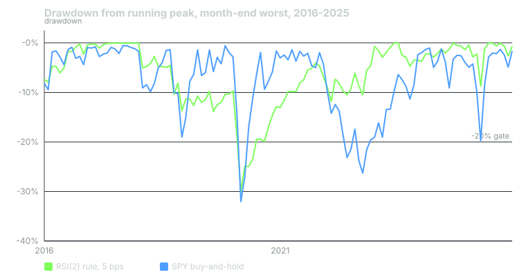

---
{
  "title": "The Metrics That Matter: Expectancy, Sharpe Conventions, Drawdown and Tail",
  "duration": "20 min",
  "free": false,
  "status": "published",
  "quiz": [
    {"q": "The RSI(2) rule won 68.2% of 110 trades, with an average winner of +1.35% and an average loser of -1.99%. Its expectancy per trade is:", "opts": ["+1.35%", "+0.29%", "-0.64%", "+0.68%"], "correct": 1, "explain": "0.682 × 1.352% + 0.318 × (-1.989%) = 0.922% - 0.632% = +0.289% per trade. The win rate alone says nothing; a 68% win rate with those averages nets a quarter of a percent."},
    {"q": "The same daily return series gives a Sharpe of 0.27 over all days, 0.82 over the days it was in a position, and 0.06 after subtracting T-bills. Which is the honest headline?", "opts": ["0.82, because flat days are not the rule's fault", "0.06 always", "The average of the three", "0.27 with the convention stated, or 0.06 if the question is whether it beat cash; 0.82 describes a rule that is only ever in the market, which this one is not"], "correct": 3, "explain": "A rule that is in the market 15% of the time earns its active Sharpe on 15% of the days and zero on the rest. The all-days figure is what the capital experienced. The active figure is inflated by roughly 1/sqrt(exposure)."},
    {"q": "The rule's maximum drawdown was -30.0% on 2020-03-20 and its longest drawdown lasted 1,300 sessions. The second number means:", "opts": ["The rule lost money for 1,300 sessions", "The equity curve spent more than five years below a previous high; anyone who started at the 2018 peak waited until 2023 to be whole", "The rule was flat for 1,300 sessions", "Drawdown duration is undefined for a rule that is sometimes in cash"], "correct": 1, "explain": "Duration counts sessions between a peak and the first new peak. Five years underwater is the number a trader would actually feel, and it is invisible in the max-drawdown figure."},
    {"q": "Daily returns had skew -1.08 and kurtosis 55. The 1% CVaR was -3.84%. Together these say:", "opts": ["Losses are concentrated in rare, large days; the average of the worst 1% of days was -3.84%, and the tail is far fatter than normal", "The rule is safe", "Returns are normal", "The Sharpe is understated"], "correct": 0, "explain": "A kurtosis of 55 against 3 for a normal distribution means almost all the variance comes from a handful of days. Sharpe assumes away exactly this, which is why tail statistics are reported next to it."},
    {"q": "Over 2016-2025 the rule returned +26.1% total; T-bills returned +25.1%; SPY buy-and-hold returned +304.6%. The right comparison for a rule that is in cash 85% of the time is:", "opts": ["SPY, because it trades SPY", "Neither; absolute return is enough", "T-bills first, because cash is what the capital would otherwise earn and the rule barely beat it; then SPY as a second benchmark for the same risk budget", "Gold"], "correct": 2, "explain": "The cash benchmark asks whether the rule added anything over doing nothing. One point over ten years says no. The SPY comparison is a separate question about opportunity cost, which lesson 10 handles with correlation and sizing."}
  ],
  "task": "Compute expectancy, all-days Sharpe, active-days Sharpe, max drawdown, drawdown duration and 1% CVaR for your rule, and write the convention next to each."
}
---

## Numbers that describe, numbers that mislead

A backtest produces a daily return series and a list of trades. Everything you report is a function of those two objects, and the choice of function decides whether the report describes the rule or flatters it. This lesson goes through the metrics in the order you should compute them, states the convention for each, and computes each one on the running example so you can see how far the same series can be made to move by changing the convention.

The running example throughout: RSI(2) below 10 on SPY, exit at the first close above the 5-day SMA, next-open execution, 5 bps per side, 2016-01-04 to 2025-12-30, on the adjusted bars from lesson 2 (Yahoo Finance chart API, 2,765 rows). Cash benchmark from FRED series DGS3MO, the 3-month T-bill rate, compounded daily.

## Expectancy, and why win rate misleads

Expectancy is the mean return per trade. It is the number to compare against cost, because cost is also charged per trade. Win rate is a component of it and is meaningless alone: a rule that wins 90% of the time and loses ten times its average win on the other 10% has an expectancy of zero.

The running example closed 110 trades, 11 a year, holding 5.1 calendar days on average. It won 75 of them (68.2%). The average winner was +1.352%, the average loser -1.989%, the median trade +0.70%. Expectancy: 0.682 × 1.352% - 0.318 × 1.989% = 0.922% - 0.632% = +0.289% per trade after costs (+0.339% before). The best trade earned +5.47%; the worst lost -13.51%. That one trade, opened at the 2020-03-10 open, is 47 times the expectancy: remove it and the ten-year expectancy rises to +0.415%. A high win rate with a fat left tail is the signature of mean-reversion rules, and it is the reason their win rate is the least informative number they produce.

## Sharpe, and which one

The Sharpe ratio is the mean of a return series divided by its standard deviation, scaled to a year. Every word in that sentence hides a choice.

Which series. All days, or only the days the rule held a position? The rule was exposed 15.3% of the time. Over all 2,512 days: daily mean / daily standard deviation × √252 = 0.27. Over the 385 days it held a position: 0.82. The active figure describes a rule that is always in the market, which this one is not; the capital earned zero on the other 85% of days. The relationship is approximately Sharpe(all) ≈ Sharpe(active) × √exposure = 0.82 × √0.153 = 0.32, close to the observed 0.27 (the approximation ignores that flat days also shrink the standard deviation). A rule with low exposure can post a high active Sharpe and still be a poor use of capital.

Which mean. Raw, or in excess of the risk-free rate? Over a decade when T-bills averaged 2.25% a year, subtracting the daily T-bill rate takes the all-days Sharpe from 0.27 to 0.06. The excess figure answers "did this beat cash"; the raw figure answers "was the series positive". State which.

Which scaling. Daily Sharpe × √252 assumes daily returns are independent. Mean-reversion returns are not, and the annualised figure is approximate. Lo (2002) gives the correction; for this rule the autocorrelation is small and the approximation stands, but report it as daily-scaled-by-√252, not as an annual Sharpe.

Buy-and-hold SPY over the same 2,512 days: raw 0.90, excess 0.77, exposure 100%.

## Drawdown: depth and duration

Maximum drawdown is the largest peak-to-trough fall in the equity curve. For the rule it was -30.0%, reached on 2020-03-20. SPY's was -32.0% on the same day. A rule that is in cash 85% of the time and still matched the index's crash drawdown is a rule whose exposure is concentrated exactly when the index falls, which is what buying dips means.

Duration is the number of sessions between a peak and the next new peak. It is the number a trader feels and the one most reports omit. The rule's longest drawdown lasted 1,300 sessions, a little over five years: the equity curve set a high on 2017-11-16, fell through the -11.3% year of 2018 and the March 2020 trade, and did not make a new high until 2023-01-20. SPY's longest was 488 sessions.


*Figure: drawdown from running peak, worst month-end value each month, for RSI(2)<10 / exit above SMA5 on SPY at 5 bps per side (green) and SPY buy-and-hold, open-to-open, dividend-adjusted (blue), 2016-01-04 to 2025-12-30. The dashed line is the -20% gate from lesson 12. Source: Yahoo Finance chart API for SPY.*

## Tail

Sharpe treats a -8.8% day and eight -1.1% days as the same amount of risk. They are not. Three numbers describe the tail: the worst day, the conditional value at risk (the mean of the worst 1% of days), and the shape of the distribution (skew and kurtosis). The rule's worst day was -8.80% on 2020-03-11 (an open-to-open return; SPY's own worst day is the same one, because the rule was long). Its 1% CVaR was -3.84%: on the worst 25 days of the decade it lost 3.84% on average. Skew was -1.08 and kurtosis (non-excess) 55.4; a normal distribution has 0 and 3. Almost all of the rule's variance came from a few dozen days, and those days were losses. Compare SPY: worst day -8.80%, CVaR -4.61%, skew -0.59, kurtosis 11.8. The rule is less volatile than the index (10.8% against 17.3% annualised) but its tail is relatively fatter.

## Worked example

Every number above, computed from one function. The trade list is built by walking the position series.

```python
import numpy as np, pandas as pd
r = backtest(adj, rsi_signal(adj, 10, 5), 5).loc["2016":"2025"]
pos = rsi_signal(adj, 10, 5).shift(1).reindex(r.index)
rf = pd.read_csv("dgs3mo.csv", parse_dates=[0], index_col=0).iloc[:, 0]
rf = pd.to_numeric(rf, errors="coerce").ffill().reindex(r.index).ffill() / 100 / 252

ann = lambda x: x.mean() / x.std() * np.sqrt(252)
eq = (1 + r).cumprod(); dd = eq / eq.cummax() - 1
under = (eq < eq.cummax()).astype(int)
runs = under.groupby((under != under.shift()).cumsum()).cumsum()
print("total", eq.iloc[-1] - 1, "cagr", eq.iloc[-1] ** (252 / len(r)) - 1)
print("sharpe all", ann(r), "active", ann(r[pos == 1]), "excess", ann(r - rf))
print("max dd", dd.min(), dd.idxmin().date(), "longest", runs.max())
print("worst", r.min(), "cvar1", r[r <= r.quantile(0.01)].mean())
print("skew", r.skew(), "kurt", r.kurt() + 3)      # pandas kurt is excess
```

The trade walk for the largest loss, so you can see how a metric is traced back to bars. On 2020-03-09 SPY's adjusted close was 249.35 and its RSI(2) was 6.38, below 10: signal on. The rule bought at the 2020-03-10 open, 258.81. On 03-10 the close of 262.25 was below the 5-day SMA of 268.31, so it held; 03-11, 03-12, 03-13, 03-16, 03-17, 03-18, 03-19, 03-20 and 03-23 all closed below their 5-day SMA (the SMA was falling with the market, but the closes were falling faster). On 2020-03-24 the close of 222.39 exceeded the SMA of 214.49: signal off. The rule sold at the 2020-03-25 open, 223.96. Trade return: 223.96 / 258.81 - 1 = -13.47% before costs; -13.51% after 5 bps on each side. Eleven sessions, one trade, a fifth of the decade's expectancy given back.

Total return over the decade: +26.09%, CAGR 2.35%. T-bills over the same days: +25.11%. The rule beat cash by 0.98 percentage points over ten years, which is the single most important number in this lesson and the one a Sharpe of 0.27 does not make you feel.

## Table

Calendar-year returns, so the decade's total can be traced to its parts.

| Year | RSI(2) rule, 5 bps | SPY buy-and-hold | T-bills | Rule entries |
|---|---|---|---|---|
| 2016 | +0.46% | +14.66% | +0.32% | 9 |
| 2017 | +3.46% | +21.33% | +0.95% | 7 |
| 2018 | -11.30% | -6.42% | +1.99% | 14 |
| 2019 | +2.13% | +34.02% | +2.12% | 7 |
| 2020 | -3.24% | +18.17% | +0.36% | 10 |
| 2021 | +9.47% | +28.60% | +0.05% | 10 |
| 2022 | +3.52% | -17.99% | +2.11% | 16 |
| 2023 | +0.21% | +24.71% | +5.38% | 12 |
| 2024 | +10.36% | +26.43% | +5.31% | 13 |
| 2025 | +10.42% | +18.01% | +4.24% | 12 |
| Total | +26.09% | +304.57% | +25.11% | 110 |

The rule beat cash in seven years of ten (2019 by one basis point) and beat SPY in one (2022). Its two double-digit years are the last two, and its worst year was 2018, when it entered 14 times into a market that kept falling through the dips. Lesson 12 turns the numbers in this lesson into pass/fail lines; three of them fail.

## Sources

- Lo, A. W. (2002). "The Statistics of Sharpe Ratios." Financial Analysts Journal 58(4). https://doi.org/10.2469/faj.v58.n4.2453
- Sharpe, W. F. (1994). "The Sharpe Ratio." Journal of Portfolio Management 21(1). https://doi.org/10.3905/jpm.1994.409501
- FRED, 3-Month Treasury Bill Secondary Market Rate (DGS3MO): https://fred.stlouisfed.org/series/DGS3MO
- pandas documentation, `Series.kurt` (returns excess kurtosis): https://pandas.pydata.org/docs/reference/api/pandas.Series.kurt.html
