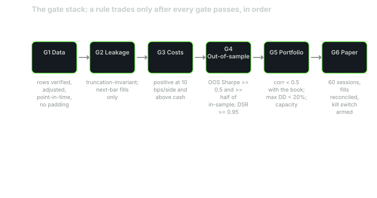

---
{
  "title": "The Gate Stack: A Written Pass/Fail Checklist Before a Rule Trades",
  "duration": "18 min",
  "free": false,
  "status": "published",
  "quiz": [
    {"q": "Why are the gates ordered data, leakage, costs, out-of-sample, portfolio, paper, and not the reverse?", "opts": ["Alphabetical convenience", "Each gate assumes the ones before it passed: an out-of-sample Sharpe on leaked data is fiction, and a portfolio blend of a rule that fails costs is a blend of nothing", "Later gates are harder to code", "Paper trading is optional"], "correct": 1, "explain": "The stack is a dependency chain. A number produced at gate 4 is only meaningful if gates 1 to 3 held. Running them out of order lets a rule reach 'pass' on a metric that should never have been computed."},
    {"q": "The RSI(2) rule's deflated Sharpe was 0.43 against a threshold of 0.95, and its excess Sharpe over cash was 0.06 against 0.30. The verdict is:", "opts": ["Pass with conditions", "Fail; the rule does not trade, and the failing gates are written next to the numbers that failed them", "Pass, because the walk-forward folds were all positive", "Re-run with 2 bps costs"], "correct": 1, "explain": "A stack is pass/fail on every gate. Positive folds do not offset a failed cash gate or a failed selection gate. Re-running with a friendlier cost is choosing the threshold after the result, which lesson 3 forbids."},
    {"q": "Which threshold is set from the standard error of the estimate rather than from preference?", "opts": ["Minimum 100 trades", "Out-of-sample Sharpe at least half of in-sample", "Excess Sharpe over cash of at least 0.30, because a ten-year Sharpe has a standard error near 0.32 and anything smaller cannot be told from zero", "Max drawdown under 20%"], "correct": 2, "explain": "The cash threshold is one standard error of a decade-long Sharpe estimate. The drawdown and trade-count gates are judgement calls about what an account can survive and what a statistic needs; they are stated as such."},
    {"q": "A rule passes every gate except G6 (paper trading, 60 sessions with reconciled fills). It may:", "opts": ["Trade at half size", "Trade with a tight stop", "Not trade; it starts the paper book, and the paper book's own thresholds decide", "Trade if the researcher is confident"], "correct": 2, "explain": "The paper gate exists because every earlier gate ran on history the researcher could see. It is the only replication on data that did not exist when the rule was written, and there is no partial credit for it."},
    {"q": "What is the purpose of writing the gate stack down with thresholds before running any of it?", "opts": ["So the code is documented", "So the same result cannot be argued into a pass after the fact, and so every retired rule leaves a record of which gate it failed", "So thresholds can be tuned later", "Regulatory filing"], "correct": 1, "explain": "A threshold written after the result is a rationalisation. A written stack turns a research programme into a series of recorded decisions, each of which can be audited later."}
  ],
  "task": "Write your own gate stack as a table with a threshold for every row, date it, and apply it to one rule you already run; record the verdict."
}
---

## What a gate stack is

A gate stack is a written list of tests a rule must pass before it trades, with a numeric threshold for every test, ordered so that each test assumes the earlier ones passed. It is the research loop of lesson 3 turned into a checklist, and it exists for one reason: so that the decision to trade a rule is made by the thresholds, written before the tests were run, and not by how the researcher feels about the equity curve.

Every lesson so far produced one or more of the gates. This lesson assembles them, states the threshold for each, explains where each threshold comes from, and applies the stack to the running example. The example fails. That is the correct result, and the point of the lesson is that the stack says so in writing, gate by gate, in a form that can be audited later.

*Figure: the gate stack as a dependency chain. A rule enters at the left and trades only after the paper gate at the right; each box's note is the threshold that box applies. Source: course design; thresholds as stated in the table below.*

## Why the order matters

The stack is ordered by dependency, not by importance. Every number produced at a later gate is computed on top of the earlier ones. An out-of-sample Sharpe is meaningless if the data had padded rows (gate 1) or the signal read the future (gate 2). A portfolio blend of a rule that does not survive costs (gate 3) is a blend of nothing. A paper book (gate 6) is a waste of sixty sessions if the rule failed the cash benchmark on ten years of history.

There is a second reason. Early gates are cheap and mechanical; later gates cost time. Running the cheap gates first means most rules are retired in an afternoon with a clear reason, and only the few that pass consume the weeks a walk-forward and a paper book take.

## The gates

G1, data. The bars are what you think they are. Interval verified from the response, row count per year matches the exchange calendar, index unique and sorted, no nulls, prices adjusted for splits and dividends with the factor stored separately, no padded tail, and for any multi-name rule a point-in-time universe. Threshold: every check passes; a single failure is a fail. Source: lesson 2.

G2, leakage. Signals are truncation-invariant (zero differences when the data is cut at any date), every fill is at the open, the close, or a limit set the previous session, and the rule was hand-walked over at least five rows around a signal change. Threshold: zero truncation differences, zero fills outside the bracket. Source: lessons 4 and 6.

G3, costs. The rule is charged per side on every position change. Threshold: CAGR remains positive at 10 bps per side, and the cost assumption is printed next to every number. For instruments with a visible spread, the charge is the measured half-spread on the rule's own trade days plus modelled impact at the intended size. Source: lesson 5.

G4, out-of-sample. Three parts. (a) Anchored walk-forward with at least three folds: every fold's test Sharpe positive, and the stitched out-of-sample Sharpe at least 0.50 and at least half of the in-sample figure. (b) Deflated Sharpe on the best cell of the parameter sweep, with N counting every trial including abandoned ones: at least 0.95. (c) Excess Sharpe over T-bills on the full window at least 0.30. The 0.30 is one standard error of a ten-year Sharpe estimate (1/√10 = 0.32); anything smaller cannot be told from zero. The 0.50 stitched threshold is a judgement: it is the level at which two-year folds (standard error about 0.7 each) agreeing in sign starts to mean something. Source: lessons 7, 8, 9.

G5, portfolio. Maximum drawdown no worse than -20% on the full window; longest drawdown no longer than 504 sessions (two years); at least 100 closed trades; daily-return correlation with each existing rule below 0.50; the blend with the existing book has a higher Sharpe than the book alone; intended order size below the impact-model capacity at the cost budget. The drawdown thresholds are what an account of the intended size can survive and are the most personal numbers in the stack; write your own and do not move them after a result. Source: lessons 9 and 10.

G6, paper. Sixty sessions on a paper book with every fill reconciled against the modelled fill, the measured cost per side within 5 bps of the modelled cost, the signal series matching the backtest's signal-for-signal on every session, and a kill switch defined and armed before the first session. Threshold: all four hold; any discrepancy the reconciliation cannot explain is a fail. Source: lesson 11.

A rule trades when every gate passes. There is no weighting, no partial credit, and no "pass with conditions". A rule that fails is retired with a log entry naming the gate and the number.

## Worked example

The stack applied to the running example: RSI(2) below 10 on SPY, exit at the first close above the 5-day SMA, next-open execution, 5 bps per side unless stated, 2016-01-04 to 2025-12-30, adjusted bars from the Yahoo Finance chart API (2,765 rows, 2015-01-02 to 2025-12-30). Every number is from an earlier lesson.

G1. 2,765 rows, `dataGranularity` 1d, per-year counts 249 to 253 matching the NYSE calendar, unique sorted index, zero nulls, 44 dividend adjustments, zero splits, no padded tail. Pass.

G2. Truncation at 2022-12-30: 0 of 2,014 signals differed. All fills at the next open. Hand-walk over 2020-03-09 to 03-25 in lesson 9 matched the code. Pass.

G3. CAGR at 10 bps per side: +1.23% (Sharpe 0.17). Positive. Pass, narrowly, and the report notes the rule is dead at 20 bps (-0.99%).

G4a. Anchored three-fold walk-forward, 5 bps: test Sharpes 0.48, 0.25, 0.86 with re-fitting (0.27, 0.22, 0.92 with fixed parameters); all positive. Stitched out-of-sample Sharpe 0.51 re-fitted, 0.45 fixed. In-sample Sharpe for the fixed rule over 2016-2020 was -0.11, so "at least half of in-sample" is trivially met. The stitched figure passes at 0.51 with re-fitting and fails at 0.45 without; the rule as written (fixed parameters) fails. Fail.

G4b. Deflated Sharpe on the best of 24 cells: 0.43 against 0.95. Fail.

G4c. Excess Sharpe over T-bills, full window: 0.06 against 0.30. Fail.

G5. Maximum drawdown -30.0% against -20%: fail. Longest drawdown 1,300 sessions against 504: fail. Closed trades 110 against 100: pass. Correlation with the SMA200 rule 0.31 against 0.50: pass. Blend Sharpe 0.77 against 0.93 for the trend rule alone: fail. Capacity $87.6 million per order against any retail size: pass. Three of six fail.

G6. Not run; the stack stops at the first failing gate, and G4 failed on three of three parts.

Verdict: FAIL at G4 (all three parts) and G5 (drawdown depth, drawdown duration, blend). The rule does not trade. Logged 2026-09-30 with the numbers above. The rule's family (24 cells) is logged as 24 trials against any future variant, and the walk-forward showed the family's in-sample optimum is unstable, so no variant of it is queued.

Note what the verdict is not. It is not a claim that RSI(2) mean reversion on SPY has no edge; the walk-forward folds were all positive and the 2021-2025 period was uniformly good for the family. It is a claim that on this data, with these costs, the rule as written cannot be distinguished from cash, its selection cannot be distinguished from noise, and its drawdown profile is that of the index it trades. Those are the three things a trader needs to know before funding it, and the stack produced all three.

## Table

The stack as a checklist. Copy it, change the thresholds you disagree with before you run it, and date it.

| Gate | Test | Threshold | RSI(2) rule | Result |
|---|---|---|---|---|
| G1 Data | Interval, row counts, uniqueness, nulls, adjustment, padding | All checks pass | All pass | Pass |
| G2 Leakage | Truncation differences; fills inside bracket; hand-walk | 0; 0; matches | 0; 0; matches | Pass |
| G3 Costs | CAGR at 10 bps per side | > 0 | +1.23% | Pass |
| G4a Walk-forward | Every fold positive; stitched OOS Sharpe | All > 0; ≥ 0.50 and ≥ half of IS | All > 0; 0.45 fixed / 0.51 re-fit | Fail (fixed) |
| G4b Selection | Deflated Sharpe, N = all trials | ≥ 0.95 | 0.43 (N = 24) | Fail |
| G4c Cash | Excess Sharpe over T-bills, full window | ≥ 0.30 | 0.06 | Fail |
| G5 Drawdown | Max drawdown; longest drawdown | ≥ -20%; ≤ 504 sessions | -30.0%; 1,300 | Fail |
| G5 Sample | Closed trades | ≥ 100 | 110 | Pass |
| G5 Book | Correlation with existing rules; blend Sharpe vs book | < 0.50; higher | 0.31; 0.77 vs 0.93 | Fail (blend) |
| G5 Capacity | Order size vs impact capacity at cost budget | Below | $87.6M capacity | Pass |
| G6 Paper | 60 sessions, fills reconciled, signals match, kill switch armed | All hold | Not run | Not run |
| Verdict | | All gates pass | 5 fails across G4 and G5 | Does not trade |

The capstone asks you to reproduce this table for the same rule at 10 bps per side, where the G3 margin narrows and the cash gate fails by more, and to write the verdict in your own words.

## Sources

- Bailey, D. H., López de Prado, M. (2014). "The Deflated Sharpe Ratio." Journal of Portfolio Management 40(5). https://doi.org/10.3905/jpm.2014.40.5.094
- Lo, A. W. (2002). "The Statistics of Sharpe Ratios." Financial Analysts Journal 58(4). https://doi.org/10.2469/faj.v58.n4.2453
- Harvey, C. R., Liu, Y. (2015). "Backtesting." Journal of Portfolio Management 42(1). https://doi.org/10.3905/jpm.2015.42.1.013
- Yahoo Finance, SPY historical data: https://finance.yahoo.com/quote/SPY/history/
