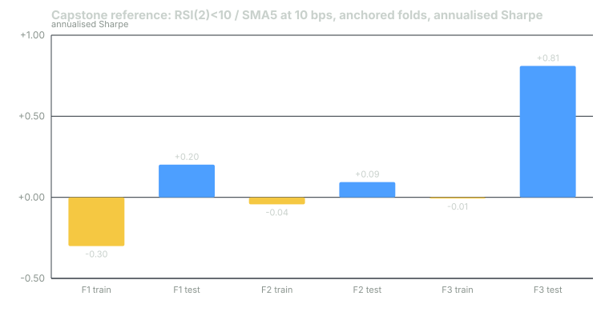

---
{
  "title": "Capstone: RSI(2) on SPY Through the Whole Stack",
  "duration": "90 min",
  "free": false,
  "status": "published",
  "quiz": [
    {"q": "The capstone window is 2016-01-04 to 2025-12-30 with 2015 as warm-up. Why is the warm-up year fetched but excluded from the results?", "opts": ["To save memory", "Because the indicators need history before the first test day; without it the first sessions of 2016 would have no RSI or SMA and the equity curve would start late or on partial signals", "Because 2015 was a bad year", "Because Yahoo requires it"], "correct": 1, "explain": "RSI(2) with Wilder smoothing and a 5-day SMA need only a few rows, but the convention is to fetch a full year of warm-up so any indicator you add later has the same start date."},
    {"q": "Your walk-forward has three anchored folds and fixed parameters (RSI below 10, exit above SMA5). What does the fold structure test when nothing is re-fitted?", "opts": ["Whether the rule's sign and magnitude hold across three consecutive periods it was not written on, which is the replication question with the selection question removed", "Nothing; walk-forward requires re-fitting", "The best parameters", "Costs"], "correct": 0, "explain": "With parameters fixed from the hypothesis, the folds are three independent looks at the same rule. The stitched result is the out-of-sample record; the per-fold results show whether it depended on one period."},
    {"q": "At 10 bps per side the reference run's excess Sharpe over T-bills is -0.04 and its total return is +12.9% against +25.1% for bills. The gate-stack verdict on G4c is:", "opts": ["Pass, because the total return is positive", "Fail; the rule earned less than cash and the excess Sharpe is negative", "Inconclusive", "Pass with a note"], "correct": 1, "explain": "The cash gate compares the rule with the alternative of doing nothing. At 10 bps the rule is worse than nothing."},
    {"q": "The rubric awards points for a verdict that names the failing gates with their numbers, not for a positive result. Why?", "opts": ["Because the rule is known to fail", "Because positive results are rare", "Because rubrics must be negative", "Because the skill being graded is the discipline of testing and reporting, and a report that finds a fail and says so precisely is worth more than a report that finds a pass and cannot show how"], "correct": 3, "explain": "The course's running example does not pass its own stack. A submission that produces a pass has almost certainly made an error somewhere in the stack, and the rubric is built to catch that."},
    {"q": "Your submission's trade count differs from the reference by two trades. The first thing to check is:", "opts": ["The Sharpe", "The cost", "The RSI implementation (Wilder smoothing via ewm with alpha=1/2, adjust=False) and the state machine that prevents re-entry while in a position", "The fold boundaries"], "correct": 2, "explain": "A different RSI smoothing (simple mean, or adjust=True) changes which days cross 10; a rule that allows re-entry on the same day it exits changes the count. Both are specification differences, not data differences."}
  ],
  "task": "Submit your notebook or script, the metrics table, the fold table and the written verdict; the rubric below is how it is graded."
}
---

## The task

Implement one rule, test it through every gate in the course, and write the verdict. The rule, the window, the costs and the folds are fixed so that every submission can be compared against the reference numbers in the rubric. The grade is for the discipline of the test and the honesty of the report, not for the result: the reference run fails the stack, and a submission that passes it has made an error somewhere.

The rule. Long SPY when RSI(2) of the adjusted close, with Wilder smoothing, is below 10 at the close; exit at the first close above the 5-day simple moving average of the adjusted close. One position at a time; no re-entry on the exit day. Signal at the close, fill at the next session's open, cash earns nothing inside the strategy series (the cash benchmark is separate).

The data. SPY daily bars from the Yahoo Finance chart API with explicit Unix timestamps, `period1=1420070400` (2015-01-01 UTC) and `period2=1767139200` (2025-12-31 UTC), `interval=1d`. Assert `dataGranularity` is `1d`. Adjust open, high, low and close by the ratio of adjusted close to close. Verify 2,765 rows, 2015-01-02 to 2025-12-30, and the per-year counts from lesson 2. If Yahoo has paid a dividend since this course was written, your adjusted prices will differ from the reference by a constant factor and your returns will be identical to four decimal places; if they are not, something else differs.

The window. Test 2016-01-04 to 2025-12-30 (2,512 open-to-open returns). 2015 is warm-up only.

The cost. 10 basis points per side, charged on every change in position. Report the 0 bps and 5 bps figures alongside for comparison, but the gate verdict is at 10 bps.

The folds. Anchored, three folds, parameters fixed (no re-fitting): test windows 2020-01-02 to 2021-12-31, 2022-01-03 to 2023-12-29, 2024-01-02 to 2025-12-30, each with its training window running from 2016-01-04 to the day before the test starts. Report in-sample Sharpe on each training window and out-of-sample Sharpe, CAGR and trade count on each test window, and the stitched out-of-sample series over 2020-2025.

The cash benchmark. FRED series DGS3MO, forward-filled to trading days, divided by 100 and by 252, compounded over the test window.

## Deliverables

1. A script or notebook that runs end to end from the fetch to the verdict, with the data checks as assertions.
2. A metrics table for the full window at 10 bps: total return, CAGR, annualised volatility, Sharpe (all days, daily × √252), Sharpe in excess of T-bills, active-days Sharpe with exposure, maximum drawdown with its date, longest drawdown in sessions, worst day, 1% CVaR, skew, kurtosis, closed trades, win rate, average winner, average loser, expectancy, average hold. The same table for SPY buy-and-hold (open-to-open, adjusted) and the T-bill total.
3. The fold table.
4. A truncation-invariance check with the cut at 2022-12-30 and the count of differing signals.
5. The deflated Sharpe for the best cell of the 24-point grid from lesson 7 (entry in {5, 10, 15, 20, 25, 30}, exit in {3, 5, 10, 20}), at 10 bps, with N = 24 and the in-sample window 2016-01-04 to 2020-12-31. Show SR₀ and the DSR.
6. The gate-stack table from lesson 12 with every row filled in at 10 bps, and a written verdict of no more than 200 words naming each failing gate with the number that failed it.

## Reference figures

These are what the course's own run produced at 10 bps per side, so you can check your pipeline before writing the verdict. Small differences in the third decimal are expected from floating-point order; a difference in trade count or in the sign of any figure is a specification difference to find.

Full window, 10 bps: total return +12.93%, CAGR 1.23%, annualised volatility 10.77%, Sharpe 0.17, excess Sharpe over T-bills -0.04, exposure 15.3%, active-days Sharpe 0.69, maximum drawdown -31.67% on 2020-03-20, longest drawdown 1,762 sessions, worst day -8.80% on 2020-03-11, 1% CVaR -3.85%, skew -1.10, kurtosis 55.2. Trades: 110 closed, win rate 66.4%, average winner +1.338%, average loser -1.929%, expectancy +0.239%, average hold 5.1 calendar days, worst trade -13.55% (entered at the 2020-03-10 open). T-bills over the window: +25.11%. SPY buy-and-hold: +304.57%, CAGR 15.05%, Sharpe 0.90, maximum drawdown -32.05%.

Folds, fixed parameters, 10 bps: fold 1 in-sample Sharpe -0.30, test 2020-2021 Sharpe 0.20, CAGR 1.9%, 20 trades; fold 2 in-sample -0.04, test 2022-2023 Sharpe 0.09, CAGR 0.4%, 28 trades; fold 3 in-sample -0.01, test 2024-2025 Sharpe 0.81, CAGR 9.1%, 25 trades.

## Chart


*Figure: the reference run's anchored three-fold walk-forward for RSI(2)<10 / exit above SMA5 on SPY at 10 bps per side, parameters fixed. Yellow bars are the training-window Sharpe, blue bars the test-window Sharpe, for folds testing 2020-21, 2022-23 and 2024-25. Source: Yahoo Finance chart API for SPY, 2016-01-04 to 2025-12-30.*

Note that every in-sample Sharpe is negative and every out-of-sample Sharpe is positive. That pattern is the 2021-2025 regime effect from lesson 7 and it is one of the things your verdict should say something about.

## Worked example

The one piece of the pipeline that most submissions get wrong is the signal state machine, so here it is in full, with the check that catches the two common errors.

```python
def rsi(close, n=2):
    d = close.diff()
    up, dn = d.clip(lower=0), (-d).clip(lower=0)
    au = up.ewm(alpha=1 / n, adjust=False).mean()     # Wilder smoothing
    ad = dn.ewm(alpha=1 / n, adjust=False).mean()
    return 100 - 100 / (1 + au / ad)

def rsi_signal(adj, entry=10, exit_sma=5):
    r, sma, c = rsi(adj["close"]), adj["close"].rolling(exit_sma).mean(), adj["close"]
    state, out = 0, []
    for rv, cv, sv in zip(r, c, sma):
        if state == 0 and rv < entry:
            state = 1                                   # enter; no exit check this row
        elif state == 1 and cv > sv:
            state = 0                                   # exit; no re-entry this row
        out.append(state)
    return pd.Series(out, index=adj.index)

sig = rsi_signal(adj)
pos = sig.shift(1).fillna(0)
assert int((pos.diff() == 1).loc["2016":"2025"].sum()) == 110       # entries
assert int((sig != rsi_signal(adj.loc[:"2022-12-30"]).reindex(sig.index).fillna(sig)).loc[:"2022-12-30"].sum()) == 0
```

Walk the first entry of the test window to see the machine work. Compute the 2016 signals and print the first row where `sig` turns 1 with the RSI value on that row; it must be below 10 and the previous row's state must be 0. Then print the first row after it where `sig` returns to 0 with the close and the 5-day SMA; the close must exceed the SMA. If the entry row's RSI is not below 10, your smoothing differs (a simple rolling mean of gains gives a different RSI). If a row shows an exit and an entry on the same day, the `elif` has been replaced by a second `if`.

The 110-entry assertion is the fastest end-to-end check of the whole specification: it fails if the adjustment, the RSI, the state machine or the window is wrong. The truncation assertion is gate G2.

## Rubric

Graded out of 100. The verdict is worth more than the metrics because the metrics can be copied and the verdict cannot.

| Criterion | What earns full marks | Points |
|---|---|---|
| Data and checks | Explicit timestamps; `dataGranularity` asserted; 2,765 rows and per-year counts asserted; all four price columns adjusted by the stored factor; T-bill series fetched and aligned | 15 |
| Signal and execution | Wilder RSI; state machine with no same-day re-entry; `shift(1)` position; open-to-open returns; cost on `pos.diff().abs()`; 110 entries reproduced; truncation check returns 0 | 20 |
| Metrics table | Every listed metric for the rule, SPY and T-bills, each with its convention stated (all-days vs active, raw vs excess, calendar vs session hold); values within rounding of the reference | 15 |
| Walk-forward and DSR | Three anchored folds with the stated boundaries, per-fold in-sample and test figures, stitched series, N = 24 grid at 10 bps with SR₀ and DSR shown step by step | 20 |
| Gate-stack table | Every row of the lesson-12 table filled at 10 bps with the threshold, the observed value and pass/fail; no threshold changed from the lesson | 10 |
| Written verdict | Under 200 words; names each failing gate and its number; states what the result does and does not establish (the regime effect, the positive folds, the cash comparison); no claim the rule works and no claim it cannot | 20 |

Deductions, applied after the criteria above: -10 for any performance figure reported without its cost assumption; -10 for a verdict that says the rule passes; -5 for an unstated Sharpe convention; -5 for a fold table without trade counts.

A submission that finds a specification error in the reference run, documents it with the row where the two differ, and reports both numbers, earns full marks on the affected criterion regardless of which number is right.

## Sources

- Yahoo Finance, SPY historical data: https://finance.yahoo.com/quote/SPY/history/
- FRED, 3-Month Treasury Bill Secondary Market Rate (DGS3MO): https://fred.stlouisfed.org/series/DGS3MO
- Bailey, D. H., López de Prado, M. (2014). "The Deflated Sharpe Ratio." Journal of Portfolio Management 40(5). https://doi.org/10.3905/jpm.2014.40.5.094
- pandas documentation, `Series.ewm` (the `adjust=False` form used for Wilder smoothing): https://pandas.pydata.org/docs/reference/api/pandas.Series.ewm.html
