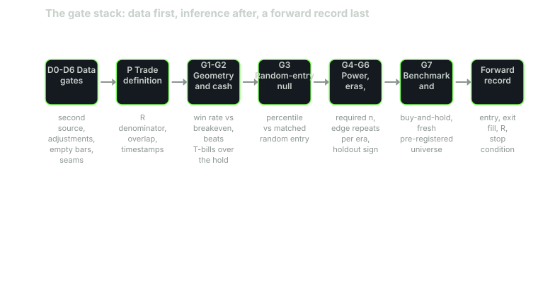

---
{
  "title": "Why the Data Fails Before the Strategy Does",
  "duration": "16 min",
  "free": true,
  "status": "published",
  "quiz": [
    {"q": "A backtest passed a random-entry null, a walk-forward holdout and a family-wise bar. Which of these could have detected that the session closes it used were untraded stub prints?", "opts": ["The random-entry null, because it draws from the same bars", "The walk-forward holdout, because the stub is absent in the later years", "None of them; only a second data source can see a wrong bar", "The family-wise bar, because it is the strictest"], "correct": 2, "explain": "Every inference gate operates on the bars it is handed. A null, a holdout and a multiple-testing correction all consume the same wrong close and pass it together. Only a comparison against an independent source can show that the close never traded."},
    {"q": "An intraday breakout rule needed a 46.8% win rate (41.8% breakeven plus a 5-point margin). On stub closes it achieved 47.0%; on the real closing auction, 46.4%. With 588 trades, roughly how many trades changed sign?", "opts": ["About 35", "About 3.5", "All 120 that exited at the close", "None; 0.6 points is rounding"], "correct": 1, "explain": "0.6 percentage points of 588 trades is 3.5 trades. A 98th-percentile result rested on three or four trades whose exit price was a print that did not trade."},
    {"q": "Why does the gate stack run data checks before the trade is even defined?", "opts": ["Because every later number is a function of the bars, so a defect in the bars propagates through every gate at once", "Because data checks are cheap and inference is expensive", "Because vendors require it", "Because the null needs clean data but the holdout does not"], "correct": 0, "explain": "Order is the point. A defect that enters before the first gate is invisible to every gate after it, and the stack will pass it with six green lights."},
    {"q": "A rule showed +0.1162 R per trade over 583 trades (98th percentile) in its discovery window and +0.0093 R over 2,093 trades (85th percentile) on 8.3 earlier years it had never seen, with five of nine years negative. The correct reading is:", "opts": ["Average the two windows; the rule is marginally positive", "Expectancy fell about 12.5 times on unseen data; the rule is refuted", "The confirmatory window is stale; markets changed after 2024", "Both windows pass because both are above the 50th percentile"], "correct": 1, "explain": "0.1162 divided by 0.0093 is 12.5. A pre-registered confirmatory test on disjoint data that shrinks the effect by an order of magnitude is a refutation, not a disagreement to be averaged."},
    {"q": "At the end of the stack a rule is marked PASSED. In this course that word means:", "opts": ["The rule is profitable and can be sized", "The rule has a positive Sharpe ratio", "The rule beat buy-and-hold", "The rule is a lead that has earned a forward record, and nothing more"], "correct": 3, "explain": "Seventeen studies went through the stack in the research notes and one passed. That one was labelled a lead, with two errands and a forward record still owed. PASSED buys the right to keep testing, not the right to trade."}
  ],
  "task": "Write down, for the last backtest you ran, which data source produced the bars and which independent source could have checked them; if the answer to the second is none, that is your first finding."
}
---

## The backtest is a function of the data first

Every number a backtest produces is computed from bars: an entry price, a stop level, an exit, a return, a win rate, a Sharpe ratio, a percentile against a null. The rule sits on top of the bars, and so does every test you will ever run on the rule. That ordering has a consequence which is easy to state and hard to feel until it has cost you something: a defect in the bars is invisible to every check that runs on the bars. A random-entry null draws from the same wrong closes. A walk-forward holdout tests the rule on the same wrong closes in a later year. A multiple-testing correction raises the bar the wrong closes must clear, and they clear it.

This course is built around a validation stack that was assembled one gate at a time while strategies died in it. Most of the strategies in the notes it draws on failed, and that is the point. The stack's most expensive lesson was not about any strategy. It was that the stack tested inference and nothing in it tested the data.

## A 98th percentile that was a data defect

The case is dated 2026-09-14 in the Phantom Traders research notes (internal). An opening-range breakout on SPY five-minute bars, 584 sessions from May 2024 to September 2026, had been run through nine parameter cells. One cell (15-minute range, 2.0x target) came out at +0.1162 R per trade, a 47.0% win rate and the 98th percentile against a random-entry null. It was, in the notes' own words, the closest anything had come in thirteen studies.

The intraday table it ran on had been filled from a vendor's five-minute feed. Each session's last row carried a 16:00 timestamp, and the rule treated that row as the session close, because that is what a last row looks like. The row was a stub: a bar the vendor emits at the bell with no volume behind it, not the closing auction print. When the closing auction was sourced from a second feed and substituted in, all nine cells died at the first inference gate. The win rate on real closes was 46.4% against a required 46.8%.

Nothing about the null, the holdout or the family-wise bar was wrong. They had been asked a question about bars, and the bars were wrong before the question was asked. The discovery and confirmatory runs, it turned out, had never even been on the same basis: one used the in-house table that ended on a stub, the other a backfill whose sessions ended on the real auction. Half the evidence was tradeable and half was an artefact, and nobody knew until the auction was sourced.

## What no downstream gate can see

Take the families of failure in turn and ask which gate catches each.

A wrong price on a bar. The stub close above. Also a bar that keeps the split state it had when it was fetched, so that a 30-for-1 reverse split reads as a +2,309% day; a delisted name a vendor pads forward at a flat price and zero volume for three years; a session that ends on a bar that never traded. No inference gate sees any of these. They are caught by comparing against a second source, by counting zero-volume bars, by checking that a cliff in the price is confirmed elsewhere. Lessons 2 and 3 are about these.

A wrong measurement of a right price. The stop sits on the entry bar's own low, so risk is nearly zero and an ordinary 4% move reads as 152 R. A scanner stamps a signal with a bar that closed five hours earlier and grades the outcome from that stamp, so the result includes price that had already printed. These are caught by looking at the risk denominator and at the gap between when a signal was stamped and when it could have been acted on. Lessons 3 and 4.

A right measurement of a right price that means nothing. A long rule on an asset that rose five-fold. A rule that beats random entry while losing money. A rule that lived in one year of eighteen. A pass count that rested on one ticker. These are the inference gates: the null, the benchmarks, the per-era score, the noise floor, replication. Lessons 5 through 10.

The stack orders these from the outside in. Data gates run before the trade is defined. Trade-definition gates run before any inference. Inference gates run in order of what they can reveal. The forward record runs last and never ends.

## Worked example

The arithmetic that killed the breakout is short enough to do by hand, and it is worth doing because the margin involved is smaller than most people's intuition for what a 98th percentile means.

The bracket was a 2.0-to-1 target-to-stop. Ignoring cost, a 2R winner and a 1R loser break even at a win rate of 1 / (1 + 2) = 33.3%. Measured round-trip cost on the five-minute bars raised that to 41.8%, the figure the notes record as the required win rate; the stack then demands a five-point margin above breakeven before a cell is allowed to proceed, so the bar was 46.8%.

On stub closes: 47.0% achieved, clearing the bar by 0.2 points. On the real closing auction: 46.4%, missing by 0.4 points. The swing is 0.6 points on 588 trades, which is 588 × 0.006 = 3.5 trades changing from win to loss.

Only 120 of the 588 trades (20%) exited at the session close; the rest hit a stop or a target intraday. The median correction between the stub and the auction print was 7 basis points. Seven basis points on a fifth of the trades was enough to flip three or four of them, and three or four trades was the entire margin the 98th percentile had been built on.

Then the confirmatory run. One cell was pre-registered, the window was 2016-01 to 2024-05 (strictly disjoint from discovery, asserted in code), and the bar was the 95th percentile with the null drawn seven times with different seeds.

| window | trades | R per trade | win rate | percentile |
|---|---|---|---|---|
| discovery, 2024-05 to 2026-09 | 583 | +0.1162 | 47.0% | 98th |
| confirmatory, 2016-01 to 2024-05 | 2,093 | +0.0093 | 43.1% | 85th |

Expectancy fell by 0.1162 / 0.0093 = 12.5 times. Five of the nine confirmatory years were negative (2016 through 2020 all below zero; 2021 through 2023 positive; 2024 the worst of all at −0.0936 R). The four months immediately before the discovery window began were the worst stretch in the whole sample, at 37.2% wins. Same instrument, same rule, adjacent months, opposite results. That is what a lucky window looks like from the inside, and 584 sessions of careful arithmetic could not tell it from an edge.

The course's own data, for comparison, was pulled from Yahoo Finance's chart endpoint on 2026-09-30 with explicit Unix timestamps (period1 = 1104537600, period2 = 1790726400, interval = 1d). The response's `dataGranularity` field reads `1d`; the same ticker requested with `range=max` returns monthly bars and says so only in that field. SPY came back as 5,469 rows from 2005-01-03 to 2026-09-29 with no nulls, 87 dividend events, no splits and zero rows with zero volume. Those checks pass on daily SPY. They would have passed on the stub table too, because a stub carries a timestamp and a price like any other row. The check that would have failed is the one in Lesson 2: the close against a source that did not produce it.

## Table

Seventeen studies went through the stack in the research notes between August and September 2026. Their causes of death, grouped by which family the failure belonged to, are the syllabus of this course.

| Study | Died at | Family | Lesson |
|---|---|---|---|
| Opening-range breakout, 9 cells | Data: stub close read as session close | wrong price | 2, 3 |
| Reversal scanner, 3 setups | Data: signal stamped 305 minutes stale | wrong timestamp | 3 |
| 3-bar pullback v1 | Denominator: 44 of 251 trades carried 72% of gross R | wrong measurement | 4 |
| Inside-day, 3% trail | Overlap: 41 trades in 2017 averaged +13%, one move counted five times | wrong measurement | 8 |
| Donchian breakout, 4 cells | Null: random entry beat it at the 0th to 7th percentile | inference | 5 |
| NR7 on 15 fresh names | Null passed at the 100th percentile on 14 of 15, all 14 lost money | inference | 6 |
| Swing momentum on QQQ | Cleared nine gates at the 51st percentile of random entry | inference | 7 |
| Swing momentum on AAPL | Captured 15% of buy-and-hold; edge lived after 2016 only | inference | 7, 8 |
| IBS on 38 names | 6 passed the noise floor; 1 of 34 on a fresh universe | inference | 9 |
| Pairs, 18 cells | 8 passed; one ticker was in 5 of the 8 | inference | 10 |
| Gap-down fill | Geometry: 59.2% achieved against 59.6% required | no edge, cleanly | 4 |
| Turn-of-month, 1993-2026 | Passed every gate; labelled a lead, forward record owed | passed | 12, 13 |

Read the last row carefully. One pass in seventeen, and the pass was labelled a lead rather than a finding because 45% of its trades sat in years no second vendor had audited, and because seven foreign markets that replicated it were, after their correlation was measured, worth about 1.4 independent looks. Passing the stack earns a forward record. It does not earn a position.

## Sources

- Bailey, D. H., Borwein, J. M., López de Prado, M., Zhu, Q. J. (2014). "Pseudo-Mathematics and Financial Charlatanism: The Effects of Backtest Overfitting on Out-of-Sample Performance." Notices of the AMS 61(5). https://doi.org/10.1090/noti1105
- Harvey, C. R., Liu, Y. (2015). "Backtesting." Journal of Portfolio Management 42(1). https://doi.org/10.3905/jpm.2015.42.1.013
- Ioannidis, J. P. A. (2005). "Why Most Published Research Findings Are False." PLoS Medicine 2(8). https://doi.org/10.1371/journal.pmed.0020124
- Yahoo Finance, SPY historical data (the daily bars used throughout this course): https://finance.yahoo.com/quote/SPY/history/
