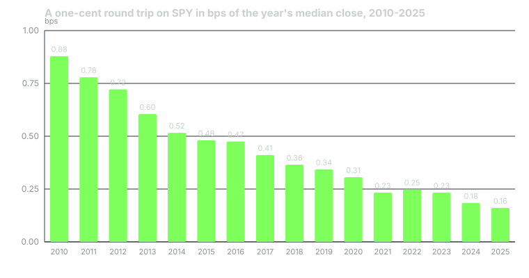

---
{
  "title": "Costs and Capacity: Spreads, Turnover and the Hurdle",
  "duration": "17 min",
  "free": false,
  "status": "published",
  "quiz": [
    {"q": "An SPY spread measured at 0.285 bps with SPY near $623 is carried unchanged into a backtest over 2016-2024, when SPY's median price was $281. What goes wrong?", "opts": ["Nothing; bps are scale-free", "The spread was wider in 2024", "Spreads should be ignored on ETFs", "The spread is roughly constant in dollars (one cent), so on the older, cheaper sample it was about 0.631 bps, 2.2 times the figure used; carrying bps flatters the early years"], "correct": 3, "explain": "A penny-wide market has a constant dollar spread. Its cost in bps rises as the price falls. Model spread in dollars over a long sample and convert per bar."},
    {"q": "The RSI(2) rule on SPY earns 44.6 bps gross per trade. If it were expressed through options with the measured 4.15% round trip, the cost would be:", "opts": ["Less than the edge, because options are levered", "About 9.3 times the gross edge per trade; dead before any signal research", "Equal to the edge", "Irrelevant, because options pay off non-linearly"], "correct": 1, "explain": "415 / 44.6 = 9.3. Ask the cost question before the signal question: a hurdle that size eliminates the instrument without a day of research."},
    {"q": "An options chain table has bid and ask columns. 691,021 rows from the last 30 days, and the backtest assumed a spread from them. How many rows held a quote?", "opts": ["Zero; the columns existed and were empty, which reads exactly like data until it is counted", "All of them", "About half", "Only the at-the-money strikes"], "correct": 0, "explain": "Verify a quote column with a count of rows where bid is greater than zero, never by the column's existence. The measured hurdle came from a different table that was 100% quoted."},
    {"q": "A capture script printed a round-trip cost for a metals ETF of 8.368 bps. The setup enters in the 15:55 close bucket, where the cost was 4.236 bps. Using the printed figure would have:", "opts": ["Been conservative and harmless", "Had no effect, since cost cancels against the null", "Doubled the cost and invented a geometry-gate failure the setup did not have", "Lowered the required win rate"], "correct": 2, "explain": "Spreads fall into the close. An all-bucket average charges a close-entry rule for the wide spreads of the open. Cost has to be measured where the rule trades."},
    {"q": "For the turn-of-month study in the notes, cost moved the percentile from 99.5 at one tick to 99.5 at four times the model, while tradeable return fell from +0.3283% to +0.0383% per trade. Which gates does cost decide?", "opts": ["The null gate G3", "The geometry and cash gates, G1 and G2, because the null pays the same cost and friction cancels in the difference", "Only the forward record", "None"], "correct": 1, "explain": "Cost subtracts from the real side and the null side alike, so the percentile is nearly blind to it. Whether the trade is worth taking after cost is a separate gate."}
  ],
  "task": "Compute your rule's gross edge per trade in bps, the round-trip cost at which its net expectancy reaches zero, and the ratio of the two; write the ratio at the top of your results."
}
---

## Ask the cost question first

A backtest without measured costs answers a question nobody trades. The research notes (Phantom Traders, 2026, internal) state the order plainly: ask the cost question before the signal question. A hurdle that is larger than any plausible edge kills an instrument without a day of research, and the notes record a whole graveyard that would have been avoided by asking.

On 2026-08-26 the first measured execution hurdle in that system's history came out of position marks for options the bots had actually held: 9,999 quoted marks, a median half-spread of 207 bps (interquartile range 103 to 269), a round trip of 415 bps, 4.15% of the premium per trade. That one number retroactively explained most of the options failures: zero-day opening-range trades, short premium, a 22-gate entry pipeline. None of them had been beaten by bad signals. They were beaten by the spread, and none had measured it first.

The trap that had hidden it was a table with bid and ask columns that were empty. Of 691,021 SPY chain rows in the prior 30 days, zero carried a quote. A column that exists and is null reads exactly like a column with data until it is counted, and an earlier study had ended up assuming a spread because of it. Verify a quote column by counting rows where the bid is positive, never by the column's existence. The notes also found that no equity bid or ask existed anywhere in the database, so every equity backtest ever run there had been costed by assumption or not at all. The response was a cost registry that refuses a number without a citation.

## Spreads are dollars, not basis points

For a liquid ETF quoted a penny wide, the spread is roughly constant in dollars across years and the cost in bps moves inversely with price. The notes measured 0.285 bps on SPY near $623 and then applied the model to an intraday sample from 2016 to 2024 whose median price was $281: the same one-cent spread was 0.631 bps there, 2.2 times the figure carried over, and 3.5 times at the 2016 start. Carrying bps across a long sample unchanged flatters the older, cheaper years.

The effect is much larger further back. US equities were quoted in eighths of a dollar until mid-1997 and sixteenths until 2001. The notes' turn-of-month study, rebuilt on 1993-2026 data, had to model cost by era on raw prices: the eighths era cost about 49.75 bps round trip against an edge near 31 bps, and the one losing four-year bucket out of nine was 1992-1995, the costliest stretch. And it had to use raw, not adjusted, prices for the cost: adjusted 1993 SPY is roughly half the raw price, which would have overstated a tick-based cost by 70% or more.

Measure where the rule trades. A capture script printed an all-bucket average round trip of 8.368 bps for a palladium ETF; the setup entered in the 15:55 bucket, where the cost was 4.236 bps. Spreads fall into the close. Taking the printed figure would have doubled the cost and invented a failure. Commodity ETFs ran 10 to 24 times SPY's spread, and assuming SPY's cost instead of measuring each asset understated the required win rate by 1.0 to 2.2 points, which for half the set was the entire difference between nearly passing and failing.

One more rule: say which number moved more before blaming cost. In the confirmatory opening-range run, cost moved the required win rate 0.9 points while the achieved win rate fell 3.9. Cost was real and was not the cause.

## Turnover and where cost bites

Cost per year is cost per round trip times round trips per year. A rule that trades eleven times a year at 10 bps round trip pays about 1.1% of the capital it deploys each year. Cost in R is cost divided by stop distance (Lesson 6), so the same 10 bps is trivial against a 2% stop and lethal against a 0.25% one. Splitting an exit into two halves changes nothing under a bps-of-notional model; only a per-ticket commission makes it cost more.

Cost also decides which gate a rule dies at. The null pays the same cost as the real rule, so friction cancels in the difference and the percentile barely moves. The turn-of-month study held its 99.5th percentile from a one-tick floor to four times the cost model while its tradeable return fell from +0.3283% to +0.0383% per trade. Cost decides the geometry gate and the cash gate, never the null.

## Capacity

Capacity is the size at which the rule's own trading moves the price it trades at. For a single-ETF daily rule in SPY the question barely arises: in 2025 SPY's median daily volume was 68.1 million shares and its median dollar volume $42.3 billion. A $1 million order is 0.0024% of a day; $100 million is 0.24%. For a cross-section of small names, a padded universe or an options strategy, capacity can be the binding constraint and has to be estimated from the instrument's own volume and depth, not from SPY's.

## Worked example

RSI(2) on SPY, the rule from Lessons 7 to 9, daily bars from Yahoo Finance, 2010-01-04 to 2025-12-31, fetched 2026-09-30. The 173 trades earn a gross mean of +0.4460% per trade, 44.6 bps.

Net per trade at a given cost per side c is (1 + gross) × (1 − c) / (1 + c) − 1, which for small c is gross minus about 2c.

At 0 bps per side: +0.4460% per trade, sum of trade returns +77.16%.
At 2.5 bps: +0.3958%, sum +68.47%.
At 5 bps (the course's default): +0.3456%, sum +59.79%.
At 10 bps: +0.2453%, sum +42.44%.
At 20 bps: +0.0450%, sum +7.79%.
At 25 bps: −0.0550%, sum −9.51%.

Breakeven per side is about half the gross edge: 44.6 / 2 = 22.3 bps per side, 44.6 bps round trip.

Now the actual spread. A one-cent quoted spread costs half a cent on entry and half a cent on exit, one cent per round trip. Divided by the year's median raw SPY close: 2010, $113.82, so 0.01 / 113.82 = 0.879 bps round trip. By 2025, at a median of $620.57, it is 0.01 / 620.57 = 0.161 bps. The course's 5 bps per side is ten round trips' worth of 2010's spread and sixty of 2025's; it is a deliberately pessimistic figure standing in for slippage, market impact on the close and commission. Even so, the rule's margin over its round-trip cost is 44.6 / 10 = 4.5 times at that figure, and 44.6 / 0.879 = 51 times against the bare 2010 spread.

Turnover: 173 trades over 16 years is 10.8 a year; at 10 bps round trip that is 1.08% of deployed capital a year.

The same signal expressed in options: the measured round trip of 415 bps against a 44.6 bp gross edge is 415 / 44.6 = 9.3 times the edge. Dead before search.

The 1993 contrast, raw SPY from Yahoo with the eighth-dollar tick: the median 1993 close was $45.19, so a one-tick round trip was 2 × 0.125 / 45.19 = 55.3 bps, larger than this rule's entire gross edge. Computed on the adjusted median of $24.93 it would read 100.3 bps, which is why cost must be modelled on raw prices.

## Table

The cost checks the stack applies, in the order they run, with the cases from this lesson.

| Check | How | Case |
|---|---|---|
| Hurdle before search | Measured round trip vs plausible gross edge | Options 415 bps vs RSI(2) gross 44.6 bps: 9.3x, dead |
| Quote column is populated | Count rows with bid greater than zero | 0 of 691,021 chain rows quoted |
| Spread in dollars, converted per bar | Tick or quoted spread / raw price that day | 0.285 bps at $623 is 0.631 bps at $281; 55.3 bps in 1993 |
| Measured where the rule trades | Bucket the capture by time of day | 4.236 bps at the close vs 8.368 averaged |
| Per-asset, not borrowed | Measure each instrument | Commodity ETFs 10-24x SPY; 1.0-2.2 points of required win rate |
| Breakeven cost reported | Gross edge / 2 per side | RSI(2): 22.3 bps per side; net turns negative at 25 |
| Capacity | Order size / median daily dollar volume | $100M is 0.24% of SPY's $42.3B day |

## Sources

- Muravyev, D., Pearson, N. D. (2020). "Options Trading Costs Are Lower than You Think." Review of Financial Studies 33(11). https://doi.org/10.1093/rfs/hhaa010
- Frazzini, A., Israel, R., Moskowitz, T. J. (2018). "Trading Costs." SSRN Working Paper 3229719. https://doi.org/10.2139/ssrn.3229719
- U.S. Securities and Exchange Commission, Regulation NMS final rule, including Rule 612 minimum pricing increment: https://www.sec.gov/rules/final/34-51808.pdf
- Yahoo Finance, SPY historical data: https://finance.yahoo.com/quote/SPY/history/
