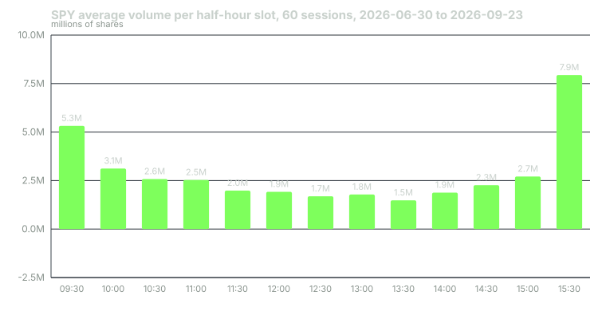

---
{
  "title": "The Intraday Session: Open, Midday, Close, and Where Volume Lives",
  "duration": "15 min",
  "free": true,
  "status": "published",
  "quiz": [
    {"q": "Over 60 SPY sessions (2026-06-30 to 2026-09-23), what share of the day's volume traded in the first and last half hours combined?", "opts": ["About 10%", "About 20%", "About 36%", "About 60%"], "correct": 2, "explain": "The 09:30 slot averaged 14.3% and the 15:30 slot 21.3%, so 35.7% of the day's shares traded in one sixth of the session."},
    {"q": "Which half-hour slot had the lowest average volume in the sample?", "opts": ["09:30–10:00", "12:30–13:00", "13:30–14:00", "15:00–15:30"], "correct": 2, "explain": "The 13:30 slot averaged 1.48 million shares, 4.0% of the day, the trough of the U-shape."},
    {"q": "The median 5-minute bar range in the first half hour was $0.94 versus $0.44 between 12:00 and 13:25. What does that imply for a fixed $0.30 stop?", "opts": ["It is equally likely to be hit at any time", "It is inside normal bar noise at the open and more reasonable at midday", "It is too wide at midday", "Stops should not be used intraday"], "correct": 1, "explain": "A stop narrower than the typical bar range gets hit by noise. The same dollar stop means different things at different times of day."},
    {"q": "Why does volume cluster at the close?", "opts": ["Retail traders wake up late", "Index funds and institutional benchmarks trade in or around the closing auction, and intraday traders flatten positions", "Exchanges lower fees after 15:30", "Volatility is always lowest at the close"], "correct": 1, "explain": "The closing auction sets the official close that index products and many benchmarks are priced against, which pulls institutional flow into the last half hour."},
    {"q": "Admati and Pfleiderer's model explains the U-shaped volume pattern through what mechanism?", "opts": ["Random noise", "Discretionary liquidity traders clustering their trades to reduce their costs, which attracts informed traders to the same periods", "Exchange opening procedures", "Overnight news only"], "correct": 1, "explain": "Traders who can choose when to trade concentrate where liquidity is deepest, and that concentration is self-reinforcing."}
  ],
  "task": "Pull one week of SPY 5-minute bars from Yahoo Finance, sum the volume by half hour, and check whether your week shows the same U-shape as the 60-session average."
}
---

## Three sessions inside one

The regular US equity session runs 09:30 to 16:00 Eastern, but treating those 390 minutes as one uniform block is the first mistake most new intraday traders make. Volume, range and the type of participant all change through the day, and a setup that works in one part is noise in another. This lesson measures the structure on real data so that later lessons can say precisely when their rules apply.

The data are SPY 5-minute bars for 60 regular sessions, 2026-06-30 to 2026-09-23, from Yahoo Finance's chart API (pulled 2026-09-24). Each session has 78 five-minute bars from 09:30 to 15:55; the 16:00 closing print is excluded.

## The open: 09:30 to about 10:30

Overnight information arrives at once. Earnings, macro data, futures moves and foreign markets have all repriced the index while the cash market was closed, and the opening auction resolves that into a single print. The first hour is where that repricing plays out: the 09:30 half-hour slot averaged 5.32 million shares, 14.3% of the day's volume, and the median 5-minute bar range in the first half hour was $0.94, more than twice the midday figure.

This is where the opening-range setups of lesson 3 live. It is also where costs are highest in effective terms: the spread in SPY is usually a cent, but quotes move faster, and a market order at 09:31 can fill several cents from where you saw the price.

## Midday: roughly 11:30 to 14:00

Volume falls steadily from the open and bottoms in the early afternoon. The 13:30 slot averaged 1.48 million shares, 4.0% of the day. The 12:30 five-minute bar averaged 345,000 shares, about 1,150 shares per second, versus 2.2 million shares, about 7,300 per second, for the 09:30 bar. Bar ranges shrink with volume: the median 5-minute range between 12:00 and 13:25 was $0.44.

For a breakout trader this is dead time, and the opening-range test in lesson 3 shows it: trades entered after 10:30 were a small, losing subset. For a mean-reversion trader it is when VWAP behaves most like a magnet (lesson 4). Lunch is also when many desks' algorithmic participation is scheduled to keep working, so the flow is more mechanical.

## The close: 15:00 to 16:00

Volume returns in the last hour and spikes into the closing auction. The 15:30 slot averaged 7.94 million shares, 21.3% of the day, the single largest slot and half again the size of the opening slot. The reason is institutional. Index funds, ETFs and any manager benchmarked to the closing price trade in or around the closing auction, and intraday traders flatten. That flow is not driven by intraday price patterns, which is why breakout rules that look for a "late-day continuation" tend to have poor statistics: they are trading against scheduled flow.

## Why the U-shape exists

Admati and Pfleiderer's 1988 model explains the pattern without appealing to psychology. Traders who have discretion over when to trade (a pension fund rebalancing, a market maker hedging) prefer to trade when liquidity is deepest because their price impact is lowest. That preference concentrates trading into particular periods, which makes those periods deeper still, and informed traders follow because their trades are better camouflaged in high volume. The equilibrium is a session with heavy trading at the ends and a hollow middle, which is exactly what the 60-session average shows.

For you, the practical consequence is that liquidity is not a constant. A 500-share order at 12:30 is a meaningful fraction of a second's flow; at 09:30 it is invisible. Fill quality, slippage and the odds that a stop gets tagged by a single stray print all depend on which of the three sessions you are in.

## Worked example

Average volume per half-hour slot across the 60 sessions, in millions of shares, computed by summing the 5-minute bar volumes inside each slot for each session and then averaging across sessions:

09:30 5.32, 10:00 3.12, 10:30 2.58, 11:00 2.53, 11:30 1.98, 12:00 1.92, 12:30 1.69, 13:00 1.78, 13:30 1.48, 14:00 1.88, 14:30 2.26, 15:00 2.71, 15:30 7.94.

Total across slots = 5.32 + 3.12 + 2.58 + 2.53 + 1.98 + 1.92 + 1.69 + 1.78 + 1.48 + 1.88 + 2.26 + 2.71 + 7.94 = 37.19 million shares per session.

Share of the day in each slot = slot / 37.19:

- 09:30 slot: 5.32 / 37.19 = 14.3%
- 15:30 slot: 7.94 / 37.19 = 21.3%
- First plus last half hour: (5.32 + 7.94) / 37.19 = 13.26 / 37.19 = 35.7%
- 13:30 slot: 1.48 / 37.19 = 4.0%

Ratio of the busiest slot to the quietest: 7.94 / 1.48 = 5.4×.

Per-second flow in the opening bar: 2,199,978 shares / 300 seconds = 7,333 shares per second. In the 12:30 bar: 345,189 / 300 = 1,151 per second. Ratio 6.4×.

Range follows volume. The median 5-minute bar range across all 4,680 bars was $0.50 (interquartile range $0.35 to $0.74); in the first half hour it was $0.94 and between 12:00 and 13:25 it was $0.44. A $0.30 stop is therefore less than a third of a typical opening bar's range, which is another way of saying it will be hit by noise at the open, while at midday it is about two thirds of a bar.

## Chart

The chart is the U-shape in one picture. Note that it is not symmetric: the close is heavier than the open in this sample, which is typical of index ETFs because of benchmark flow, and would look different in a single stock on an earnings day.

## What this means for each setup in the course

The opening range (lesson 3) is defined in the first 5, 15 or 30 minutes and traded in the first hour or two, because that is where directional information and range are. VWAP (lesson 4) becomes a usable reference only after enough volume has accumulated, and its reversion behaviour is strongest through the hollow middle. Scalping (lesson 5) needs the spread to be tight and the book to be deep at the same time, which points at the open and the last hour, and those are also where per-second flow makes it hardest to be first in the queue. Time stops (lesson 9) exist because a trade that has not resolved by the time the session turns hollow is facing a different market from the one it was designed for.

One more measurement to carry forward: the average full-session range (high minus low) in this sample was $5.88, the median $5.29, the smallest $2.57 and the largest $13.58. Every dollar target you set in later lessons should be read against that scale. A $2 target on SPY is a third of a typical day; a $6 target is the whole day and should not be expected from a rule that enters at 10:00.

## Sources

- Anat Admati and Paul Pfleiderer, "A Theory of Intraday Patterns: Volume and Price Variability," Review of Financial Studies 1(1), 1988: https://doi.org/10.1093/rfs/1.1.3
- New York Stock Exchange, "Hours & Calendars" (regular session 09:30–16:00 ET, auction schedule): https://www.nyse.com/markets/hours-calendars
- Yahoo Finance, SPY historical data page (the chart API used here serves the same bars): https://finance.yahoo.com/quote/SPY/history/
