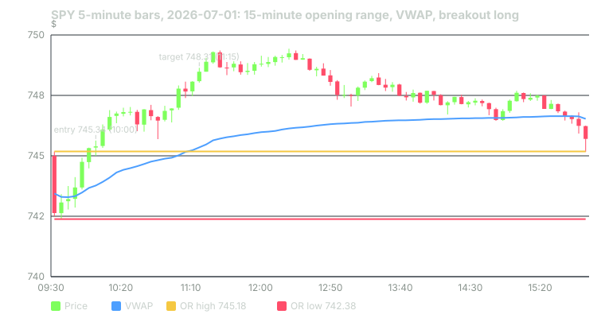

---
{
  "title": "The Opening Range: Definition, 5/15/30-Minute Variants, and a 60-Session Test",
  "duration": "18 min",
  "free": false,
  "status": "published",
  "quiz": [
    {"q": "In this course's reference rule, where is the stop on a long opening-range breakout?", "opts": ["One ATR below entry", "At the opening-range low", "At VWAP", "At the prior day's close"], "correct": 1, "explain": "The reference rule uses the opposite edge of the range. Risk per share is entry minus the OR low, and the target is one such unit above entry."},
    {"q": "On 2026-07-01 the 15-minute range was 745.18 to 742.38 and the trade entered at 745.34. What was the 1R target?", "opts": ["747.14", "748.31", "750.52", "746.00"], "correct": 1, "explain": "R = 745.34 − 742.38 = 2.96 (2.965 unrounded); target = 745.34 + 2.965 = 748.31."},
    {"q": "Across the 12 tested variants over the same 60 sessions, net results ranged from roughly:", "opts": ["+$10 to +$20 per share", "−$22 to +$20 per share", "−$2 to +$2 per share", "All were positive"], "correct": 1, "explain": "The OR30/2R/opposite-edge variant lost $22.41 per share while OR15/2R/midpoint made $19.58. Parameter choice swung the result by more than any single result's size."},
    {"q": "The reference rule's win rate was 58.3% on 60 trades. The 95% confidence interval on that win rate is approximately:", "opts": ["57% to 60%", "46% to 71%", "40% to 50%", "50% to 55%"], "correct": 1, "explain": "Standard error = sqrt(0.583 × 0.417 / 60) = 0.064; 0.583 ± 1.96 × 0.064 gives 0.459 to 0.708."},
    {"q": "Trades that triggered after 10:30 in the sample (6 of 60) had a 33% win rate and lost money. The right conclusion is:", "opts": ["Never trade after 10:30", "Six trades is too few to conclude anything, but it is consistent with lesson 2's finding that range and volume fade by then", "Late breakouts are more reliable", "The rule should be reversed after 10:30"], "correct": 1, "explain": "A subset of six cannot support a rule, but the direction agrees with the session structure, so it is worth a time filter as a hypothesis for the capstone."}
  ],
  "task": "Mark the 15-minute opening range on tomorrow's SPY chart before 09:46, write the breakout entry, stop and 1R target on paper, and record what happened without trading it."
}
---

## Definition

The opening range (OR) is the high and low of the first N minutes of the regular session. The three conventional choices are 5, 15 and 30 minutes, meaning the first one, three or six 5-minute bars. The range is fixed once its window closes and does not change for the rest of the day.

The breakout rule is simple enough to test without judgement: after the window closes, the first 5-minute bar that closes above the OR high triggers a long, and the first bar that closes below the OR low triggers a short. You take the first signal only; there is one trade per session. Stop, target and time exit have to be specified too, and different choices give very different results, as you will see.

The reference rule for this course, used in the capstone, is: 15-minute range; entry at the open of the bar after the signal bar; stop at the opposite edge of the range; target one R above (below) entry, where R is entry minus stop; exit at the 15:55 close if neither is hit; $0.02 per share round-trip cost (half a one-cent spread on each side plus half a cent of slippage on each side).

Why the opposite edge as the stop? Because the range is the market's first statement of value, and a move back through the entire range means the breakout thesis was wrong. Why 1R? Because lesson 2 showed a typical session range of about $5.88 and a 15-minute range of $1 to $3, so a 1R target is a fraction of the day, not the whole of it.

## Why it is supposed to work

The opening range captures the resolution of overnight information. If buyers and sellers established a value area in the first 15 minutes and price then leaves it with a closing bar, the argument is that the auction has found new information and the move will continue while the first hour's volume is still there to carry it. The counter-argument is that a single 5-minute close above a 15-minute high is a low bar, that stops clustered just outside the range invite exactly the kind of poke-and-reverse that hits them, and that SPY, as an index, absorbs single-stock news rather than trending on it. Both arguments are plausible. Neither is evidence. The test is.

## Worked example

Session: SPY, 2026-07-01, 5-minute bars, Yahoo Finance chart API. Regular hours only.

First three bars (the 09:30, 09:35 and 09:40 bars): highs 745.18, 743.41, 743.75; lows 742.50, 742.375, 742.78. OR high = 745.18, OR low = 742.375 (shown as 742.38), width = 2.80.

Bars after 09:45: the 09:50 bar closed at 744.75, inside the range. The 09:55 bar closed at 745.32, above 745.18: signal. Entry at the 10:00 bar's open, 745.34.

Stop = OR low = 742.375. R = 745.34 − 742.375 = 2.965 per share, shown as 2.96 or 2.97 depending on rounding. Target = 745.34 + 2.965 = 748.305, which rounds to 748.31.

Path: price never returned to the OR low. The 11:15 bar printed a high of 748.64, through the target. Exit at 748.31.

Gross = 748.31 − 745.34 = 2.97 per share. Cost = 0.02. Net = 2.95 per share, which is 2.95 / 2.965 = 0.99R (the cost is the missing 0.01R).

On 100 shares that is $295 net on $296.50 risked. The rest of the day, incidentally, shows why the target matters: SPY peaked at 749.43 at 12:20 and closed at 745.70, a few cents above the entry. A trader holding for "more" would have given all of it back.

## The 60-session test

All 60 sessions from 2026-06-30 to 2026-09-23 produced a signal for every variant, so each variant has exactly 60 trades. Longs and shorts were taken symmetrically. Results for the three window lengths with the reference stop (opposite edge) and 1R target:

- OR5: 60.0% win rate, 34 targets, 24 stops, 2 time exits, net +$12.87 per share, longest losing streak 4.
- OR15 (reference): 58.3% win rate, 30 targets, 21 stops, 9 time exits, net +$15.00 per share, longest losing streak 4.
- OR30: 50.0% win rate, 21 targets, 18 stops, 21 time exits, net −$1.84 per share, longest losing streak 4.

The 30-minute range is wider, so its 1R target is further away and a third of its trades were still open at 15:55; those time exits are where the money leaked. The 5-minute range is narrow, so it triggers early (often on the 09:35 bar) and its stops are tight; it won more often but each win was small.

Now the honest part. Vary two more choices, the target (1R or 2R) and the stop (opposite edge or range midpoint), and the same 60 sessions give twelve results from −$22.41 to +$19.58 per share. Seven were positive, five negative. The spread across parameter choices is larger than any individual result. Nothing in the data tells you in advance which of the twelve you should have picked, and lesson 12 shows what happens when you pick the best one and trade it forward.

## Table

The twelve variants over the same 60 sessions, net of $0.02 per share per round trip.

| Range | Target | Stop | Win rate | Net $/share | Targets / stops / time | Longest losing streak |
|---|---|---|---|---|---|---|
| 5 min | 1R | opposite edge | 60.0% | +12.87 | 34 / 24 / 2 | 4 |
| 5 min | 1R | midpoint | 48.3% | −4.28 | 29 / 31 / 0 | 7 |
| 5 min | 2R | opposite edge | 50.0% | +18.61 | 18 / 29 / 13 | 5 |
| 5 min | 2R | midpoint | 43.3% | +12.93 | 24 / 34 / 2 | 7 |
| 15 min | 1R | opposite edge | 58.3% | +15.00 | 30 / 21 / 9 | 4 |
| 15 min | 1R | midpoint | 53.3% | +7.33 | 32 / 27 / 1 | 6 |
| 15 min | 2R | opposite edge | 45.0% | −1.06 | 10 / 27 / 23 | 4 |
| 15 min | 2R | midpoint | 45.0% | +19.58 | 23 / 31 / 6 | 7 |
| 30 min | 1R | opposite edge | 50.0% | −1.84 | 21 / 18 / 21 | 4 |
| 30 min | 1R | midpoint | 53.3% | +2.95 | 31 / 27 / 2 | 5 |
| 30 min | 2R | opposite edge | 41.7% | −22.41 | 2 / 21 / 37 | 6 |
| 30 min | 2R | midpoint | 40.0% | +0.01 | 17 / 34 / 9 | 5 |

## Reading the reference rule properly

Sixty trades, 58.3% winners. The standard error of a proportion is sqrt(p(1−p)/n) = sqrt(0.583 × 0.417 / 60) = 0.064, so the 95% interval on the win rate is 46% to 71%. Mean profit per trade was +$0.25 per share with a standard error of $0.27 (lesson 1 showed the arithmetic), t = 0.93. In R terms the mean was +0.156R, standard error 0.119R, t = 1.31.

Splits inside the sample are suggestive but not evidence. Trades that triggered by 10:00 (35 of them) won 62.9% and made +$13.17; trades between 10:05 and 10:30 (19) won 57.9% and made +$2.97; trades after 10:30 (6) won 33.3% and lost $1.14. Narrow ranges (bottom third, under $1.42 wide) won 68.4%; wide ranges (over $2.04) won 50.0% and had seven time exits. Longs (25) won 60.0%, shorts (35) won 57.1%. Monthly: July +$12.50 on 22 trades, August −$0.78 on 21, September +$1.01 on 16. Nearly all of the profit came from one month.

What the test can say: the reference rule did not lose money over these 60 sessions, its losing streaks stayed at four, and its costs were small relative to its risk (the average R was $2.18, so $0.02 is 0.9% of R). What it cannot say: that the rule has positive expectancy, that the 15-minute window is better than the 5-minute one, or that any of the splits above will persist. You will test persistence yourself in lesson 12 and the capstone.

## Sources

- Yahoo Finance chart API, SPY 5-minute bars, range 60 days (as used: `https://query1.finance.yahoo.com/v8/finance/chart/SPY?range=60d&interval=5m`, pulled 2026-09-24); the same data is browsable at https://finance.yahoo.com/quote/SPY/history/
- David Bailey, Jonathan Borwein, Marcos López de Prado and Qiji Zhu, "Pseudo-Mathematics and Financial Charlatanism: The Effects of Backtest Overfitting on Out-of-Sample Performance," Notices of the AMS 61(5), 2014: https://www.ams.org/notices/201405/rnoti-p458.pdf
- Campbell Harvey, Yan Liu and Heqing Zhu, "... and the Cross-Section of Expected Returns," Review of Financial Studies 29(1), 2016: https://doi.org/10.1093/rfs/hhv059
