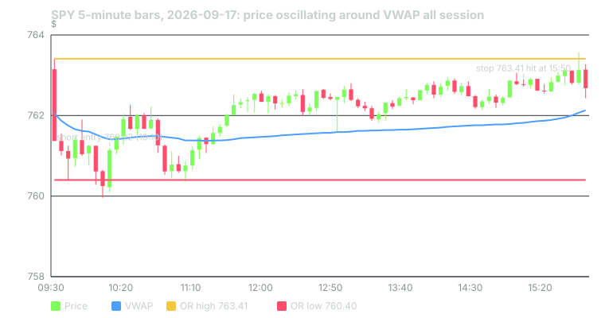

---
{
  "title": "VWAP: What It Is, How Institutions Use It, Pullbacks and Reversion",
  "duration": "17 min",
  "free": false,
  "status": "published",
  "quiz": [
    {"q": "VWAP after three 5-minute bars is computed as:", "opts": ["The average of the three closes", "The sum of (typical price × volume) over the three bars divided by the sum of volume", "The midpoint of the day's high and low", "The last price weighted by the last bar's volume"], "correct": 1, "explain": "VWAP is cumulative: every bar's typical price is weighted by its volume, and the running total is divided by running volume."},
    {"q": "Why do institutional execution desks care about VWAP?", "opts": ["It predicts the close", "Their orders are benchmarked against it; filling below VWAP on a buy is a measurable execution win", "It is required by FINRA", "It is the only intraday indicator regulators allow"], "correct": 1, "explain": "Berkowitz, Logue and Noser proposed VWAP as a transaction-cost benchmark in 1988 and it remains the standard yardstick for agency algorithms."},
    {"q": "In the 60-session sample, when SPY first moved 0.25% away from VWAP after 10:00, how often did it touch VWAP again before the close?", "opts": ["27 of 42 sessions", "42 of 42 sessions", "5 of 42 sessions", "Never"], "correct": 0, "explain": "Reversion happened in 64% of cases, with a median wait of 90 minutes. At 0.5% away it was only 5 of 11."},
    {"q": "The VWAP-pullback entry test (buy the first touch of VWAP after a 15-minute breakout) produced:", "opts": ["A 75% win rate and large profits", "54 trades, a 50% win rate and a net loss of $7.12 per share", "No trades", "The same result as the breakout rule"], "correct": 1, "explain": "The pullback entry lost money in this sample: 22 stops, 20 targets and 12 time exits."},
    {"q": "On 2026-09-17, SPY closed at 762.68 with VWAP at 762.13 after oscillating around it all day. Which setup did that session punish?", "opts": ["A VWAP-reversion trade", "The 15-minute opening-range short, which was stopped at 763.41 at 15:50", "A closing-auction trade", "None"], "correct": 1, "explain": "The breakout short entered at 760.22 while price was below VWAP; price reverted to VWAP within two bars and ground higher into the stop."}
  ],
  "task": "For three consecutive sessions, note SPY's distance from VWAP at 10:30 and whether price touched VWAP again before 15:55."
}
---

## What VWAP is

The volume-weighted average price is the average price at which every share of the day has traded so far. Formally, after n bars:

VWAP = Σ (typical price × volume) / Σ volume

where the sums run from the first bar of the session and the typical price is usually (high + low + close) / 3 for each bar. Tick-level VWAP uses every trade; bar-level VWAP approximates it. It resets at the open. It is cumulative, so early in the day a single large bar dominates it, and late in the day it barely moves.

VWAP is not a moving average. A moving average of closes treats a 300,000-share bar and a 3-million-share bar the same. VWAP is the price the day's volume has actually cleared at, which is why it answers a different question: not "where has price been" but "where has the money been."

## How institutions use it

VWAP entered the industry as a benchmark, not a signal. Berkowitz, Logue and Noser proposed it in 1988 as a way to measure the cost of executing large orders on the NYSE: if you bought over the day and your average fill was below VWAP, you beat the market's own average; if above, you paid for immediacy. Every major agency algorithm now offers a VWAP schedule that spreads an order across the session in proportion to expected volume, and the trader who hands the order to the algorithm is judged against VWAP afterwards.

Two consequences follow for you. First, there is real, scheduled flow that references VWAP: an algorithm working a buy order that is "behind" VWAP will lean in when price dips toward it. That is the mechanical basis for the pullback idea. Second, this flow is passive and price-taking in aggregate; it does not defend VWAP as a level. Price crosses VWAP dozens of times on an ordinary day. The reversion statistics below are about tendencies, not walls.

## The three ways traders use it

Bias: above VWAP means the average buyer of the day is in profit and the session is "bid"; below means the opposite. Traders use this to take only longs above and shorts below.

Pullback entry: in a session that has already broken out, wait for price to come back to VWAP and enter in the direction of the breakout, with the idea that the benchmark flow provides support.

Reversion: when price is stretched far from VWAP with no new information, fade it back toward VWAP, treating the distance as an overextension.

All three can be stated precisely. Only precise statements can be tested.

## Worked example

Session: SPY, 2026-09-17, 5-minute bars, Yahoo Finance chart API. VWAP by hand for the first three bars, using typical price (H + L + C) / 3:

09:30 bar: H 763.41, L 761.37, C 761.37, V 3,515,147. TP = (763.41 + 761.37 + 761.37) / 3 = 762.050. TP × V = 2,678,717,728.

09:35 bar: H 761.55, L 761.01, C 761.125, V 968,485. TP = (761.55 + 761.01 + 761.125) / 3 = 761.228. TP × V = 737,238,222.

09:40 bar: H 761.25, L 760.40, C 760.93, V 614,507. TP = 760.860. TP × V = 467,553,800.

Cumulative after three bars: Σ TP×V = 2,678,717,728 + 737,238,222 + 467,553,800 = 3,883,509,750. Σ V = 3,515,147 + 968,485 + 614,507 = 5,098,139.

VWAP at 09:45 = 3,883,509,750 / 5,098,139 = 761.75.

Note how the first bar's 3.5 million shares anchor it: price at 09:40 closed at 760.93, eighty cents below VWAP, because the opening bar traded heavily near 762.

The rest of the session: VWAP drifted from 761.53 at 10:00 to 761.47 at 12:00 to 762.13 at 15:55, a range of 70 cents all day. Price, meanwhile, dipped to 759.96 at 10:05 (0.19% below VWAP), was back above VWAP by 10:20 at 761.91, sagged below it again around 10:45 to 11:10, and then held above it for the rest of the afternoon, closing at 762.68, 0.07% above VWAP.

The 15-minute opening-range short from lesson 3 fired at 10:10 at 760.22 with a stop at the range high, 763.41. Price was below VWAP at entry, which a VWAP-bias filter would have approved. It reverted to VWAP within two bars and never gave the short a 1R target; the stop was hit at 15:50, a loss of 3.19 gross, 3.21 net per share, the largest loss in the 60-session log.

## What the 60 sessions say about reversion

Take the first time after 10:00 that a 5-minute close is at least a threshold away from VWAP, and ask whether the price touches VWAP again before 15:55. Over the 60 sessions from 2026-06-30 to 2026-09-23:

- 0.15% away: reached in 58 sessions; touched VWAP again in 50 (86%); median wait 50 minutes.
- 0.25% away: reached in 42 sessions; touched again in 27 (64%); median wait 90 minutes.
- 0.50% away: reached in 11 sessions; touched again in 5 (45%); median wait 70 minutes.

Small stretches revert most of the time, but a small stretch on SPY is a dollar, and the wait is nearly an hour. Larger stretches revert less than half the time, which is what you would expect if a 0.5% move away from the day's average price usually carries information. The close landed within a median of 0.10% of VWAP, and never more than 0.73% away, in this sample. VWAP is a decent estimate of where the day ends up, not a level that pays you to fade it.

## Table

The VWAP pullback entry tested on the same 60 sessions: after a 15-minute opening-range breakout (long or short), enter at the first subsequent 5-minute bar that touches VWAP, stop at the opposite range edge, target 1R, exit at 15:55, $0.02 per share cost.

| Measure | VWAP pullback entry | Reference OR15 breakout (lesson 3) |
|---|---|---|
| Sessions with a trade | 54 (6 never pulled back) | 60 |
| Win rate | 50.0% | 58.3% |
| Outcomes (target / stop / time) | 20 / 22 / 12 | 30 / 21 / 9 |
| Net $/share, after costs | −7.12 | +15.00 |
| Expectancy in R | −0.04R | +0.16R |

The pullback entry lost money here. The reason is visible in the trade list: pullbacks to VWAP after a breakout tended to come late (entries at 12:00, 13:40, 14:50) when lesson 2's hollow middle had arrived, and the stop, still at the opposite range edge, was far away by then, so the losses were large in dollars relative to the 1R targets that the afternoon rarely delivered. That is one sample. It is enough to say that "buy the pullback to VWAP" is not automatically better than "buy the breakout," and it is not enough to say the reverse.

## How to use VWAP honestly

Use it as context: which side of the day's average price you are on, and how far. Use its reversion tendency to set expectations, not entries: a trade that needs price to move 0.5% further from VWAP in the afternoon is asking for something that happened in a minority of sessions. If you want to trade a VWAP entry, write it as a rule with a stop and a target, run it over at least the 60 sessions you can pull for free, and compare it to the breakout you already have. The capstone rubric rewards exactly that comparison.

## Sources

- Stephen Berkowitz, Dennis Logue and Eugene Noser, "The Total Cost of Transactions on the NYSE," Journal of Finance 43(1), 1988: https://doi.org/10.1111/j.1540-6261.1988.tb02591.x
- FINRA Rule 5310, Best Execution and Interpositioning (the obligation that makes execution benchmarks such as VWAP matter to brokers): https://www.finra.org/rules-guidance/rulebooks/finra-rules/5310
- Yahoo Finance chart API, SPY 5-minute bars, 2026-06-30 to 2026-09-23, pulled 2026-09-24: https://finance.yahoo.com/quote/SPY/history/
