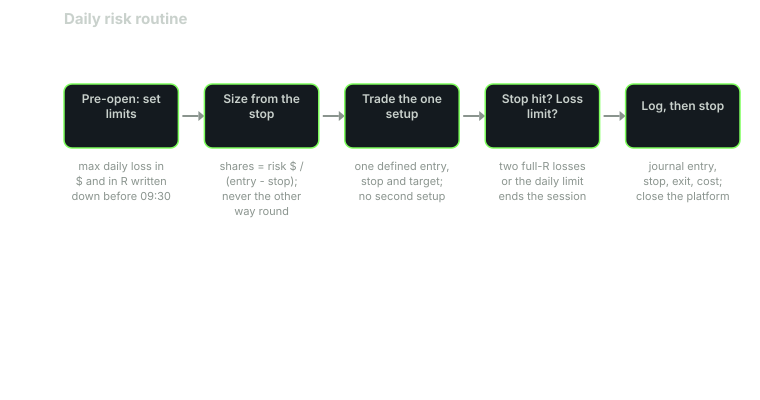

---
{
  "title": "Intraday Risk: Max Daily Loss, Per-Trade Risk, and When to Stop",
  "duration": "16 min",
  "free": false,
  "status": "published",
  "quiz": [
    {"q": "With a $30,000 account, 0.5% risk per trade and a stop $2.965 away, how many shares do you buy?", "opts": ["100", "50", "150", "30"], "correct": 1, "explain": "$150 / $2.965 = 50.6, rounded down to 50 shares, risking $148.25."},
    {"q": "The reference rule's longest losing streak over 60 sessions was 4. At 0.5% per trade, that streak costs:", "opts": ["0.5%", "2.0%", "4.0%", "8.0%"], "correct": 1, "explain": "Four consecutive full-R losses at 0.5% each is 2.0% of the account, before any compounding effect."},
    {"q": "The rule's maximum peak-to-trough drawdown was 6.37R. At 1% risk per trade that is roughly:", "opts": ["1.6%", "3.2%", "6.4%", "12.7%"], "correct": 2, "explain": "6.37 × 1% ≈ 6.4%. At 0.5% it would be about 3.2%. Risk per trade scales the drawdown directly."},
    {"q": "Why is position size computed from the stop distance rather than from a fixed share count?", "opts": ["Brokers require it", "Because it makes every trade risk the same fraction of the account, which is what makes the R-based statistics in this course meaningful", "It reduces commissions", "It increases leverage"], "correct": 1, "explain": "A fixed share count means a wide-range day risks three times more than a narrow one. Sizing from the stop equalises risk so that expectancy in R translates to expectancy in dollars."},
    {"q": "A daily loss limit of 1% with 0.5% per trade means the session ends after:", "opts": ["One loss", "Two full-R losses", "Four losses", "It never ends; keep trading until profitable"], "correct": 1, "explain": "Two full losses reach the limit. The reference playbook takes one trade per day anyway; the limit exists for the day you break that rule."}
  ],
  "task": "Compute your per-trade risk in dollars at 0.5% of your account and your daily limit at 1%, and set both as hard alerts in your platform."
}
---

## Risk is the only variable you fully control

You do not control whether the breakout follows through. You control how many shares you hold when it does not, and how many times you will let that happen in one day. Everything in this lesson is arithmetic, and all of it should be done before 09:30, because after 09:30 the numbers will be done by whatever part of you is angriest.

The framework has three layers: risk per trade, risk per day, and the rule that says when you stop for longer than a day. Each is a number, written down, and each is expressed in R, the dollars risked on a trade, because R is the unit in which every result in this course is measured.

## Risk per trade and position size

Decide the fraction of the account you will lose if the stop is hit. For someone learning a setup, 0.25% to 0.5% is defensible; 1% is the upper end of what professional risk frameworks tolerate for a single discretionary intraday position; more than that is a decision to shorten the experiment.

Then the size follows from the stop, never the other way round:

shares = (account × risk fraction) / (entry − stop)

This is the step most new traders invert. They buy 100 shares because 100 is a round number, then look for a stop that "makes sense," and end up risking three times as much on a wide-range day as on a narrow one. Sizing from the stop makes every trade risk the same dollars, which is what allows lesson 3's "+0.156R per trade" to mean anything in your account.

## Worked example

Account: $30,000. Risk per trade: 0.5% = $150. Daily limit: 1% = $300.

Session 2026-07-01, the reference opening-range trade from lesson 3. Entry 745.34, stop 742.375, so entry − stop = 2.965.

shares = 150 / 2.965 = 50.59, round down to 50. Dollars actually at risk = 50 × 2.965 = $148.25, or 0.494% of the account.

Target at 1R = 748.305. If hit: 50 × 2.965 = $148.25 gross, minus 50 × $0.02 = $1.00 cost, net $147.25. If stopped: −$148.25 − $1.00 = −$149.25.

Compare a fixed-100-share trader on the same day: risk 100 × 2.965 = $296.50, or 0.99% of the account, twice the intended risk, from a decision about round numbers. On 2026-07-23, when the 15-minute range was $4.09 wide and R was $4.40, that trader would have risked $440, 1.47%; on 2026-09-21, with R = $0.97, only $97. The R-sized trader risked $148 both days.

Now the daily limit. It is $300, two full-R losses. The reference playbook takes one trade a session, so on a normal day the limit is never tested; it is there for the day you take a second trade "to get it back." The rule is mechanical: a second full loss closes the platform.

Scale the sample to this account. The reference rule's 60-session results in R: total +9.37R, longest losing streak 4 (2026-08-19 to 2026-08-24, all four in the capstone window), maximum peak-to-trough drawdown 6.37R. At 0.5% per trade:

- The streak: 4 × 0.5% = 2.0% of the account, about $600.
- The drawdown: 6.37 × 0.5% = 3.2%, about $955.
- The whole 60 sessions: 9.37 × 0.5% = +4.7%, about $1,400 (ignoring compounding and rounding shares down).

At 2% per trade the same drawdown is 12.7% and the same streak is 8%, from a rule that, on the evidence, might be a coin flip (lesson 1). The setup did not change. The size decided whether a normal losing patch was survivable.

## Chart

## Risk per day

The daily limit protects you from the one thing per-trade risk cannot: the sequence of decisions that begins after the first loss. The Brazilian study in lesson 1 found no evidence of learning over hundreds of days, and one reason is that most of a losing day trader's damage is done on the days they kept going. A limit of two R is deliberately tight. It is one trade's worth of slack beyond the plan.

There is a second daily number: the maximum number of trades. In the reference playbook it is one. A second trade requires a second setup, and the only second setup this course has tested (the VWAP pullback in lesson 4) lost money on the sample. If you want two trades a day, define the second one, test it, and only then put it in the plan.

## When to stop for longer

Two kinds of stop beyond the day. The first is a drawdown stop for the account: if the capstone's 30-session log ends with an expectancy below zero after costs, or if the account is down more than the drawdown you budgeted (three times the sample's 6.37R is a reasonable budget: about 19R, or 9.6% at 0.5%), you stop trading the setup and go back to logging without money. The second is a behavioural stop: any day on which you moved a stop, added to a loser, or traded outside the written setup is a day you count, and three such days in a month means the experiment is no longer measuring the rule. It is measuring you, and the rule's statistics no longer apply.

Both stops are cheap when written down in advance and nearly impossible to apply in the moment. Write them down.

## Volatility and the size of R

R is not constant across days, and it should not be. The 15-minute range in the sample ran from $0.82 (2026-09-21) to $4.09 (2026-07-23), so the same 0.5% risk meant anywhere from 36 to 182 shares in the $30,000 account. Session-level volatility sets the scale: the 14-day average true range of SPY on 2026-09-23 was $6.96, or 0.91% of the $767.81 close, computed from Yahoo Finance daily bars. A day whose 15-minute range is a third of the daily ATR is a day on which a 1R target is asking price to travel a large fraction of what it usually travels all day. That is information about the target, not the size: size from the stop, and let the target's odds be what they are.

## Margin is not a risk framework

FINRA's intraday margin standard (Regulatory Notice 26-10, effective June 4, 2026) requires your firm to compute an intraday margin deficit whenever your trading reduces intraday maintenance margin, and to require it to be met promptly. That is the firm protecting itself. The old $25,000 rule was a floor on equity, not a limit on losses, and its replacement is the same. Nothing your broker enforces will stop you from losing 10% in a morning; only the numbers at the top of this lesson will.

## Table

The reference rule's 60-session risk statistics scaled to three per-trade risk levels on a $30,000 account (rounding and compounding ignored).

| Measure | In R | 0.25% per trade | 0.5% per trade | 1% per trade | 2% per trade |
|---|---|---|---|---|---|
| Longest losing streak (4 trades) | −4.0R | −1.0% / −$300 | −2.0% / −$600 | −4.0% / −$1,200 | −8.0% / −$2,400 |
| Maximum drawdown | −6.37R | −1.6% / −$478 | −3.2% / −$956 | −6.4% / −$1,911 | −12.7% / −$3,822 |
| Worst single trade (2026-09-17) | −1.01R | −0.25% / −$76 | −0.5% / −$152 | −1.0% / −$303 | −2.0% / −$606 |
| Total, 60 sessions | +9.37R | +2.3% / +$703 | +4.7% / +$1,406 | +9.4% / +$2,811 | +18.7% / +$5,622 |
| Daily limit (2R) | −2R | −0.5% | −1.0% | −2.0% | −4.0% |

The last row is the point. Doubling the risk doubles the gain in the sample, and it doubles the drawdown from a rule whose 95% confidence interval includes zero. Choose the row whose drawdown you can sit through for three months without changing the rule, because that is how long a fair test takes.

## Sources

- FINRA, Regulatory Notice 26-10, "FINRA Adopts New Intraday Margin Standards to Replace the Day Trading Margin Requirements" (April 20, 2026): https://www.finra.org/rules-guidance/notices/26-10
- FINRA, investor insight, "Day Trading" (margin and intraday deficit consequences for frequent traders): https://www.finra.org/investors/investing/investment-products/stocks/day-trading
- U.S. Securities and Exchange Commission, "Day Trading: Your Dollars at Risk": https://www.sec.gov/investor/pubs/daytips.htm
- Yahoo Finance, SPY daily and 5-minute bars used for ATR and the 60-session statistics: https://finance.yahoo.com/quote/SPY/history/
