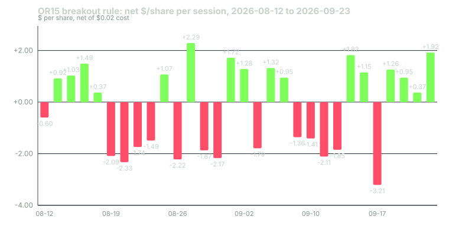

---
{
  "title": "Capstone: Log 30 Opening-Range Sessions and Compute Your Expectancy",
  "duration": "45 min",
  "free": false,
  "status": "published",
  "quiz": [
    {"q": "In the reference 30-session window (2026-08-12 to 2026-09-23), the rule's win rate, net result and longest losing streak were:", "opts": ["58%, +$15.00, 4", "53%, −$6.33 per share, 4", "70%, +$20.00, 2", "45%, −$20.00, 7"], "correct": 1, "explain": "16 winners of 30, net −$6.33 per share after $0.60 of costs, with four consecutive losses from 2026-08-19 to 2026-08-24."},
    {"q": "Expectancy after costs in the reference window was −$0.211 per share per trade. Its standard error in R was 0.168R around a mean of +0.005R. The sample therefore:", "opts": ["Proves the rule loses", "Proves the rule wins", "Cannot distinguish the rule from zero in either direction", "Is large enough to stop testing"], "correct": 2, "explain": "A mean within a small fraction of one standard error of zero is uninformative about the sign; the honest conclusion is 'extend the sample.'"},
    {"q": "Which of the following is NOT something a 30-session log can tell you?", "opts": ["Your longest losing streak in the window", "Whether your fills matched the bar prices", "Whether the rule has positive expectancy over the next year", "How many trades were time exits"], "correct": 2, "explain": "Thirty sessions establishes mechanics and gives a first, wide estimate; it cannot establish forward expectancy."},
    {"q": "Why must the 30 sessions be logged before the outcome is known, rather than reconstructed from a chart afterwards?", "opts": ["Charts are unavailable", "Because reconstructing after the fact lets hindsight choose the entries and exits, which is the same overfitting lesson 12 demonstrated", "It is faster", "Brokers require it"], "correct": 1, "explain": "The capstone tests the rule as written, in real time; anything else tests your memory of what worked."},
    {"q": "The rubric awards the most points to:", "opts": ["A profitable result", "Complete, honest logging and correct computation, regardless of whether the result was profitable", "Trading the most sessions", "Using the smallest stop"], "correct": 1, "explain": "The capstone is graded on the quality of the evidence, not on its sign. A losing window logged honestly scores higher than a winning window with missing costs."}
  ],
  "task": "Submit your 30-row log, your four computed statistics with their arithmetic shown, and your one-page conclusion on what the sample can and cannot tell you."
}
---

## The exercise

Log 30 consecutive regular sessions of the reference opening-range rule on SPY 5-minute bars, compute four statistics from the log, and write one page on what the sample does and does not establish. Paper or live, your choice; if live, size at lesson 7's 0.25% row.

Use the sessions that follow your start date, not sessions you have already seen. If you want to check your logging mechanics first, the 30 sessions before 2026-08-12 (2026-06-30 to 2026-08-11) are available from the same free data source and are not printed in this course, so they make a fair practice set; the 30 sessions from 2026-08-12 to 2026-09-23 are printed below as the reference answer and do not count.

The rule, exactly as lesson 12's playbook states it: 15-minute range from the 09:30, 09:35 and 09:40 bars; first 5-minute close outside the range triggers; enter at the next bar's open; stop at the opposite edge; target one R; exit at the 15:55 close if neither is hit; one trade per session; no trade if no signal by 11:30. Cost: your measured cost per share per round trip if live, $0.02 if paper.

For each session record: date, range high and low, side, signal time, entry time and price, stop, target, exit time and price, outcome type (target / stop / time / no trade), gross $ per share, cost, net $ per share, result in R, MAE and MFE in R, and whether the rule was followed.

Then compute:

1. Win rate: winners divided by trades taken, with its standard error sqrt(p(1−p)/n).
2. Expectancy after costs, in $ per share and in R, shown as (win rate × average win) − (loss rate × average loss), and checked against total net divided by trades.
3. Standard error of the mean R: standard deviation of the per-trade R values divided by sqrt(n).
4. Maximum losing streak, and the maximum peak-to-trough drawdown in R.

Finally, write one page answering: what does this sample tell you, what does it not tell you, and what will you do next (extend, stop, or change one thing and restart the count)?

## Worked example

The reference answer: the same rule over the 30 sessions from 2026-08-12 to 2026-09-23, SPY 5-minute bars from the Yahoo Finance chart API, $0.02 per share cost. Every session produced a signal, so there are 30 trades.

Winners: 16 (12 targets, 4 positive time exits). Average net win = +$1.2444 per share.
Losers: 14 (12 stops, 2 negative time exits). Average net loss = −$1.8743 per share.

1. Win rate = 16 / 30 = 53.3%. Standard error = sqrt(0.533 × 0.467 / 30) = sqrt(0.00830) = 0.091, so the 95% interval is 35% to 71%.

2. Expectancy in $ = 0.5333 × 1.2444 − 0.4667 × 1.8743 = 0.6637 − 0.8747 = −$0.211 per share per trade. Check: total net = −$6.33; −6.33 / 30 = −$0.211. Gross was −$5.73 and costs were 30 × 0.02 = $0.60.
   Expectancy in R = sum of R outcomes / 30 = +0.15 / 30 = +0.005R per trade. The signs differ because the losing trades had wider ranges (average R $2.12) than the winners ($1.63); at fixed shares the dollar figure is what you would have felt, and at stop-based sizing the R figure is.

3. Standard deviation of per-trade R = 0.921; standard error = 0.921 / sqrt(30) = 0.921 / 5.477 = 0.168R. The mean of +0.005R is 0.03 standard errors from zero.

4. Longest losing streak: 4 (2026-08-19, 08-20, 08-21, 08-24: three stops and a negative time exit). Cumulative net peaked at +$3.21 after 2026-08-18 and troughed at −$10.83 after 2026-09-17, a drawdown of $14.04 per share; in R the drawdown over the same stretch was 6.37R.

What this window can say: the mechanics work as specified (every session triggered, 12 targets and 12 stops resolved at the stated levels, six went to the time exit); costs at $0.02 were 0.9% of the average R and did not decide anything; the losing streak of four and the 6.4R drawdown are the scale of pain a 0.5%-per-trade sizing would have produced (3.2% of the account). What it cannot say: whether the rule's expectancy is positive, negative or zero. The 95% interval on the mean R runs from −0.32R to +0.33R. It cannot say whether the four-loss streak was unlucky or typical. It cannot say anything about the entry-time or weekday splits, each of which has fewer than a dozen trades. The next step for this window, by lesson 10's decision rule, is to extend to 60, which is what lesson 3 did: the full 60 sessions came out at +0.156R with a standard error of 0.119R, still not two standard errors from zero.

## Table

The reference log. Prices in $ per share; entry is the open of the bar after the signal; net is gross minus $0.02.

| Date | Side | OR high / low | Entry time | Entry | Stop | Target | Exit time, price | Outcome | Gross | Net | R |
|---|---|---|---|---|---|---|---|---|---|---|---|
| 2026-08-12 | S | 774.90 / 772.46 | 10:05 | 771.94 | 774.90 | 768.98 | 15:55, 772.52 | time | −0.58 | −0.60 | −0.20 |
| 2026-08-13 | L | 776.47 / 774.12 | 09:50 | 776.84 | 774.12 | 779.56 | 15:55, 777.78 | time | +0.94 | +0.92 | +0.34 |
| 2026-08-14 | S | 778.58 / 777.66 | 10:25 | 777.53 | 778.58 | 776.47 | 11:10, 776.47 | target | +1.05 | +1.03 | +0.98 |
| 2026-08-17 | S | 776.78 / 775.32 | 10:00 | 775.27 | 776.78 | 773.76 | 13:20, 773.76 | target | +1.51 | +1.49 | +0.99 |
| 2026-08-18 | S | 769.50 / 767.91 | 11:10 | 767.78 | 769.50 | 766.06 | 15:55, 767.39 | time | +0.39 | +0.37 | +0.22 |
| 2026-08-19 | S | 770.63 / 769.25 | 09:50 | 768.56 | 770.63 | 766.49 | 10:35, 770.63 | stop | −2.07 | −2.09 | −1.01 |
| 2026-08-20 | S | 767.75 / 765.86 | 10:20 | 765.44 | 767.75 | 763.13 | 11:00, 767.75 | stop | −2.31 | −2.33 | −1.01 |
| 2026-08-21 | S | 766.14 / 764.62 | 09:55 | 764.42 | 766.14 | 762.70 | 11:00, 766.14 | stop | −1.72 | −1.74 | −1.01 |
| 2026-08-24 | L | 764.81 / 762.19 | 12:05 | 764.95 | 762.19 | 767.71 | 15:55, 763.48 | time | −1.47 | −1.49 | −0.54 |
| 2026-08-25 | S | 766.78 / 765.87 | 10:00 | 765.69 | 766.78 | 764.60 | 10:30, 764.60 | target | +1.09 | +1.07 | +0.98 |
| 2026-08-26 | L | 766.61 / 764.68 | 10:00 | 766.88 | 764.68 | 769.08 | 12:35, 764.68 | stop | −2.20 | −2.22 | −1.01 |
| 2026-08-27 | L | 769.20 / 767.16 | 10:25 | 769.47 | 767.16 | 771.78 | 12:40, 771.78 | target | +2.31 | +2.29 | +0.99 |
| 2026-08-28 | S | 772.84 / 771.47 | 10:10 | 770.99 | 772.84 | 769.14 | 10:40, 772.84 | stop | −1.85 | −1.87 | −1.01 |
| 2026-08-31 | S | 767.62 / 765.75 | 10:10 | 765.47 | 767.62 | 763.33 | 15:50, 767.62 | stop | −2.15 | −2.17 | −1.01 |
| 2026-09-01 | L | 762.40 / 761.18 | 10:10 | 762.92 | 761.18 | 764.66 | 11:50, 764.66 | target | +1.74 | +1.72 | +0.99 |
| 2026-09-02 | L | 762.83 / 761.73 | 10:00 | 763.03 | 761.73 | 764.33 | 10:15, 764.33 | target | +1.30 | +1.28 | +0.98 |
| 2026-09-03 | S | 769.89 / 768.15 | 10:05 | 768.12 | 769.89 | 766.35 | 11:00, 769.89 | stop | −1.77 | −1.79 | −1.01 |
| 2026-09-04 | S | 772.87 / 771.85 | 10:10 | 771.53 | 772.87 | 770.19 | 10:45, 770.19 | target | +1.34 | +1.32 | +0.99 |
| 2026-09-08 | S | 769.69 / 767.09 | 10:05 | 766.96 | 769.69 | 764.23 | 15:55, 765.99 | time | +0.97 | +0.95 | +0.35 |
| 2026-09-09 | S | 764.38 / 763.24 | 10:20 | 763.04 | 764.38 | 761.70 | 11:00, 764.38 | stop | −1.34 | −1.36 | −1.01 |
| 2026-09-10 | S | 758.74 / 757.55 | 09:55 | 757.35 | 758.74 | 755.96 | 10:20, 758.74 | stop | −1.39 | −1.41 | −1.01 |
| 2026-09-11 | L | 765.99 / 764.22 | 10:00 | 766.31 | 764.22 | 768.40 | 10:35, 764.22 | stop | −2.09 | −2.11 | −1.01 |
| 2026-09-14 | L | 759.52 / 758.45 | 09:50 | 760.28 | 758.45 | 762.11 | 10:25, 758.45 | stop | −1.83 | −1.85 | −1.01 |
| 2026-09-15 | S | 760.34 / 758.73 | 10:10 | 758.50 | 760.34 | 756.66 | 10:50, 756.66 | target | +1.84 | +1.82 | +0.99 |
| 2026-09-16 | L | 759.66 / 758.72 | 09:50 | 759.89 | 758.72 | 761.06 | 11:45, 761.06 | target | +1.17 | +1.15 | +0.98 |
| 2026-09-17 | S | 763.41 / 760.40 | 10:10 | 760.22 | 763.41 | 757.03 | 15:50, 763.41 | stop | −3.19 | −3.21 | −1.01 |
| 2026-09-18 | S | 761.76 / 760.58 | 09:50 | 760.48 | 761.76 | 759.20 | 10:00, 759.20 | target | +1.28 | +1.26 | +0.98 |
| 2026-09-21 | L | 766.85 / 766.03 | 09:50 | 767.00 | 766.03 | 767.97 | 10:15, 767.97 | target | +0.97 | +0.95 | +0.98 |
| 2026-09-22 | S | 775.14 / 773.89 | 10:00 | 773.83 | 775.14 | 772.51 | 15:55, 773.44 | time | +0.39 | +0.37 | +0.28 |
| 2026-09-23 | S | 773.05 / 771.88 | 09:50 | 771.11 | 773.05 | 769.17 | 10:15, 769.17 | target | +1.94 | +1.92 | +0.99 |
| Total | | | | | | | | 12 T / 12 S / 6 time | −5.73 | −6.33 | +0.15 |

## Rubric

Graded out of 100. A losing window logged completely scores higher than a winning window with gaps.

| Criterion | What earns full marks | Points |
|---|---|---|
| Completeness and provenance of the log | 30 consecutive sessions, every field filled at the time (not reconstructed), data source and bar convention named, any rule deviation flagged in its row | 30 |
| Correct statistics with arithmetic shown | Win rate with standard error, expectancy in $ and R by the formula and checked against the total, standard error of mean R, longest losing streak and drawdown in R; costs included and stated | 25 |
| Honest interpretation | The one-page conclusion states what the sample cannot say (sign of expectancy, persistence of any split), quotes the confidence interval, and names the next step by lesson 10's decision rule | 20 |
| Fidelity to the written rule | Entries, stops, targets and time exits match the playbook on every row; sizing shown from the stop; one trade per session | 15 |
| Diagnostics | MAE and MFE recorded per trade and summarised; outcome-type counts; at least one pre-registered "what if" column (for example a 12:00 time stop) computed on the same rows without being traded | 10 |

## Sources

- Yahoo Finance chart API, SPY 5-minute bars, 60 days ending 2026-09-23, pulled 2026-09-24 (`https://query1.finance.yahoo.com/v8/finance/chart/SPY?range=60d&interval=5m`); browsable history at https://finance.yahoo.com/quote/SPY/history/
- Fernando Chague, Rodrigo De-Losso and Bruno Giovannetti, "Day Trading for a Living?" (2020), SSRN, for the base rate your result should be read against: https://papers.ssrn.com/sol3/papers.cfm?abstract_id=3423101
- FINRA, Regulatory Notice 26-10, on the intraday margin standard that applies if you fund the exercise: https://www.finra.org/rules-guidance/notices/26-10
