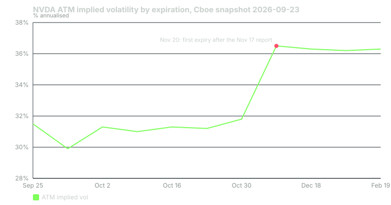

---
{
  "title": "The IV Crush and the Term Structure",
  "duration": "17 min",
  "free": false,
  "status": "published",
  "quiz": [
    {"q": "In the Cboe snapshot of 2026-09-23, NVDA ATM implied vol was about 31% for expiries through October 30 and about 36.5% for November 20. What explains the step?", "opts": ["A dividend", "The November 20 expiry is the first to contain the November 17 earnings report, so it carries the event variance", "Longer options always have higher vol", "A data error"], "correct": 1, "explain": "Expiries that end before the report carry ordinary volatility; the first expiry after it carries ordinary volatility plus the event. The step is the event's contribution."},
    {"q": "A representative 2-day ATM straddle costs 7.0% of spot. What annualised implied volatility does that correspond to, using straddle = 0.8 x sigma x sqrt(T)?", "opts": ["About 40%", "About 70%", "About 118%", "About 250%"], "correct": 2, "explain": "sigma = (0.07 / 0.8) / sqrt(2/365) = 0.0875 / 0.0740 = 1.18, or 118% annualised. Short-dated options into an event carry very high annualised vol because a large move is being squeezed into a short window."},
    {"q": "After the event, with one day to expiry and the stock unchanged, the same straddle at a 40% baseline vol is worth about:", "opts": ["7.0% of spot", "3.5% of spot", "1.7% of spot", "0.1% of spot"], "correct": 2, "explain": "0.8 x 0.40 x sqrt(1/365) = 0.8 x 0.40 x 0.0523 = 0.0167, about 1.7% of spot. From 7.0% to 1.7% is a 76% loss with no move in the stock: the crush."},
    {"q": "Which Greek most directly describes the straddle buyer's exposure to the crush?", "opts": ["Delta", "Vega", "Rho", "Gamma"], "correct": 1, "explain": "Vega is the sensitivity to implied volatility. The straddle is long vega; when the event passes and implied vol collapses, the position loses through vega even if the stock has not moved."},
    {"q": "On FOMC day 2026-09-16 the VIX closed at 17.71, then 15.44 the next day and 14.81 the day after. What is this an example of?", "opts": ["Index-level implied vol falling once a scheduled event has passed", "The VIX predicting a rally", "A VIX calculation error", "Rising realised volatility"], "correct": 0, "explain": "The VIX is a 30-day implied-vol index; the FOMC was inside its window until 2 p.m. on the 16th. Once the decision was known, the event premium left the index: a crush at the index level."}
  ],
  "task": "Pull the ATM implied vol for every listed expiry of one name that reports within 60 days, plot it, and mark which expiry is the first to contain the report."
}
---

## Why implied volatility rises into an event and collapses after it

Implied volatility is the market's price for uncertainty over an option's remaining life. Before a scheduled event, part of that uncertainty is the event itself. The event does not make the stock more volatile every day; it makes it very volatile for one night. Because an option's life is measured in calendar time, that one night is a larger share of a two-day option than of a sixty-day option, and the short-dated option's *annualised* implied volatility rises the most, sometimes to several times its normal level. The moment the event passes, that uncertainty is gone. The option now prices only ordinary days, and its implied volatility drops to the ordinary level in a single step. That step down is the **IV crush**.

The crush is not a market inefficiency or a trick played on retail buyers. It is the correct repricing of an option whose main source of uncertainty has resolved. What makes it dangerous is that a straddle buyer can be right about direction, right about the size of the move, and still lose, because the drop in implied volatility took more out of the position than the move put in.

## Reading the term structure into an event

Plot ATM implied volatility against expiry for a name with a report inside the window and you see a step, not a slope. Expiries that end before the report sit at the baseline. The first expiry after it jumps. Later expiries hold that level or drift slightly higher, because the event's fixed variance is spread over more days and blended with the ordinary vol of those days.

A Cboe delayed-quote snapshot of NVDA captured on 2026-09-23 (quotes reflecting the prior session's close, spot 228.56) gives the ATM implied vol at each expiry (mean of ATM call and put IV):

- September 25: 31.5%
- September 30: 29.9%
- October 2: 31.3%
- October 9: 31.0%
- October 16: 31.3%
- October 23: 31.2%
- October 30: 31.8%
- November 20: 36.5%
- December 18: 36.3%
- January 15, 2027: 36.2%
- February 19, 2027: 36.3%

NVIDIA's third-quarter call is set for November 17. Every expiry through October 30 is flat near 31%; November 20 steps to 36.5%; nothing after it steps back down, because each of those expiries also contains the report. The step is the event, and lesson 2 showed it corresponds to a one-standard-deviation event move of about 7.1%.

Two months later, on the afternoon of November 17, the picture will be different. The weekly expiring November 20 will have three days of life, of which one contains the report, and its annualised IV will be far above 36.5%, probably above 100%. That is the same event variance concentrated into a short option. When the report lands, the weekly will reprice to the baseline and the step will vanish from the whole curve at once.

## Chart

## Worked example

Options prices from the day before a past report cannot be sourced from a public feed, so this example uses a **clearly labelled representative chain** for NVIDIA into the August 26, 2026 report. The stock prices are real (Yahoo Finance daily bars). The option prices are representative: an ATM straddle costing 7.0% of spot, a figure in the range NVDA weeklies have priced in recent quarters, and a post-event baseline vol of 40%.

**Setup, Wednesday August 26 at the close.** Spot 209.66. The weekly expiring Friday August 28 has two trading days left. Representative 210 straddle: 7.0% × 209.66 = **14.68** (call 7.34, put 7.34).

**Step 1, what annualised vol is that?** Straddle ≈ 0.8 × σ × √T × S with T = 2/365 = 0.00548, √T = 0.0740. σ = (14.68 / 209.66) / (0.8 × 0.0740) = 0.0700 / 0.0592 = **1.18, i.e. 118% annualised.** Compare the 31% baseline: the weekly is carrying almost four times the ordinary vol because one of its two days is the event.

**Step 2, what the straddle is worth after the event if the stock does not move.** Thursday close, one day left, baseline 40% (representative; the Cboe snapshot suggests ordinary NVDA vol nearer 31%, and 40% is a conservative post-event level). ATM straddle ≈ 0.8 × 0.40 × √(1/365) × S = 0.8 × 0.40 × 0.0523 × 209.66 = 0.01675 × 209.66 = **3.51**. Loss from 14.68 to 3.51: **−11.17, or −76%**, with the stock exactly unchanged. That is the crush in isolation.

**Step 3, what actually happened on Thursday.** NVDA closed August 27 at 227.98, up 8.74%. The 210 call is 17.98 in the money; with one day left and the stock 8.6% above strike, its time value is negligible, so call ≈ 17.98. The 210 put is 8% out of the money with one day left; at 40% vol its value rounds to zero. Straddle ≈ **17.98**. P&L: 17.98 − 14.68 = **+3.30, or +22%**. The move (17.98 of intrinsic) beat the crush (11.17 of lost premium) by 3.30. The buyer needed an 8.7% move to make 22%; a 5% move (intrinsic 10.48) would have lost 4.20, or −29%, despite being a large move by most standards.

**Step 4, what happened on Friday at expiry.** NVDA closed August 28 at 217.55. Straddle at expiry = |217.55 − 210| = **7.55**. P&L: 7.55 − 14.68 = **−7.13, or −49%**. The position that was up 22% at Thursday's close expired down 49% because the stock gave back 4.57% on Friday. The crush was permanent; the move was not.

**Step 5, the index version, with real numbers.** The VIX measures 30-day S&P 500 implied vol. Around the September 16, 2026 FOMC decision (Cboe VIX daily closes via the Yahoo Finance chart API, 498 rows): 17.20 on the 15th, 17.71 on the 16th (the market sold off after the 2:30 press conference and realised vol rose), 15.44 on the 17th, 14.81 on the 18th. From the pre-decision close to two days later: 14.81 / 17.20 − 1 = **−13.9%**. The event premium left the index once the decision was known, even though the decision itself, a 25 basis point increase, was not the outcome most had positioned for.

## What this means for each side

**The buyer** of a pre-event straddle is buying vega at its most expensive and holding it through its largest single-step decline. The buyer's break-even at Thursday's close is not the straddle cost; it is the straddle cost minus the post-event value, divided by the stock price. In the example: (14.68 − 3.51) / 209.66 = 5.3% for a stock that then sits still, and rather more once you account for the put's residual value if the move is small. A buyer who does not know the post-event baseline vol cannot compute their real break-even.

**The seller** is short vega into the crush and long the crush's arrival. The seller's profit if the stock does not move is the full 11.17 in the example, minus costs. The seller's loss is unbounded above and bounded below by the strike. The crush is the seller's friend and the gap is the seller's enemy; lesson 5 puts numbers on both.

**The calendar spread** trader is the one for whom the term structure is the whole trade. Selling the front weekly at 118% and buying a later expiry at 36% is a bet that the front will crush and the back will not. It usually does, and lesson 5 shows why "usually" is not the same as "safely."

## Two things the crush does not do

It does not happen at a fixed time. For an after-close reporter, the front weekly reprices at the next open, but the *stock's* first reaction is in extended hours, when most retail option holders cannot trade. By the time the option market opens, the crush has already happened and the new price reflects both the move and the new vol.

It does not fully reset the back months. In the Cboe snapshot the December and January expiries also sit at 36%, and after November 17 they will step down by only the event's share of their total variance, not to 31%. An option that was bought two months out is affected far less than the weekly; that is the whole reason calendars exist.

## Sources

- Cboe delayed option quotes (public feed), NVDA snapshot 2026-09-23: https://cdn.cboe.com/api/global/delayed_quotes/options/NVDA.json
- Cboe, VIX Index overview and methodology: https://www.cboe.com/tradable_products/vix/
- Dubinsky, A., Johannes, M., Kaeck, A., and Seeger, N. J. (2019). "Option Pricing of Earnings Announcement Risks." Review of Financial Studies 32(2), 646–687. https://doi.org/10.1093/rfs/hhy060
- Federal Reserve, FOMC statement, September 16, 2026: https://www.federalreserve.gov/newsevents/pressreleases/monetary20260916a.htm
