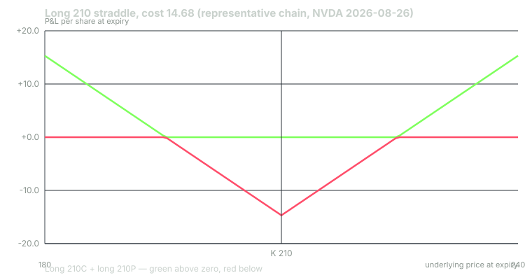
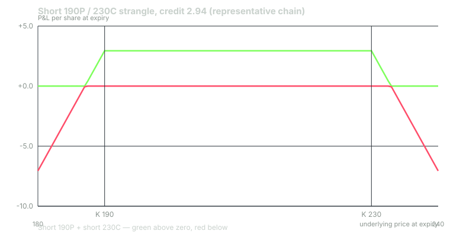

---
{
  "title": "Earnings Plays: Straddle, Strangle, Calendar",
  "duration": "18 min",
  "free": false,
  "status": "published",
  "quiz": [
    {"q": "A long ATM straddle bought before earnings is, in one sentence, a bet that:", "opts": ["The stock will go up", "The realised move will exceed the implied move by more than the crush and costs take away", "Implied volatility will rise after the report", "The stock will not move"], "correct": 1, "explain": "The buyer pays the implied move and receives the realised move at expiry; in between the crush drains the premium. The buyer wins only when realised beats implied by enough to cover both the crush and the round trip."},
    {"q": "In the representative chain, the short 190P/230C strangle on NVDA into August 26, 2026 collected 2.94. On August 27 the stock traded as high as 230.47. What happened to the position intraday?", "opts": ["Nothing, it was still out of the money at the close", "The 230 call went briefly in the money, so the position showed a loss at that moment even though it finished the week at full profit", "It was automatically closed", "The put was assigned"], "correct": 1, "explain": "A short strangle's max profit at expiry says nothing about the path. With the call 0.47 in the money and one day left, the mark-to-market loss was real, and a trader without the margin or the stomach to hold would have closed at a loss."},
    {"q": "Across the four representative NVDA straddles held to Friday expiry, the total P&L was −18.42 on 57.07 of premium. The short strangle made money on all four. What can you conclude?", "opts": ["Short strangles are a winning strategy", "Long straddles are a losing strategy", "Four observations cannot establish either; the strangle's four wins say nothing about its unbounded loss, which did not occur in the sample", "The chain is wrong"], "correct": 2, "explain": "A strategy whose loss is unbounded cannot be evaluated by counting wins. Four wins of about 2.9 each would be erased by one move to the 180s or 240s. The sample shows the mechanism, not the edge."},
    {"q": "A pre-earnings calendar spread (short front weekly straddle, long back-month straddle at the same strike) profits most when:", "opts": ["The stock makes a very large move", "The stock stays near the strike and the front expiry crushes while the back month retains most of its value", "Implied vol rises in the front month", "The back month expires first"], "correct": 1, "explain": "The calendar is short the crush-prone front and long the crush-resistant back. Its best case is a small move: the front collapses to intrinsic, the back keeps its time value. A large move drives both legs toward intrinsic and the spread toward zero."},
    {"q": "In the representative calendar on the August 26 report, the spread cost 4.26 and was worth 3.98 at Thursday's close after an 8.74% move. The same spread with the stock unchanged would have been worth 11.26. Which statement is correct?", "opts": ["The calendar lost 0.28 because the move was large; its payoff peaks at the strike and falls off with distance", "The calendar made 7.00", "The calendar always loses on earnings", "The calendar is unaffected by the stock's move"], "correct": 0, "explain": "The calendar is a short-volatility structure with a peaked payoff. An 8.74% move took it from a potential +7.00 to a small loss. Its risk is bounded at the debit, which is why it is the beginner's short-vol structure, but it is still a bet that realised will be smaller than implied."}
  ],
  "task": "Price a long straddle, a short strangle at roughly the implied move, and a calendar at the ATM strike on one name reporting next week, and write down which of the three you would be most uncomfortable holding through the print and why."
}
---

## Three structures, one question

Every earnings option position is a bet on the relationship between the implied move, which you can read from the chain before the print, and the realised move, which you learn after it. The structures differ in *how* they express that bet: what they pay if realised is larger, what they pay if it is smaller, how much of the crush they absorb, and what they risk. You know all three structures from the options course. This lesson prices them on a real event and shows what each did.

The prices in the worked example come from a **clearly labelled representative chain**, not dated quotes: an ATM straddle at 7.0% of spot, a short strangle with strikes roughly 9% either side of spot collecting 1.4% of spot, and back-month options priced with Black–Scholes at stated vols. The stock prices are real, from the Yahoo Finance daily bars (496 rows, 2024-10-01 to 2026-09-23). The point is the mechanism and the arithmetic, which are identical on a live chain; the exact numbers are not.

## Long straddle: long realised, short the crush

Buy the ATM call and put on the first expiry after the report. Cost = the implied move. Payoff at expiry = |move| − cost. Break-even at expiry is the implied move in either direction. Risk is the debit.

The position is long vega, long gamma, and roughly delta-neutral at inception. The crush hits it through vega; the move helps it through gamma. Between the print and expiry the straddle's value is intrinsic plus what remains of time value at the post-event vol, and lesson 4 showed that residual is small for a weekly. The buyer's decision after the print is whether to take the mark-to-market value on the reaction day or hold to expiry, and that decision, as you will see, mattered more than the entry on the reports in the sample.

## Short strangle: short realised, long the crush

Sell an OTM put and an OTM call, typically at or a little beyond the implied move. Credit = the premium collected. Payoff at expiry = credit minus any amount by which the stock finishes beyond either strike. Max profit is the credit; loss is unbounded above the call strike and large below the put.

The strangle is short vega and short gamma. The crush is its friend: when the front month's implied vol collapses at the open after the report, both legs lose most of their value even before expiry. Its enemy is the gap beyond a strike, and its hidden enemy is the *path*: a stock that trades through a strike intraday and comes back leaves the position at full profit on Friday but showed a loss, and demanded margin, on Thursday.

## Calendar: short the front's crush, long the back's persistence

Sell the ATM straddle on the front expiry, buy the ATM straddle on a later expiry at the same strike. Net debit. The front leg crushes hard; the back leg crushes only by the event's share of its total variance. If the stock sits near the strike, the front goes to near zero and the back retains most of its value: the spread widens to a large multiple of its cost. If the stock moves far, both legs go toward intrinsic, which is the same number for both, and the spread collapses toward zero. Risk is bounded at the debit. It is the one short-volatility earnings structure whose worst case is known in advance, which is why it is the appropriate first short-vol trade for a trader with a small account.

## Worked example

NVIDIA reported after the close on Wednesday, August 26, 2026. Prior close 209.66. All representative options expire Friday, August 28, except the calendar's back leg, which expires September 18 (23 calendar days). Real closes: Thursday August 27, 227.98 (+8.74%); Friday August 28, 217.55 (+3.76% from the prior-close level, −4.57% from Thursday). Thursday's high was 230.47.

**Long 210 straddle.** Cost 7.0% × 209.66 = **14.68**.

- Thursday close: intrinsic |227.98 − 210| = 17.98; residual time value with one day at a 40% baseline is negligible for the deep-ITM call and the far-OTM put. Value ≈ 17.98. P&L = 17.98 − 14.68 = **+3.30 (+22.5%)**.
- Friday expiry: |217.55 − 210| = 7.55. P&L = 7.55 − 14.68 = **−7.13 (−48.6%)**.

**Short 190P / 230C strangle.** Strikes 9.4% below and 9.7% above spot. Credit 1.4% × 209.66 = **2.94**.

- Thursday intraday high 230.47: the 230 call was 0.47 in the money. Mark-to-market at that moment, with one day left and vol still elevated, was a loss of several points on a 2.94 credit.
- Thursday close 227.98: both legs out of the money; the call, 2.02 OTM with one day left, still carried a little value. Position at a partial profit.
- Friday expiry at 217.55: both legs expire worthless. P&L = **+2.94 (full credit)**.

**Calendar, short Aug 28 210 straddle / long Sep 18 210 straddle.** Front straddle at 118% vol and 2 days: Black–Scholes gives 14.62 (the representative 7.0% figure, to the penny). Back straddle at a pre-event 45% vol (representative; it contains the event) and 23 days: 18.88. Net debit = 18.88 − 14.62 = **4.26**.

- Thursday close, stock 227.98: front straddle at 40% vol, 1 day: 18.00. Back straddle at 36% vol, 22 days: 21.98. Spread = 21.98 − 18.00 = 3.98. P&L = 3.98 − 4.26 = **−0.28 (−6.6%)**.
- The same spread if the stock had been unchanged at 209.66: front 3.51, back 14.77, spread 11.26, P&L **+7.00 (+164%)**.
- If the stock had fallen 5% to 199.18: front 10.81, back 16.69, spread 5.88, P&L **+1.62 (+38%)**.

Now apply the straddle and the strangle to the other three reports in the last four quarters, same representative pricing, held to the Friday expiry. Strikes are the nearest listed to the prior close; strangle strikes are the listed strikes nearest 9% either side.

## Table

| Report | Prior close | Straddle strike / cost | Friday close | Straddle P&L at expiry | Strangle strikes / credit | Strangle P&L at expiry |
|---|---|---|---|---|---|---|
| 2025-11-19 | 186.52 | 185 / 13.06 | 178.88 | 6.12 − 13.06 = −6.94 (−53%) | 170P/205C / 2.61 | +2.61 |
| 2026-02-25 | 195.56 | 195 / 13.69 | 177.19 | 17.81 − 13.69 = +4.12 (+30%) | 177.5P/212.5C / 2.74 | 2.74 − 0.31 = +2.43 |
| 2026-05-20 | 223.47 | 222.5 / 15.64 | 215.33 | 7.17 − 15.64 = −8.47 (−54%) | 202.5P/242.5C / 3.13 | +3.13 |
| 2026-08-26 | 209.66 | 210 / 14.68 | 217.55 | 7.55 − 14.68 = −7.13 (−49%) | 190P/230C / 2.94 | +2.94 |
| **Total** | | **57.07 paid** | | **−18.42 (−32%)** | **11.42 collected** | **+11.11** |

Two details in that table are the lesson. First, the February straddle was *down* 26% at Thursday's close (stock 184.89, intrinsic 10.11) and *up* 30% at Friday's expiry (stock 177.19), while the August straddle was up 22% Thursday and down 49% Friday. The day after the reaction day moved these positions by more than the reaction itself. Second, the February strangle survived by 0.31: the stock closed 177.19 against a 177.5 put. That is not a robust win; it is a coin that landed on its edge.

## What the sample can and cannot tell you

The straddle lost 32% of premium over four reports and the strangle collected its full credit on all four. It would be easy to read that as "sell strangles into NVDA earnings." Do not. The strangle's four wins total 11.11. A single move of 15%, which NVDA has produced on non-earnings days in this very sample (+18.72% on April 9, 2025; −16.97% on January 27, 2025), would cost the strangle roughly 12 points on one report, erasing the four wins and then some. The sample contains no such event, so the sample cannot price it. A strategy with unbounded loss is evaluated by its worst plausible outcome and the size you can survive it at, never by its hit rate.

The straddle's record is more informative, because its loss is bounded and its wins are not. Three losses of about half the premium and one gain of 30% is consistent with the literature in lesson 2: buyers overpay on average, and the occasional large move only partly compensates. What the sample cannot say is whether the *conditioning* rules from Chung and Louis (buy after quiet periods, avoid after loud ones) would have changed the selection. That requires the journal.

## Choosing among them

- If your thesis is "this move will be larger than the chain thinks," and you can state why, the straddle expresses it with bounded risk. Plan the exit before the print: the reaction-day close or the expiry, not "see how it looks."
- If your thesis is "this move will be smaller than the chain thinks," the calendar expresses it with bounded risk and the strangle expresses it with unbounded risk and a higher credit. Take the calendar until your journal shows you have been right about "smaller" more often than the credit differential requires.
- If you have no thesis about the size of the move, you have no trade. The chain has already priced the average.

## Sources

- Cboe delayed option quotes (public feed), the NVDA chain the representative vols are anchored to: https://cdn.cboe.com/api/global/delayed_quotes/options/NVDA.json
- Dubinsky, A., Johannes, M., Kaeck, A., and Seeger, N. J. (2019). "Option Pricing of Earnings Announcement Risks." Review of Financial Studies 32(2), 646–687. https://doi.org/10.1093/rfs/hhy060
- Chung, S. G., and Louis, H. (2017). "Earnings announcements and option returns." Journal of Empirical Finance 40, 220–235. https://doi.org/10.1016/j.jempfin.2016.07.010
- NVIDIA, "NVIDIA Announces Financial Results for Second Quarter Fiscal 2027," August 26, 2026: https://nvidianews.nvidia.com/news/nvidia-announces-financial-results-for-second-quarter-fiscal-2027
