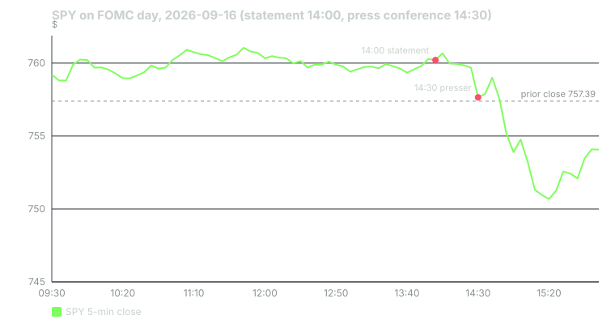

---
{
  "title": "FOMC Day Mechanics and the Pre-FOMC Drift",
  "duration": "17 min",
  "free": false,
  "status": "published",
  "quiz": [
    {"q": "At what time is the FOMC statement released, and when does the press conference begin?", "opts": ["8:30 a.m. and 9:00 a.m. ET", "12:00 p.m. and 12:30 p.m. ET", "2:00 p.m. and 2:30 p.m. ET", "4:00 p.m. and 4:30 p.m. ET"], "correct": 2, "explain": "The statement is posted at 2:00 p.m. Eastern on the second day of the meeting; the Chair's press conference starts at 2:30 p.m. Both are on the Federal Reserve's calendar page."},
    {"q": "Lucca and Moench (2015) found that the S&P 500's average excess return in the 24 hours before scheduled FOMC announcements over 1994–2011 was about:", "opts": ["5 basis points", "49 basis points", "200 basis points", "Zero"], "correct": 1, "explain": "The paper documents roughly 49 basis points of average excess return in the pre-announcement window, which accounted for a large share of the annual equity premium in their sample."},
    {"q": "On September 16, 2026, SPY rose from 757.47 at 2 p.m. the prior day to 760.28 at 1:55 p.m., then closed at 754.05. Which description is accurate?", "opts": ["A positive pre-announcement drift of about 0.37%, followed by a post-announcement decline of about 0.8%", "No drift", "A negative drift and a rally after", "The market was closed"], "correct": 0, "explain": "760.28 / 757.47 − 1 = +0.37% over the Lucca–Moench window; 754.05 / 760.28 − 1 = −0.82% from the pre-statement level to the close. One observation, consistent with the average drift and saying nothing about the post-announcement direction in general."},
    {"q": "Why is the 2:30 p.m. press conference often a bigger source of movement than the 2:00 p.m. statement?", "opts": ["The statement is not public", "The statement is short and largely anticipated; the press conference is unscripted and can shift expectations about the path of rates", "The press conference sets the rate", "Trading is halted at 2:00 p.m."], "correct": 1, "explain": "The decision itself is usually well priced by futures. The Chair's answers at 2:30 are where the market learns about the next meeting, and on both 2026 examples in this lesson the larger move came after 2:30."},
    {"q": "Which of these is the safest inference from the two FOMC days in this lesson (July 29 and September 16, 2026), both of which sold off after the press conference?", "opts": ["Markets always fall after FOMC", "Two observations are consistent with almost any hypothesis; the pre-drift is a documented average, the post-move is not", "The Fed causes bear markets", "Sell at 2:29 p.m. every meeting"], "correct": 1, "explain": "The pre-FOMC drift has a large-sample average behind it. The post-announcement direction does not; two sell-offs in a row are exactly what randomness produces often."}
  ],
  "task": "For the next FOMC decision, record SPY at 2:00 p.m. the day before, at 1:59 p.m., at 2:01 p.m., at 2:30 p.m., at 3:00 p.m. and at the close, and compute the pre-window return and the post-statement return."
}
---

## The most scheduled event there is

The Federal Open Market Committee meets eight times a year on dates published on the Federal Reserve's website roughly a year in advance. On the second day of each meeting the statement is released at exactly 2:00 p.m. Eastern. It states the target range for the federal funds rate, the vote, and a few paragraphs on the economy. At 2:30 p.m. the Chair holds a press conference that runs about an hour. Four of the eight meetings, in March, June, September and December, also release the Summary of Economic Projections, including the "dot plot" of participants' rate expectations.

Nothing about this is uncertain except the content. That makes FOMC day the cleanest natural experiment in event trading: the same clock every time, the same two release points, and a market that has had six weeks to price the outcome through fed funds futures. Almost always the decision itself is priced; the movement comes from the *path*: what the statement's wording and the Chair's answers imply about the next meeting and the one after that.

## The intraday shape

A typical FOMC day, in the sense of what happens on most of them, has four phases:

1. **Morning to 1:59 p.m.:** low volume, narrow range, a slow upward bias. This is the tail end of the pre-FOMC drift.
2. **2:00 to 2:05 p.m.:** the statement bar. Volume spikes, the range widens, the first move often reverses within minutes as algorithms trade the headline and humans read the text.
3. **2:30 to about 3:30 p.m.:** the press conference. The larger move usually happens here, in response to specific answers about the path of rates, the balance sheet, or the Chair's characterisation of inflation.
4. **3:30 p.m. to the close:** positioning for the close, sometimes a partial reversal of the press-conference move.

The direction of phases 2 through 4 is not predictable from the decision alone. A hike can rally the market if the statement is softer than feared; a cut can sell it off if the Chair sounds worried. What *is* documented is phase 1, and that is where the academic evidence lives.

## The pre-FOMC drift

Lucca and Moench (2015), in the Journal of Finance, documented that the S&P 500 earned an average excess return of about 49 basis points in the 24 hours *before* scheduled FOMC announcements, from 2 p.m. on the day before to 2 p.m. on decision day, over 1994–2011. They found the return was not compensated by a corresponding increase in risk in that window, that it did not appear before other macro announcements to the same degree, and that it accounted for a large share of the total annual equity premium over the period: the market did most of its earning in those eight 24-hour windows a year. The effect has since been examined repeatedly; it appears weaker after 2011 and varies with the level of uncertainty going into the meeting, and later work links it to investor sentiment and to the resolution of uncertainty. It remains the best-documented scheduled-event return pattern in equities.

The related finding from Savor and Wilson (2013) is that scheduled macro announcement days in general (CPI, employment, FOMC) carry higher average returns than other days, 11.4 basis points against 1.1 basis points over 1958–2009, which they interpret as compensation for bearing the risk of the announcement. Both papers are about averages over hundreds of events. Neither says anything about which way a given decision day will go after 2 p.m.

## Worked example

Two decision days in 2026, using SPY 5-minute bars from the Yahoo Finance chart API (79 bars each for the regular session, including a stray 16:00 bar that is discarded) and the Fed's own statements.

**September 16, 2026.** The FOMC raised the target range by 25 basis points to 3.75–4.00%, by a 12–0 vote, citing inflation that "remains elevated." The July meeting had held at 3.50–3.75% with three dissents in favour of a hike, so a hike was on the table.

- Prior day, September 15, 2:00 p.m. bar close: **757.47**. September 15 close: 757.39.
- September 16, 1:55 p.m. bar close: **760.28**. Pre-FOMC window return: 760.28 / 757.47 − 1 = **+0.37%**. Consistent in sign and rough size with the Lucca–Moench average.
- 2:00 p.m. bar: open 760.18, high 760.98, low 758.77, close 760.21, volume 1.80 million against roughly 0.2 million on the preceding bars. A 2.21-point range in five minutes, closed flat.
- 2:30 p.m. bar (press conference begins): close **757.65**. 2:35: low 756.05 on 1.86 million shares.
- 3:25 p.m. bar: low **749.60**, the day's low, 1.40% below the 1:55 p.m. level.
- Close: **754.05**. Post-statement return: 754.05 / 760.28 − 1 = **−0.82%**. Day: 754.05 / 757.39 − 1 = −0.44%.
- VIX (Cboe, daily): 17.20 on the 15th, 17.71 on the 16th, 15.44 on the 17th.

**July 29, 2026.** The FOMC held the target range at 3.50–3.75%, by 9–3, with three dissents preferring a 25 basis point increase.

- 1:55 p.m. bar close: 736.41. Prior close (July 28): 740.86. Note the run-in was *negative* that day: 736.41 / 740.86 − 1 = −0.60% from the prior close to the minute before the statement.
- 2:00 p.m. bar: open 736.37, high 739.55, close 738.14 on 1.89 million shares. First reaction up.
- 2:50 p.m.: 742.59, the post-statement high, +0.84% from 1:55.
- 3:55 p.m.: close 729.54 on 8.9 million shares in the last bar. Day close 729.46, −1.54%. From the 2:50 high to the close: −1.76%.

Two decision days, one hike and one hold, one positive pre-window and one negative, both with a positive first reaction in the 2:00 bar, and both with a sell-off that began during the press conference and ran into the close. That is a story, not a pattern; with two observations you cannot distinguish "the presser is bearish" from chance. The documented pattern is the *average* pre-window drift, and September's +0.37% is one draw from it.

## Chart

## What is tradeable and what is not

The pre-FOMC drift is an average of 49 basis points with a standard deviation many times that. A trader who buys SPY at 2 p.m. the day before and sells at 1:59 p.m. is running a strategy that, if the historical average held, would earn eight times 0.49% ≈ 3.9% a year before costs, with each trade exposed to a full overnight session of ordinary market risk. The post-2011 evidence is weaker. It is a documented tilt for someone who was going to be long anyway; it is not a stand-alone trade with the reliability the headline number suggests.

The statement bar is not tradeable by a retail trader in any useful sense. The 2:00 p.m. bar on September 16 ranged 2.21 points and closed flat; a market order placed at 2:00:01 could have filled anywhere in that range against a spread that had widened from a cent to several cents. Lesson 9 covers why.

The press conference is where a discretionary trader with a view can act, because it unfolds over an hour and the market's interpretation is visible in real time. Even then, the two 2026 examples show a move that began around 2:30 and continued to 3:25 or later; there was time to see it develop. A position taken at 2:29 on a guess about what the Chair would say has no edge documented anywhere.

Two practical rules follow. Do not hold short-dated short-gamma positions in index products through 2:00 p.m. unless the position was sized for a 1.5% move in either direction within an hour. And if you want to hold long index exposure into the decision for the drift, put it on the day before and be prepared to hold through 2:00 p.m. without a stop, because a stop inside the 2:00 bar's range will be filled at the worst print.

## Sources

- Lucca, D. O., and Moench, E. (2015). "The Pre-FOMC Announcement Drift." Journal of Finance 70(1), 329–371. https://doi.org/10.1111/jofi.12196 (working-paper version: Federal Reserve Bank of New York Staff Report 512, https://www.newyorkfed.org/research/staff_reports/sr512.html)
- Savor, P., and Wilson, M. (2013). "How Much Do Investors Care About Macroeconomic Risk? Evidence from Scheduled Economic Announcements." Journal of Financial and Quantitative Analysis 48(2), 343–375. https://doi.org/10.1017/S002210901300015X
- Federal Reserve, FOMC calendar: https://www.federalreserve.gov/monetarypolicy/fomccalendars.htm; statements of July 29, 2026 (https://www.federalreserve.gov/newsevents/pressreleases/monetary20260729a.htm) and September 16, 2026 (https://www.federalreserve.gov/newsevents/pressreleases/monetary20260916a.htm)
