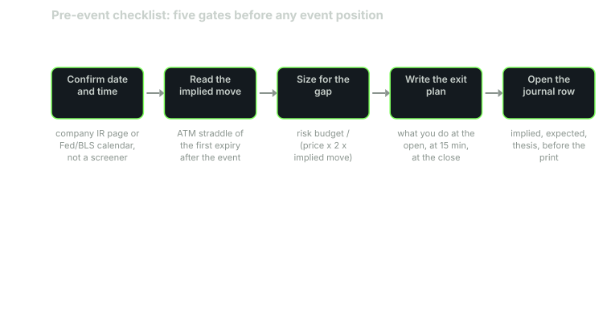

---
{
  "title": "Positioning into Events: Gaps and Stops",
  "duration": "17 min",
  "free": false,
  "status": "published",
  "quiz": [
    {"q": "You are short 150 NVDA at 209.66 with a stop at 213.00 through the August 26, 2026 report. The stock opens at 222.86. Where does your stop fill?", "opts": ["213.00", "About 209.66", "At or near 222.86, the first print past the stop", "It does not fill"], "correct": 2, "explain": "A stop becomes a market order when the stock trades through the stop price. The first regular-session trade past 213 was the 222.86 open, so the fill is there or worse: 13.20 per share against a planned 3.34."},
    {"q": "The correct way to size a position held through an event is to divide the risk budget by:", "opts": ["The distance to the stop", "The price times a gap assumption of at least twice the implied move", "The average true range", "The premium of the ATM straddle"], "correct": 1, "explain": "Through an event the stop does not bound the loss; the gap does. Size so that a gap of two implied moves against you costs no more than the risk budget. In the example that means 17 shares, not 150."},
    {"q": "A 'gap assumption of two implied moves' for a 7% implied move means planning for:", "opts": ["A 3.5% move", "A 7% move", "A 14% move", "A 28% move"], "correct": 2, "explain": "The implied move is roughly a one-standard-deviation figure; two of them covers most but not all outcomes. NVDA has produced moves larger than 14% in this sample on non-earnings days, so even this is not a hard ceiling."},
    {"q": "Which of these does a pre-event checklist NOT do?", "opts": ["Confirm the date and time from the primary source", "Guarantee the trade is profitable", "Force you to write the exit plan before the print", "Open the journal row with implied and expected before the outcome is known"], "correct": 1, "explain": "The checklist removes avoidable errors: wrong date, wrong size, no plan, no record. It has nothing to say about whether the thesis is right."},
    {"q": "Why does the course say to log the expected move and thesis before the print rather than after?", "opts": ["Brokers require it", "After the outcome is known, memory rewrites the thesis to fit it, and the journal stops measuring anything", "It is faster", "It reduces commissions"], "correct": 1, "explain": "Hindsight bias is not a character flaw; it is how memory works. The only defence is a timestamped record made while the outcome is still unknown."}
  ],
  "task": "Write your own five-gate pre-event checklist on one page, and compute the gap-sized share count for one upcoming report at a 1% risk budget and a two-implied-move gap assumption."
}
---

## The stop is not a risk limit through an event

In ordinary trading a stop-loss order approximates a maximum loss. The stock trades continuously, the stop triggers near its level, and the fill is close behind. Through a scheduled event that approximation fails completely. The stock does not trade continuously across the event; it trades at 4:00 p.m., then in a thin extended session, then at 9:30 the next morning at a price that can be 6% or 10% away. A stop set 1.6% from entry triggers at the first regular-session print past it, and that print is the open, wherever the open is.

This lesson does the arithmetic on a real gap, derives the sizing rule that follows from it, and ends with the five-gate checklist that keeps the rest of the course from being undone by an avoidable mistake.

## Worked example

Account of $50,000. Risk budget per trade 1%, or **$500**. NVIDIA reports after the close on Wednesday, August 26, 2026. Prior close **209.66**. Representative implied move (lesson 2) **7.0%**. Suppose you have a bearish thesis and want to be short through the print.

**The ordinary-day sizing, applied wrongly.** Stop at 213.00, which is 3.34 above entry, 1.6%. Shares = 500 / 3.34 = **150**. Notional 150 × 209.66 = $31,449, 63% of the account, on a bet that the stop will hold.

**What happened.** August 27 opened at **222.86**. The extended session on the 26th had traded as high as 226.25 at 5:20 p.m. and settled near 218 to 219 by evening, but a standard stop is active only in the regular session, so the first trade that could trigger it was the open. Fill at 222.86 (a market order into a 39-million-share opening bar; the 9:30 bar's range was 221.22 to 225.50, so 222.86 is optimistic). Loss per share = 222.86 − 209.66 = **13.20**. Loss = 150 × 13.20 = **$1,980**, or **3.96%** of the account. The planned loss was $500. The realised loss was four times the plan, and the stop did precisely nothing.

**The gap-sized position.** The right question is not "where is my stop" but "what does a bad gap cost me." Take a gap assumption of **two implied moves**: 2 × 7.0% = 14%. Loss per share at a 14% adverse gap = 209.66 × 0.14 = **29.35**. Shares = 500 / 29.35 = **17.0**, so 17 shares. Notional 17 × 209.66 = $3,564, 7.1% of the account.

Check against what happened: 17 × 13.20 = **$224**, 0.45% of the account. Within budget, with room for a worse gap. At the 14% assumption the loss would have been 17 × 29.35 = $499. At the extended-session extreme of 226.25 (+7.91%), had a stop been active there and filled, 17 × 16.59 = $282.

**The same arithmetic, long side.** Suppose the thesis was bullish and you bought 17 shares at 209.66 with a stop at 205. The 4:20 p.m. bar on the 26th printed 203.50, below the stop, in the extended session. A regular-session stop would not have triggered; an extended-hours stop, if your broker offered one and you had enabled it, would have sold you at or below 203.50 into a book with almost no bids, twelve hours before the stock opened at 222.86. The position that was sized for the gap and had no extended-hours stop did nothing overnight and was up 13.20 a share at the open. The position with the "protective" extended-hours stop lost 6.16 a share and missed the move.

Two lessons in one example. The gap, not the stop, bounds the loss, so size for the gap. And an active stop in the thin session after the print is not protection; it is an invitation to be the only seller at the low.

## Chart

## The sizing rule, stated once

For any position held through a scheduled event:

shares (or contracts × multiplier) = risk budget / (price × gap assumption)

where the gap assumption is at least **two times the implied move** from the chain, and larger if the name's realised history (lesson 2) shows moves beyond two implied. The stop, if you use one, is for the *session after* the open, once the gap has printed and trading is continuous again. It does not enter the sizing.

For options the same logic applies to the *premium at risk*, but with one difference: a long option's loss is bounded by the debit, so the gap assumption only affects the upside, not the sizing. A short option or short strangle has no such bound, and its sizing must assume the underlying gaps through the short strike by the full gap assumption. In lesson 5's representative strangle, credit 2.94, the call strike was 230; a 14% gap takes the stock to 239, and the short call loses 9 net of the credit collected. At 10 contracts that is $9,000 against $2,940 collected. The sizing rule says 10 contracts is the wrong number for a $50,000 account with a $500 budget; the right number, on this arithmetic, is zero, or one at most, and one contract on a strangle is an expensive way to earn $294.

## The pre-event checklist

Five gates. Every one of them has to be passed *before* the print, in writing, or the position is not put on. None of them is about whether the thesis is right; all of them are about not losing money to something other than the thesis.

1. **Confirm the date and time from the primary source.** The company's IR page, the Fed's calendar, the BLS schedule. Not a screener. Note whether the release is pre-market or post-close and the time of the call. Note the exchange calendar: is it a half day?
2. **Read the implied move.** ATM straddle of the first expiry after the event, divided by spot. Compare to the name's last four to eight realised moves. Write both numbers down.
3. **Size for the gap.** Risk budget divided by price times at least two implied moves. If the resulting position is too small to bother with, that is the answer: the event is too big for the account, not the account too small for the event.
4. **Write the exit plan.** What you do at the open (nothing, usually), at 15 minutes, at the close of the reaction day, at expiry. Where the session-after stop goes. Whether extended-hours orders are enabled (they should not be, unless you have a specific reason).
5. **Open the journal row.** Implied move, your expected move, your thesis in one sentence, the consensus and the regime for a macro print. Timestamped before the release. Lesson 11 gives the columns.

## Why the order matters

Gate 1 before gate 2 because an implied move read against the wrong expiry is meaningless. Gate 2 before gate 3 because the size depends on the implied move. Gate 3 before gate 4 because the exit plan for 17 shares is different from the exit plan for 150. Gate 4 before gate 5 because the journal should record the plan you actually had, not the one you reconstruct afterward. And gate 5 last, before the print, because once the outcome is known the thesis will quietly rearrange itself to match it. That is not a flaw you can fix by being careful. It is what memory does. The timestamp is the only defence.

## Two things this lesson does not tell you

It does not tell you whether to be long or short, or whether to hold anything through a print at all. The evidence in lessons 2 through 8 is that scheduled events carry a documented but small average premium, that option sellers have collected a premium on average at the cost of unbounded tail risk, and that both the pre-FOMC drift and the index effect have shrunk since publication. Nothing in that supports holding a large directional position through a print on the strength of a hunch.

It also does not tell you that the gap assumption of two implied moves is safe. NVDA moved +18.72% on April 9, 2025 and −16.97% on January 27, 2025, neither on an earnings date, both larger than two implied moves. The assumption is a floor. Your journal will tell you, in time, whether your names need a higher one.

## Sources

- FINRA, order types, including how stop orders become market orders: https://www.finra.org/investors/investing/investment-products/stocks/order-types
- U.S. Securities and Exchange Commission, Investor.gov glossary, "Stop Order": https://www.investor.gov/introduction-investing/investing-basics/glossary/stop-order
- Limit Up-Limit Down Plan (bands and pauses that govern the session after the gap): https://www.luldplan.com/
- NVIDIA, "NVIDIA Announces Financial Results for Second Quarter Fiscal 2027," August 26, 2026: https://nvidianews.nvidia.com/news/nvidia-announces-financial-results-for-second-quarter-fiscal-2027
