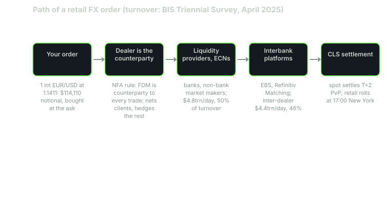

---
{
  "title": "How the FX Market Is Structured: Interbank, ECNs and Your Broker",
  "duration": "16 min",
  "free": true,
  "status": "published",
  "quiz": [
    {"q": "According to the BIS 2025 Triennial Survey, what was average daily OTC FX turnover in April 2025?", "opts": ["$2.1 trillion", "$7.5 trillion", "$9.6 trillion", "$14 trillion"], "correct": 2, "explain": "The 2025 survey recorded $9.6 trillion per day, up 28% from $7.5 trillion in April 2022."},
    {"q": "Which instrument had the largest share of FX turnover in April 2025?", "opts": ["Spot", "Outright forwards", "FX swaps", "Options"], "correct": 2, "explain": "FX swaps were $4 trillion a day, 42% of turnover. Spot was $3 trillion, 31%."},
    {"q": "Under US rules, who is the counterparty to a retail customer's forex trade at a retail foreign exchange dealer?", "opts": ["An exchange", "Another retail customer", "The dealer itself", "The Federal Reserve"], "correct": 2, "explain": "NFA's guide states that an FDM is the counterparty to every customer transaction, and forbids representations that suggest otherwise."},
    {"q": "The US dollar was on one side of what share of all FX trades in April 2025?", "opts": ["About 50%", "About 65%", "About 89%", "100%"], "correct": 2, "explain": "89.2%, up from 88.4% in 2022. That is why nearly every widely traded pair has USD on one side."},
    {"q": "What share of April 2025 FX turnover was handled by sales desks in the top four centres (UK, US, Singapore, Hong Kong)?", "opts": ["25%", "50%", "75%", "95%"], "correct": 2, "explain": "75% on a net-gross basis, with Singapore alone at 11.8%. Trading is global but the dealing is concentrated."}
  ],
  "task": "Open your broker's customer agreement and find the sentence that says who the counterparty to your trades is; copy it into your notes with the page reference."
}
---

## There is no exchange

The first thing to unlearn from equities is the idea of a central venue. When you buy a share of a listed company, an exchange matches your order against another order, and a regulator watches the tape. When you buy euros against dollars, there is no exchange. Currencies trade over the counter, which means two parties agree a price directly, and the "market" is the sum of thousands of such bilateral relationships wired together by electronic platforms.

That structure matters to you for a practical reason: the price you see and the counterparty you face are decided by where you sit in the chain. This lesson walks the chain from the top down and then measures it with the Bank for International Settlements' survey, which is the only comprehensive count of the market that exists.

## The tiers

**Tier 1: the interbank market.** A few dozen large banks quote each other continuously. Historically they did this by phone and through voice brokers; today most of it runs on two electronic platforms, EBS (now owned by CME Group) and Refinitiv Matching (LSEG), plus each bank's own single-dealer platform. These banks are the reporting dealers in the BIS survey, and trading among them is called inter-dealer trading. In April 2025 it averaged $4.4 trillion per day, 46% of the total.

**Tier 2: other financial institutions.** Hedge funds, asset managers, smaller banks, non-bank market makers such as XTX and Citadel Securities, and retail brokers hedging their books. This tier trades with the dealers and increasingly through electronic communication networks (ECNs) and aggregators that pool quotes from several dealers into one order book. BIS puts dealer trading with this group at $4.8 trillion a day in 2025, 50% of the total, and growing faster than the inter-dealer segment.

**Tier 3: non-financial customers.** Corporations converting revenue, importers paying invoices, tourists. A few per cent of turnover.

**You.** A retail trader sits below tier 2. Your broker is either a market maker that takes the other side of your trade and hedges (or does not hedge) in tier 2, or an agency broker that passes your order through to an ECN and charges a commission. In the United States the market-making model is the norm and the regulator is explicit about it: NFA's Forex Transactions regulatory guide states that a forex dealer member "is actually the counterparty to every customer's forex transaction" and prohibits any representation suggesting otherwise. The same guide requires the dealer to hold your funds; no third party can.

That sentence is the most important structural fact in retail FX. The entity quoting you the price is the entity that profits when you lose, unless it hedges. Reputable dealers do hedge net exposure, and regulation (capital requirements, quarterly profitability disclosures, execution rules) constrains the conflict, but the conflict is designed in. You should know it exists and read the disclosure that says so.

## What the money actually is

The BIS Triennial Central Bank Survey counts turnover every three years in April. The 2025 edition, published in September 2025, reports:

- **$9.6 trillion per day** in OTC FX, up 28% from $7.5 trillion in April 2022. April 2025 was an unusually volatile month, following trade-policy announcements, so the number is partly a snapshot of stress.
- **FX swaps** are the biggest instrument at $4.0 trillion a day, 42% of the total. A swap is a spot trade paired with an offsetting forward; banks use them to fund positions in one currency with another. This is plumbing, not speculation, and it explains why "FX turnover" is many times larger than the trade and investment it serves.
- **Spot** is $3.0 trillion, 31%. This is the instrument you trade as a retail customer, although your contract is technically a rolling spot position that never settles.
- **Outright forwards** are $1.8 trillion, 19%; **options** 7%; **currency swaps** about 2%.

By currency, the US dollar was on one side of **89.2%** of all trades. The euro was on one side of 28.9%, the yen 16.8%, sterling 10.2%, the renminbi 8.5%, the Swiss franc 6.4%, and the Australian and Canadian dollars roughly 6% each. (Shares sum to 200% because every trade has two currencies.) The top ten pairs all contain the dollar, which is why the dollar is called the vehicle currency: a Brazilian company buying yen usually sells reais for dollars and then dollars for yen.

By location, sales desks in the United Kingdom, the United States, Singapore and Hong Kong handled 75% of trading, with Singapore at 11.8% and rising. This is why the trading day, covered in lesson 5, is really three overlapping days centred on London, New York and Asia.

## Worked example

Trace one retail order through the chain, using the survey figures to size each layer.

You place a market order to buy 1 standard lot (100,000 units) of EUR/USD with a US retail dealer on 2026-09-23. The ECB's reference rate that day was 1.1411, so the notional is 100,000 × 1.1411 = $114,110.

1. **Your broker fills you as principal.** You are long EUR/USD; the dealer is short EUR/USD against you. Nothing has yet touched the wider market.
2. **The dealer nets you against other customers.** If another customer sold 1 lot at the same moment, the dealer's net exposure is zero and it keeps both spreads. Only the residual goes out.
3. **The residual is hedged in tier 2.** The dealer's own liquidity providers (banks or non-bank market makers) quote it through an aggregator or an ECN. Your $114,110 is 0.0000012% of the $9.6 trillion daily total, which is another way of saying your order has no price impact and no one is watching it.
4. **The liquidity provider manages its book in tier 1.** If it accumulates a long euro position it does not want, it sells on EBS or Refinitiv Matching, where the inter-dealer turnover of $4.4 trillion a day absorbs it.
5. **Settlement.** Real spot trades settle two business days later through CLS Bank, which settles both legs simultaneously to remove the risk that one side pays and the other does not. Your retail position never settles; at 5 p.m. New York time it is rolled forward one day and a swap credit or charge is applied (lesson 7).

The chain has four links between you and the interbank price. Each link earns something: the dealer's spread, the liquidity provider's spread, the ECN fee, the prime broker's fee. A retail EUR/USD spread of 0.8 pips (tastyfx's published minimum on its standard account) is wide relative to the fraction of a pip that dealers quote each other, and the difference is the cost of the chain.

*Figure 1. The path of a retail order from customer to interbank market. Turnover figures per layer are from the BIS Triennial Central Bank Survey, April 2025.*

## Table

| Layer | Who | April 2025 daily turnover (BIS) | Share | What they charge you |
| --- | --- | --- | --- | --- |
| Interbank (tier 1) | Reporting dealers trading each other on EBS, Refinitiv Matching, single-dealer platforms | $4.4 trillion | 46% | Nothing directly; sets the reference price |
| Other financial institutions (tier 2) | Funds, smaller banks, non-bank market makers, retail brokers hedging | $4.8 trillion | 50% | Spread and fees to your broker, passed to you |
| Non-financial customers | Corporates, importers, travellers | Remainder | About 4% | Not applicable |
| Retail dealer | Your broker acting as counterparty (NFA rule) | Not separately reported | Included in tier 2 | Spread, swap markup, sometimes commission |
| Instrument mix | FX swaps 42%, spot 31%, forwards 19%, options 7%, currency swaps 2% | $9.6 trillion total | 100% | You trade rolling spot |

## What this means for how you trade

Three consequences follow from the structure.

First, the quote you see is a dealer's quote, not "the market". Two brokers will show slightly different EUR/USD prices at the same instant, and both are legitimate. Comparing your fill to a chart from another vendor proves nothing.

Second, liquidity is not uniform. In the dollar pairs at the London-New York overlap you are trading in the deepest market that exists. In an exotic pair at 3 a.m. Tokyo time you are trading against one dealer's willingness to warehouse risk, and the spread will show it (lesson 3).

Third, your broker's business model is disclosed and you should read it. US dealers must state that they are the counterparty and must publish, every quarter, the percentage of non-discretionary retail accounts that were profitable. Lesson 11 uses those numbers. They are the closest thing this market has to a scoreboard.

## Sources

- Bank for International Settlements, "OTC foreign exchange turnover in April 2025", Triennial Central Bank Survey: https://www.bis.org/statistics/rpfx25_fx.htm
- Bank for International Settlements, Triennial Survey overview page: https://www.bis.org/statistics/rpfx25.htm
- National Futures Association, "Forex Transactions: A Regulatory Guide": https://www.nfa.futures.org/members/member-resources/files/forex-regulatory-guide.html
- European Central Bank, euro foreign exchange reference rates (2026-09-23 fix used above): https://www.ecb.europa.eu/stats/policy_and_exchange_rates/euro_reference_exchange_rates/html/index.en.html
