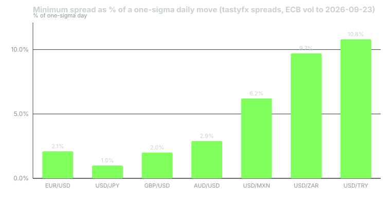

---
{
  "title": "Spreads and the True Cost of a Trade: EUR/USD Against an Exotic",
  "duration": "16 min",
  "free": false,
  "status": "published",
  "quiz": [
    {"q": "You buy EUR/USD at the ask and later sell at the bid. How many times do you pay the spread?", "opts": ["Twice, once each way", "Once; the spread is the round-trip cost", "Never, if the trade is profitable", "It depends on the holding period"], "correct": 1, "explain": "Buying at the ask and selling at the bid loses one spread in total. Quoting it as 'paid on entry' or 'paid on exit' is bookkeeping; the cost is one spread per round trip."},
    {"q": "tastyfx's published minimum spread on USD/ZAR is 110 pips. At USD/ZAR 16.347, what is that in dollars per standard lot?", "opts": ["$11", "$67", "$110", "$1,100"], "correct": 1, "explain": "A pip on one lot is ZAR 10; ZAR 10 / 16.347 = $0.61 per pip; 110 pips × $0.61 = $67.3."},
    {"q": "Why is comparing spreads in pips across pairs misleading?", "opts": ["Pips are always the same size", "Pip value and daily volatility differ by pair, so the same pip count is a different share of a typical day's move", "Brokers quote exotics in pipettes", "Spreads in pips are only quoted for majors"], "correct": 1, "explain": "The relevant number is the spread as a fraction of what the pair typically moves; 0.8 pips is about 2% of a one-sigma day in EUR/USD while 110 pips is about 10% of one in USD/ZAR."},
    {"q": "A broker advertises 'spreads from 0.0 pips'. What should you check next?", "opts": ["Nothing; zero is zero", "The commission per lot, the average (not minimum) spread, and the swap markup", "Whether the broker is an exchange", "The leverage offered"], "correct": 1, "explain": "Zero-spread accounts charge a commission, minimum spreads are not typical spreads, and overnight financing is a separate cost line."},
    {"q": "What is the break-even move for a long EUR/USD trade entered at 1.14161 with a 0.6-pip spread, ignoring swap?", "opts": ["0 pips", "0.6 pips", "6 pips", "60 pips"], "correct": 1, "explain": "The bid must rise to your entry ask before you are flat; that is exactly the spread, 0.6 pips."}
  ],
  "task": "Screenshot your broker's EUR/USD and one exotic pair's live spread at 09:00 London time and again at 22:00 New York time, and record both in pips and in dollars per lot."
}
---

## The cost you pay on every trade

Retail FX is sold as commission-free, and often it is. The cost is instead built into the price: you buy at the dealer's ask and sell at the dealer's bid, and the difference between them, the spread, is the dealer's revenue and your cost. Because you cross the spread on the way in and are marked against the other side on the way out, one spread is the round-trip cost of a trade. A trade that moves nowhere loses exactly the spread.

This lesson turns spreads into dollars and then into a more useful unit, the fraction of a typical day's move, because that is what decides whether a strategy can survive its own costs.

## Minimum, typical and live

Brokers publish minimum spreads. tastyfx's product details page lists 0.8 pips on EUR/USD and USD/JPY, 1 pip on GBP/USD and AUD/USD, 6 pips on USD/CNH, 50 pips on USD/MXN and USD/TRY, and 110 pips on USD/ZAR, with the caveat that "spreads are subject to variation, especially in volatile market conditions." IG UK advertises EUR/USD "from 0.6 points" and, on the morning of 2026-09-24, its market page showed a live quote of 1.13913 bid / 1.13919 ask, which is 0.6 pips.

The word "from" is doing work. A minimum spread is what you get in EUR/USD at 10:00 London time on an ordinary Tuesday. It is not what you get at 22:00 New York time, in the minute after a payrolls release, or in an exotic pair at any time. Some brokers also publish average spreads over a period; those are the numbers to use in planning, and if a broker publishes only minimums you should measure the live spread yourself at the times you intend to trade (this lesson's task).

Measuring the live spread is simple and worth doing. Note the bid and ask at the moment you would normally enter, subtract, and record it in pips next to the time and session. Ten readings over two weeks give you a typical spread for your own trading hours, which is the number your plan should use. If your typical is double the published minimum, the published minimum was never your cost; it was someone else's, at a different hour.

Two other cost lines sit next to the spread. Commission accounts (tastyfx's "Zero+" account quotes spreads from 0.0 pips with a per-lot commission) simply move the cost from the price to a fee. Overnight financing, covered in lesson 7, is a daily charge or credit that can exceed the spread for any position held more than a few days.

## Worked example

Compare a long trade in EUR/USD with a long trade in USD/ZAR, one standard lot each, using tastyfx's published minimum spreads and the ECB reference rates for 2026-09-23 (EUR/USD 1.1411; USD/ZAR = EUR/ZAR 18.6537 ÷ 1.1411 = 16.347).

**Step 1: spread in dollars.**

- EUR/USD: pip value per lot is $10 (dollar is the quote currency). Spread 0.8 pips × $10 = **$8.00** per lot round trip.
- USD/ZAR: pip value per lot is ZAR 10 ÷ 16.347 = $0.612. Spread 110 pips × $0.612 = **$67.3** per lot round trip.

The exotic costs 8.4 times as much in dollars for the same notional. But that comparison still understates the difference, because the rand moves more than the euro.

**Step 2: what a typical day moves.**

From the ECB's daily reference rates over the year 2025-09-23 to 2026-09-23 (256 observations), the standard deviation of daily log returns was 0.339% for EUR/USD and 0.694% for USD/ZAR (11.0% annualised ÷ √252). Converted to pips at the 2026-09-23 rates:

- EUR/USD: 1.1411 × 0.00339 = 0.00387 = **38.7 pips** for a one-standard-deviation day.
- USD/ZAR: 16.347 × 0.00694 = 0.1134 = **1,134 pips** for a one-standard-deviation day.

(Yahoo Finance's daily bars for EUR/USD over the same year, pulled 2026-09-24, give a median high-to-low range of 47.7 pips, a slightly different measure that tells the same story.)

**Step 3: spread as a share of a typical day.**

- EUR/USD: 0.8 ÷ 38.7 = **2.1%** of a one-sigma day.
- USD/ZAR: 110 ÷ 1,134 = **9.7%** of a one-sigma day.

So the exotic's spread is not eight times worse, it is about five times worse in the unit that matters, and either way it is a different kind of instrument. A strategy that targets half a day's move in USD/ZAR gives up a fifth of its target to the spread before anything happens.

**Step 4: break-even and the effect on a strategy.**

Suppose your rule risks 40 pips to make 40 pips in EUR/USD (a 1:1 reward-to-risk). With a 0.8-pip spread, a winner nets 39.2 pips and a loser costs 40.8 pips. The win rate needed to break even is 40.8 ÷ (39.2 + 40.8) = 51.0% instead of 50%. Cost moved the hurdle by one percentage point. The same rule in USD/ZAR with a 1,134-pip stop (one sigma) and a 110-pip spread nets 1,024 on a win and loses 1,244 on a loss; break-even is 1,244 ÷ 2,268 = 54.9%. Cost moved the hurdle by five points, before swap, which in USD/ZAR was −5.39% per year on the long side in OANDA TMS Brokers' published swap table for 2026-09-21 to 2026-09-27 (lesson 7).

## Chart

*Figure 2. Minimum spread as a share of a one-sigma daily move. Spreads from tastyfx product details; daily volatility from ECB reference rates, 2025-09-23 to 2026-09-23; conversion at ECB rates of 2026-09-23. USD/TRY looks expensive because the lira's daily volatility was unusually low over the year (1.5% annualised) while its published spread stayed at 50 pips.*

The chart also exposes a trap in the lira: low measured volatility is not safety. USD/TRY rose 17.9% over the year in an almost straight line, so daily standard deviation is small while the drift is enormous, and the long-side swap in the OANDA table was −46.61% per year. Cost analysis must include all three numbers, spread, volatility and carry, not one.

## When spreads widen

Spreads are quotes, and dealers widen them when their own risk rises. Expect wider spreads:

- **Around scheduled releases.** In the seconds around US payrolls or a central-bank decision, 0.8 pips in EUR/USD can become 3 to 10 pips, and stops are filled at the wider price. Lesson 9 covers this.
- **At the daily rollover.** Around 17:00 New York time, when the trading day ends and swaps are applied, liquidity thins and some brokers widen quotes for several minutes.
- **In the Asian session for European and American pairs.** GBP/USD at 03:00 London time trades in a market where most of its natural participants are asleep.
- **In exotics at all times**, and especially when the local market is closed.

None of this is hidden. It is the direct result of the structure in lesson 1: you are trading against a dealer who prices risk, and the price of risk goes up when risk goes up.

## Sources

- tastyfx, forex product details (minimum spreads and margin by pair): https://www.tastyfx.com/help-and-support/product-details/what-are-tastyfxs-forex-product-details/
- IG, EUR/USD market page (live quote 1.13913 / 1.13919 on 2026-09-24): https://www.ig.com/uk/forex/markets-forex/eur-usd
- European Central Bank, euro foreign exchange reference rates (daily history used for volatility): https://www.ecb.europa.eu/stats/policy_and_exchange_rates/euro_reference_exchange_rates/html/index.en.html
- OANDA TMS Brokers S.A., published swap points table valid 2026-09-21 to 2026-09-27: https://www.oanda.com/eu-en/document/91
