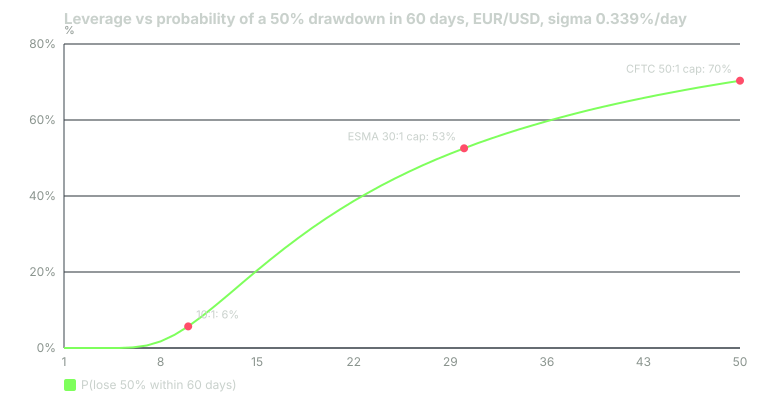

---
{
  "title": "Leverage and Margin: CFTC and ESMA Limits, and What Leverage Does to Ruin Probability",
  "duration": "18 min",
  "free": false,
  "status": "published",
  "quiz": [
    {"q": "What minimum security deposit does CFTC Regulation 5.9 require for retail forex in a major currency?", "opts": ["1% of notional", "2% of notional (50:1)", "5% of notional (20:1)", "10% of notional (10:1)"], "correct": 1, "explain": "2% for major currencies and 5% for all others. NFA may set higher levels and decides which currencies count as major."},
    {"q": "Under ESMA's 2018 product intervention measures, what is the maximum leverage for a retail client on a major currency pair?", "opts": ["500:1", "50:1", "30:1", "5:1"], "correct": 2, "explain": "30:1 for majors, 20:1 for non-majors, with a 50% margin close-out rule and negative balance protection."},
    {"q": "A $10,000 account holds 4 lots of EUR/USD at 1.1411 with 2% margin. At a 50% margin close-out level, roughly how many pips against you trigger liquidation?", "opts": ["About 14 pips", "About 136 pips", "About 500 pips", "About 1,360 pips"], "correct": 1, "explain": "Margin is $9,129; close-out at $4,564 equity means a $5,436 loss; at $40 per pip that is 136 pips, less than three median EUR/USD days."},
    {"q": "Using zero drift and EUR/USD's measured daily volatility of 0.339%, what is the approximate probability that a fully leveraged 50:1 position loses half the account within 60 trading days?", "opts": ["About 5%", "About 25%", "About 70%", "About 99%"], "correct": 2, "explain": "2 × Φ(−0.01 / (0.00339 × √60)) = 2 × Φ(−0.38) ≈ 0.70. At 10:1 the same calculation gives about 6%."},
    {"q": "Why does the broker's margin requirement understate the capital a position really needs?", "opts": ["Because margin is refunded", "Because margin is only the deposit; the loss is on the full notional and can exceed the margin quickly", "Because margin is charged daily", "Because brokers never call margin"], "correct": 1, "explain": "Margin is collateral, not risk. A 1% move on a 50:1 position is 50% of the margin posted, and the position is closed out long before the margin is exhausted."}
  ],
  "task": "Find the margin close-out level in your broker's agreement (the equity-to-margin percentage at which positions are liquidated) and compute, for your largest recent position, how many pips against you would have triggered it."
}
---

## Margin is a deposit, not a risk limit

Leverage lets you control a notional position larger than your account. Margin is the collateral the broker holds against it. Those two sentences are usually taught as one idea, and the confusion costs retail traders more than any other single thing in this market.

The loss on a position is computed on the full notional. The margin is what you posted. If you post 2% and the pair moves 2% against you, the loss equals the entire deposit, and the broker will have closed you out well before that point. Leverage does not change the size of the market's moves; it changes how much of your account each move represents.

## The rules: United States

CFTC Regulation 5.9 sets minimum security deposits for retail forex transactions with a registered futures commission merchant or retail foreign exchange dealer: **2% of the notional value for major currencies and 5% for all other currencies**. The CFTC's 2010 fact sheet describes the mechanism: the Commission sets those parameters, and the National Futures Association may set specific levels within them and decides which currencies are major. NFA's regulatory guide lists the British pound, Japanese yen, Canadian dollar, Swiss franc and euro among the major currencies. 2% is 50:1 leverage; 5% is 20:1.

Those are minimums. Brokers may require more, and do. tastyfx's product details list 2% on EUR/USD, 3% on AUD/USD, 5% on USD/JPY and GBP/USD (even though sterling and yen are major currencies under NFA's list), 7% on USD/ZAR, 10% on USD/MXN and 25% on USD/TRY. Read your own broker's table, not the regulation.

US retail forex customers also do not get negative balance protection by rule. If a gap takes your equity below zero, you owe the difference.

## The rules: Europe and the UK

ESMA's product intervention measures, agreed in March 2018 under Article 40 of MiFIR and since carried into national law across the EU and, separately, by the UK's FCA, cap leverage on opening a retail CFD position at **30:1 for major currency pairs and 20:1 for non-major pairs** (10:1 for commodities other than gold, 5:1 for individual shares, 2:1 for crypto). They add three protections that US retail forex lacks: a **margin close-out rule at 50%** of the minimum required margin, applied per account; **negative balance protection**, so a client cannot lose more than the account; and a standardised risk warning that must state the percentage of the provider's retail accounts that lose money. IG UK's EUR/USD page shows the practical result: a margin requirement of 3.33% (which is 30:1) and the warning that 69% of its retail accounts lose money.

ESMA's stated reason for the caps is in the same press release: national regulators' analyses found that 74% to 89% of retail CFD accounts lose money, with average losses per client between €1,600 and €29,000. Leverage was named as the feature responsible.

Elsewhere, Australia's ASIC adopted similar 30:1 limits in 2021; many offshore brokers advertise 500:1 or more. A broker offering 500:1 is telling you something about its regulator.

## Worked example

Account: $10,000, US broker, EUR/USD at the ECB reference rate of 1.1411 on 2026-09-23. Pip value per lot: $10.

**One lot.** Notional = 100,000 × 1.1411 = $114,110. Margin at 2% = $2,282.20; at 3.33% (ESMA/IG UK) = $3,799.86. A 100-pip adverse move costs $1,000: 10% of the account, or 43.8% of the 2% margin. EUR/USD's median daily range over the year to 2026-09-24 was 47.7 pips (Yahoo Finance daily bars), so 100 pips is about two ordinary days.

**Maximum size at 50:1.** $10,000 × 50 ÷ $114,110 = 4.38 lots; take 4 lots. Margin = 4 × $2,282.20 = $9,128.80, leaving $871.20 free. Pip value = $40. Assume the broker liquidates when equity falls to 50% of required margin, which is ESMA's rule and a common US practice: equity floor = $4,564.40, so the permitted loss is $10,000 − $4,564.40 = $5,435.60, which is $5,435.60 ÷ $40 = **136 pips**. Less than three median days. The largest single-day range in the year was 175 pips.

**The probability of ruin.** Define ruin as losing half the account, and model EUR/USD daily returns as a random walk with zero drift and daily standard deviation σ = 0.339% (ECB reference rates, 2025-09-23 to 2026-09-23). A position with leverage L (notional ÷ starting equity) loses half the account when the cumulative move against it reaches 0.5 ÷ L. By the reflection principle, the probability that a driftless random walk touches a barrier at distance d within N days is 2 × Φ(−d ÷ (σ√N)), where Φ is the standard normal distribution function. For N = 60 trading days (about three months):

- L = 50: d = 1.0%; σ√N = 0.339% × 7.75 = 2.63%; 2 × Φ(−0.38) = **70%**
- L = 30: d = 1.67%; 2 × Φ(−0.63) = **53%**
- L = 20: d = 2.5%; 2 × Φ(−0.95) = **34%**
- L = 10: d = 5%; 2 × Φ(−1.90) = **6%**
- L = 5: d = 10%; 2 × Φ(−3.81) = **0.01%**

This model is generous. It assumes no spread, no swap, no gaps, no widening at events, and normal returns; real returns have fatter tails. Even so, the fully leveraged 50:1 position on the deepest pair in the world has a seven-in-ten chance of halving the account in a quarter, on a coin flip. The 10:1 position, same pair, same coin, has a one-in-sixteen chance. That is the whole argument for using a fraction of the leverage you are offered.

## Chart

*Figure 3. Probability of a 50% drawdown within 60 trading days as a function of leverage, from the reflection-principle formula above with σ = 0.339% per day (ECB reference rates, 2025-09-23 to 2026-09-23). Vertical markers at the ESMA 30:1 and CFTC 50:1 caps.*

## Leverage you use versus leverage you are offered

The cure is to separate the two. The broker's cap is a ceiling, not a suggestion. Your own leverage is decided by lesson 2's arithmetic: fix the dollar risk, fix the stop in pips, derive the lots. In the worked example of lesson 2, risking $100 on a 40-pip stop produced 0.25 lots of EUR/USD, a notional of $28,527 on a $10,000 account. That is 2.85:1 leverage, and the margin posted at 2% is $571, 5.7% of the account. The position can go 40 pips against you and cost exactly 1%; the margin close-out is more than 1,600 pips away.

Nothing about the broker's 50:1 changed. What changed is that the stop, not the margin, set the size.

Two further rules follow. First, total margin in use across all open positions should stay a small fraction of equity, so that a gap through several stops at once (which happens at central-bank decisions, lesson 9) cannot reach the close-out level. Second, if you trade a US account without negative balance protection, treat weekend gaps as a real exposure: USD/JPY moved from 161.58 (ECB fix, 2024-07-11) to 142.24 (2024-08-05) across seventeen fixes in the 2024 unwind, and the last 669 pips of that fell between the Friday 2024-08-02 fix and the Monday 2024-08-05 fix, most of it in the Monday Asian session, through stops that had been placed at the weekend.

## Sources

- Commodity Futures Trading Commission, 17 CFR 5.9, Security deposits for retail forex transactions: https://www.ecfr.gov/current/title-17/chapter-I/part-5/section-5.9
- Commodity Futures Trading Commission, fact sheet on the final retail forex rule (2% and 5% security deposits; NFA authority): https://www.cftc.gov/sites/default/files/idc/groups/public/@newsroom/documents/file/forexfinalrulefactsheet.pdf
- European Securities and Markets Authority, "ESMA agrees to prohibit binary options and restrict CFDs to protect retail investors", 27 March 2018: https://www.esma.europa.eu/press-news/esma-news/esma-agrees-prohibit-binary-options-and-restrict-cfds-protect-retail-investors
- tastyfx, forex product details (margin by pair): https://www.tastyfx.com/help-and-support/product-details/what-are-tastyfxs-forex-product-details/
