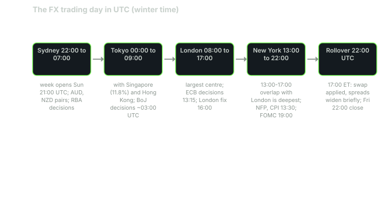

---
{
  "title": "The Sessions: Sydney, Tokyo, London, New York and the Overlaps",
  "duration": "15 min",
  "free": false,
  "status": "published",
  "quiz": [
    {"q": "When does the retail FX trading week open and close, in New York time?", "opts": ["Monday 09:30 to Friday 16:00", "Sunday 17:00 to Friday 17:00", "Monday 00:00 to Friday 23:59", "Sunday 22:00 to Friday 22:00"], "correct": 1, "explain": "The week opens with Sydney and Wellington on Sunday afternoon New York time and closes with New York on Friday; tastyfx quotes 16:00 ET Sunday to 16:59 ET Friday."},
    {"q": "Which two sessions overlap for roughly four hours, and why does that matter?", "opts": ["Sydney and Tokyo; it is when the yen is most active", "London and New York; the two largest dealing centres are both open, so depth is greatest and spreads narrowest", "Tokyo and London; it is when European data is released", "New York and Sydney; it is when Australian data is released"], "correct": 1, "explain": "London and New York together handle the bulk of dealing, and their overlap, roughly 13:00 to 17:00 UTC in winter, is when liquidity is deepest."},
    {"q": "At what time is the daily rollover applied by most retail brokers?", "opts": ["Midnight UTC", "17:00 New York time", "08:00 London time", "09:00 Tokyo time"], "correct": 1, "explain": "The FX 'day' ends at 17:00 New York time; positions open at that moment are rolled and swap is applied. Spreads often widen briefly around it."},
    {"q": "Why is a 'daily bar' in FX less well defined than in equities?", "opts": ["Because FX has no daily bars", "Because there is no exchange close; each data vendor cuts the 24-hour day at its own time, so bars and gaps differ between sources", "Because FX bars only exist for the London session", "Because volume is missing"], "correct": 1, "explain": "The market never closes during the week. Yahoo, your broker and the ECB fix all cut the day at different times, which changes the open, close and apparent gaps."},
    {"q": "On 2026-09-18, the day the Bank of Japan raised its policy rate, USD/JPY's daily range was 187.8 pips against a median of 66.9 pips on non-event days in 2026. During which session did the announcement fall?", "opts": ["New York afternoon", "London afternoon", "Tokyo session, around 03:00 to 04:00 UTC", "Sydney open"], "correct": 2, "explain": "BoJ decisions are published around midday Tokyo time, which is the Tokyo session and before London opens. Volatility follows the calendar, not just the clock."}
  ],
  "task": "For one week, note EUR/USD's spread and one-hour range at 03:00, 09:00, 14:00 and 21:00 UTC each day, and mark which session each time belongs to."
}
---

## A day with no close

Equities have an opening bell. Currencies have a sunrise. The market opens when Wellington and Sydney banks start quoting on Monday morning local time, which is Sunday afternoon in New York, and it closes when New York banks stop on Friday afternoon. In between, it never stops; it moves from one financial centre to the next as the earth turns. tastyfx's product details state its trading hours as 4:00 p.m. ET Sunday to 4:59 p.m. ET Friday for all pairs except a few emerging-market ones, and that is typical.

The consequence is that "the market" at any moment is really whichever centres are awake. The BIS survey (lesson 1) found that sales desks in the UK, the US, Singapore and Hong Kong handled 75% of April 2025 turnover. When London and New York are both open, most of the world's dealing capacity is online at once. When only Sydney is open, a fraction of it is.

## The four sessions

Times below are in UTC for winter (standard time). During daylight saving, the London and New York sessions shift one hour earlier in UTC; Sydney shifts one hour later in UTC during its summer (October to April), and Tokyo does not observe daylight saving.

**Sydney (about 22:00 to 07:00 UTC).** Wellington opens slightly earlier. This is the thinnest part of the week's trading, especially the first hours after the Sunday open, when weekend news is priced in a market with few participants. AUD and NZD pairs are most active here; Australian data (employment, CPI) and the Reserve Bank of Australia's decisions land in this session.

**Tokyo (00:00 to 09:00 UTC).** Japan is the third largest trading currency (16.8% of turnover in 2025) and the Tokyo session sets the tone for yen pairs. Singapore and Hong Kong, which together are the third and fourth largest dealing centres, run alongside it, so "Asian session" is a better label. Bank of Japan decisions are published around midday Tokyo time; the Chinese renminbi fix is set at 09:15 Beijing time (01:15 UTC).

**London (08:00 to 17:00 UTC).** The largest centre. The first hour after 08:00 UTC, when European desks arrive and overnight Asian positions are re-evaluated, is the first burst of the day's volatility in the European pairs. European data (eurozone PMIs and inflation, UK employment and CPI) is released between 07:00 and 10:00 UTC; the ECB's reference rates are fixed around 13:15 UTC (14:15 CET), and ECB decisions are published at 13:15 UTC on meeting days.

**New York (13:00 to 22:00 UTC).** The second largest centre. The most important scheduled US releases, non-farm payrolls and CPI, are published at 08:30 ET (13:30 UTC in winter, 12:30 UTC in summer), squarely in the London-New York overlap. FOMC statements are released at 14:00 ET, after London has closed. The WM/Refinitiv 4 p.m. London fix, at 16:00 UTC in winter, is a benchmark that funds trade around and produces a visible burst of activity. At 17:00 ET the trading day ends, swaps are applied, and the calendar date rolls.

## The overlaps

**Tokyo and London (08:00 to 09:00 UTC).** Short and busy in yen and European pairs.

**London and New York (13:00 to 17:00 UTC).** This is the core of the trading day. Both of the two largest centres are open, the main US releases are inside it, and the London fix is at its end. Spreads in the majors are at their tightest, and depth is greatest. IG's EUR/USD page says as much, recommending "between 1pm and 4pm UK time" as the period with the most liquidity and tightest spreads.

After 17:00 UTC, London has gone home, New York winds down, and the market thins into the rollover and the Sydney open. Between about 21:00 and 23:00 UTC, some brokers widen spreads for a few minutes around their 17:00 ET rollover, and stops placed just outside a range are vulnerable to being clipped by a wide quote rather than by real trading.

## Worked example

Map the events of one week onto the clock, using the actual timestamps of the 2026-09-14 week.

- **Wednesday 2026-09-16, 14:00 ET (18:00 UTC).** The FOMC raised the federal funds target range by 25 basis points to 3.75% to 4.00%. This fell in the New York afternoon, after London's close. Yahoo Finance's daily EUR/USD bar labelled 2026-09-16 closed at 1.1538, and the bar labelled 2026-09-17 opened at 1.1468, a 70-pip gap between consecutive daily bars. There was no gap in the market; the vendor's daily bar simply ended before the New York afternoon repriced the pair. The ECB's fixes tell the same story at a different cut: 1.1537 on the 16th (fixed at 13:15 UTC, before the decision) and 1.1481 on the 17th.
- **Thursday 2026-09-17.** USD/JPY's daily range was 93.3 pips, the market digesting the Fed and positioning for Tokyo the next morning.
- **Friday 2026-09-18, around 03:00 to 04:00 UTC.** The Bank of Japan raised its guideline for the uncollateralised overnight call rate to around 1.25%. USD/JPY's daily range that day was 187.8 pips (Yahoo daily bar: open 156.16, high 158.00, low 156.12, close 156.13), against a median of 66.9 pips on non-event days in 2026. The entire move happened inside the Tokyo session while London and New York slept.
- **Wednesday 2026-09-23, 13:15 UTC.** The ECB fixed EUR/USD at 1.1411 and USD/JPY at 157.92, the rates this course uses as its reference.

Two lessons. Volatility follows the calendar as much as the clock: the biggest yen move of the week happened in the "quiet" Asian session because that is where the BoJ lives. And every "daily" number depends on where the day was cut: the same week produces different opens, closes and gaps on Yahoo, at your broker, and in the ECB's fix. When you backtest, know which cut you are using.

This lesson does not include a measured hour-by-hour range chart. Yahoo's hourly endpoint rate-limited every attempt while the course was written on 2026-09-24, and the course does not print numbers it could not source. Measuring it yourself is this lesson's task and lesson 10 tells you how to keep the record.

*Figure 4. The 24-hour FX clock in UTC (winter time). Session hours are the conventional banking hours of each centre; centre shares are from the BIS Triennial Survey, April 2025; rollover time from tastyfx product details.*

## Table

| Session | Approx. hours (UTC, winter) | Overlaps | Most active pairs | Scheduled events inside it |
| --- | --- | --- | --- | --- |
| Sydney / Wellington | 22:00 to 07:00 | Tokyo from 00:00 | AUD, NZD pairs | RBA and RBNZ decisions, Australian CPI and employment |
| Tokyo (with Singapore, Hong Kong) | 00:00 to 09:00 | Sydney until 07:00; London 08:00 to 09:00 | JPY pairs, AUD/JPY, USD/CNH | BoJ decisions around midday Tokyo, CNY fix 01:15 UTC |
| London | 08:00 to 17:00 | Tokyo 08:00 to 09:00; New York 13:00 to 17:00 | EUR, GBP, CHF pairs and everything else | Eurozone and UK data 07:00 to 10:00; ECB decisions 13:15; London fix 16:00 |
| New York | 13:00 to 22:00 | London until 17:00 | USD pairs, USD/CAD, USD/MXN | NFP and CPI 13:30; FOMC 19:00; rollover 22:00 (17:00 ET) |

## What to do with this

Trade the pair in the session where its natural participants are awake. Trade the majors in the London-New York overlap if you want the narrowest spreads. Do not leave resting stops just outside a range across the 17:00 ET rollover or the Sunday open unless you have priced in a wide quote. And when you see a large "gap" on a daily chart, check the timestamp before concluding that the market jumped; often the vendor's day ended at the wrong moment.

## Sources

- Bank for International Settlements, "OTC foreign exchange turnover in April 2025" (currency and centre shares): https://www.bis.org/statistics/rpfx25_fx.htm
- Board of Governors of the Federal Reserve System, FOMC statement, 16 September 2026: https://www.federalreserve.gov/newsevents/pressreleases/monetary20260916a.htm
- Bank of Japan, "Change in the Guideline for Money Market Operations", 18 September 2026: https://www.boj.or.jp/en/mopo/mpmdeci/mpr_2026/k260918a.pdf
- tastyfx, forex product details (trading hours, rollover): https://www.tastyfx.com/help-and-support/product-details/what-are-tastyfxs-forex-product-details/
