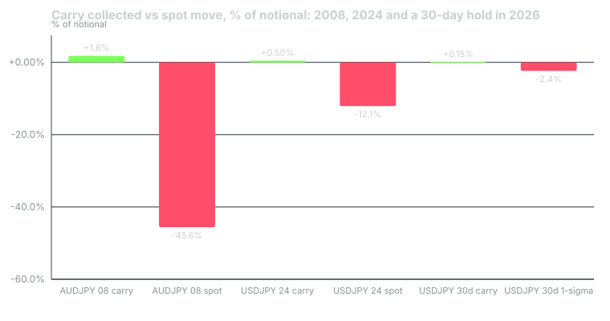

---
{
  "title": "The Carry Trade: Interest Differentials, Swap Points, Why Carry Pays and How It Crashes",
  "duration": "18 min",
  "free": false,
  "status": "published",
  "quiz": [
    {"q": "OANDA TMS Brokers' swap table valid 2026-09-21 to 2026-09-27 quoted long USD/JPY at +1.81% per year. What does one standard lot earn over a 30-day hold, ignoring compounding?", "opts": ["$18.10", "$148.77", "$1,810", "$4.96"], "correct": 1, "explain": "$100,000 × 0.0181 × 30/365 = $148.77."},
    {"q": "At a pip value of $6.33, how many pips does USD/JPY have to fall to erase that 30-day swap credit?", "opts": ["About 2 pips", "About 24 pips", "About 148 pips", "About 1,000 pips"], "correct": 1, "explain": "$148.77 / $6.33 = 23.5 pips, less than a third of the pair's median daily range."},
    {"q": "Between the ECB fixes of 2008-07-21 and 2008-10-27, AUD/JPY fell from 104.34 to 56.75. Roughly how much carry would a long position have collected over that period at a 6.75-point rate differential?", "opts": ["About 45%", "About 18%", "About 1.8%", "About 0.18%"], "correct": 2, "explain": "6.75% × 98/365 = 1.8%. The spot loss was 45.6%, twenty-five times the carry."},
    {"q": "Why is the same swap table's short USD/JPY figure (−3.71%) not simply the negative of the long figure (+1.81%)?", "opts": ["Because the yen is a major currency", "Because the broker adds a financing spread on both sides; the parity differential sits between the two quotes", "Because short positions are riskier", "Because of the triple-swap Wednesday"], "correct": 1, "explain": "Interest parity at the 2026-09-23 rates implies about +2.6% for long and −2.6% for short. The broker pays less than that to longs and charges more than that to shorts."},
    {"q": "Which statistical property of carry-trade returns do Brunnermeier, Nagel and Pedersen document?", "opts": ["Positive skew: small losses, occasional large gains", "Negative skew: steady gains, occasional large losses, as trades unwind when funding liquidity dries up", "Zero skew", "Returns are unrelated to interest differentials"], "correct": 1, "explain": "The paper's central finding is that high-minus-low-rate currency returns are negatively skewed because carry trades unwind rapidly when risk appetite and funding liquidity fall."}
  ],
  "task": "Copy your broker's current long and short swap for USD/JPY and AUD/JPY into your notes, convert each to dollars per lot per day, and compute the pip move that would cancel a week of carry."
}
---

## Carry in one sentence

Hold the currency that pays the higher interest rate, fund it with the one that pays less, and collect the difference every day the position stays open. That is the carry trade. It is the largest and oldest strategy in the currency market, it is what your broker's overnight swap is pricing, and it is the reason a position that "did nothing" can quietly make or lose money.

It also has a well-documented failure mode. Lesson 6 showed that interest parity fixes the forward rate; it does not fix the spot rate, and spot can move in a day by more than a year of carry. This lesson prices the carry with a broker's published numbers and then examines the two crashes every carry trader should know by date.

## Swaps and rollover points

Your retail position is a rolling spot contract. At 17:00 New York time every trading day, the broker closes it and reopens it for the next value date, and in doing so applies the interest differential for one day (three days on the day the weekend is rolled, conventionally Wednesday). The amount is quoted as a swap or rollover: in pips, in currency per lot, or as an annual percentage of notional. It is derived from the tom-next (tomorrow-next) rate in the interbank market, which itself reflects the two currencies' short-term rates and expectations of change, plus the broker's markup. tastyfx describes its charge as "the tom-next rate plus a small admin fee" not exceeding 0.8% per year.

Swap can be a credit or a debit. Long the higher-rate currency, you receive; long the lower-rate currency, you pay. Because the broker's spread sits on both sides, the credit you receive is smaller than the debit you would pay on the opposite position.

## Worked example

OANDA TMS Brokers S.A. publishes a weekly swap table in percentage points per year. The table valid 2026-09-21 to 2026-09-27 lists, among others:

| Instrument | Long swap | Short swap |
| --- | --- | --- |
| USDJPY | +1.81% | −3.71% |
| AUDJPY | +2.29% | −4.17% |
| EURUSD | −2.36% | +0.40% |
| USDCHF | +2.80% | −4.69% |
| USDZAR | −5.39% | +0.55% |
| USDTRY | −46.61% | +16.45% |

**Step 1: price a 30-day long USD/JPY.** One standard lot is $100,000 of notional (the base is the dollar). Swap = $100,000 × 0.0181 × 30 ÷ 365 = **$148.77** credited over 30 days, about $4.96 per day (with the Wednesday triple, the daily pattern is lumpier but the monthly total is the same).

**Step 2: compare with parity.** Lesson 6 computed the one-month CIP forward for USD/JPY at the 2026-09-23 rates as 34.4 pips below spot, which is 34.4 × $6.33 = $217.75 per lot per 30 days, or 2.6% per year. The broker pays 1.81%. The 0.8-point difference is its financing spread on the long side; on the short side it charges 3.71% against a parity cost of about 2.6%, a 1.1-point spread. The midpoint of the broker's two quotes, −0.95%, is not parity; both sides of the table are shaded against you.

**Step 3: what spot move cancels it.** Pip value per lot at 157.92 is $6.33. $148.77 ÷ $6.33 = **23.5 pips**. USD/JPY's median daily range over the year to 2026-09-24 was 76.5 pips (Yahoo daily bars). A month of carry is about a third of one ordinary day. Using the ECB-derived daily standard deviation of 0.512%, a one-sigma move over 21 trading days is 0.512% × √21 = 2.35%, or 371 pips at 157.92, which is 16 times the monthly carry.

**Step 4: the exotic.** Long USD/TRY would cost 46.61% per year: on one lot, $100,000 × 0.4661 × 30/365 = $3,831 per month. Short USD/TRY receives 16.45%, $1,352 per month, against a pair that rose 17.9% in the year to 2026-09-23. The swap table is telling you what the market expects of the lira, and it is not kind.

## Why carry pays

If forward rates are unbiased predictors of future spot, carry should earn nothing: the high-rate currency should depreciate by exactly the differential. Historically it has not, on average; high-rate currencies have tended to depreciate by less than the differential or even to appreciate, which is the "forward premium puzzle". The best-supported explanation is that carry returns are compensation for bearing crash risk. Brunnermeier, Nagel and Pedersen (NBER Working Paper 14473, 2008) document that returns to being long high-rate currencies against low-rate currencies are negatively skewed: many small gains, occasional large losses, and the losses arrive precisely when risk appetite and funding liquidity fall, because leveraged carry positions are unwound together. Carry is a strategy that sells insurance against global deleveraging.

## How it crashes: 2008

Through mid-2008 the Reserve Bank of Australia's cash rate was 7.25% and the Bank of Japan's policy rate was 0.5%. Long AUD/JPY paid about 6.75 percentage points a year. On 2008-07-21 the ECB's reference rates put AUD/JPY at 104.34. Then the financial crisis deleveraged everything at once. By 2008-10-27 the pair was at 56.75, a fall of 45.6%. Carry collected over those 98 days: 6.75% × 98/365 = 1.8%. The RBA cut to 7.00% on 2008-09-03 and to 6.00% on 2008-10-08, so the actual carry was slightly less. A trader at 10:1 leverage lost the account several times over; a trader at 2:1 lost most of it.

## How it crashes: 2024

The setup was the cleanest carry in a generation: the Fed's target range at 5.25% to 5.50% against a BoJ policy rate of 0.10%, a differential above 5 points, and USD/JPY at 161.91 on 2024-07-03 (ECB fix). Japan's Ministry of Finance had already intervened to sell dollars in late April and May and did so again on 2024-07-11 and 12, when the fix dropped from 161.58 to 158.74. On 2024-07-31 the BoJ raised its rate to around 0.25%. On 2024-08-02, weak US payrolls raised expectations of Fed cuts. On Monday 2024-08-05 the fix printed 142.24, a fall of 12.1% from the July peak, most of it in the final three sessions; the Nikkei fell 12% that day and the VIX spiked. The BIS's post-mortem (Bulletin 90, 27 August 2024) estimated yen-funded carry positions at roughly ¥40 trillion, about $250 billion, going into the event, and described it as "yet another example of volatility exacerbated by procyclical deleveraging and margin increases." Carry collected from the peak to the trough: about 5.2% × 33/365 = 0.5%.

## Chart

*Figure 5. Carry versus spot for three long positions. 2008 and 2024 spot changes from ECB reference rates; carry from RBA, BoJ and Federal Reserve policy rates over the stated windows; the 2026 case uses OANDA TMS Brokers' published long USD/JPY swap of +1.81% per year and a one-sigma 30-day move from ECB-derived daily volatility.*

## What a retail carry trade has to do

Carry earns pennies daily and loses dollars suddenly, so the position must be sized for the sudden part. Three rules:

1. **Size for the crash, not the carry.** Use the daily volatility and a multi-day adverse move to set the stop and the lots (lesson 11); a 24-pip monthly credit is not a reason to hold through a 371-pip month.
2. **Watch the funding currency's central bank.** Both crashes accelerated when the low-rate side moved: the BoJ hiked in July 2024 and again in 2026. A carry trade is a short position in the funding currency's rate expectations.
3. **Watch risk appetite, not just rates.** AUD/JPY fell 45.6% in 2008 with no BoJ hike at all. Equity volatility, credit spreads and the yen itself are the tells, and they move together.

## Sources

- OANDA TMS Brokers S.A., swap points table valid 2026-09-21 to 2026-09-27: https://www.oanda.com/eu-en/document/91
- Bank for International Settlements, BIS Bulletin No. 90, "The market turbulence and carry trade unwind of August 2024", 27 August 2024: https://www.bis.org/publ/bisbull90.htm
- Brunnermeier, Nagel and Pedersen, "Carry Trades and Currency Crashes", NBER Working Paper 14473: https://www.nber.org/papers/w14473
- European Central Bank, euro foreign exchange reference rates (2008 and 2024 series): https://www.ecb.europa.eu/stats/policy_and_exchange_rates/euro_reference_exchange_rates/html/index.en.html
