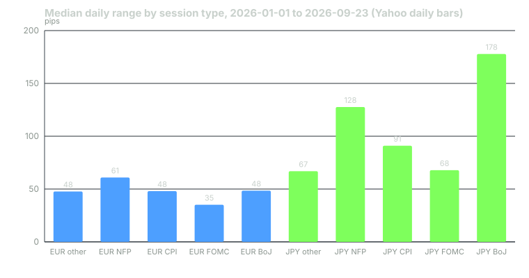

---
{
  "title": "Central Banks and the Calendar: FOMC, ECB, BoJ, NFP, CPI and Spike Risk",
  "duration": "17 min",
  "free": false,
  "status": "published",
  "quiz": [
    {"q": "At what time are US non-farm payrolls and CPI released?", "opts": ["08:30 ET on the scheduled day", "14:00 ET on the scheduled day", "Midnight UTC", "09:30 ET, at the equity open"], "correct": 0, "explain": "The BLS schedules both at 08:30 AM Eastern, which is inside the London-New York overlap."},
    {"q": "In 2026 through 23 September, USD/JPY's median daily range on BoJ decision days was 177.8 pips against 66.9 pips on non-event days. What is the ratio?", "opts": ["About 1.3 times", "About 2.7 times", "About 5 times", "About 10 times"], "correct": 1, "explain": "177.8 / 66.9 = 2.66. The decision that matters most for a pair is its own central bank's."},
    {"q": "Yahoo's daily EUR/USD bars show a below-median range on 2026 FOMC days (35.1 pips) and a 70-pip gap to the next bar on 17 September. Why?", "opts": ["The FOMC does not move EUR/USD", "The vendor's daily bar ends before the 14:00 ET statement, so the move lands in the next bar and appears as a gap", "The market was closed", "Spreads were zero"], "correct": 1, "explain": "A 24-hour market cut at the wrong time hides the event inside the following bar. Measure event moves on intraday data or at fixes that fall after the release."},
    {"q": "What happens to a stop-loss order placed 15 pips from the market in the seconds around a payrolls release?", "opts": ["It is guaranteed at its price", "It is a market order once touched and fills at the next available price, which may be many pips worse as spreads widen", "It is cancelled", "It converts to a limit order"], "correct": 1, "explain": "Ordinary stops are not guaranteed. Around releases, spreads widen and quotes jump, so the fill can be far from the trigger."},
    {"q": "Which of these is the correct sequence of the September 2026 events used in this lesson?", "opts": ["FOMC hike, then NFP, then CPI, then BoJ hike", "NFP (4 Sep), CPI (11 Sep), FOMC hike (16 Sep), BoJ hike (18 Sep)", "BoJ hike, then FOMC, then CPI", "CPI, NFP, BoJ, FOMC"], "correct": 1, "explain": "Payrolls 4 September, CPI 11 September, the Fed's quarter-point rise on the 16th and the BoJ's on the 18th."}
  ],
  "task": "Build a calendar for the next four weeks with every FOMC, ECB, BoJ, BoE, RBA decision and every US NFP and CPI release, with the time converted to your local zone."
}
---

## Scheduled volatility

Most of what moves a currency in a given week is scheduled. The central bank that sets its rate announces on published dates; the statistics agency that measures its inflation and employment publishes on published dates; the times are fixed to the minute. A trader who does not know the calendar is not being surprised by the market; they are being surprised by a timetable.

This lesson lists the timetable for 2026, measures what the events did to daily ranges, and explains the mechanics of the spike: why spreads widen, why stops fill badly, and what to do about it.

## The calendar for 2026

**Federal Open Market Committee.** Eight meetings a year; the statement is released at 14:00 ET on the second day, followed by a press conference. The 2026 dates are 27-28 January, 17-18 March, 28-29 April, 16-17 June, 28-29 July, 15-16 September, 27-28 October and 8-9 December; the March, June, September and December meetings include the Summary of Economic Projections. On 16 September 2026 the Committee raised the target range by 25 basis points to 3.75% to 4.00%.

**European Central Bank.** Monetary policy meetings every six weeks; the decision is published at 14:15 CET. The key ECB interest rates page shows the deposit facility rate at 2.25% with effect from 17 June 2026 and 2.50% with effect from 16 September 2026 (decision of 10 September).

**Bank of Japan.** Eight meetings; the statement is published around midday Tokyo time on the second day, with no fixed minute. 2026 statements are dated 23 January, 19 March, 28 April, 16 June, 31 July and 18 September. The June meeting moved the overnight call rate guideline to around 1.0% and the September meeting to around 1.25%.

**US non-farm payrolls (Employment Situation).** Bureau of Labor Statistics, 08:30 ET, usually the first Friday. 2026 dates: 9 January, 11 February, 6 March, 3 April, 8 May, 5 June, 2 July, 7 August, 4 September, 2 October, 6 November, 4 December.

**US CPI.** BLS, 08:30 ET. 2026 dates: 13 January, 13 February, 11 March, 10 April, 12 May, 10 June, 14 July, 12 August, 11 September, 14 October, 10 November, 10 December.

Add the Bank of England, the Reserve Bank of Australia (cash rate 4.35% since 6 May 2026), the Bank of Canada, the Swiss National Bank and the Reserve Bank of New Zealand for their currencies, and the eurozone flash CPI and PMIs for the euro. Every one of these publishes a calendar a year ahead.

## Worked example

Measure what the events did. Yahoo Finance's daily bars for EUR/USD and USD/JPY, pulled on 2026-09-24, give a high-to-low range for every session from 1 January to 23 September 2026 (189 sessions). Sort the sessions by which scheduled event, if any, fell on them and take the median range in pips:

| Session type (2026) | Sessions | EUR/USD median range | USD/JPY median range |
| --- | --- | --- | --- |
| No scheduled major event | 158 | 47.7 pips | 66.9 pips |
| NFP day | 9 | 60.9 | 127.6 |
| CPI day | 9 | 48.0 | 91.0 |
| FOMC day | 6 | 35.1 | 67.8 |
| BoJ day | 6 | 48.5 | 177.8 |

Three findings.

**First, the effect is pair-specific.** BoJ days were 2.7 times an ordinary day in USD/JPY (177.8 ÷ 66.9) and nothing at all in EUR/USD (48.5 versus 47.7). NFP days were 1.9 times normal in USD/JPY and 1.3 times in EUR/USD. The pair reacts to its own central bank and to US data; it does not much react to someone else's central bank.

**Second, the measurement depends on where the day is cut.** FOMC days show a *below*-median range in EUR/USD (35.1 pips). That is not because the Fed does not move the euro. The statement is released at 14:00 ET, and Yahoo's daily FX bar ends before that. The move lands in the next bar: on 16 September 2026 the EUR/USD bar closed at 1.1538 and the 17 September bar opened at 1.1468, a 70-pip jump between bars that no single bar's range records. The ECB fix, taken at 14:15 CET before the release, shows 1.1537 on the 16th and 1.1481 on the 17th. If you backtest an "FOMC-day breakout" on vendor daily bars you will conclude the FOMC is quiet. It is not; your bars are.

**Third, the individual days are wilder than the medians.** On the September sequence: payrolls on 4 September gave USD/JPY a 139.4-pip range and EUR/USD 45.5; CPI on 11 September, 127.4 and 48.0; the Fed's hike on 16 September, 56.9 and 24.8 inside the bar plus the 70-pip jump to the next; the BoJ's hike on 18 September, 187.8 and 38.8. On the BoJ day USD/JPY opened at 156.16, traded to 158.00 and closed at 156.13: a 188-pip round trip that ended where it started. A 40-pip stop in USD/JPY on that day was a coin flip against the noise, in either direction, regardless of the direction you had right.

## Chart

*Figure 6. Median daily high-to-low range by session type, 1 January to 23 September 2026. Yahoo Finance daily bars pulled 2026-09-24; event dates from the Federal Reserve, BLS and Bank of Japan calendars. FOMC-day EUR/USD reads low because the vendor's bar closes before the 14:00 ET statement.*

## The mechanics of a spike

In the seconds around a release, three things happen at once. Dealers pull or widen their quotes, because they do not want to be picked off by the first algorithms to parse the number; a 0.8-pip EUR/USD spread can become 5 or 10 pips. The price jumps between successive quotes rather than trading through every level. And every resting stop inside the jump becomes a market order simultaneously.

A stop-loss order is an instruction to sell at market once a price is touched. It is not a guarantee of that price. When the market jumps 40 pips through your 15-pip stop, you are filled at the first price the dealer quotes after the jump, which can be 40 pips or more from your trigger, at a widened spread. Some brokers sell guaranteed stops for a premium; ordinary stops are not.

Two other effects. Slippage is symmetric in principle but not in practice: limit orders to enter are often not filled on the favourable side of a jump, while stops on the unfavourable side always are. And the first move is frequently reversed within minutes, as the 18 September USD/JPY round trip shows, which means a stop hit in the spike converts a temporary excursion into a permanent loss.

## What to do

- Know the times. The calendar above is the minimum; keep it in your own time zone.
- Do not carry a tight stop through a release in the pair the release concerns. Either widen the stop to the event's typical range and size down to keep the dollar risk constant, or be flat.
- Do not enter in the first minutes after a release unless your plan is specifically an event plan, tested on intraday data that includes the spread at the time.
- Measure events with data that can see them: intraday bars, or fixes that fall after the release. Vendor daily bars will lie to you about the FOMC.
- Expect the pair's own central bank to be the biggest scheduled risk. For USD/JPY that is the BoJ, in the Asian session, when you may be asleep.

## Sources

- Board of Governors of the Federal Reserve System, FOMC meeting calendars: https://www.federalreserve.gov/monetarypolicy/fomccalendars.htm
- Bureau of Labor Statistics, Employment Situation release schedule: https://www.bls.gov/schedule/news_release/empsit.htm
- Bureau of Labor Statistics, Consumer Price Index release schedule: https://www.bls.gov/schedule/news_release/cpi.htm
- Bank of Japan, Statements on Monetary Policy 2026 (ECB effective dates are from the key ECB interest rates page cited in lesson 6): https://www.boj.or.jp/en/mopo/mpmdeci/state_2026/index.htm
