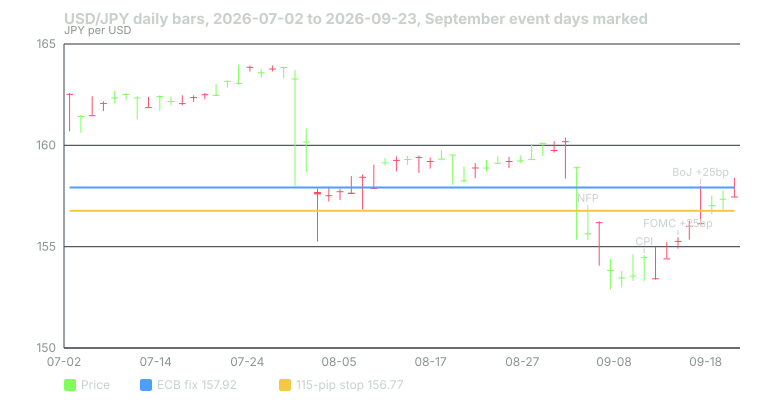

---
{
  "title": "Technical Analysis in FX: What Carries Over From Equities and What Does Not",
  "duration": "16 min",
  "free": false,
  "status": "published",
  "quiz": [
    {"q": "Why is there no true volume on a spot FX chart?", "opts": ["Because FX does not trade", "Because there is no exchange or consolidated tape; each platform sees only its own flow, so 'volume' is that venue's tick count or its own trades", "Because regulators forbid publishing it", "Because volume is only reported monthly"], "correct": 1, "explain": "Lesson 1's structure: bilateral, over the counter. The BIS survey is the only comprehensive count and it is triennial."},
    {"q": "Yahoo's daily USD/JPY bar for 2026-09-18 opened at 156.16, made a high of 158.00 and closed at 156.13. What does this bar's shape tell you?", "opts": ["The market closed higher", "A 188-pip excursion during the BoJ decision was fully reversed by the bar's close", "Nothing; daily bars are unreliable", "The trend is up"], "correct": 1, "explain": "A long upper wick with the close at the open is a round trip. Any stop inside the wick was hit; any thesis about direction was irrelevant."},
    {"q": "USD/JPY's median daily range over the year to 2026-09-24 was 76.5 pips. What is the issue with a 25-pip stop on a daily-chart trade?", "opts": ["It is too wide", "It is inside one-third of an ordinary day's noise and will be hit by random movement rather than by the thesis failing", "Stops should always be 25 pips", "There is no issue"], "correct": 1, "explain": "A stop narrower than the instrument's typical range measures noise, not the trade. Size the stop from measured range and then size the lots from the stop."},
    {"q": "Why do daily FX bars from two vendors show different opens, closes and gaps for the same day?", "opts": ["One vendor is wrong", "The market never closes during the week, so each vendor cuts the 24-hour day at its own time", "FX prices differ by country", "One uses pips and one uses pipettes"], "correct": 1, "explain": "There is no session close to anchor to. Cut times of 17:00 New York, midnight UTC and midnight London all produce legitimate but different daily bars."},
    {"q": "Which of these equity-chart techniques transfers to FX with the least modification?", "opts": ["Volume-weighted average price", "On-balance volume", "Range-based volatility measures such as average true range and support and resistance levels", "Earnings-gap patterns"], "correct": 2, "explain": "Anything built from price alone carries over. Anything built from volume needs a proxy and a health warning; earnings do not exist."}
  ],
  "task": "Compute the 20-day median daily range for the pair you trade and rewrite your current stop rule as a multiple of it."
}
---

## Price is the same; the tape is not

The tools of chart reading were built on exchange-traded stocks: one venue, one open, one close, one tape of every trade. Currencies give you the price and take away the rest. What survives the move is everything that is computed from price alone. What does not survive is everything that assumes a session or a volume count. This lesson goes through both lists and then does the one piece of technical work that this course insists on: setting a stop from measured range.

## What carries over

**Support, resistance and prior extremes.** Levels where price reversed before are watched by the same people in FX as in equities, with one addition: round numbers and option strikes matter more, because a large part of the market's order flow comes from corporate hedgers and option books that are placed at round levels. USD/JPY at 160 in 2024 was such a level, defended by Japan's Ministry of Finance rather than by chart traders; the ECB's fixes show 161.91 on 2024-07-03 as the peak before intervention and the BoJ's July hike brought it down.

**Trend measures.** Moving averages, channels and higher-highs-higher-lows are price-only and transfer directly. FX trends have a macro engine behind them (lesson 6), so a trend that coincides with a widening rate differential has a reason to persist; USD/TRY's 17.9% rise in the year to 2026-09-23 with almost no daily volatility is the extreme case.

**Range-based volatility.** Average true range, daily high-minus-low, and standard deviation of returns all transfer, and they are the most useful tools in the box because they size stops. The rest of this lesson is about them.

**Multi-timeframe reading.** Works the same, with the caveat below about where the daily bar is cut.

## What does not carry over

**Volume.** There is no consolidated tape. Your platform's "volume" is its own tick count or its own client flow, which is a fraction of a percent of the $9.6 trillion the BIS counted per day. Tick volume does correlate with activity, so it can flag when the market is awake versus asleep (lesson 5), but on-balance volume, volume-weighted average price and any "confirmation by volume" rule are measuring your broker, not the market. Futures on the CME (6E for the euro, 6J for the yen) have real exchange volume and are the usual substitute for those who need it.

**The daily bar.** Equity daily bars are anchored by the open and close. FX has neither during the week. Yahoo Finance's daily bars, used in this course, cut the day at a time that falls before the 14:00 ET FOMC statement, which is why lesson 9 found FOMC days quiet on Yahoo's bars and a 70-pip gap between the 16 and 17 September 2026 EUR/USD bars. A broker whose day ends at 17:00 ET will show the same move inside the 16 September bar with no gap. The ECB's 14:15 CET fix is a third cut. None is wrong; a rule tested on one cut will not reproduce on another.

**Gaps.** True gaps in FX are weekend gaps, from the Friday close to the Sunday open, plus the occasional intraday jump at a release. A weekday "gap" on a daily chart is usually the vendor's cut, not the market. Gap-fill statistics from equities, where every morning has a gap, do not apply.

**Earnings and corporate events.** Nothing corresponds. The scheduled events that matter are in lesson 9, and they cluster in particular sessions rather than before the open.

**Session patterns.** The equity U-shape of volume (heavy at the open and close, quiet at lunch) is replaced by the three-centre relay of lesson 5. "Opening range" means something different when there are three openings, and a breakout rule should say which one it means.

## Worked example

Set a stop for a USD/JPY position from measured range, then size the position from the stop.

**Step 1: measure.** From Yahoo Finance's daily USD/JPY bars for 2025-09-23 to 2026-09-23 (259 sessions, pulled 2026-09-24), the median high-to-low range was **76.5 pips** and the mean was 91.5 pips; the largest was 573.9 pips. From the ECB's daily reference rates over the same year, the standard deviation of daily log changes was 0.512%, which at 157.92 is 0.00512 × 157.92 = 0.81 yen, or **81 pips** for a one-sigma day. The two measures agree to within a few pips.

**Step 2: choose the multiple.** A stop for a trade meant to last several days should sit outside one ordinary day's noise. Take 1.5 times the median daily range: 1.5 × 76.5 = 114.75, call it **115 pips**. That is 1.4 one-sigma days. On the year's data, a day's range exceeded 115 pips on a minority of sessions, and every one of those in September 2026 was an event day (lesson 9: 139.4 on payrolls, 127.4 on CPI, 187.8 on the BoJ decision).

**Step 3: size from the stop.** Account $10,000, risk 1% = $100. Dollars per pip = $100 ÷ 115 = $0.870. Pip value per lot at 157.92 = ¥1,000 ÷ 157.92 = $6.332. Lots = 0.870 ÷ 6.332 = 0.137, rounded down to **0.13 lots** (13,000 dollars of notional). Check: 0.13 × $6.332 × 115 = $94.66, inside the budget. Leverage used: 13,000 ÷ 10,000 = 1.3:1.

**Step 4: check against the chart.** On the daily candles below, 115 pips covers every non-event bar in the last 60 sessions with room to spare and would still have been inside the 18 September wick. If your thesis cannot survive a BoJ day, the rule from lesson 9 applies: be flat, or widen to the event range and cut the lots to match.

Compare the alternative most beginners choose, a 25-pip stop "to keep risk small". Dollars per pip = $100 ÷ 25 = $4; lots = 0.63; notional $63,000; leverage 6.3:1. The dollar risk is the same $100, but the stop is inside a third of an ordinary day's range and will be hit by noise most days, so the strategy's win rate is now the probability that a random 25-pip wiggle does not happen first. The smaller stop did not reduce risk. It increased the number of times the risk is paid.

## Chart

*Figure 7. USD/JPY daily candles for the last 60 sessions to 2026-09-23 (Yahoo Finance daily bars, pulled 2026-09-24), with the ECB fix of 157.92 and the 115-pip stop level of 156.77 from the worked example drawn as horizontal lines for scale. Event dates from the BLS, Federal Reserve and Bank of Japan calendars. The 18 September wick is the BoJ decision.*

## Reading the chart with the right assumptions

Three habits keep FX charts honest. Know the cut: write the vendor's daily-bar boundary at the top of your notes and never mix bars from two vendors in one backtest. Know the session: a 30-pip range on a one-hour bar means something different at 03:00 UTC and at 14:00 UTC, and the same breakout rule will produce different statistics in each. Know the calendar: any bar that looks unusual should be checked against lesson 9's dates before you call it a pattern. The 18 September wick on the chart above is not a reversal signal; it is a rate decision.

## Sources

- European Central Bank, euro foreign exchange reference rates (daily history used for volatility): https://www.ecb.europa.eu/stats/policy_and_exchange_rates/euro_reference_exchange_rates/html/index.en.html
- Bank of Japan, Change in the Guideline for Money Market Operations, 18 September 2026: https://www.boj.or.jp/en/mopo/mpmdeci/mpr_2026/k260918a.pdf
- Board of Governors of the Federal Reserve System, FOMC statement, 16 September 2026: https://www.federalreserve.gov/newsevents/pressreleases/monetary20260916a.htm
- Bank for International Settlements, "OTC foreign exchange turnover in April 2025": https://www.bis.org/statistics/rpfx25_fx.htm
