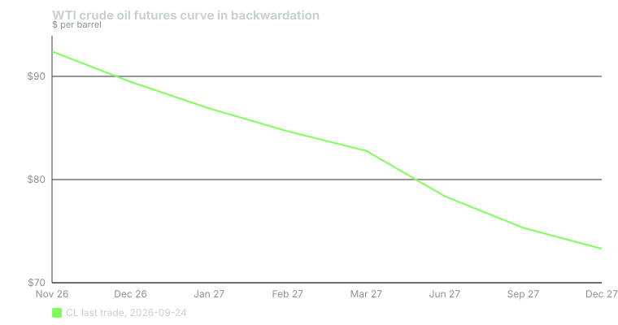

---
{
  "title": "Term Structure: Contango, Backwardation and Fair Value",
  "duration": "17 min",
  "free": false,
  "status": "published",
  "quiz": [
    {"q": "On 2026-09-24 WTI crude traded at $92.41 for Nov 2026 and $73.29 for Dec 2027. The curve is in:", "opts": ["Contango", "Backwardation", "Fair value", "A calendar squeeze"], "correct": 1, "explain": "Later months cheaper than nearer months is backwardation. Contango is the opposite: later months more expensive."},
    {"q": "For an equity index future, fair value above spot arises when:", "opts": ["The dividend yield exceeds the interest rate", "The interest rate exceeds the dividend yield", "The index is expected to rise", "Volatility is high"], "correct": 1, "explain": "Carrying the stocks costs financing (r) and earns dividends (q). The future trades at spot x (1 + (r - q) x T); with r > q the future sits above spot regardless of anyone's forecast."},
    {"q": "With ESZ26 at 7,772.50, r = 4.14%, q = 0.99% and 91 days to the March contract, the fair Dec-to-Mar spread is about:", "opts": ["6 points", "31 points", "61 points", "245 points"], "correct": 2, "explain": "7,772.50 x (0.0414 - 0.0099) x 91/365 = 61.0 index points. That is the carry for one quarter."},
    {"q": "Why did the observed ESZ26/ESH27 spread on Yahoo Finance (82.50 points) differ from the fair value of 61?", "opts": ["The market expects the S&P to rise 21 points", "The two last-trade prints were not simultaneous and the March contract had traded only 1,484 contracts", "Fair value ignores dividends", "The multiplier is different for March"], "correct": 1, "explain": "A last-trade in a thin back month can be hours old. Compare settlements or a live calendar-spread quote, never two stale prints."},
    {"q": "What does the futures price converge to at expiration?", "opts": ["The prior day's settlement", "The spot price of the underlying", "The initial margin", "The average price of the contract month"], "correct": 1, "explain": "At expiry there is no carry left, so the future equals spot; for ES it settles to the SOQ of the index. Convergence is what makes the term structure a statement about carry, not about direction."}
  ],
  "task": "Pull the last-trade prices for the next three ES contract months and compute the implied annualised carry between each pair; note which pair has enough volume to trust."
}
---

## One index, many prices

On any day there is one S&P 500 level and several ES prices: December, March, June, September and beyond. They differ, and the pattern of those differences across months is the **term structure**. For crude oil, with a contract every month, the term structure is a curve of a dozen points. For ES it is a handful of quarterly steps. Reading it tells you what it costs to hold exposure over time and where your roll (Lesson 6) will land.

Two words describe the shape. **Contango**: later months priced above nearer months, so the curve slopes up. **Backwardation**: later months priced below nearer months, sloping down. Neither word says anything about where the market is going. They describe the cost of carrying the underlying from now until then.

## Cost of carry

Imagine holding the underlying instead of the future. If you buy the 500 stocks in the index today and hold them to December, you tie up cash that could have earned the risk-free rate, and you collect dividends along the way. Someone who buys the December future instead keeps their cash in T-bills and forgoes the dividends. For the two routes to be equally attractive, which arbitrage forces, the future must trade above spot by the financing cost and below it by the dividends:

F = S x (1 + (r - q) x T)

where S is the spot index, r the risk-free rate, q the dividend yield of the index, and T the fraction of a year to expiration. (The continuous-compounding version F = S x e^((r-q)T) differs by a few hundredths of a point at these horizons.) The bracketed term is the **fair value premium**. When r > q the future sits above spot and the ES curve is in contango; when q > r it is in backwardation. The premium shrinks linearly as T falls and is zero at expiry, when the future equals spot. That is **convergence**, and for ES it is enforced by cash settlement to the SOQ.

Arbitrageurs keep ES within a point or two of fair value during regular hours: if the future is rich they sell it and buy the stocks; if cheap, the reverse. What they cannot do is remove the premium itself, because it is a real cost that someone has to bear.

## Physical commodities carry differently

For crude oil the "dividend" is replaced by storage cost (which pushes later months up) and the **convenience yield** of having barrels on hand today (which pushes later months down). When inventories are tight, the convenience yield is large and the curve backwardates: today's barrel is worth more than a promise of one next year. When storage fills, the curve goes into steep contango, and in April 2020 the May 2020 WTI contract settled at negative $37.63 on 2020-04-20 because holders could not take delivery. Lesson 8 returns to that episode. For now the lesson is that a commodity curve is a report on inventories; an index curve is a report on interest rates and dividends.

## Roll yield

Because the future converges to spot, a long position in a backwardated market gains the spread as time passes (the cheap deferred contract rises to meet spot), and a long in contango pays it. This is **roll yield**, and it is the dominant driver of returns for anyone who holds commodity futures for months. On 2026-09-24 the WTI front spread (Nov minus Dec) was $92.41 - $89.47 = $2.94 per barrel, about 3.2% of the front price in one month. A long who rolled Nov into Dec each month at those spreads would collect that carry if the curve held its shape; a short would pay it.

For ES the roll yield is simply minus the carry: a perpetual long pays r - q per year, about 3.15% at the rates below, in exchange for keeping cash in T-bills at 4.14%. Net, holding ES long instead of the stocks costs you the dividends you did not collect; there is no free leverage.

## Worked example

All inputs dated. On 2026-09-23 ESZ26 closed at 7,772.50 and ESH27 at 7,855.00 (Yahoo Finance daily bars; ESH27 traded 1,484 contracts that day against 1,342,461 for ESZ26). The 13-week Treasury bill coupon-equivalent yield was 4.14% on 2026-09-23 (U.S. Treasury daily bill rates). For the dividend yield use SPY's trailing four distributions: $1.993 (2025-12-19), $1.797 (2026-03-20), $1.904 (2026-06-18) and $1.889 (2026-09-18), total $7.583, against SPY's 2026-09-23 close of $767.81 (Yahoo Finance):

q = 7.583 / 767.81 = 0.00988 = 0.99%

ESZ26 expires 2026-12-18 and ESH27 on 2027-03-19; the gap is 91 days, T = 91/365 = 0.2493.

Fair spread, March over December:

7,772.50 x (0.0414 - 0.0099) x 0.2493 = 7,772.50 x 0.0315 x 0.2493 = 61.04 index points

So the fair ESH27 price, given ESZ26 at 7,772.50, is about 7,833.54. Rounded to the spread tick of 0.05, a fair quote is 61.05.

Observed last-trade spread: 7,855.00 - 7,772.50 = 82.50 points, 21.5 points above fair value. That is not an arbitrage. The March last trade was one of 1,484 prints scattered through a day on which ES ranged 7,758.75 to 7,843.25; it was almost certainly struck when December was trading higher. Two stale prints from different moments do not make a spread. To see the real spread, quote the ESZ26-ESH27 calendar spread on Globex, where it trades as a single instrument in 0.05 increments, or compare the two official settlements, which CME computes at the same instant.

Now check the arithmetic another way: the implied annual carry in the observed 82.50 would be 82.50 / 7,772.50 / 0.2493 = 4.26% per year, above the 4.14% bill rate, which would require a negative dividend yield. Impossible; so the print is stale. The fair 61.04 implies 3.15%, exactly r - q.

Finally, the crude curve on 2026-09-24 (Yahoo Finance last trades): Nov 26 $92.41, Dec 26 $89.47, Jan 27 $86.90, Feb 27 $84.68, Mar 27 $82.78, Jun 27 $78.38, Sep 27 $75.32, Dec 27 $73.29. Front-to-back drop: $19.12, or 20.7%, over 13 months. That is a deeply backwardated curve, consistent with tight inventories after a year in which the front contract had ranged from $54.98 (2025-12-16) to $119.48 (2026-03-09).

## Table

| Contract | Expiry | Days from 2026-12-18 | T (years) | Fair premium over ESZ26 (pts) | Fair price |
|---|---|---|---|---|---|
| ESZ26 | 2026-12-18 | 0 | 0 | 0.00 | 7,772.50 |
| ESH27 | 2027-03-19 | 91 | 0.2493 | 61.04 | 7,833.54 |
| ESM27 | 2027-06-18 | 182 | 0.4986 | 122.08 | 7,894.58 |
| ESU27 | 2027-09-17 | 273 | 0.7479 | 183.12 | 7,955.62 |

Fair premium = 7,772.50 x (0.0414 - 0.0099) x T, using the 13-week bill yield of 4.14% (Treasury, 2026-09-23) and a 0.99% trailing SPY dividend yield. The rate for longer horizons should really be the matching bill or SOFR term rate; the 26-week bill was 4.25% the same day, which would lift the June premium by about 2 points.

## Sources

- CME Group, E-mini S&P 500 contract specifications — https://www.cmegroup.com/markets/equities/sp/e-mini-sandp500.contractSpecs.html
- U.S. Department of the Treasury, Daily Treasury Bill Rates — https://home.treasury.gov/resource-center/data-chart-center/interest-rates/TextView?type=daily_treasury_bill_rates&field_tdr_date_value_month=202609
- CME Group, WTI Crude Oil contract specifications — https://www.cmegroup.com/markets/energy/crude-oil/light-sweet-crude.contractSpecs.html
- CFTC, "Economic Purpose of Futures Markets and How They Work" — https://www.cftc.gov/LearnAndProtect/AdvisoriesAndArticles/economicpurpose.html
