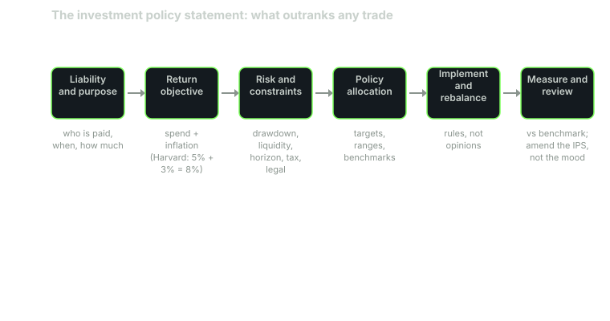

---
{
  "title": "The Investment Policy Statement",
  "duration": "17 min",
  "free": true,
  "status": "published",
  "quiz": [
    {
      "q": "What is the defining property of a well-written investment policy statement?",
      "opts": [
        "It lists the securities the portfolio will own",
        "It is rewritten whenever markets change direction",
        "It is kept private from the investment committee",
        "It outranks any individual trade, so a trade that violates it is wrong by definition"
      ],
      "correct": 3,
      "explain": "The IPS is the constitution of the portfolio: objectives, constraints and policy ranges. Trades are judged against it, not the other way round. Changing it requires a deliberate amendment, not a market move."
    },
    {
      "q": "Yale's policy limits illiquid assets (venture, buyouts, real estate, natural resources) to 50% of the portfolio and requires at least 30% in 'market-insensitive' assets. What kind of IPS element are these?",
      "opts": [
        "Return objectives",
        "Constraints written as hard ranges",
        "Benchmark definitions",
        "Tactical views"
      ],
      "correct": 1,
      "explain": "They are constraints: numerical limits that bound the policy allocation regardless of how attractive any asset looks."
    },
    {
      "q": "An IPS sets a return objective of 'spend rate plus inflation'. If the spend rate is 4.83% and assumed inflation is 2.4%, the nominal objective is approximately:",
      "opts": [
        "7.2%",
        "2.4%",
        "4.8%",
        "9.5%"
      ],
      "correct": 0,
      "explain": "4.83% + 2.4% = 7.23%; the more exact compounding form (1.0483 x 1.024 - 1) gives 7.35%. Either way the objective is about 7.2%."
    },
    {
      "q": "Which of these belongs in the constraints section rather than the objectives section?",
      "opts": [
        "A required nominal return of 8%",
        "A maximum tolerable drawdown of 25%",
        "A prohibition on margin borrowing",
        "A target of beating a 70/30 benchmark"
      ],
      "correct": 2,
      "explain": "A margin prohibition is a legal or self-imposed constraint. Required return and benchmark targets are objectives; a drawdown limit is a risk objective, which many IPS templates place alongside return objectives."
    },
    {
      "q": "Why do institutional IPS documents specify rebalancing ranges (for example 60% equity, range 55–65%) rather than a single number?",
      "opts": [
        "Because exact targets are impossible to calculate",
        "So that the manager can time the market within the range",
        "Because ranges define when action is required and avoid trading on every small drift",
        "Because auditors require ranges"
      ],
      "correct": 2,
      "explain": "Ranges turn rebalancing into a rule: inside the range, do nothing; outside it, rebalance. That removes discretion and transaction costs from ordinary drift."
    }
  ],
  "task": "Draft the objectives and constraints sections of your own IPS using the template in this lesson; leave the allocation blank until Lesson 4."
}
---

## The document that outranks any trade

Every institution in Lesson 1 has one document that its investment staff cannot override: the investment policy statement. A trade that breaches it is wrong even if it makes money, and a trade that follows it is defensible even if it loses. That is the point. The IPS moves the argument from "was this a good trade?" to "was this the policy, and is the policy still right?", which is a question a committee can actually answer.

Institutions write the IPS for three reasons that all apply to you. First, fiduciary duty: trustees must be able to show they acted prudently, and a written policy is the evidence. Second, staff turnover: the CIO who set up the portfolio will not be there in 15 years, and the document has to carry the reasoning. Third, and most useful for individuals, behaviour: the IPS is written in calm conditions and read in a panic. It is the future you protecting the portfolio from the present you.

## The five parts of an IPS

The structure below follows the CFA Institute's standard framing (objectives, constraints, policy, implementation, review) and the way real endowment and pension policies are laid out.

**1. Purpose and liability.** One paragraph stating who the money is for and what it must pay. Yale's is, in effect, "support the university's operating budget in perpetuity while preserving purchasing power." A pension's is "pay accrued benefits as they come due." Yours might be "fund retirement income starting in 2046 without forced sales in a downturn."

**2. Return objective.** The number the portfolio must earn, derived from the liability, not from what markets happen to offer. Harvard's FY2025 report puts it in one line: annual distributions of about 5% plus inflation of about 3% gives an 8% long-term target. Yale's fiscal 2024 spending was 4.83% of ending endowment value; add a 2.4% inflation assumption and you get a 7.2% nominal objective. Note the honesty this forces: if capital-market assumptions say a portfolio you can tolerate returns 6.5%, then either the spend rate is too high or the risk must rise. The IPS is where that trade-off is made explicit.

**3. Risk objective and constraints.** How much loss the liability can survive, stated in the liability's own units. For an endowment: the largest one-year decline that would not force a real spending cut under the smoothing rule. For an individual: the largest drawdown you can carry without changing your plan. Then the constraints: liquidity (how much must be sellable within a month), horizon, legal and regulatory limits, tax, and anything unique (an insurer's capital rules, an individual's employer stock). Yale states two constraints as hard numbers: at least 30% of the portfolio in market-insensitive assets (cash, bonds and absolute return) and no more than 50% in illiquid assets (venture capital, leveraged buyouts, real estate and natural resources). Those are lines the staff cannot cross without going back to the board.

**4. Policy allocation, ranges and benchmarks.** The strategic allocation itself (Lesson 4), each asset class's permitted range, and the benchmark for each sleeve and for the total portfolio (Lesson 3). Yale's fiscal 2021 targets, for instance, were 23.5% absolute return, 23.5% venture capital, 17.5% leveraged buyouts, 11.75% foreign equity, 9.5% real estate, 7.5% bonds and cash, 4.5% natural resources and 2.25% domestic equity. Norway's mandate is simpler: a benchmark with roughly 70% equities and 30% bonds, and an expected tracking-error limit on how far the fund may deviate.

**5. Implementation and review.** Who may trade, the rebalancing rule (bands and frequency), how performance is measured (time-weighted, after fees, against the stated benchmark, Lesson 10), and how often the document itself is reviewed. Most institutions review annually and require a formal amendment to change any number in parts 2 to 4.

*Figure: the IPS process as a pipeline. Each box feeds the next; nothing to the right may contradict anything to its left. Harvard's 8% = 5% + 3% is the FY2025 HMC report's own derivation.*

## Worked example

Write the numeric core of an IPS for a real institution using only published figures, then scale it down.

**Step 1, the liability.** Yale distributed $2.0 billion in fiscal 2024 against a $41.4 billion endowment: 2.0 / 41.4 = 4.83% spend rate. The obligation is that stream, growing with inflation, forever.

**Step 2, the return objective.** Spend plus inflation. With inflation at J.P. Morgan's 2025 long-term assumption of 2.4%: 4.83% + 2.4% = 7.23% nominal. Yale's own reported long-run results, 9.5% per year over 10 years and 10.3% over 20 years to June 2024, clear the bar; its fiscal 2024 result of 5.7% did not, which is fine for a perpetual investor as long as the decade does.

**Step 3, the risk objective.** Suppose the smoothing rule spends 80% of last year's amount (inflated) plus 20% of the target rate times current value. Then a 25% fall in endowment value cuts the formula-driven spending by only 20% × 25% = 5% in year one, and the cut compounds gradually. The question for the board is: can the budget absorb a 5% real cut in year one and more later? If yes, a 25% drawdown is inside tolerance and the policy can hold roughly two-thirds in equity-like assets; if not, the allocation must be tamer. This is how a risk objective is derived from a liability rather than from a questionnaire.

**Step 4, the constraints as numbers.** Liquidity: Yale's own rule, at least 30% market-insensitive and at most 50% illiquid. Check the fiscal 2021 targets: cash and bonds 7.5% plus absolute return 23.5% = 31.0%, which clears the 30% floor; venture 23.5% + buyouts 17.5% + real estate 9.5% + natural resources 4.5% = 55.0%, which is above the 50% ceiling on target weights. Yale's reports describe the ceiling as applied to the portfolio with private-asset marks and commitments taken into account, and the target itself sits right at the edge of the constraint. That is worth noticing: the constraint is binding, not decorative.

**Step 5, scale it down.** A 45-year-old with $500,000, retiring in 20 years and planning to draw 4% a year after that, owes a spending stream starting in 2046. Return objective: 4% spend + 2.4% inflation = 6.4% nominal after fees, which is close to J.P. Morgan's 6.4% forecast for a 60/40 portfolio. Risk objective: the largest drawdown that would not change the retirement date; if 25% is survivable and 40% is not, that number goes in the document. Constraints: 12 months of expenses outside the portfolio, no margin, no more than 10% in any single stock, and a note about employer stock. Ranges: each asset class gets a target and a plus-or-minus band. Review: once a year, and after any life event, never after a market event.

Every number above traces to a liability or a published assumption. None traces to a forecast of next year's market.

## Table

| IPS section | Institutional example (source) | Individual translation |
|---|---|---|
| Purpose | "Support the operating budget in perpetuity" (Yale) | "Fund retirement income from 2046 without forced sales" |
| Return objective | 5% distributions + 3% inflation = 8% (Harvard FY2025) | 4% withdrawal + 2.4% inflation = 6.4% |
| Risk objective | Largest loss that avoids a real spending cut | Largest drawdown that does not move the retirement date |
| Liquidity constraint | ≥30% market-insensitive, ≤50% illiquid (Yale) | 12 months of expenses in cash outside the portfolio; no lock-ups longer than the horizon |
| Legal / regulatory | Fiduciary standard, state code, tax-exempt status | Account types, contribution limits, wash-sale rules |
| Unique circumstances | Donor restrictions, mission | Employer stock, pension, mortgage |
| Policy allocation | Targets with ranges, benchmark per sleeve | Same, in ETFs |
| Review | Annual, by amendment | Annual, by amendment; never during a drawdown |

## The behavioural clause

Add one line that institutions rarely need but individuals always do: "No change to Parts 2–4 may take effect sooner than 30 days after it is proposed." A cooling-off period converts a panic into a memo. If the change still looks right a month later, make it. Most will not.

## Sources

- CFA Institute, "Elements of an Investment Policy Statement for Institutional Investors" (2010): https://rpc.cfainstitute.org/research/foundation/2010/elements-of-an-investment-policy-statement-for-institutional-investors
- Yale Investments Office, "The Yale Endowment 2021" (annual report, targets as of June 30, 2021): https://investments.yale.edu/reports
- Harvard Management Company, FY25 Annual Report: https://www.hmc.harvard.edu/wp-content/uploads/2025/10/FY25_HMC_Annual_Report.pdf
- Yale University, "Yale reports investment return for fiscal 2024": https://news.yale.edu/2024/10/25/yale-reports-investment-return-fiscal-2024
