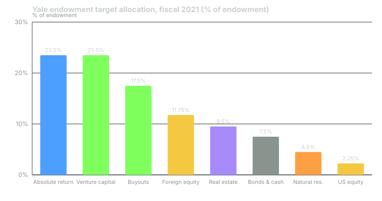

---
{
  "title": "Strategic vs Tactical Asset Allocation",
  "duration": "17 min",
  "free": false,
  "status": "published",
  "quiz": [
    {
      "q": "Ibbotson and Kaplan (2000) found that asset allocation policy explained about 90% of a typical fund's return variability over time, but only about 40% of the return differences between funds. What does the second number mean?",
      "opts": [
        "Policy is unimportant across funds",
        "Sixty percent of funds had no policy",
        "Cross-sectional differences are measurement error",
        "Sixty percent of the difference between funds' returns came from active decisions: timing, selection and fees"
      ],
      "correct": 3,
      "explain": "Within one fund, most of the year-to-year swings are the market moving the policy mix. Between funds, more than half of the spread in results comes from what they did around the policy, including costs."
    },
    {
      "q": "Mapping Yale's fiscal 2021 target weights onto J.P. Morgan's 2025 capital-market assumptions gives a policy expected return of about 7.3%. Which two sleeves contribute the most?",
      "opts": [
        "Bonds and cash, and domestic equity",
        "Venture capital and leveraged buyouts",
        "Real estate and natural resources",
        "Absolute return and foreign equity"
      ],
      "correct": 1,
      "explain": "Venture (23.5% x 8.8% = 2.07 points) and buyouts (17.5% x 9.9% = 1.73 points) contribute 3.8 of the 7.3 points, because they combine large weights with the highest assumed returns."
    },
    {
      "q": "Which statement correctly distinguishes strategic from tactical asset allocation?",
      "opts": [
        "Strategic uses ETFs; tactical uses individual stocks",
        "Strategic is the long-run policy mix derived from the liability; tactical is a temporary, bounded deviation from it based on a market view",
        "Strategic is decided by staff; tactical by the board",
        "There is no difference; the terms are interchangeable"
      ],
      "correct": 1,
      "explain": "The strategic allocation lives in the IPS and changes only by amendment. Tactical allocation moves weights within the policy ranges on a market view, and its results are measured as a separate attribution term."
    },
    {
      "q": "In the 1986 Brinson, Hood and Beebower study of 91 large US pension plans, the average contribution of market timing to returns was:",
      "opts": [
        "Positive, about +1% a year",
        "Zero",
        "Negative, on the order of tenths of a percent a year",
        "Not measured"
      ],
      "correct": 2,
      "explain": "The study reported that timing and selection together detracted from the policy return on average; timing's average contribution was slightly negative (about -0.66% a year in the original sample)."
    },
    {
      "q": "Why do allocators state tactical bets as ranges around the strategic weight rather than as unlimited discretion?",
      "opts": [
        "So the tactical decision can be measured, capped and reversed by rule",
        "Because regulators require it",
        "To hide the bets from the committee",
        "Ranges have no purpose; they are a convention"
      ],
      "correct": 0,
      "explain": "A range (for example 55-65% around a 60% target) bounds the size of any view, makes the deviation measurable against policy, and forces a return to target when the view expires."
    }
  ],
  "task": "Compute the expected return of your own current allocation using the J.P. Morgan 2025 numbers in this lesson's table, sleeve by sleeve, and compare it to the return objective from your IPS."
}
---

## Two decisions that get confused

Asset allocation is the decision that dominates every institutional result, and it comes in two forms that must be kept apart.

**Strategic asset allocation (SAA)** is the long-run policy mix: the weights that, given the liability and the capital-market assumptions, give the best chance of meeting the return objective inside the risk objective. It lives in the IPS. It changes rarely, by amendment, after a formal asset-liability study. Norway's is roughly 70% equities and 30% bonds. Yale's fiscal 2021 policy was 23.5% absolute return, 23.5% venture capital, 17.5% leveraged buyouts, 11.75% foreign equity, 9.5% real estate, 7.5% bonds and cash, 4.5% natural resources and 2.25% domestic equity. CalPERS adopted, effective July 2022, a mix of 42% public equity, 13% private equity, 30% fixed income, 15% real assets and 5% private debt, funded in part with 5% total-fund leverage, then raised private equity and private debt in 2024.

**Tactical asset allocation (TAA)** is a temporary, bounded deviation from those weights based on a view: "equities look expensive, we will run at the bottom of the range for two quarters." It is measured separately, it is capped by the policy ranges, and at most institutions it is small.

The reason to keep them apart is accountability. The board owns the SAA; the staff owns the TAA. When results come in, attribution (Lesson 10) tells you which one produced the outcome.

## What the evidence says allocation explains

Brinson, Hood and Beebower (1986) looked at 91 large US corporate pension plans over 1974–1983 and found that the policy allocation, applied to index returns, explained on average 93.6% of the variation over time in each plan's total return. The rest, timing and security selection, on average subtracted from the policy return; timing's average contribution was −0.66% a year.

That study was widely misquoted as "allocation explains 90% of returns", which is not what it measured. Ibbotson and Kaplan (2000) cleaned this up with three separate questions. Across balanced mutual funds and pension funds: policy explained about 90% of the variability of a fund's return over time (Brinson's result), about 40% of the variation in returns between funds, and, on average, about 100% of the level of return, because the average fund's active decisions roughly netted to zero before costs and to slightly negative after them.

The practical reading: your policy mix decides how your portfolio behaves through time; what you do around it decides where you land relative to your peers, and on average that is nowhere good. This is why institutions put the effort into the SAA and treat TAA as a small, monitored sideline.

## How an SAA is built

The steps, whether at a $500 billion pension or a $500,000 account, are the same.

1. **State the liability and the required return** (Lessons 1 and 2).
2. **Adopt capital-market assumptions (CMAs).** Expected return, volatility and correlation for each asset class over the next 10–15 years. Institutions either build their own or use published sets. J.P. Morgan's 2025 Long-Term Capital Market Assumptions, used throughout this course, give for example US large cap 6.7% compound return at 16.26% volatility, US aggregate bonds 4.6% at 4.52%, EAFE equity 8.1% at 17.61%, emerging-market equity 7.2% at 21.08%, US core real estate 8.1%, private equity 9.9%, diversified hedge funds 4.9%, cash 3.1%, and inflation 2.4%.
3. **Choose the mix** that meets the return objective within the risk objective and constraints. Optimizers are used, but with hard constraints and heavy human overrides, because expected returns are estimated with error and optimizers amplify error.
4. **Set ranges and benchmarks** for each sleeve.
5. **Test the mix against the liability**, including a bad-decade scenario and a liquidity stress (Lesson 5).

## Worked example

Take Yale's fiscal 2021 target allocation and compute its expected return under J.P. Morgan's 2025 assumptions. This is the calculation an asset-liability study performs, with two simplifications: sleeve returns are the published compound figures, and Yale's private-asset sleeves are mapped to J.P. Morgan's nearest public-report category.

| Yale sleeve (FY2021 target) | Weight | Mapped J.P. Morgan 2025 assumption | Contribution |
|---|---|---|---|
| Absolute return | 23.5% | Diversified hedge funds, 4.9% | 23.5 × 4.9 / 100 = 1.15 |
| Venture capital | 23.5% | Venture capital, 8.8% | 23.5 × 8.8 / 100 = 2.07 |
| Leveraged buyouts | 17.5% | Private equity, 9.9% | 17.5 × 9.9 / 100 = 1.73 |
| Foreign equity | 11.75% | Average of EAFE 8.1% and EM 7.2% = 7.65% | 11.75 × 7.65 / 100 = 0.90 |
| Real estate | 9.5% | US core real estate, 8.1% | 9.5 × 8.1 / 100 = 0.77 |
| Bonds and cash | 7.5% | US intermediate Treasuries, 3.8% | 7.5 × 3.8 / 100 = 0.29 |
| Natural resources | 4.5% | Global timberland, 5.3% | 4.5 × 5.3 / 100 = 0.24 |
| Domestic equity | 2.25% | US large cap, 6.7% | 2.25 × 6.7 / 100 = 0.15 |
| **Total** | **100%** | | **7.29%** |

The policy expected return is about 7.3% a year before Yale's own manager selection and after the assumed asset-class fees embedded in J.P. Morgan's alternative-asset figures (which are stated as net-of-fee industry medians).

Compare that with a plain 70/30 mix of US large cap and US aggregate bonds: 0.7 × 6.7 + 0.3 × 4.6 = 6.07%. The endowment model, on these assumptions, is buying about 1.2 percentage points a year of expected return by moving from public to private markets, at the cost of the liquidity, leverage and manager risk discussed in the next lesson. Yale's realized 10-year return to June 2024 was 9.5%, and it reports beating a 70/30 portfolio over both 10 and 20 years by a wider margin than 1.2 points, so its historical manager selection has added to the policy return. Whether that continues is exactly the argument between the model's defenders and its critics.

Now check the policy against the liability. Yale's fiscal 2024 spending was 4.83% of endowment value; add 2.4% inflation and the required nominal return is about 7.2%. A 7.3% policy expectation clears it by a tenth of a point, with no margin for a decade of poor manager selection. That is the kind of finding an asset-liability study exists to surface: the policy meets the objective on paper, but only just, so either the spending rule or the risk level is a live decision for the board, not a settled one.

## Chart

*Figure: Yale's target allocation as of June 30, 2021 (source: The Yale Endowment 2021, Yale Investments Office). Green bars are private equity sleeves; only 2.25% is US public equity.*

## Tactical allocation, honestly

Institutions do run tactical views, but the ones that survive committee scrutiny have three features. The size is bounded by policy ranges: a 60% equity target with a 55–65% range caps any view at ±5 points. The view has an expiry: it returns to target on a date or a trigger, not "when it feels right". And it is measured: the return from the deviation is reported as a separate line, so after five years the committee knows whether the staff's timing has added or subtracted. Brinson's −0.66% a year is the base rate you are trying to beat, and most do not.

The individual version is simpler. Set ranges. Inside the ranges, do nothing. If you want to express a view, do it inside the range and write the expiry date in your IPS notes. Then keep score.

## Sources

- Yale Investments Office, "The Yale Endowment 2021" (target allocation as of June 30, 2021): https://investments.yale.edu/reports
- Brinson, G. P., Hood, L. R., and Beebower, G. L. (1986), "Determinants of Portfolio Performance," *Financial Analysts Journal* 42(4): https://doi.org/10.2469/faj.v42.n4.39
- Ibbotson, R. G., and Kaplan, P. D. (2000), "Does Asset Allocation Policy Explain 40, 90, or 100 Percent of Performance?" *Financial Analysts Journal* 56(1): https://doi.org/10.2469/faj.v56.n1.2327
- J.P. Morgan Asset Management, 2025 Long-Term Capital Market Assumptions (USD assumptions matrix, data as of September 30, 2024): https://am.jpmorgan.com/us/en/asset-management/institutional/insights/portfolio-insights/ltcma/
