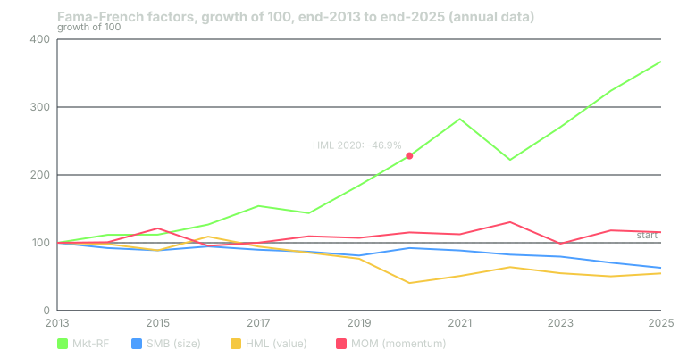

---
{
  "title": "Factor Investing at Institutional Scale",
  "duration": "18 min",
  "free": false,
  "status": "published",
  "quiz": [
    {
      "q": "In the Fama-French data, HML (value) returned −13.42%, −9.63%, −10.36% and −46.94% in 2017, 2018, 2019 and 2020. The cumulative four-year result is:",
      "opts": [
        "About −80%",
        "About −45%",
        "About −33%",
        "About −63%"
      ],
      "correct": 3,
      "explain": "0.8658 x 0.9037 x 0.8964 x 0.5306 = 0.372, a cumulative return of −62.8%. Adding the annual numbers (−80.4%) overstates it because losses compound on a shrinking base."
    },
    {
      "q": "Fama and French's HML factor is constructed as:",
      "opts": [
        "The return of the 30% highest book-to-market stocks minus the 30% lowest, built from size-neutral portfolios",
        "The S&P 500 Value index minus the S&P 500 Growth index",
        "The return of stocks with the highest dividend yield",
        "The average return of value mutual funds"
      ],
      "correct": 0,
      "explain": "HML is the average of the two high book-to-market portfolios (small and big) minus the average of the two low ones, so it is roughly size-neutral by construction."
    },
    {
      "q": "Which factor is defined by past price performance rather than an accounting ratio?",
      "opts": [
        "Value",
        "Quality",
        "Momentum",
        "Size"
      ],
      "correct": 2,
      "explain": "Momentum sorts on trailing returns (Fama-French use months t-12 to t-2; MSCI uses 6- and 12-month risk-adjusted price momentum). Value, quality and size use fundamentals or market cap."
    },
    {
      "q": "Why do institutions worry about 'crowding' in a factor?",
      "opts": [
        "Crowded factors are illegal to trade",
        "When many investors hold the same tilt, the premium can be bid away in advance and the exit can be disorderly, as with momentum's −24.3% in 2023",
        "Crowding only affects small-cap stocks",
        "Index providers refuse to license crowded factors"
      ],
      "correct": 1,
      "explain": "Factor premia are compensation for risk or for others' behaviour; when the trade is widely held, valuations of the factor stretch and reversals are sharp."
    },
    {
      "q": "J.P. Morgan's 2025 assumptions give US equity value a 7.7% compound return at 17.52% volatility and the US large-cap index 6.7% at 16.26%. What is the assumed value premium?",
      "opts": [
        "17.52%",
        "About 1 percentage point a year",
        "Zero, because the volatilities differ",
        "7.7%"
      ],
      "correct": 1,
      "explain": "7.7% − 6.7% = 1.0 point a year, at about 1.3 points of extra volatility. The premium is an assumption, not a guarantee, and a decade of −45% shows how long it can fail to appear."
    }
  ],
  "task": "Download the annual Fama-French factor file from the French Data Library and check the 2017-2020 HML numbers yourself, then compute the cumulative return of any factor over the last ten calendar years."
}
---

## From stocks to factors

Institutions stopped describing equity portfolios by their stocks decades ago. They describe them by exposures: how much of the return comes from the market, from small companies, from cheap companies, from recent winners, from high-quality balance sheets, from low-volatility names. Those exposures are "factors", and the reason the framework matters is that most of what an active equity manager delivers can be explained by them. If a manager's outperformance is fully explained by a value tilt, a pension can buy that tilt in an index fund for a few basis points instead of paying 0.7% for it.

Factor investing at scale means three things: measuring every manager's factor exposures, deciding at the policy level which factor tilts the fund wants, and buying those tilts as cheaply as possible.

## The five factors and how they are defined

**Market.** The return of the whole equity market over cash. Fama and French's "Mkt-RF".

**Size (SMB, "small minus big").** Fama and French (1993) sort stocks by market capitalization at the NYSE median and by book-to-market into three groups, form six portfolios, and take the average of the three small portfolios minus the average of the three big ones. The evidence for a standalone size premium is the weakest of the five; over 2014–2025 SMB compounded to −37%.

**Value (HML, "high minus low").** From the same six portfolios: the average of the two high book-to-market portfolios minus the two low ones. This is the factor with the longest history and, in the last decade, the most painful drawdown.

**Momentum (MOM or UMD).** Fama and French's momentum factor sorts on returns from month t−12 to t−2, skipping the most recent month. MSCI's momentum indexes use 6- and 12-month price momentum adjusted for volatility. Jegadeesh and Titman (1993) documented the effect; it is strong, but it reverses violently.

**Quality.** No single definition. MSCI's quality index screens on return on equity, debt-to-equity and earnings variability. Asness, Frazzini and Pedersen's "quality minus junk" uses profitability, growth and safety. Fama and French's five-factor model uses operating profitability (RMW) and investment (CMA).

**Low volatility / minimum volatility.** MSCI's minimum volatility indexes are optimized portfolios with the lowest expected variance subject to constraints. Frazzini and Pedersen's "betting against beta" documents that low-beta stocks have earned higher risk-adjusted returns than high-beta ones, consistent with leverage-constrained investors overpaying for high beta.

## The evidence, honestly

Two things are simultaneously true. The long-run academic evidence for value, momentum, quality and low volatility is broad, spanning decades and countries. And each factor has spent years failing.

The Fama-French annual data make this concrete. Over the twelve calendar years 2014–2025, the market factor compounded to +267%. HML compounded to −45%, with a four-year run in 2017–2020 that lost 63%. Momentum compounded to only +16%, with a −24.31% year in 2023 following a +15.93% year in 2022. SMB lost 37%. An institution that added a 20% value tilt in 2016 spent the next five years explaining to its board why it was paying for a factor with negative returns.

J.P. Morgan's 2025 assumptions still assign premia: US equity value 7.7% and momentum 7.6% versus 6.7% for the large-cap index, quality 6.7% at lower volatility (14.89% versus 16.26%), and minimum volatility 7.0% at 12.99% volatility. These are estimates that the market has spent the last decade contradicting for value, which is exactly why they are called assumptions.

## Crowding and capacity

Factors are cheap to buy, which is the problem. When a factor is widely held, three things happen. Its valuation stretches (the cheap stocks stop being cheap relative to history), which lowers the forward premium. Its crashes get sharper, because holders exit together: momentum's −24% in 2023 came after a year in which momentum had loaded up on energy and defensive names that then reversed. And capacity binds: a $500 billion pension cannot own a small-cap value tilt of meaningful size without moving prices.

Arnott, Harvey, Kalesnik and Linnainmaa (2021) examined value's drawdown and found that most of it was explained by value stocks becoming relatively cheaper (valuations widening), not by their fundamentals deteriorating, which argues the premium was compressed rather than destroyed. The subsequent 2021–2022 recovery (+25.6% and +25.7% in HML, +58% cumulative) is consistent with that. Whether it was crowding unwinding or something else cannot be settled from two years of data, and institutions have learned not to try.

## Worked example

All figures are from the Kenneth R. French Data Library annual factor files (F-F_Research_Data_Factors and F-F_Momentum_Factor), annual returns in percent.

**Step 1: the value drawdown.** HML 2017 −13.42, 2018 −9.63, 2019 −10.36, 2020 −46.94.

Cumulative growth of 1 = 0.8658 × 0.9037 × 0.8964 × 0.5306 = 0.372. Cumulative return = −62.8%. Note that simply adding the four years gives −80.4%, which overstates the loss; compounding on a shrinking base is why the true figure is −62.8%.

**Step 2: what it cost a tilted portfolio.** Suppose a pension ran its US equity sleeve as 80% market plus a 20% long-short value overlay from the start of 2017 (a stylized version of a "value-tilted" mandate). The overlay's contribution each year is 0.2 × HML:

- 2017: 0.2 × −13.42 = −2.68 points
- 2018: 0.2 × −9.63 = −1.93
- 2019: 0.2 × −10.36 = −2.07
- 2020: 0.2 × −46.94 = −9.39

Roughly 16 points of cumulative underperformance against the plain market sleeve over four years, on a $10 billion sleeve about $1.6 billion, before any benefit arrived. A board that hired the value manager in 2016 on a strong 2016 (HML +22.80%) would have fired him by 2020, right before +25.6% and +25.7%. That sequence, hire after a good run, fire after a bad one, is the subject of Lesson 11.

**Step 3: momentum's whipsaw.** MOM 2022 +15.93, 2023 −24.31. Cumulative: 1.1593 × 0.7569 = 0.8775, a −12.3% two-year result despite a strong first year. Momentum needs to be held through the crash to earn its long-run premium, which is a behavioural test few committees pass.

**Step 4: the assumed premia.** From the J.P. Morgan table: value 7.7% − large cap 6.7% = 1.0 point of expected premium a year; momentum 7.6% − 6.7% = 0.9; quality 6.7% − 6.7% = 0.0 but at 1.4 points less volatility; minimum volatility 7.0% − 6.7% = 0.3 at 3.3 points less volatility. Against those expectations, value's −45% over twelve years is roughly a 3-sigma miss, which tells you how uncertain the assumptions are.

## Chart

*Figure: growth of 100 in each Fama-French factor, compounded from the published annual returns in the Kenneth R. French Data Library (2014–2025). The HML trough at end-2020 is the −46.94% year.*

| Year | Mkt-RF | SMB | HML | MOM |
|---|---|---|---|---|
| 2014 | 11.74 | −7.69 | −1.85 | 0.85 |
| 2015 | 0.20 | −3.85 | −9.48 | 20.21 |
| 2016 | 13.36 | 6.57 | 22.80 | −21.23 |
| 2017 | 21.50 | −5.21 | −13.42 | 4.80 |
| 2018 | −6.82 | −3.13 | −9.63 | 9.50 |
| 2019 | 28.43 | −6.48 | −10.36 | −2.09 |
| 2020 | 23.59 | 13.48 | −46.94 | 7.34 |
| 2021 | 23.87 | −3.79 | 25.60 | −2.32 |
| 2022 | −21.32 | −6.99 | 25.70 | 15.93 |
| 2023 | 21.75 | −3.53 | −13.98 | −24.31 |
| 2024 | 19.76 | −11.31 | −8.43 | 19.72 |
| 2025 | 13.30 | −10.79 | 8.71 | −2.27 |

## What scales down

Two things. First, run a factor regression on any active fund you own (the exposures are published by most data providers) and ask whether you could buy the same exposures in an index product for less. Second, if you hold a factor tilt, size it so that a −60% four-year run in the factor, which has happened, does not make you abandon it, because the only way to earn a factor premium is to still be there when it pays.

## Sources

- Kenneth R. French Data Library, Fama/French factors and momentum factor, annual files: https://mba.tuck.dartmouth.edu/pages/faculty/ken.french/data_library.html
- Fama, E. F., and French, K. R. (1993), "Common risk factors in the returns on stocks and bonds," *Journal of Financial Economics* 33(1): https://doi.org/10.1016/0304-405X(93)90023-5
- Jegadeesh, N., and Titman, S. (1993), "Returns to Buying Winners and Selling Losers," *Journal of Finance* 48(1): https://doi.org/10.1111/j.1540-6261.1993.tb04702.x
- Arnott, R., Harvey, C. R., Kalesnik, V., and Linnainmaa, J. (2021), "Reports of Value's Death May Be Greatly Exaggerated," *Financial Analysts Journal* 77(1): https://doi.org/10.1080/0015198X.2020.1842704
