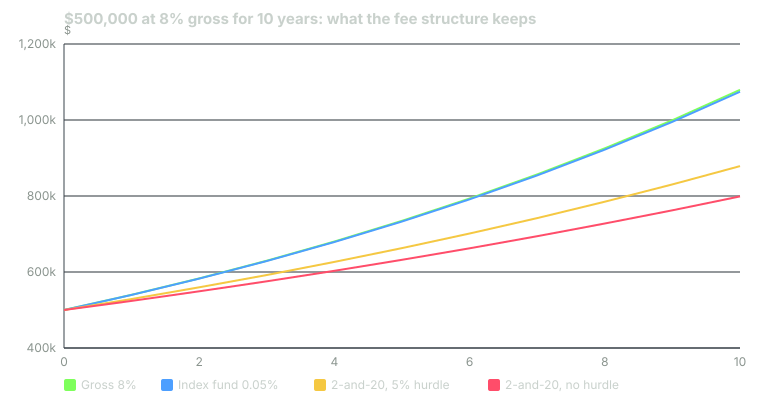

---
{
  "title": "Manager Selection, Due Diligence and Fees",
  "duration": "18 min",
  "free": false,
  "status": "published",
  "quiz": [
    {
      "q": "A fund charges 2-and-20 with no hurdle and earns 8% gross. The investor's net return is:",
      "opts": [
        "6.0%",
        "6.4%",
        "4.8%",
        "5.8%"
      ],
      "correct": 2,
      "explain": "Management fee first: 8% − 2% = 6%. Incentive fee on the remainder: 20% x 6% = 1.2%. Net: 6% − 1.2% = 4.8%."
    },
    {
      "q": "Ben-David, Birru and Rossi (2020) found that over 22 years hedge fund investors paid an effective incentive fee of about:",
      "opts": [
        "20% of profits, as contracted",
        "10% of profits, because of high-water marks",
        "5% of profits",
        "50% of profits, 2.5 times the contractual rate"
      ],
      "correct": 3,
      "explain": "Because fees are paid on gains but not refunded on later losses, and because losing funds close before recovering, the aggregate effective rate was about 50%; investors kept 36 cents of every dollar earned above the risk-free rate."
    },
    {
      "q": "A high-water mark provision means:",
      "opts": [
        "The manager's fee rises when assets exceed a size threshold",
        "No incentive fee is paid until the fund's NAV exceeds its previous peak, so losses must be recovered before new performance fees accrue",
        "The investor can withdraw only when NAV is at a high",
        "The management fee is capped at 2%"
      ],
      "correct": 1,
      "explain": "The high-water mark protects investors from paying twice for the same gain. It does not refund fees already paid on gains that are later lost."
    },
    {
      "q": "What does 'fee per unit of active share' reveal that the headline expense ratio does not?",
      "opts": [
        "How much you are paying for the part of the portfolio that is not simply the benchmark",
        "The fund's tax efficiency",
        "The manager's incentive fee rate",
        "The fund's turnover"
      ],
      "correct": 0,
      "explain": "A 0.80% fee on a fund with 40% active share is 2.0% on the active portion; the other 60% could be indexed for a few basis points."
    },
    {
      "q": "Which item is an operational rather than investment due-diligence question?",
      "opts": [
        "What is the manager's edge and why does it persist?",
        "Who is the independent administrator, and are NAVs verified by a third party?",
        "How does the strategy behave when the value factor falls 47%?",
        "What is the capacity of the strategy?"
      ],
      "correct": 1,
      "explain": "Operational due diligence covers custody, administration, valuation, audit and controls: the questions that catch fraud and failure regardless of investment skill."
    }
  ],
  "task": "For every fund you own, write down the expense ratio, the active share if published, and the fee per unit of active share; flag any fund where that last number exceeds 1.5%."
}
---

## Why this is the hardest job in the building

An allocator's investment staff spends most of its time not on markets but on people: finding, vetting, hiring, monitoring and occasionally firing external managers. Yale and Harvard run almost everything through outside managers; CalPERS runs a large share of public markets internally but its private markets are entirely external. The quality of this process, not the asset allocation, is what separates the endowments that earned Yale's 9.5% a year from the ones that earned CalPERS's 6.2% with a similar mix.

The reason it is hard is that past performance is almost useless, dispersion among managers is enormous in exactly the asset classes where it matters most, and the fee contract is engineered by the manager. This lesson covers what allocators actually check, how the fee contract works, and what the evidence says you get to keep.

## What allocators actually check

Institutional due diligence has two halves, and the second is the one individuals skip.

**Investment due diligence** asks: what is the edge, why does it persist, how big is the capacity, and how does it fail? The staff will decompose the track record into factor exposures (Lesson 6) to see how much of the return could have been bought as an index. They compute active share and tracking error. They ask for the worst quarter and what changed afterwards. They interview former employees and other investors. And they ask the question that most sales decks avoid: if this works, why is the manager selling it to us rather than levering it themselves?

**Operational due diligence** asks whether the business can lose your money without the strategy failing. Who is the custodian, and is it independent of the manager? Who administers the fund and strikes the NAV? Are the audited financials from a recognized firm, and do the auditor's numbers match the marketing numbers? Who can move cash, and does it take two signatures? What are the valuation policies for illiquid positions? The Institutional Limited Partners Association's due-diligence questionnaire runs to dozens of pages on these points because the frauds that have cost allocators the most, from Madoff onward, would have failed an operational check long before an investment one.

Then comes reference checking, legal review of the fund documents, and the fee negotiation, which is where the next section starts.

## The fee contract

The standard hedge fund and private-equity contract is "2-and-20": a 2% annual management fee on assets (or committed capital, in private equity) plus 20% of profits. The mechanics have three moving parts that determine what the investor keeps.

**The hurdle rate.** With a hurdle, the 20% is charged only on returns above a threshold (a fixed rate, or a benchmark). Without one, it is charged on every dollar of profit, including the part any index fund would have delivered. Private-equity funds commonly carry an 8% preferred return; hedge funds usually have none.

**The high-water mark.** The fund pays no incentive fee until its NAV exceeds the highest level on which a fee was previously paid. This stops you paying twice for the same gain. It does not return fees already paid on gains that were later lost, and if the fund closes while underwater, the manager keeps them. Goetzmann, Ingersoll and Ross (2003) showed that the high-water-mark contract is, in effect, a call option on the fund's assets, and that its value to the manager rises with volatility, which is a reason managers underwater are tempted to add risk.

**Asymmetry and fund closure.** Fees are paid in good years and not refunded in bad ones. Ben-David, Birru and Rossi (2020) measured the consequence across the hedge fund industry over 22 years: the aggregate effective incentive fee was about 50% of gains, 2.5 times the 20% contractual rate, and investors kept 36 cents of every dollar earned above the risk-free rate. The gap comes from the asymmetry, from investors chasing returns into funds right before they lost, and from underwater funds closing rather than working back to the mark.

For mutual funds the contract is simpler, an expense ratio with no incentive fee, but the same idea applies: the fee is charged on the whole portfolio while only the active part could possibly justify it. Petajisto's closet-index result (Lesson 3) is this arithmetic showing up in returns.

## Worked example

**Part A: the drag over a decade.** Start with $500,000, an 8% gross return each year for 10 years, and four fee regimes.

- Gross: 500,000 × 1.08^10 = $1,079,462.
- Index fund at 0.05%: net rate 7.95%; 500,000 × 1.0795^10 = $1,074,475. Cost of the fee: $4,987.
- 2-and-20 with no hurdle: management fee takes 8% to 6%; incentive takes 20% of 6% = 1.2%; net 4.8%. 500,000 × 1.048^10 = $799,066. Cost of the fees: $280,396, or 26% of the gross ending value.
- 2-and-20 with a 5% hurdle: incentive is 20% of (6% − 5%) = 0.2%; net 5.8%. 500,000 × 1.058^10 = $878,672. Cost: $200,790.

In the no-hurdle case the manager needs to earn about 3.2 points a year of gross outperformance over the index just to match it after fees, before counting the extra risk. That is roughly the entire long-run premium J.P. Morgan assumes for private equity over public equity (9.9% versus 6.7%).

**Part B: paying a fee on a loss.** Now let returns be volatile: +20% in year one, −20% in year two, 2-and-20, ignore the management fee for clarity.

- Year one: $100 → $120 gross. Incentive fee 20% × $20 = $4. Net $116. High-water mark set at $116.
- Year two: $116 × 0.80 = $92.80. No incentive fee (below the mark).
- Two-year gross result: 1.20 × 0.80 = 0.96, a 4% loss. Investor's result: $92.80, a 7.2% loss, of which $4 is fees paid on a profit that no longer exists.

The investor paid an incentive fee equal to 20% of a gain and ended with a loss. If the fund closes here, the $4 is gone. If it stays open, no fee accrues until NAV passes $116, a 25% gain from $92.80. Multiply this across an industry where investors chase into funds after good years and funds close after bad ones, and you get Ben-David's 50%.

**Part C: fee per unit of active share.** A mutual fund charges 0.80% with active share of 40%. Fee on the active portion: 0.80 / 0.40 = 2.0% a year. The alternative, 60% in an index fund at 0.05% and 40% in a genuinely active fund at 1.0%, costs 0.6 × 0.05 + 0.4 × 1.0 = 0.43% for the same active exposure. This is the calculation allocators now run on every long-only mandate, and it is why fees for low-active-share products have collapsed.

## Chart

*Figure: the ten-year paths from Part A of the worked example. Every line uses an identical 8% gross return; only the fee contract differs.*

## What the evidence says about picking winners

Two findings should temper any manager-selection process.

In private equity, dispersion is real and persistent enough to matter. Harris, Jenkinson and Kaplan (2014) found that US buyout funds had, on average, outperformed public equity net of fees by around 3% a year over their sample, but with a wide spread between top- and bottom-quartile funds, and that venture funds' outperformance was concentrated before 2000. Access to the top quartile is the endowment model's edge, and it is not for sale to new entrants at the same terms.

In public markets, persistence is weak. Managers who outperform over three years are about as likely as not to outperform over the next three, once the factor exposures are stripped out. Lesson 11 shows what happens when committees hire on those three years anyway.

The institutional response is procedural, not predictive: pay for active share, insist on hurdles and high-water marks, negotiate management fees down as assets grow, size each manager so that a bottom-quartile outcome does not threaten the policy return, and write the firing rule (usually based on process breaches, staff departures and style drift, not on returns) before you hire.

## Negotiating the terms

| Fee term | Typical (hedge / PE) | What to negotiate | Why it matters |
|---|---|---|---|
| Management fee | 1.5–2% of assets or commitments | Step-downs with size; charge on invested, not committed, capital after the investment period | Paid regardless of results; compounds every year |
| Incentive / carry | 20% of profits | Hurdle rate; catch-up terms; crystallization annually not quarterly | Without a hurdle, you pay 20% on beta |
| High-water mark | Standard in hedge funds | Perpetual, not resetting; clawback in PE | Prevents paying twice, not paying on losses that stick |
| Liquidity terms | Quarterly with 45–90 days' notice; gates | Match to your IPS liquidity constraint | Fund liquidity is your liability in a crisis (Lesson 5) |
| Expense ratio (mutual fund) | 0.5–1.0% active; 0.03–0.20% index | Fee per unit of active share under ~1.5% | Closet indexers cost the fee and deliver the index |

## Sources

- Ben-David, I., Birru, J., and Rossi, A. (2020), "The Performance of Hedge Fund Performance Fees," NBER Working Paper 27454: https://doi.org/10.3386/w27454
- Goetzmann, W. N., Ingersoll, J. E., and Ross, S. A. (2003), "High-Water Marks and Hedge Fund Management Contracts," *Journal of Finance* 58(4): https://doi.org/10.1111/1540-6261.00581
- Harris, R. S., Jenkinson, T., and Kaplan, S. N. (2014), "Private Equity Performance: What Do We Know?" *Journal of Finance* 69(5): https://doi.org/10.1111/jofi.12154
- Institutional Limited Partners Association, Due Diligence Questionnaire: https://ilpa.org/due-diligence-questionnaire/
