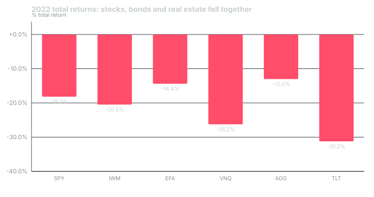

---
{
  "title": "Rebalancing and Liquidity Management at Scale",
  "duration": "17 min",
  "free": false,
  "status": "published",
  "quiz": [
    {
      "q": "A $500,000 60/40 portfolio of SPY and AGG started at the end of 2019 and was never rebalanced. By the end of 2024 its equity weight had drifted to:",
      "opts": [
        "About 60%, because bonds and stocks moved together",
        "About 68%",
        "About 75%",
        "About 82%"
      ],
      "correct": 2,
      "explain": "SPY returned +18.3%, +28.7%, −18.2%, +26.2% and +24.9% over 2020–2024 while AGG returned +7.5%, −1.8%, −13.0%, +5.7% and +1.3%; the untouched portfolio ended at $785,801 with 75.0% in equities."
    },
    {
      "q": "In the same five years, the never-rebalanced portfolio ended with more money than the annually rebalanced one. What is the correct conclusion?",
      "opts": [
        "Rebalancing destroys value and should be abandoned",
        "Rebalancing is a risk-control rule; it gives up return when the risky asset trends and earns a premium when assets mean-revert, and it kept the portfolio at the risk the IPS specified",
        "The result proves bonds are a bad investment",
        "Annual rebalancing is too frequent; monthly would have won"
      ],
      "correct": 1,
      "explain": "Equities trended up strongly in four of the five years, so selling winners cost money. The rebalanced portfolio ended at 64.9% equity instead of 75%; the point of the rule is the risk you are carrying, not the return in a particular window."
    },
    {
      "q": "Willenbrock's 'diversification return' for a 60/40 portfolio with asset volatilities of 16.26% and 4.52% and correlation 0.26 is approximately:",
      "opts": [
        "0.0%",
        "1.5% a year",
        "3.0% a year",
        "0.3% a year"
      ],
      "correct": 3,
      "explain": "Weighted average variance = 0.6 x 16.26² + 0.4 x 4.52² = 166.8; portfolio variance = 107.6; half the difference is 29.6 (in %²), i.e. about 0.30% a year of return from rebalancing, in expectation."
    },
    {
      "q": "CalPERS's 2024 policy change cut public equity from 42% to 37% of a roughly $500 billion fund. At a 20 basis-point implementation shortfall, the transition cost is on the order of:",
      "opts": [
        "$50 million",
        "$5 million",
        "$500 million",
        "$5 billion"
      ],
      "correct": 0,
      "explain": "5% of $500B is $25B of trades; 0.20% of $25B is $50M. This is why institutions transition over months and use cash flows rather than block sales."
    },
    {
      "q": "Which rebalancing rule best matches how most institutions actually operate?",
      "opts": [
        "Rebalance every day to exact targets",
        "Never rebalance; let winners run",
        "Check on a calendar, act only when a sleeve breaches its policy band, and use cash flows first",
        "Rebalance only when the CIO has a market view"
      ],
      "correct": 2,
      "explain": "Calendar-plus-band rules combine low turnover with bounded drift, and directing contributions and distributions to the underweight sleeves rebalances without trading."
    }
  ],
  "task": "Set your own rebalancing rule in writing: the check date, the band per sleeve, and which sleeve new contributions go to first."
}
---

## Drift is a decision

A policy allocation is a snapshot. The moment prices move, the weights move with them, and a 60/40 portfolio silently becomes a 65/35 one after a good equity year. Institutions treat that drift as a decision they are making by default, and they manage it with rules: when to check, how far a sleeve may wander, and how to bring it back at the lowest cost. At scale, "lowest cost" is the whole problem. Moving 5% of a $500 billion pension is $25 billion of trading, and the market notices.

This lesson covers three things institutions do that individuals mostly do not: rebalance by rule rather than by mood, use cash flows before trades, and manage liquidity as a budget with a stress test attached.

## Why rebalance at all

Two reasons, and they pull in different directions.

**Risk control.** The IPS specified 60/40 because that mix met the risk objective. A drifted 75/25 portfolio carries far more equity risk than the board approved. Rebalancing returns the portfolio to the risk it is supposed to have. This is the primary reason, and it holds regardless of what rebalancing does to returns.

**The rebalancing premium.** Willenbrock (2011) showed that a rebalanced portfolio earns a "diversification return" over a buy-and-hold one equal to roughly half the difference between the weighted average of the assets' variances and the portfolio's variance. It comes from mean reversion in relative prices: you sell what went up and buy what went down. It is a modest number, a few tenths of a percent a year for a stock-bond mix, and it is not guaranteed in any window. When one asset trends for years, as US equities did 2019–2024, buy-and-hold wins that window and rebalancing costs money. Institutions know this and rebalance anyway, because they are managing risk, not chasing the premium.

## The rules institutions use

**Calendar plus bands.** Check weights on a schedule (monthly or quarterly) and act only if a sleeve is outside its policy band. A common band is ±5 percentage points on major sleeves and proportionally tighter on small ones (a 5% sleeve might carry ±1.5 points). Inside the band, nothing happens; outside it, rebalance to target or to the band edge.

**Cash flows first.** A pension receives contributions and pays benefits every month; an endowment receives gifts and pays distributions. Yale received $231 million of gifts and distributed $2.0 billion in fiscal 2024. Directing inflows to underweight sleeves and sourcing outflows from overweight ones rebalances with zero incremental trading. Norway's fund, which received large oil-revenue inflows for years, rebalanced almost entirely this way.

**Transition management.** When the policy itself changes, the shift is planned as a project. CalPERS's 2024 move (public equity 42% to 37%, private equity 13% to 17%, private debt 5% to 8%) is executed over quarters, partly by directing new money and partly by trades scheduled to minimize market impact. The cost is measured as implementation shortfall (Perold, 1988): the difference between the portfolio's value at the decision price and its value after execution, including the drift in prices while you waited.

**Private assets cannot be rebalanced.** You cannot sell a venture partnership at Tuesday's close. Institutions manage private sleeves through the pace of new commitments, a multi-year plan that targets the policy weight three to five years out, and accept that the actual weight will overshoot after public drawdowns (Lesson 5). The public sleeves are used as the buffer.

## Liquidity as a budget

After 2008, allocators added a liquidity budget alongside the risk budget. It has three tiers: cash and Treasuries that can be sold today; public equities and credit that can be sold within a month at a cost; and private assets that cannot be sold at all except at a discount. Against those tiers they list the claims: spending or benefits for the next two to three years, unfunded capital commitments, collateral calls on derivatives and currency hedges, and rebalancing needs after a 30% public-market fall. The budget passes if tiers one and two cover the claims under stress without touching tier three. Harvard's FY2025 report describes exactly this logic: the uncorrelated hedge fund sleeve is held partly because it "provides access to liquidity across market cycles", and the endowment's liquidity "allowed it to serve as a ballast" during the university's operating stress that year.

## Worked example

Every number below is computed from Yahoo Finance adjusted daily closes for SPY (S&P 500 ETF) and AGG (Bloomberg US Aggregate ETF), December 31, 2019 to December 31, 2024, 1,259 trading days each. Annual total returns:

| Year | SPY | AGG |
|---|---|---|
| 2020 | +18.33% | +7.48% |
| 2021 | +28.73% | −1.77% |
| 2022 | −18.18% | −13.02% |
| 2023 | +26.18% | +5.66% |
| 2024 | +24.89% | +1.31% |

Start with $500,000, 60% SPY ($300,000) and 40% AGG ($200,000), and run three rules.

**Rule 1: never rebalance.**
- End 2020: SPY 300,000 × 1.1833 = 354,990; AGG 200,000 × 1.0748 = 214,960; total 569,950; equity 62.3%.
- End 2021: 354,990 × 1.2873 = 456,979; 214,960 × 0.9823 = 211,155; total 668,134; equity 68.4%.
- End 2022: 456,979 × 0.8182 = 373,900; 211,155 × 0.8698 = 183,663; total 557,563; equity 67.1%.
- End 2023: 373,900 × 1.2618 = 471,787; 183,663 × 1.0566 = 194,058; total 665,845; equity 70.9%.
- End 2024: 471,787 × 1.2489 = 589,215; 194,058 × 1.0131 = 196,600; total 785,815; equity 75.0%.

(Exact daily compounding gives $785,801; the annual rounding above is within $20.)

**Rule 2: rebalance to 60/40 every December 31.** Each year the portfolio return is 0.6 × SPY + 0.4 × AGG: 2020 +13.99%, 2021 +16.53%, 2022 −16.12%, 2023 +17.97%, 2024 +15.46%. Compounded: 500,000 × 1.1399 × 1.1653 × 0.8388 × 1.1797 × 1.1546 = $758,828. Five rebalancing trades; ending equity weight 64.9% before the final rebalance.

**Rule 3: annual check, ±5-point band.** Same drift as Rule 1 until a check finds equity outside 55–65%. End 2020: 62.3%, inside, no trade. End 2021: 68.4%, outside, rebalance to 60/40 on $668,137. 2022: −16.12% → $560,474, equity 58.5%, inside. 2023: SPY-heavy drift to 62.8%, inside. 2024: 67.5%, outside, rebalance. Ending value $765,698 with two trades in five years.

**Reading the result.** Buy-and-hold finished highest ($785,801) because equities trended up in four of five years, but it did so carrying 75% equity against a 60% policy: the board approved one risk and got another. The band rule captured most of the buy-and-hold return with a third of the trades of annual rebalancing and never let equity exceed 68.4%. The diversification return in expectation, using the J.P. Morgan 2025 inputs (volatilities 16.26% and 4.52%, correlation 0.26): weighted average variance 0.6 × 264.4 + 0.4 × 20.4 = 166.8; portfolio variance 107.6; half the gap = 29.6 in %², about 0.30% a year. That premium is real over long horizons and invisible in a five-year equity bull market, which is exactly what happened here.

**Transition cost at scale.** CalPERS's 5-point cut in public equity on roughly $500 billion is $25 billion of sales. At a 20 basis-point implementation shortfall, a reasonable figure for large-cap equity executed over weeks, the cost is $25B × 0.002 = $50 million. At 50 basis points, if executed hastily, $125 million. That is the budget line that makes institutions plan transitions over quarters and use cash flows first.

## Chart

*Figure: 2022 total returns for six ETFs, from adjusted closes December 31, 2021 to December 30, 2022 (251 trading days each). A rebalancing rule in 2022 sold the asset that fell least (AGG) to buy the ones that fell more, which paid off in 2023 when SPY returned +26.18%.*

## What scales down

All of it. Write the check date and the bands into your IPS. Direct every contribution to the most underweight sleeve; in a taxable account this is also the cheapest way to rebalance because it avoids realizing gains. Keep a liquidity tier list: what you could sell today, what you would rather not, and what you cannot (a lock-up, a house, a private investment) and make sure the first two tiers cover two years of any planned withdrawals.

## Sources

- Willenbrock, S. (2011), "Diversification Return, Portfolio Rebalancing, and the Commodity Return Puzzle," *Financial Analysts Journal* 67(4): https://doi.org/10.2469/faj.v67.n4.1
- Perold, A. F. (1988), "The Implementation Shortfall: Paper versus Reality," *Journal of Portfolio Management* 14(3): https://doi.org/10.3905/jpm.1988.409150
- Harvard Management Company, FY25 Annual Report (liquidity role of the hedge fund sleeve): https://www.hmc.harvard.edu/wp-content/uploads/2025/10/FY25_HMC_Annual_Report.pdf
- Yale University, "Yale reports investment return for fiscal 2024" (gifts and distributions): https://news.yale.edu/2024/10/25/yale-reports-investment-return-fiscal-2024
