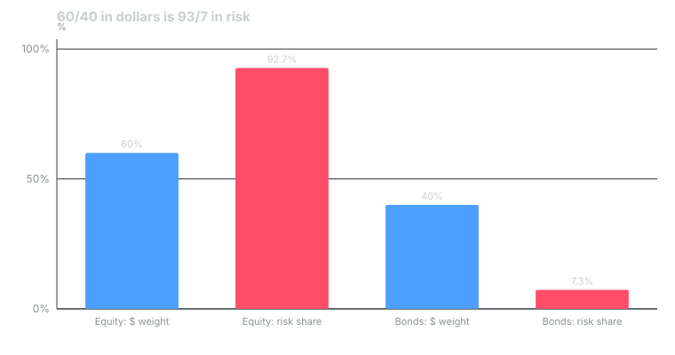

---
{
  "title": "Risk Budgeting, Risk Parity and the 2022 Bond Lesson",
  "duration": "18 min",
  "free": false,
  "status": "published",
  "quiz": [
    {
      "q": "Using J.P. Morgan's 2025 inputs (US large cap volatility 16.26%, US aggregate bonds 4.52%, correlation 0.26), a 60/40 portfolio's volatility is about 10.4%. What share of that risk comes from the equity sleeve?",
      "opts": [
        "60%",
        "About 75%",
        "About 93%",
        "100%"
      ],
      "correct": 2,
      "explain": "Equity's risk contribution is w_e x cov(equity, portfolio) / σ_p = 9.62 points of the 10.37% total, or 92.7%. Dollars are 60/40; risk is 93/7."
    },
    {
      "q": "An unlevered risk-parity mix of the same two assets (weights inversely proportional to volatility) holds about:",
      "opts": [
        "50% equity, 50% bonds",
        "78% equity, 22% bonds",
        "40% equity, 60% bonds",
        "22% equity, 78% bonds"
      ],
      "correct": 3,
      "explain": "w_e = (1/16.26) / (1/16.26 + 1/4.52) = 21.75%. At those weights each asset contributes half of the portfolio's 5.61% volatility."
    },
    {
      "q": "To bring that risk-parity mix up to the 60/40 portfolio's 10.37% volatility requires leverage of roughly:",
      "opts": [
        "1.2x",
        "1.85x",
        "3x",
        "None; volatility cannot be scaled"
      ],
      "correct": 1,
      "explain": "10.37 / 5.61 = 1.85. The levered portfolio is about 40% equity and 145% bonds, financed by borrowing 85% of capital."
    },
    {
      "q": "In 2022 SPY returned −18.18%, AGG −13.02% and TLT −31.23%. What did that year expose about risk parity?",
      "opts": [
        "That bonds have no place in any portfolio",
        "That the strategy relies on stock-bond correlation staying low or negative; when both fell together, leverage on bonds turned a moderate loss into a large one",
        "That risk parity had been secretly holding equities",
        "Nothing; risk parity outperformed 60/40 in 2022"
      ],
      "correct": 1,
      "explain": "Risk parity's diversification depends on bonds offsetting equities. In 2022 rising inflation and rates made the correlation positive, and levered bond positions lost more than the unlevered 60/40."
    },
    {
      "q": "Risk budgeting differs from dollar budgeting because:",
      "opts": [
        "It allocates expected volatility contributions, so a small dollar weight in a volatile asset can consume a large share of the budget",
        "It only applies to hedge funds",
        "It ignores correlations",
        "It replaces the IPS"
      ],
      "correct": 0,
      "explain": "Risk contribution depends on weight, volatility and correlation with the rest of the portfolio; a 5% emerging-markets sleeve can contribute 8% of portfolio risk while a 25% bond sleeve contributes 4%."
    }
  ],
  "task": "Compute the risk contribution of each sleeve in your own portfolio using the formula in this lesson and the J.P. Morgan volatilities and correlations; note which sleeves consume more risk than dollars."
}
---

## Dollars are not risk

Ask a committee what its portfolio looks like and it will say "60/40". Ask what its risk looks like and the honest answer is "93/7". A 60/40 mix of US large-cap equity and aggregate bonds gets about 93% of its volatility from the equity sleeve, because equities are roughly 3.6 times as volatile as bonds and the two are only modestly correlated. The dollar allocation hides this; the risk budget reveals it.

Risk budgeting is the practice of allocating *expected risk contributions* rather than dollars. It answers three questions the dollar view cannot: which sleeve is really driving outcomes, whether a diversifier is actually diversifying, and how much of the total risk budget each decision (policy, tactical, manager) is allowed to consume.

## The arithmetic

For a portfolio with weights w_i, volatilities σ_i and correlations ρ_ij:

Portfolio variance: σ_p² = Σ_i Σ_j w_i w_j σ_i σ_j ρ_ij

Risk contribution of asset i: RC_i = w_i × cov(i, portfolio) / σ_p = w_i × (Σ_j w_j σ_i σ_j ρ_ij) / σ_p

The contributions sum to σ_p, so each one can be read as a share of total volatility. Institutions compute this monthly for the total fund and for each sleeve against its benchmark (where it becomes a tracking-error budget, Lesson 3).

## Risk parity and its leverage

If the risk budget says 93/7 is too concentrated, the natural fix is to size positions so each asset contributes equally to risk. That is risk parity. With two assets and modest correlation, the weights are close to inversely proportional to volatility: the bond weight is large and the equity weight small. The catch is that such a portfolio has low expected return and low volatility, so to meet a return objective it must be levered, and the leverage is applied mostly to bonds.

Asness, Frazzini and Pedersen (2012) gave the theoretical case: if many investors cannot or will not use leverage, they overweight high-risk assets to reach their return targets, which bids up those assets and leaves low-risk assets with better risk-adjusted returns. An investor who *can* lever should hold the higher-Sharpe, low-risk mix and scale it. Maillard, Roncalli and Teiletche (2010) formalized the equal-risk-contribution portfolio and showed it sits between the minimum-variance and equal-weight portfolios in risk.

Large pensions adopted versions of this in the 2010s, and CalPERS's policy allows 5% total-fund leverage partly for the same reason. The strategy's weakness is in the assumption it leans on hardest: that the stock-bond correlation stays low or negative, so that the levered bond sleeve cushions equity drawdowns.

## Worked example

All inputs are from J.P. Morgan's 2025 Long-Term Capital Market Assumptions (USD): US large cap arithmetic return 7.91%, volatility 16.26%; US aggregate bonds 4.70%, 4.52%; correlation 0.26; cash 3.10%. Realized 2022 returns are from Yahoo Finance adjusted closes: SPY −18.18%, AGG −13.02%, TLT −31.23%.

**Step 1: the 60/40 risk budget.**

σ_p² = 0.6² × 16.26² + 0.4² × 4.52² + 2 × 0.6 × 0.4 × 0.26 × 16.26 × 4.52
= 0.36 × 264.39 + 0.16 × 20.43 + 0.1248 × 73.50
= 95.18 + 3.27 + 9.17 = 107.62
σ_p = 10.37%

Equity's covariance with the portfolio: 0.6 × 264.39 + 0.4 × 0.26 × 16.26 × 4.52 = 158.63 + 7.64 = 166.28.
RC_equity = 0.6 × 166.28 / 10.37 = 9.62 points, which is 92.7% of 10.37.
Bonds' covariance with the portfolio: 0.4 × 20.43 + 0.6 × 0.26 × 16.26 × 4.52 = 8.17 + 11.47 = 19.64.
RC_bonds = 0.4 × 19.64 / 10.37 = 0.76 points, 7.3%.

Check: 9.62 + 0.76 = 10.38 ≈ σ_p. Expected arithmetic return: 0.6 × 7.91 + 0.4 × 4.70 = 6.63%.

**Step 2: unlevered risk parity.** Inverse-volatility weights: w_e = (1/16.26) / (1/16.26 + 1/4.52) = 0.0615 / 0.2827 = 21.75%; w_b = 78.25%.

σ_p² = 0.2175² × 264.39 + 0.7825² × 20.43 + 2 × 0.2175 × 0.7825 × 0.26 × 73.50 = 12.51 + 12.51 + 6.50 = 31.52; σ_p = 5.61%. Each asset contributes 2.81 points, exactly half. Expected return: 0.2175 × 7.91 + 0.7825 × 4.70 = 5.40%. Sharpe-style ratio over cash: (5.40 − 3.10) / 5.61 = 0.41, versus (6.63 − 3.10) / 10.37 = 0.34 for 60/40. Better risk-adjusted, lower absolute return.

**Step 3: lever it to 60/40's risk.** Leverage L = 10.37 / 5.61 = 1.85. Positions: 1.85 × 21.75% = 40.2% equity and 1.85 × 78.25% = 144.6% bonds, financed by borrowing 84.8% of capital at cash. Expected return: 1.85 × 5.40 − 0.85 × 3.10 = 9.99 − 2.63 = 7.35%, against 6.63% for 60/40 at the same expected volatility. That 0.7-point edge is the risk-parity argument in one number, and it holds only if the inputs hold.

**Step 4: 2022.** Realized returns broke the correlation assumption: stocks and bonds fell together.

- 60/40 (SPY/AGG): 0.6 × −18.18 + 0.4 × −13.02 = −10.91 − 5.21 = **−16.12%**.
- Unlevered risk parity (SPY/AGG): 0.2175 × −18.18 + 0.7825 × −13.02 = −3.95 − 10.19 = **−14.14%**. Slightly better than 60/40, but not the cushion the strategy promises.
- Levered risk parity at 1.85x: 1.85 × −14.14 = −26.16%, plus financing on the 85% borrowed. Three-month bill yields rose from about 0.05% to about 4.3% during 2022; assume 1.5% average: 0.85 × 1.5 = 1.28 points. Total about **−27.4%**.
- Many risk-parity funds hold long-duration Treasuries rather than the aggregate. With TLT (volatility assumption 12.83% for long Treasuries): w_e = (1/16.26) / (1/16.26 + 1/12.83) = 44.1%, w_b = 55.9%; 2022 unlevered = 0.441 × −18.18 + 0.559 × −31.23 = −8.02 − 17.46 = **−25.5%** before any leverage.

The lesson institutions drew is not that risk parity is wrong but that a risk budget built on one correlation regime is a bet on that regime. Since 2022, most allocators stress their risk budgets under a positive stock-bond correlation as a standard scenario, and cap leverage on the sleeve that only diversifies when inflation is falling.

## Chart

*Figure: dollar weights versus risk contributions for the 60/40 portfolio in Step 1 (volatilities 16.26% and 4.52%, correlation 0.26, portfolio volatility 10.37%).*

## Using a risk budget without leverage

Most individuals cannot or should not lever, so the useful part of risk budgeting is diagnostic. Compute each sleeve's risk contribution and compare it to its dollar weight. Three findings recur. Small, volatile sleeves (emerging markets, single stocks, crypto) consume far more of the budget than their weight suggests. Bond sleeves consume almost none, so they are doing little for volatility and their real job is liquidity and a hedge in the falling-inflation regime. And the total-portfolio volatility is usually close to the equity weight times the equity volatility, which is a quick sanity check: 0.6 × 16.26 = 9.8%, near the 10.37% computed above.

Then set the budget the way institutions do: a total-volatility target derived from the drawdown you wrote in the IPS (a 10% volatility portfolio has historically produced peak-to-trough losses of 25–35% in bad years), and a cap on any single sleeve's share of it.

## Sources

- J.P. Morgan Asset Management, 2025 Long-Term Capital Market Assumptions (USD assumptions matrix, September 30, 2024): https://am.jpmorgan.com/us/en/asset-management/institutional/insights/portfolio-insights/ltcma/
- Asness, C. S., Frazzini, A., and Pedersen, L. H. (2012), "Leverage Aversion and Risk Parity," *Financial Analysts Journal* 68(1): https://doi.org/10.2469/faj.v68.n1.1
- Maillard, S., Roncalli, T., and Teiletche, J. (2010), "The Properties of Equally Weighted Risk Contribution Portfolios," *Journal of Portfolio Management* 36(4): https://doi.org/10.3905/jpm.2010.36.4.060
