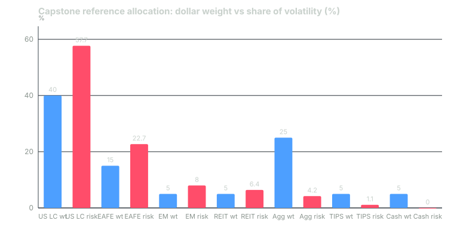

---
{
  "title": "Capstone: Write the Policy for a $500,000 Account",
  "duration": "45 min",
  "free": false,
  "status": "published",
  "quiz": [
    {
      "q": "Under the stated assumptions, the reference allocation's expected arithmetic return is 7.06% and its volatility is 10.96%. Its expected compound return is approximately:",
      "opts": [
        "7.06%",
        "5.86%",
        "10.96%",
        "6.46%"
      ],
      "correct": 3,
      "explain": "Compound ≈ arithmetic − variance/2 = 7.06 − (10.96²/100)/2 = 7.06 − 0.60 = 6.46%. Weighting the published compound returns directly gives 6.17%, a lower bound that ignores diversification."
    },
    {
      "q": "The account's return objective is 4% spending plus 2.4% inflation, about 6.4% nominal after fees. With expected fund costs of about 0.05%, does the reference allocation meet it?",
      "opts": [
        "No, it falls short by more than a point",
        "Yes, by a wide margin",
        "Just: 6.46% − 0.05% = 6.41% against 6.40%, with no cushion for assumption error",
        "The question cannot be answered without private assets"
      ],
      "correct": 2,
      "explain": "The policy clears the objective by a hundredth of a point. The rubric rewards noticing that and stating what would change if the assumptions prove optimistic: a lower spend rate or a later retirement, not more risk."
    },
    {
      "q": "Which sleeve consumes the most risk per dollar in the reference allocation?",
      "opts": [
        "US large cap",
        "Emerging markets",
        "Aggregate bonds",
        "TIPS"
      ],
      "correct": 1,
      "explain": "Emerging markets is 5% of dollars but 8.0% of volatility, a ratio of 1.6; US large cap is 40% of dollars and 57.7% of risk, a ratio of 1.44; bonds are 25% of dollars and 4.2% of risk."
    },
    {
      "q": "The rebalancing rule in the reference solution is 'annual check on the IPS anniversary, ±5 points on sleeves over 20%, ±2 points on smaller sleeves, contributions to the most underweight sleeve first'. What makes this a rule rather than a preference?",
      "opts": [
        "It names a date, a threshold and an action, so it can be executed without a market opinion",
        "It requires monthly trading",
        "It maximizes return",
        "It was approved by a committee"
      ],
      "correct": 0,
      "explain": "A rule specifies when to look, what triggers action, and what the action is. Anything that requires a view about markets to execute is discretion."
    },
    {
      "q": "Why does the reference IPS set the policy benchmark as a fixed blend of index returns at the policy weights, rebalanced annually?",
      "opts": [
        "Because it is the only benchmark GIPS permits",
        "So that every deviation from the benchmark is by construction an active decision the investor made: allocation drift, tactical moves or fund selection",
        "Because blended benchmarks always outperform",
        "To make the portfolio look better"
      ],
      "correct": 1,
      "explain": "A policy benchmark built from the IPS weights separates what the policy did from what the investor did around it, which is what a Brinson attribution needs (Lesson 10)."
    }
  ],
  "task": "Submit your completed IPS, allocation, benchmark, rebalancing rule, risk budget and expected return-and-volatility calculation against the rubric; then set the IPS anniversary in your calendar."
}
---

## The brief

You are writing the investment policy for a real-sized account, doing every calculation an asset-liability study would do, using published capital-market assumptions. Submit a document with six numbered sections. The rubric at the end is how it is graded.

**The investor.** Age 45. Account: $500,000 across a taxable brokerage account ($300,000) and a rollover IRA ($200,000). Employment income covers all current spending; contributions of $24,000 a year will continue until retirement. Twelve months of expenses are held in a bank account outside this portfolio and are not part of it.

**The goal.** Retire at 65, in 20 years, and then withdraw 4% of the portfolio's value each year, rising with inflation, for at least 30 years. No withdrawals before 65.

**The constraints the investor has stated.** No margin or other borrowing. No single company above 10% of the portfolio. Nothing with a lock-up longer than one year. The investor has said that a 25% peak-to-trough decline would be uncomfortable but would not change the plan; a 40% decline would cause a change of plan. Taxable-account turnover should be kept low.

**The capital-market assumptions you must use.** J.P. Morgan Asset Management, 2025 Long-Term Capital Market Assumptions, USD, data as of September 30, 2024, 10–15 year horizon. Compound return, arithmetic return and volatility, in percent:

| Asset class | Compound | Arithmetic | Volatility |
|---|---|---|---|
| US large cap equity | 6.70 | 7.91 | 16.26 |
| EAFE (developed ex-US) equity | 8.10 | 9.49 | 17.61 |
| Emerging markets equity | 7.20 | 9.18 | 21.08 |
| US REITs | 8.00 | 9.33 | 17.22 |
| US aggregate bonds | 4.60 | 4.70 | 4.52 |
| TIPS | 4.10 | 4.26 | 5.78 |
| US cash | 3.10 | 3.10 | 0.65 |
| US inflation | 2.40 | | |

Correlations from the same matrix: US large cap with EAFE 0.88, EM 0.74, REITs 0.77, aggregate bonds 0.26, TIPS 0.31, cash 0.00. EAFE with EM 0.86, REITs 0.71, bonds 0.30, TIPS 0.32, cash 0.03. EM with REITs 0.59, bonds 0.29, TIPS 0.33, cash 0.03. REITs with bonds 0.39, TIPS 0.38, cash −0.06. Bonds with TIPS 0.76, cash 0.08. TIPS with cash 0.02.

You may use any subset of these seven asset classes. You may not add others, because you would have no sourced assumptions for them.

## What to submit

1. **Investment policy statement.** Purpose, return objective derived from the goal, risk objective in the investor's own terms (the drawdown numbers), constraints, and the review rule, following Lesson 2. One page.
2. **Strategic allocation.** Target weight and band for each sleeve, with one sentence per sleeve on what it is for.
3. **Benchmarks.** A benchmark index for each sleeve and a policy benchmark for the whole portfolio, with a sentence on why it meets the Lesson 3 criteria.
4. **Rebalancing rule.** Check date, bands, action, and how contributions are used.
5. **Risk budget.** Each sleeve's contribution to portfolio volatility, using the Lesson 9 formula, and a statement of the total volatility the IPS tolerates.
6. **Expected return and volatility.** Arithmetic return, volatility, and compound return of the policy, with every step shown, and a comparison to the return objective.

## Worked example

This is one defensible answer, not the only one. It is the reference against which the rubric was calibrated.

**1. IPS core.** Purpose: fund retirement income from 2046 for at least 30 years without forced sales. Return objective: 4% spend + 2.4% inflation ≈ 6.4% nominal after fees. Risk objective: expected one-year volatility not above 11%, and a policy for which a 25% drawdown is inside two standard deviations of a bad year; a 40% drawdown is the plan-changing loss, so the equity-like share is capped at 65%. Constraints: as stated by the investor; taxable account holds the equity index funds (low turnover), the IRA holds bonds, TIPS and REITs. Review: annually on the IPS anniversary; amendments take effect 30 days after being written.

**2. Allocation.** US large cap 40% (band 35–45), EAFE 15% (12–18), emerging markets 5% (3–7), US REITs 5% (3–7), US aggregate bonds 25% (20–30), TIPS 5% (3–7), cash 5% (3–7). Equity-like total 65%; bonds and cash 35%.

**3. Benchmarks.** S&P 500, MSCI EAFE, MSCI Emerging Markets, MSCI US REIT, Bloomberg US Aggregate, Bloomberg US TIPS 0–5 year, 3-month Treasury bills. Policy benchmark: those indexes at the policy weights, rebalanced annually on the IPS anniversary. Each is investable through an index fund, specified in advance and measurable daily.

**4. Rebalancing rule.** Check on the anniversary; if any sleeve is outside its band, restore all sleeves to target. Monthly contributions of $2,000 go to the most underweight sleeve. In the taxable account, rebalance with contributions and dividends before selling.

**5. Expected arithmetic return.** Σ w × arithmetic:
0.40 × 7.91 = 3.164; 0.15 × 9.49 = 1.424; 0.05 × 9.18 = 0.459; 0.05 × 9.33 = 0.467; 0.25 × 4.70 = 1.175; 0.05 × 4.26 = 0.213; 0.05 × 3.10 = 0.155. Total = **7.06%**.

**6. Variance.** Compute each sleeve's covariance with the portfolio, cov_k = Σ_j w_j σ_k σ_j ρ_kj, then σ_p² = Σ w_k cov_k. For US large cap: 0.40 × 16.26² + 0.15 × 16.26 × 17.61 × 0.88 + 0.05 × 16.26 × 21.08 × 0.74 + 0.05 × 16.26 × 17.22 × 0.77 + 0.25 × 16.26 × 4.52 × 0.26 + 0.05 × 16.26 × 5.78 × 0.31 + 0.05 × 16.26 × 0.65 × 0.00 = 105.76 + 37.80 + 12.68 + 10.78 + 4.78 + 1.46 + 0 = **173.2**. The same procedure gives EAFE 181.7, EM 191.2, REITs 153.5, bonds 20.2, TIPS 27.1, cash 0.1.

σ_p² = 0.40 × 173.2 + 0.15 × 181.7 + 0.05 × 191.2 + 0.05 × 153.5 + 0.25 × 20.2 + 0.05 × 27.1 + 0.05 × 0.1 = 69.3 + 27.3 + 9.6 + 7.7 + 5.1 + 1.4 + 0.0 = **120.2**. σ_p = √120.2 = **10.96%**.

**7. Expected compound return.** Arithmetic minus half the variance (in decimal): 7.06 − 120.2 / 200 = 7.06 − 0.60 = **6.46%**. Cross-check by weighting the published compound returns directly: 0.40 × 6.70 + 0.15 × 8.10 + 0.05 × 7.20 + 0.05 × 8.00 + 0.25 × 4.60 + 0.05 × 4.10 + 0.05 × 3.10 = 6.17%; the 0.29-point difference is the diversification benefit of holding assets that do not move together. Against the objective: 6.46% less about 0.05% of index-fund costs is 6.41% versus a 6.40% requirement. It passes with no cushion. The honest note in the IPS: if the assumptions prove a point optimistic, the lever is the spend rate (3.5%) or the retirement date, not more equity, because the risk objective is already binding.

**8. Risk budget.** RC_k = w_k × cov_k / σ_p: US large cap 0.40 × 173.2 / 10.96 = 6.32 points (57.7%); EAFE 2.49 (22.7%); EM 0.87 (8.0%); REITs 0.70 (6.4%); bonds 0.46 (4.2%); TIPS 0.12 (1.1%); cash 0.00. Sum 10.96. Equity-like sleeves are 65% of dollars and 94.7% of risk. A two-standard-deviation bad year is 7.06 − 2 × 10.96 = −14.9%; realized 2022 returns applied to these weights (SPY −18.18%, EFA −14.39% for both EAFE and EM, VNQ −26.25%, AGG −13.02% for bonds and TIPS, cash +1.5%) give −15.3%, and 2008-scale equity declines of 40% with bonds flat imply roughly −26%, at the edge of the 25% tolerance and well inside the 40% plan-changing loss. The risk objective holds.

**9. Twenty years on.** 500,000 × 1.0646^20 = $1,748,600 before contributions, on which a 4% first-year withdrawal is about $69,900 in 2046 dollars; contributions of $24,000 a year add roughly $900,000 more at the same rate. The plan is feasible on the stated assumptions, and the document says exactly which assumption would have to fail for it not to be.

## Chart

*Figure: dollar weights (blue) and risk contributions (red) for the reference allocation, computed in steps 6 and 8 from the J.P. Morgan 2025 assumptions stated above.*

## Rubric

| Criterion | Points | Full marks | Partial | Zero |
|---|---|---|---|---|
| Return objective derived from the liability | 15 | Spend rate plus stated inflation, compared explicitly to the computed policy return, with a stated response if the assumptions fail | Objective stated but not derived, or not compared to the policy | No return objective, or one based on a market forecast |
| Risk objective and constraints in the investor's terms | 15 | Drawdown tolerances translated into a volatility cap or equity-share cap; all stated constraints reflected (no leverage, no lock-ups, 10% single-name, low taxable turnover) | Constraints listed but not connected to the allocation | Constraints ignored or contradicted |
| Allocation, bands and benchmarks | 20 | Targets sum to 100% using only the seven permitted classes; every sleeve has a band and an investable, specified benchmark; a policy benchmark at policy weights | Missing bands, or a benchmark that fails a Lesson 3 criterion | Weights do not sum, or assets without assumptions used |
| Rebalancing rule | 10 | Date, trigger, action and use of contributions all specified; executable without a market view | Two of the four elements | Discretionary or absent |
| Risk budget | 15 | Correct risk contributions for every sleeve (within rounding), summing to the portfolio volatility, with a stress comparison to the drawdown tolerance | Contributions computed but do not sum, or no stress comparison | Dollar weights presented as risk |
| Expected return and volatility | 25 | Arithmetic return, variance via covariances, volatility and compound return each shown step by step; matches an independent recalculation within 0.05 points | Arithmetic return correct but variance mishandled (for example ignoring correlations) | Numbers asserted without calculation |

Total: 100. A submission scoring 80 or more is a policy you can run; one scoring below 60 will not survive its first drawdown.

## Sources

- J.P. Morgan Asset Management, 2025 Long-Term Capital Market Assumptions, USD assumptions matrix: https://am.jpmorgan.com/us/en/asset-management/institutional/insights/portfolio-insights/ltcma/
- CFA Institute, "Elements of an Investment Policy Statement for Individual Investors" (2010): https://rpc.cfainstitute.org/research/foundation/2010/elements-of-an-investment-policy-statement-for-individual-investors
- CFA Institute, Global Investment Performance Standards (GIPS) 2020 (benchmark and return-presentation provisions): https://www.gipsstandards.org/standards/
