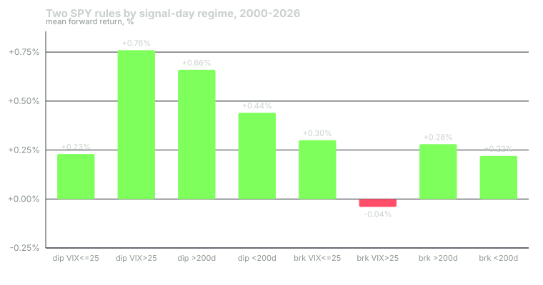

---
{
  "title": "What a Regime Is, and Why the Same Rule Earns Differently",
  "duration": "16 min",
  "free": true,
  "status": "published",
  "quiz": [
    {"q": "In this course, a market regime is:", "opts": ["A forecast of where the index will be in six months", "A persistent state of the environment, defined by observable variables, in which a given rule's return distribution is measurably different", "Any period a commentator names after the fact", "The Fed's current policy stance"], "correct": 1, "explain": "A regime is only useful if it is defined by things you can observe at the time and if it changes the distribution of what your rule earns. A label applied after the fact fails the first test; a stance that does not change your rule's results fails the second."},
    {"q": "From 2000 to 2026, the SPY dip rule (close at least 2% below its 5-day high, hold 5 sessions) earned a mean of +0.23% when the VIX was at or below 25 and +0.76% when it was above 25. The breakout rule (close at a 20-day high, hold 10 sessions) earned +0.30% and -0.04% in the same two states. What is the lesson?", "opts": ["Mean reversion is better than breakouts", "The VIX predicts the market", "The same regime variable moves two rules in opposite directions, so a regime is a property of the rule-environment pair, not of the market alone", "Neither rule works"], "correct": 2, "explain": "High volatility helped one rule and hurt the other. That is why the course keeps asking how a specific rule behaves in a specific state rather than whether a state is good or bad."},
    {"q": "The dip rule's mean return in VIX>25 was three times its VIX<=25 mean, but its standard deviation was 4.64% against 2.51%. Which statement is the honest one?", "opts": ["The high-VIX state pays more per trade on average and is much less certain per trade, so return alone cannot decide the sizing", "The high-VIX state is unambiguously better for the rule", "The difference is noise because the standard deviation is large", "The rule should be turned off when the VIX is high"], "correct": 0, "explain": "A higher mean with nearly double the dispersion is a different distribution, not simply a better one. Lesson 10 turns that into a sizing decision."},
    {"q": "Why must a regime variable be observable at the time of the trade?", "opts": ["Because otherwise it cannot be plotted", "Because regulators require it", "Because after-the-fact labels are always wrong", "Because a rule that uses information from the future produces a backtest that cannot be traded"], "correct": 3, "explain": "Every regime test in this course reads the state at the close of day t and measures returns from day t+1. If you label a month a bear market after seeing how it ended, the test is contaminated by the answer."},
    {"q": "Over the same period, buying SPY on every session and holding 5 sessions returned a mean of +0.19%. The dip rule in the VIX<=25 state returned +0.23%. What does this comparison tell you?", "opts": ["The rule is broken", "The rule adds essentially nothing over the baseline in calm markets", "Calm markets should be avoided", "The baseline is wrong"], "correct": 1, "explain": "In the calm state the rule's edge over doing nothing special is four basis points per trade before costs. Whatever the rule earns, it earns in the stressed state."}
  ],
  "task": "Pick one rule you trade or follow, write down a single regime variable you could have read at the close of any day, and note where you will get its history."
}
---

## The claim this course tests

Every trading rule has a return distribution: a mean, a dispersion, a tail. The usual way to state that distribution is as a single set of numbers over the whole backtest. This course argues that the single set hides something important: the distribution is not the same in every environment, and the environments can be identified in advance, at least roughly, from variables you can read at the close.

A regime, as used here, is a persistent state of the environment, defined by observable variables, in which a given rule's return distribution is measurably different from its distribution in other states. Each clause does work. Persistent means the state lasts long enough to act on; a regime that flips every day is noise. Observable means you can read it at the time, from data that existed then. Measurably different means you have actually measured the rule in each state and the difference is larger than what sampling noise would produce.

Notice what the definition does not say. It does not say a regime is bullish or bearish. It does not say a regime is a forecast. And it does not attach the regime to the market alone; it attaches it to the pair of a rule and an environment. The worked example below shows why that last point matters: the same environment variable pushes two rules in opposite directions.

## The four axes, briefly

The course organises the environment along four axes, one lesson each in the first half: growth (is the economy expanding or contracting), inflation (are prices accelerating or decelerating, and what does the bond market expect), rates and liquidity (what is the price of money and how much of it the central bank is adding or draining), and volatility (how much the market is moving and how much it expects to move). Trend, the fifth variable, is a property of price rather than of the economy, and it is the one most traders reach for first; lesson 7 tests it on its own.

You will not use all four every day. The classifier built in lesson 9 uses two: trend and volatility. The others explain why those two behave as they do, and they are the ones you check when the two-variable classifier gives an answer that does not match what you see in rates and credit.

## Why the difference matters for a trader

Three practical consequences follow from taking regimes seriously.

First, a rule's whole-sample statistics are a weighted average of its per-state statistics, weighted by how often each state occurred in the sample. If your backtest covered a decade that was 90% calm and the next year is 40% stressed, your expected return is not the backtest's mean. Lesson 13 asks you to compute the per-state numbers so you know what you are averaging.

Second, sizing should depend on the state, because the dispersion of outcomes does. A rule that earns more per trade in a stressed state but with double the dispersion is not simply better there; it is a different bet. Lesson 10 covers how to size to that.

Third, the transitions are where the damage happens. A regime filter is always late; the state is read from data that has already moved. Lesson 11 measures exactly how late, in sessions and in drawdown, for the 2008, 2020, 2022 and 2025 declines.

## What a regime is not

A regime is not a narrative. "Risk-on" and "risk-off" are descriptions people apply to price after it moves; they are useful for conversation and useless as a variable, because there is no rule for reading them at the close. Every regime variable in this course has a number and a source: a VIX close, a 200-day moving average, a curve spread from FRED.

A regime is not a prediction either. Knowing the VIX closed above 30 does not tell you what tomorrow's return will be. Lesson 6 shows that months which begin with the VIX above 30 have historically had a higher mean return than months which begin with it below 15, which is the opposite of what a naive reading suggests. What the regime tells you is what the distribution around tomorrow's return looks like, and in particular how wide it is.

Finally, a regime is not a reason to abandon a rule. The right response to "my rule earns nothing in calm markets" is usually to size it down there and let it run, not to turn it off and try to guess when to turn it back on. The cost of that guess is the subject of lesson 11.

## Worked example

The data is SPY daily bars from the Yahoo Finance chart API, requested with explicit Unix timestamps (`period1=631152000`, 1990-01-01; `period2=1790812800`, 2026-10-01; `interval=1d`), which returned 8,475 rows from 1993-01-29 to 2026-09-30. The last row is the current session and is dropped, so the test runs on 8,474 closes through 2026-09-29. Returns use Yahoo's dividend-adjusted close. The VIX is the daily close of `^VIX` from the same API (9,256 rows, 1990-01-02 to 2026-09-30, last row dropped).

Two rules, both applied at the close of every session from 2000-01-03 to 2026-09-15 (the last day with a full forward window):

Rule A, a dip buy: if today's close is at least 2% below the highest close of the last five sessions, buy at the close and hold five sessions. Rule B, a breakout: if today's close is the highest of the last twenty sessions, buy at the close and hold ten sessions.

Each signal is tagged with two regime readings taken on the signal day: whether the VIX close is above 25, and whether SPY's close is above its 200-session simple moving average. The forward return is the adjusted close five (or ten) sessions later divided by today's adjusted close, minus one. No costs are charged; the point is the difference between states, not the profitability of either rule.

Rule A fired 1,127 times. Mean five-session forward return, all signals: +0.52%, standard deviation 3.86%, 59% of trades positive. Split by volatility: VIX at or below 25, 498 signals, mean +0.23%, standard deviation 2.51%; VIX above 25, 629 signals, mean +0.76%, standard deviation 4.64%. Split by trend: above the 200-day, 432 signals, mean +0.66%; below it, 695 signals, mean +0.44%.

Rule B fired 1,407 times. Mean ten-session forward return, all signals: +0.28%, standard deviation 2.17%, 63% positive. Split by volatility: VIX at or below 25, 1,313 signals, mean +0.30%; VIX above 25, 94 signals, mean -0.04%, standard deviation 3.25%. Split by trend: above the 200-day, 1,263 signals, +0.28%; below it, 144 signals, +0.22%.

For scale, the mean five-session return of every session in the window (6,715 of them) was +0.19% and the mean ten-session return was +0.38%.

The arithmetic of the headline: the dip rule's stressed-state mean is 0.76 / 0.23 = 3.3 times its calm-state mean. Its calm-state edge over the every-day baseline is 0.23 - 0.19 = 0.04 percentage points per trade, which no realistic cost model survives. The breakout rule goes the other way: its stressed-state mean is below zero and below the every-day baseline, while its calm-state mean is roughly at the baseline. Same variable, opposite effect.

## Chart

Read the bars in pairs. The dip rule's two volatility bars differ by more than half a percentage point per trade; the breakout rule's differ in the opposite direction by a third of a point. The trend split matters less for both rules than the volatility split, which is a preview of lesson 9: for these two rules, volatility is the more informative of the two axes, but neither axis is informative for both.

One caution the chart cannot show: the stressed-state bars sit on top of standard deviations roughly twice as large as the calm-state bars. A higher mean with double the dispersion is a different distribution, and the sizing lessons treat it that way.

## Sources

- Yahoo Finance historical data for SPY and ^VIX: https://finance.yahoo.com/quote/SPY/history/ and https://finance.yahoo.com/quote/%5EVIX/history/
- Cboe, VIX Index methodology and white paper: https://www.cboe.com/tradable_products/vix/
- Ang, A. and Bekaert, G. (2002), "International Asset Allocation With Regime Shifts", Review of Financial Studies 15(4), https://doi.org/10.1093/rfs/15.4.1137
- Hamilton, J. D. (1989), "A New Approach to the Economic Analysis of Nonstationary Time Series and the Business Cycle", Econometrica 57(2), https://doi.org/10.2307/1912559
