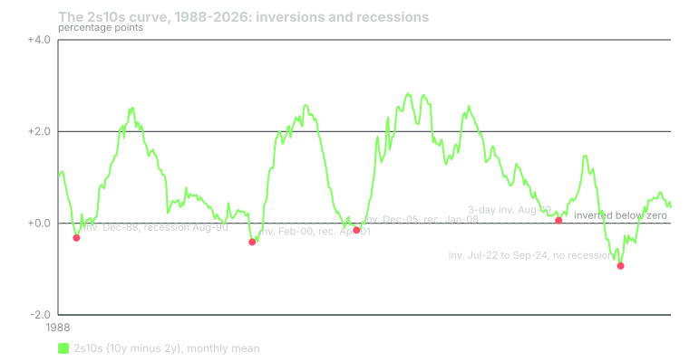

---
{
  "title": "Reading the Fed and the Curve: Fed Funds, 2s10s, 3m10y and What Inversions Predicted",
  "duration": "18 min",
  "free": false,
  "status": "published",
  "quiz": [
    {"q": "The 2s10s spread is:", "opts": ["The 2-year yield minus the 10-year yield", "The difference between the fed funds rate and the 10-year yield", "A Cboe volatility index", "The 10-year constant-maturity Treasury yield minus the 2-year, published daily by FRED as T10Y2Y"], "correct": 3, "explain": "FRED's T10Y2Y is the 10-year minus the 2-year. When it is negative the curve is inverted: short money yields more than long money."},
    {"q": "Counting inversions of at least five trading days since 1976, the 2s10s curve inverted before every recession in the sample. How many such inversions were not followed by a recession within three years?", "opts": ["None", "One: the July 2022 to September 2024 inversion, the longest and deepest in the series, with no recession recorded through August 2026", "Three", "Every inversion since 2000"], "correct": 1, "explain": "The 1998 inversion was followed by the 2001 recession 34 months later, so it counts only loosely. The 2022-2024 inversion, 539 negative sessions with a minimum of -1.08 on 2023-07-03, has produced no NBER recession as of the latest USREC observation."},
    {"q": "The lead time from first 2s10s inversion to recession start, for the six recessions since 1980, ranged from:", "opts": ["About 5 to 24 months, with most between 10 and 20", "1 to 3 months", "Exactly 12 months", "3 to 5 years"], "correct": 0, "explain": "The computed leads were 17.5, 10.6, 19.6 (or 4.8 counting the brief March 1990 re-inversion), 13.9 and 24.2 months, plus 6.2 months for the three-day August 2019 inversion. The signal is real but the timing is useless for a trade."},
    {"q": "SPY's total return in the twelve months after the first 2s10s inversion was +20.6% (1998), -1.2% (2000), +15.7% (2005) and +16.6% (2022). What should a trader conclude?", "opts": ["Inversions are bullish", "The 2000 case proves inversions predict crashes", "An inversion is not a sell signal for the index on any horizon a trader can hold; it is a statement about the economy a year or two out", "The data is wrong"], "correct": 2, "explain": "Three of four twelve-month windows after inversion were strongly positive. Selling the index on an inversion has been a poor trade; the information is about the cycle, not the next year of returns."},
    {"q": "On 2023-07-03 the 3-month bill yielded 5.44%, the 2-year 4.94% and the 10-year 3.86%. Which spread was more inverted, and why does it matter which you watch?", "opts": ["3m10y at -1.58; it matters because the 3-month bill tracks the funds rate directly, so 3m10y inverts later and un-inverts later than 2s10s in a hiking cycle", "2s10s at -1.08; it matters because 2s10s always leads", "They were equal", "Neither was inverted"], "correct": 0, "explain": "The 3-month yield sits on the policy rate. In 2022 the 2s10s inverted in July while 3m10y did not invert until October; in 2024 the 2s10s un-inverted in September while 3m10y first turned positive in December 2024 and then chopped around zero until October 2025. The two spreads are the same story on different clocks."}
  ],
  "task": "Download T10Y2Y and T10Y3M from FRED, plot both from 2018, and mark the first and last negative day of each inversion by hand before reading the next lesson."
}
---

## What the Fed controls and what the market decides

The Federal Open Market Committee sets a target range for the federal funds rate, the overnight rate at which banks lend reserves to one another. The effective rate (FRED DFF) is the volume-weighted average of actual trades and sits inside the range. That is the one interest rate the central bank controls directly. Everything else on the curve, from the 3-month bill to the 30-year bond, is set by the market, and the market sets it by guessing where the funds rate will be over the life of the bond, plus a premium for bearing the uncertainty.

The effective rate's path since 2007 is the skeleton of every regime in this course. It was 5.33% on 2007-09-17, the day before the first cut of the financial crisis; 0.17% on 2008-12-16 after the cut to the zero bound; 0.15% on 2015-12-16, the first hike after seven years at zero; 2.40% on 2019-07-31, the first cut of the mid-cycle adjustment; 0.25% on 2020-03-16, the day after the emergency cut to zero; 0.08% on 2022-03-16 and 0.33% on 2022-03-17, the first hike of the inflation cycle; 5.33% from 2023-07-27 through 2024-09-18; 4.83% on 2024-09-19 after the first cut; and 3.88% on 2026-09-29.

## The curve as a forecast of the Fed

If the 2-year yield is the market's average expected funds rate over the next two years, and the 10-year is the expected average over ten, then the difference between them is a statement about the direction of policy. A positive spread (long yields above short) says the market expects rates to be higher on average later than sooner, which is what you get when the economy is expected to grow and the Fed to stay accommodative or to tighten gradually. A negative spread, an inversion, says short rates are above what the market expects later: the Fed has tightened and the market expects it to have to cut, which is what an expected slowdown looks like from inside the bond market.

Two versions are in common use. The 2s10s (FRED T10Y2Y) is the 10-year constant-maturity yield minus the 2-year, available daily from 1976-06-01. The 3m10y (FRED T10Y3M) is the 10-year minus the 3-month bill, from 1982-01-04; it is the version the Federal Reserve's own recession-probability research uses, because the bill yield sits directly on the policy rate. They tell the same story on different clocks. In a hiking cycle the 2-year rises first (it prices the hikes before they happen), so 2s10s inverts first; the 3-month rises only as the hikes are delivered, so 3m10y inverts later and, at the end of the cycle, un-inverts later.

## What inversions predicted, with dates

The worked example lists every inversion. The summary: since 1976, every NBER recession was preceded by a 2s10s inversion, and every 2s10s inversion of any length was followed by a recession within about three years, until 2022. The July 2022 to September 2024 inversion was the longest and deepest in the series, 539 negative sessions with a minimum of -1.08 percentage points on 2023-07-03, and as of the latest USREC observation (August 2026) no recession has been declared. Whether that is a failure of the signal or an unusually long lead is not knowable yet; a course written in 2024 would have said the same thing about it, and so would a course written in 2007 about the December 2005 inversion, twenty-four months before the recession began.

The lead times are the practical problem. From first inversion to recession start: 17.5 months (1978), 10.6 months (1980), 19.6 months (1988, or 4.8 months counting the brief March 1990 re-inversion), 13.9 months (2000), 24.2 months (2005), 6.2 months (the three-day inversion of August 2019). A signal with a lead of six to twenty-four months is a statement about the cycle. It is not a trade.

## What inversions did not predict

An inversion did not predict the index. SPY's total return in the twelve months after the first day of each 2s10s inversion since the fund's launch: +20.6% after 1998-05-26, -1.2% after 2000-02-02, +15.7% after 2005-12-27, +16.6% after 2022-07-06. Twenty-four months out: +28.9%, -18.3%, +22.1%, +49.1%. Three of four twelve-month windows were strongly positive; only the 2000 case, where the recession arrived within fourteen months and the index fell with it, was negative, and even that took two years to show up.

Nor did inversions time the bear markets that did follow. The 2005 inversion began twenty-one months before SPY's October 2007 peak; the 2000 inversion began seven weeks before the 2000-03-24 peak; the 2022 inversion began six months after the 2022-01-03 peak, when the index had already fallen 19%. If you had sold on each first inversion you would have been early by two years, roughly on time, and late by six months.

## How to use the curve as a regime variable

Treat the sign of the curve as a slow-moving background state, not a trigger. It tells you which kind of environment the growth axis is drifting toward, and it changes rarely: eight multi-week 2s10s inversions in fifty years. It belongs in the classifier as a third indicator that flips the interpretation of the other two (lesson 9 discusses adding it), not as a signal that opens or closes positions by itself. The one operational use is in sizing the tail: a market that is twelve months into an inversion has a higher probability of a growth shock in the next year than one that is not, and the exposure caps of lesson 10 should reflect that.

## Worked example

Data: FRED T10Y2Y (12,579 daily observations, 1976-06-01 to 2026-09-29, after dropping the rows FRED marks with a period), T10Y3M (11,188 observations, 1982-01-04 to 2026-09-29), USREC (monthly NBER recession indicator, 1 in recession months), DFF, DGS10, DGS2, DGS3MO. All pulled 2026-09-30 from `https://fred.stlouisfed.org/graph/fredgraph.csv?id=SERIES`. SPY adjusted closes from the Yahoo Finance chart API as in lesson 1.

An inversion episode is defined as a run of negative daily values with at least five negative sessions; runs separated by fewer than 90 calendar days are merged into one episode. A recession start is the first month USREC reads 1 after reading 0. Lead time is the number of days from the episode's first negative session to the first day of the recession's first month.

Recession starts in the sample: 1980-02, 1981-08, 1990-08, 2001-04, 2008-01, 2020-03.

2s10s episodes (first negative day, last negative day, minimum, negative sessions, next recession, lead): 1978-08-18 to 1980-05-01, -2.41, 423 sessions, 1980-02, 532 days; 1980-09-12 to 1982-07-16, -1.70, 400 sessions, 1981-08, 323 days; 1988-12-13 to 1989-11-06, -0.45, 174 sessions, 1990-08, 596 days; 1990-03-08 to 1990-03-29, -0.14, 16 sessions, 1990-08, 146 days; 1998-05-26 to 1998-07-27, -0.07, 27 sessions, 2001-04, 1,041 days; 2000-02-02 to 2000-12-28, -0.52, 227 sessions, 2001-04, 424 days; 2005-12-27 to 2007-06-05, -0.19, 238 sessions, 2008-01, 735 days; 2022-07-06 to 2024-09-05, -1.08, 539 sessions, none as of 2026-08. Two shorter runs are worth noting because they were widely reported: 2019-08-27 to 2019-08-29 (three sessions, minimum -0.04, 187 days before the 2020-03 recession) and 2022-04-01 to 2022-04-04 (two sessions, -0.05).

3m10y episodes: 1989-03-27 to 1989-12-28 (-0.35, 99 sessions, 492 days to 1990-08); 1998-09-10 to 1998-10-05 (-0.13, 5 sessions); 2000-04-07 to 2001-02-09 (-0.95, 136 sessions, 359 days); 2006-01-17 to 2006-03-01 (-0.07, 9 sessions) and 2006-07-17 to 2007-08-27 (-0.64, 234 sessions, 533 days); 2019-03-22 to 2019-10-10 (-0.52, 104 sessions, 345 days); 2020-01-31 to 2020-03-02 (-0.20, 13 sessions, 30 days); 2022-10-18 to 2025-10-16 (-1.89 on 2023-05-04, 621 negative sessions, none); this last episode first turned positive on 2024-12-13 and then oscillated around zero in runs of a few days until 2025-10-17, after which it stayed positive, which is why the 90-day merge rule treats it as one episode. An eight-session inversion in February 1982 fell inside the 1981-82 recession and is excluded from the lead count.

The 2023-07-03 reading that produced the 2s10s minimum: DGS10 3.86, DGS2 4.94, DGS3MO 5.44. So 2s10s = 3.86 - 4.94 = -1.08 and 3m10y = 3.86 - 5.44 = -1.58. On 2026-09-29: DGS10 5.26, DGS2 4.89, DGS3MO 4.25, giving 2s10s = +0.37 and 3m10y = +1.01, both positive, a normal curve.

SPY forward returns from each first-inversion date: adjusted close 365 and 730 calendar days later (nearest prior session) divided by the adjusted close on the inversion date, minus one. From 2022-07-06: the close on 2023-07-06 was 16.6% higher and the close on 2024-07-05 was 49.1% higher.

## Chart

The chart makes the timing problem visible. Each dip below zero is followed, after a gap of one to two years, by a recession, and each recession is followed by a steep re-steepening as the Fed cuts. The 2022-2024 dip is the deepest on the chart and is the one with no recession beside it. The re-steepening after it happened in 2024-2025 without cuts to zero, which is itself unusual: every earlier un-inversion coincided with an easing cycle.

## Sources

- Federal Reserve Bank of St. Louis, FRED: https://fred.stlouisfed.org/series/T10Y2Y, https://fred.stlouisfed.org/series/T10Y3M, https://fred.stlouisfed.org/series/DFF, https://fred.stlouisfed.org/series/USREC
- Board of Governors of the Federal Reserve System, "Open Market Operations" (target range history): https://www.federalreserve.gov/monetarypolicy/openmarket.htm
- Estrella, A. and Mishkin, F. S. (1998), "Predicting U.S. Recessions: Financial Variables as Leading Indicators", Review of Economics and Statistics 80(1), https://doi.org/10.1162/003465398557320
- Bauer, M. D. and Mertens, T. M. (2018), "Economic Forecasts with the Yield Curve", FRBSF Economic Letter 2018-07: https://www.frbsf.org/research-and-insights/publications/economic-letter/2018/03/economic-forecasts-with-yield-curve/
