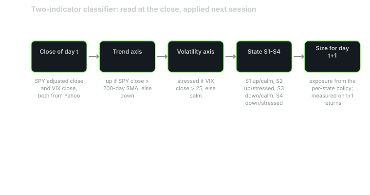
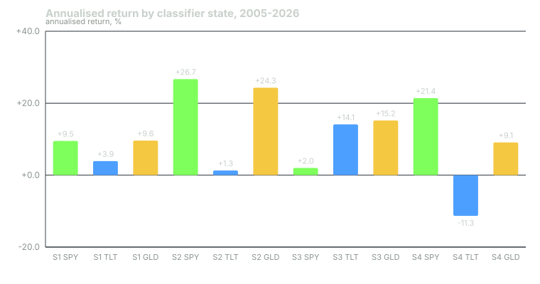

---
{
  "title": "Building a Simple Classifier: Two Indicators, Four States, and How Each Treated SPY, TLT and GLD",
  "duration": "19 min",
  "free": false,
  "status": "published",
  "quiz": [
    {"q": "The classifier reads SPY's close against its 200-day SMA and the VIX close against 25 at the close of day t, and measures returns on day t+1. Why the one-day offset?", "opts": ["To make the numbers look better", "Because Yahoo data is delayed", "Because the state must be knowable before the return it is used to explain; measuring day t's return with day t's state would credit the classifier with information it did not have", "Because the SMA needs an extra day"], "correct": 2, "explain": "This is the same look-ahead discipline as every backtest. A state read at the close is tradeable at the next open at the earliest, so its return is the next session's."},
    {"q": "Over 2005-2026, state S4 (trend down, VIX above 25) had the highest annualised SPY return of the four states (+21.4%) and also 40.8% annualised volatility and a -45.2% within-state drawdown. Which reading is right?", "opts": ["S4 is the best state to own SPY", "The classifier is broken", "S4 never happens", "S4 is where both the crash days and the rebound days live; its mean is high because the rebounds are violent, its drawdown is the worst because the crashes are too, and the mean is the wrong number to size on"], "correct": 3, "explain": "A 40% volatility state with a +21% mean is a lottery ticket, not a regime to be long at full size. Lesson 10 sizes on volatility and drawdown, not on mean."},
    {"q": "Which per-state result was stable across the 2005-2015 and 2016-2026 halves?", "opts": ["GLD in S3 (down/calm): -10.2% then +49.0%", "TLT in S3 (down/calm) was the best TLT state in both halves (+16.0%, +11.1%) and TLT in S4 (down/stressed) was the worst in both (-3.7%, -22.6%)", "SPY in S1 was the best SPY state in both halves", "Nothing was stable"], "correct": 1, "explain": "The bond results line up with the mechanism: an orderly equity decline is a growth scare, which is good for bonds; a stressed decline includes the rates shocks (2022) and forced liquidations (2008, 2020) that hurt them. GLD in S3 flipped sign between halves, which is what an unstable result looks like."},
    {"q": "The classifier changed state 320 times in 21.7 years, with a median run length of three sessions and 215 of 321 runs lasting five sessions or fewer. What does this imply for using the states directly as trading signals?", "opts": ["Most state changes are short-lived flickers around a threshold; a policy that trades every change will pay for two thirds of them and gain from a few, so the states are better used to set exposure ranges than to fire trades", "The states are perfect signals", "The thresholds should be changed until the flickers disappear", "The classifier needs more indicators"], "correct": 0, "explain": "Flicker is a property of any threshold rule on a noisy input. Tuning the thresholds to remove it in-sample is the overfit the course warns against; using the state as a slow input to sizing is the honest use."},
    {"q": "Adding the 2s10s sign as a third indicator would produce eight states. The lesson recommends against it for this sample because:", "opts": ["The curve is useless", "Three indicators is too many to compute", "The curve and the VIX are the same thing", "Eight states over 5,468 days leaves several with a few dozen observations, and the 2s10s changed sign only a handful of times in the window, so the extra states would mostly be one episode each: a description of history, not a distribution"], "correct": 3, "explain": "A state's statistics are only meaningful if the state recurred. With four states the smallest has 254 days spread across several episodes; with eight, some would be a single episode."}
  ],
  "task": "Compute today's state from SPY's adjusted close versus its 200-day SMA and the VIX close versus 25, and write down which of S1-S4 it is and how many sessions it has been there."
}
---

## Design choices

A classifier is a rule that maps observable variables to a small number of named states. The design decisions are which variables, which thresholds, how many states, and when the state is read. Each decision trades information against sample size: more variables and finer thresholds give states that describe the environment more precisely and recur less often, and a state that recurred twice has no distribution, only a history.

This lesson builds the smallest classifier that captures two of the four axes. Trend: SPY's adjusted close above or below its 200-session SMA (lesson 7). Volatility: the VIX close above or below 25 (lesson 6). Two binary readings give four states, named S1 to S4. The state is read at the close of day t and the returns attributed to it are those of day t+1, for SPY, TLT and GLD. That is the look-ahead discipline every test in this course follows, and it is the reason the numbers below are smaller and less tidy than the ones you will see in charts that shade regimes after the fact.

The threshold of 25 for the VIX is near the 85th percentile of its history, so the stressed states are rare by construction. The 200-day is the 200-day. Neither was tuned to this sample, and you should be suspicious of any classifier whose thresholds were.

## What the four states are

S1, trend up and VIX at or below 25, is the default state: 75.7% of sessions from 2005 to 2026. S2, trend up and VIX above 25, is rare (4.6%): the market is above its long average but something has spooked it, which is usually the first days of a decline or the last days of a recovery. S3, trend down and VIX at or below 25 (8.2%), is an orderly decline or a slow base: the market is below its average but nobody is panicking. S4, trend down and VIX above 25 (11.4%), is the crisis state, and it is where both the worst and the best sessions in the sample live.

## What each state did to SPY, TLT and GLD

The worked example has the full table. The headline results, annualised over 2005-01-03 to 2026-09-29:

SPY earned +9.5% in S1 with 12.0% volatility, +26.7% in S2 with 22.8%, +2.0% in S3 with 19.8%, and +21.4% in S4 with 40.8% volatility and a -45.2% within-state drawdown. The equity result is not "up-trend good, down-trend bad". It is: calm states have moderate returns and moderate volatility; stressed states have high mean returns, because the rebounds are violent, and volatility two to three times higher, because the crashes are too. S3, the orderly decline, is the only state where SPY's mean is near zero.

TLT earned +3.9% in S1, +1.3% in S2, +14.1% in S3 and -11.3% in S4. The bond result is the cleanest of the three: bonds are the hedge in an orderly equity decline (S3) and a liability in a disorderly one (S4), because S4 contains both the 2008 and 2020 liquidations and the 2022 rates shock.

GLD earned +9.6% in S1, +24.3% in S2, +15.2% in S3 and +9.1% in S4. Gold did well in every state on average, best in the two down-trend-or-stressed states, and its -49.2% drawdown in S1 is a reminder that the 2011-2015 gold bear happened entirely inside the calm, up-trend equity state.

Buy-and-hold over the same window, for scale: SPY +10.9% with 18.9% volatility and -55.2% drawdown; TLT +2.7%, 14.5%, -48.4%; GLD +10.6%, 18.3%, -45.6%.

## Which results survive a split

Splitting the sample into 2005-2015 and 2016-2026 is the cheapest test of whether a per-state result is a property of the state or of one episode. Stable: SPY's mean in S2 exceeded S1 in both halves (+30.5% against +5.4%; +23.6% against +13.6%); SPY in S3 was the lowest equity state in both halves (+1.0%, +4.8%); TLT in S3 was the best bond state in both (+16.0%, +11.1%) and TLT in S4 the worst in both (-3.7%, -22.6%). Unstable: GLD in S3 was -10.2% in the first half and +49.0% in the second; TLT in S2 was +9.2% then -4.7%. The unstable results are the ones you should not size on.

## Flicker

The classifier changed state 320 times, a mean run of 17 sessions but a median of three, and 215 of the 321 runs lasted five sessions or fewer. Most state changes are the VIX crossing 25 and crossing back, or SPY closing a few cents either side of its average. If you traded every change you would pay a spread 320 times for a few dozen changes that mattered. The states are therefore inputs to a sizing policy that moves exposure gradually (lesson 10), not triggers for trades.

## Why not a third indicator

The obvious addition is the sign of the 2s10s curve, which would give eight states. The problem is sample size. The 2s10s inverted in 2005-2007, briefly in 2019, and in 2022-2024; the eight-state table would have several cells that are one episode each, and one episode is a history, not a distribution. The credit spread has the same problem with the added defect that FRED served only three years of it. The right way to use the slow axes is as modifiers on the sizing policy (a lower cap in S4 when the curve has been inverted for a year, for instance), where a judgement can be written down and audited without pretending it was measured.

## Worked example

Data: Yahoo Finance chart API daily bars, current session dropped, adjusted closes for SPY (from 1993-01-29), TLT (from 2002-07-30), GLD (from 2004-11-18) and the `^VIX` close. The 200-session SMA of SPY's adjusted close is computed on the full SPY history so it is available from the first day of the test. The test window is 2005-01-03 to 2026-09-29, the first date on which all four series exist with a full SMA and a prior session; that is 5,468 return days.

For each pair of consecutive sessions (t, t+1): the state on t is (SPY close on t > SMA200 on t, VIX close on t > 25). The return attributed to the state is close(t+1) / close(t) - 1 for each of SPY, TLT and GLD. Within each state the returns are compounded in sequence to form a within-state equity curve; annualised return is that curve's terminal value raised to 252 over the state's day count, minus one; annualised volatility is the standard deviation of the state's daily returns times sqrt(252); drawdown is the largest peak-to-trough fall of the within-state curve.

State counts: S1 4,141 days (75.7%), S2 254 (4.6%), S3 447 (8.2%), S4 626 (11.4%). Check: 4,141 + 254 + 447 + 626 = 5,468.

Per-state results (annualised return, annualised volatility, within-state drawdown): S1: SPY +9.5%, 12.0%, -24.9%; TLT +3.9%, 12.6%, -29.4%; GLD +9.6%, 16.5%, -49.2%. S2: SPY +26.7%, 22.8%, -28.5%; TLT +1.3%, 15.9%, -13.2%; GLD +24.3%, 16.2%, -9.9%. S3: SPY +2.0%, 19.8%, -24.2%; TLT +14.1%, 14.1%, -9.2%; GLD +15.2%, 18.7%, -23.9%. S4: SPY +21.4%, 40.8%, -45.2%; TLT -11.3%, 23.5%, -43.7%; GLD +9.1%, 27.7%, -28.5%.

A check on one number: the S4 SPY mean daily return is +27.7% / 252 = 0.110% per day; compounding 626 days of returns with that mean and a daily standard deviation of 40.8% / sqrt(252) = 2.57% loses about half the daily variance to compounding drag (0.5 times 0.0257 squared = 0.033% per day), so the compounded annualised figure (+21.4%) is well below the arithmetic one (+27.7%). The gap between the two is itself a measure of how wide the state is.

State transitions: 320 changes; run lengths have mean 17.0 sessions and median 3; 215 of 321 runs are five sessions or shorter.

Split halves (SPY, TLT, GLD annualised by state). 2005-01-03 to 2015-12-31 (2,768 days): S1 +5.4%, +7.7%, +7.6%; S2 +30.5%, +9.2%, +41.4%; S3 +1.0%, +16.0%, -10.2%; S4 +13.8%, -3.7%, +14.2%. 2016-01-04 to 2026-09-29 (2,699 days): S1 +13.6%, +0.5%, +11.4%; S2 +23.6%, -4.7%, +11.8%; S3 +4.8%, +11.1%, +49.0%; S4 +35.2%, -22.6%, +1.0%.

## Chart

The chart shows twelve numbers and hides twelve more. Every bar in the S4 group sits on a volatility two to three times that of the same asset in S1, and the S4 SPY bar in particular is the average of the worst and best days in twenty-one years. Read the bars as the location of each distribution and the worked example's volatility and drawdown columns as its width. Sizing, in the next lesson, is done on the width.

## Sources

- Yahoo Finance historical data: https://finance.yahoo.com/quote/SPY/history/, https://finance.yahoo.com/quote/TLT/history/, https://finance.yahoo.com/quote/GLD/history/, https://finance.yahoo.com/quote/%5EVIX/history/
- Cboe, VIX Index methodology: https://www.cboe.com/tradable_products/vix/vix_index_methodology/
- Hamilton, J. D. (1989), "A New Approach to the Economic Analysis of Nonstationary Time Series and the Business Cycle", Econometrica 57(2), https://doi.org/10.2307/1912559
- Guidolin, M. and Timmermann, A. (2007), "Asset Allocation under Multivariate Regime Switching", Journal of Economic Dynamics and Control 31(11), https://doi.org/10.1016/j.jedc.2006.12.004
