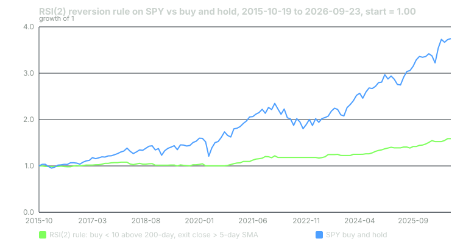

---
{
  "title": "RSI(2) and Connors-Style Reversion on SPY",
  "duration": "20 min",
  "free": false,
  "status": "published",
  "quiz": [
    {"q": "On 2025-05-21 SPY fell 9.99 points. With Wilder smoothing over two periods, the average down move went from 1.006 to 5.498 and the average up move from 1.05 to 0.525. RSI(2) was therefore:", "opts": ["About 51", "About 8.7", "About 92", "Exactly 0"], "correct": 1, "explain": "RS = 0.525 / 5.498 = 0.0955; RSI = 100 − 100 / (1 + 0.0955) = 8.7. One large down day after a small one is enough to push a two-period RSI into single digits."},
    {"q": "Across the seven exit and filter variants tested, the exit that made the least money per trade was:", "opts": ["Close above the 5-day SMA", "RSI(2) above 70", "Fixed five days", "Sell at the next close"], "correct": 3, "explain": "Selling at the next close earned +0.172% per trade and +21.8% in total, against +0.527% and +62.5% for the 5-day SMA exit. The reversion after an RSI(2) reading below 10 plays out over three to five days, not one."},
    {"q": "Signals that occurred with SPY below its 200-day average (which the rule skips) had an average five-day forward return of +1.003% versus +0.521% for signals above it. Why keep the filter?", "opts": ["Because the filtered signals lose money", "Because the unfiltered version's worst trade was −11.35% and its maximum drawdown −21.4%, against −4.15% and −7.2% with the filter; the filter trades average return for survivability", "Because 200 is a round number", "Because the filter increases the trade count"], "correct": 1, "explain": "The filter costs return per signal and total return (+62.5% vs +86.7%) but removes the trades taken into a collapsing market. Which you prefer depends on how you size, which is lesson 11."},
    {"q": "Over 2015-10-19 to 2026-09-23 the base rule (RSI(2) < 10, above the 200-day, exit above the 5-day SMA) earned +62.5% while in the market 11% of the time. SPY buy-and-hold earned +277.5%. The honest comparison is:", "opts": ["The rule beat the market", "The rule earned about 5.6% per year on average with a −7.2% worst drawdown while holding cash 89% of the time; it did not beat buy-and-hold and was never designed to", "The rule is useless", "Buy-and-hold had a smaller drawdown"], "correct": 1, "explain": "Buy-and-hold's maximum drawdown over the same period was −34.1%. The rule's economics are a modest return with a small footprint; whether that is worth your attention is a question about what else the capital would do."},
    {"q": "In February 2025 the rule bought at the close of 02-21 with RSI(2) at 6.4 and exited 02-28 at −0.98%. The next four days also printed RSI(2) below 10 with negative five-day forward returns. What does that episode show?", "opts": ["The rule is broken", "That an oversold reading in a market that has begun to trend down keeps getting more oversold; the exit rule capped the loss at under 1% and the 200-day filter then kept the rule out of March and early April", "That RSI(2) should be replaced by RSI(14)", "That the exit should be a fixed 20 days"], "correct": 1, "explain": "SPY crossed below its 200-day average in March 2025 and the rule took no trades until 05-21. It missed the +8.3% five-day bounce after the 04-08 signal, and it also missed the −9.1% five-day drop after the 03-28 signal."}
  ],
  "task": "Compute RSI(2) for SPY over the last 60 trading days by hand or in a spreadsheet, using Wilder smoothing, and list every close on which it was below 10."
}
---

The two-period RSI is the most widely used short-term reversion trigger on index ETFs, popularised by Larry Connors and Cesar Alvarez in the late 2000s. It is worth studying because it is simple enough to compute by hand, because it has a real test history, and because the interesting part is not the entry at all. The entry finds an oversold day. The exit decides whether you make money. This lesson computes the indicator, runs the rule on eleven years of SPY, and compares four exits so you can see that for yourself.

## The indicator

Wilder's RSI over n periods uses smoothed averages of up moves and down moves. Start with simple averages of the first n changes, then update each day:

avgU_t = (avgU_{t−1} × (n − 1) + U_t) / n, where U_t is the day's gain if positive, else 0
avgD_t = (avgD_{t−1} × (n − 1) + D_t) / n, where D_t is the day's loss if negative, else 0
RS = avgU / avgD; RSI = 100 − 100 / (1 + RS)

With n = 2, each day's change gets half the weight and the previous average gets the other half, so the indicator reacts to the last two or three sessions and almost nothing else. Two consecutive down days of any size push it below 10. That is the point: it is a detector of very short-term selling, not of trend.

## The rule

Connors' base rule for SPY, as tested here:

1. SPY's close is above its 200-day simple moving average (a long-term trend filter).
2. RSI(2) closes below 10.
3. Buy at that close.
4. Sell at the first close above the 5-day simple moving average.

The entry at the close assumes a market-on-close order or a trade in the last minute; the closing auction in SPY is deep enough that this is realistic. Cost is set at 0.01% per side, twice the actual half-spread of a one-cent-wide quote on a $580 ETF, to leave room for slippage.

## Worked example

Data: Yahoo Finance daily closes for SPY, `interval=1d`, 2015-01-02 to 2026-09-23, pulled 2026-09-24. The 200-day average needs 200 closes, so the first tradeable day is 2015-10-19; there are 2,748 tradeable days.

**The May 2025 signal.** Closes: 05-16 594.20, 05-19 594.85 (+0.65), 05-20 592.85 (−2.00), 05-21 582.86 (−9.99). Running the Wilder averages forward through the full history gives, on 05-20, avgU = 1.05 and avgD = 1.006, so RSI(2) = 100 − 100 / (1 + 1.05 / 1.006) = 51.1. On 05-21 the move is a 9.99-point loss:

avgU = (1.05 × 1 + 0) / 2 = **0.525**
avgD = (1.006 × 1 + 9.99) / 2 = **5.498**
RS = 0.525 / 5.498 = 0.0955
RSI(2) = 100 − 100 / 1.0955 = **8.7**

The 200-day SMA on 05-21 is 575.14, below the 582.86 close. Both conditions hold: buy at 582.86.

- 05-22: close 583.09, 5-day SMA 589.57. Not above. Hold. (RSI(2) = 12.1.)
- 05-23: close 579.11, 5-day SMA 586.55. Hold. (RSI(2) = 5.3, a second signal you are already in.)
- 05-27: close 591.15, 5-day SMA 585.81. Above. Sell at 591.15.

Return: 591.15 / 582.86 − 1 = +1.422%, minus 0.02% costs = **+1.40%** in three trading days.

**All trades, 2015-10-19 to 2026-09-23.** The base rule fired 94 times. 75.5% of trades were profitable; the average trade returned **+0.527%**, the average winner +1.15%, the average loser −1.40%; the average holding period was 3.3 days; the rule was in the market on 309 of 2,748 days, 11%. Compounded, the trades total **+62.5%**. The worst trade was −4.15% (bought 2020-02-24, sold 2020-03-02) and the deepest drawdown of the trade-by-trade equity curve was **−7.2%**. SPY buy-and-hold over the same window: +277.5% with a −34.1% drawdown.

By year the rule made money in nine of twelve calendar years, with 2015 (one trade, −1.27%), 2018 (−5.94% over nine trades) and 2022 (−2.93% over two) the losers, and 2021 (+13.86%) and 2024 (+13.67%) the best.

**Forward returns by RSI(2) level, all tradeable days.** The five-day forward return of SPY grouped by that day's RSI(2):

- 0 to 5 (113 days): **+0.482%**, positive 62.8% of the time
- 5 to 10 (137 days): **+0.880%**, positive 67.2%
- 10 to 30 (455): +0.300%
- 30 to 70 (828): +0.237%
- 70 to 90 (706): +0.155%
- 90 to 95 (236): +0.361%
- 95 to 100 (268): +0.122%
- All days (2,743): +0.268%

Below 10, the five-day forward return is two to three times the unconditional average. Above 95 it is below average but still positive: the "overbought" side does not give you a short. This is the asymmetry from lesson 1 again.

**The filter's real effect.** Split the sub-10 readings by the 200-day filter: above the average, 157 readings with a five-day forward return of +0.521%; below it, 93 readings with +1.003%. The filter removes the more profitable signals on average. It also removes the ones taken during crashes. Without the filter (variant E below) the rule takes 128 trades, earns +86.7%, and suffers a −11.35% single trade and a −21.4% drawdown.

## Seven variants

| Variant (SPY, 2015-10-19 to 2026-09-23, 0.01% per side) | Trades | Win rate | Avg trade | Total | Max drawdown | Avg hold |
|---|---|---|---|---|---|---|
| A. Exit: close > 5-day SMA, 200-day filter on | 94 | 75.5% | +0.527% | +62.5% | −7.2% | 3.3 d |
| B. Exit: RSI(2) > 70, filter on | 89 | 82.0% | +0.580% | +65.4% | −6.6% | 4.6 d |
| C. Exit: fixed 5 days, filter on | 93 | 71.0% | +0.650% | +79.2% | −9.5% | 5.0 d |
| D. Exit: next close, filter on | 119 | 64.7% | +0.172% | +21.8% | −12.2% | 1.0 d |
| E. Exit: 5-day SMA, filter off | 128 | 76.6% | +0.509% | +86.7% | −21.4% | 3.4 d |
| F. Entry RSI(2) < 5, exit 5-day SMA, filter on | 49 | 75.5% | +0.585% | +32.3% | −7.7% | 3.2 d |
| G. Entry RSI(2) < 15, exit 5-day SMA, filter on | 133 | 74.4% | +0.381% | +63.7% | −7.3% | 3.3 d |
| SPY buy and hold | — | — | — | +277.5% | −34.1% | — |

Source: Yahoo Finance daily closes, computed by the course. Totals are compounded trade returns.

## The exit that makes or breaks it

Compare rows A and D. Same entries, same filter, and the only change is selling at the next close instead of waiting for the 5-day average. Average trade falls from +0.527% to +0.172%; total from +62.5% to +21.8%. The oversold reading is not a one-day event; the bounce takes three to five sessions to develop, and an exit that does not give it that time captures a third of it. Row C, a fixed five-day hold, captures the most (+79.2%) at the cost of a deeper drawdown, because it holds through days on which the SMA exit would already have taken a profit and the market turned back down.

Row B is instructive in a different way. Exiting on RSI(2) above 70 wins 82% of the time, the highest hit rate in the table, and has the largest average loser, −2.29%. When the bounce does not come, the RSI never reaches 70 and the trade sits until it does, which can be a long way down. High win rates and large losers travel together in reversion; lesson 11 is about why that combination fools people.

## Chart

Spring 2025 shows both failure modes in one window. From 02-21 to 02-27 the indicator printed below 10 on five consecutive days, all above the 200-day average, all followed by negative five-day returns; the rule bought once on 02-21 and the SMA exit took it out on 02-28 for −0.98%. Then SPY crossed below its 200-day average and the rule went quiet: it did not buy the 03-28 signal (five-day forward −9.1%) and it did not buy the 04-08 signal (+8.3%). The filter's job is to skip both, and it did.

The equity curve is the rule's honest summary. It is nearly flat through 2017 to 2020, climbs in 2021 and again from 2023, and never approaches buy-and-hold. What it offers is a return with a small footprint: 11% market exposure, −7.2% worst drawdown, and no dependence on the index going up over the year. Whether that is useful depends entirely on what the other 89% of the time does with the capital, and on whether the next eleven years keep the daily reversal that lesson 2 showed was strong in these.

## Sources

- Wilder, J. W. (1978). *New Concepts in Technical Trading Systems*. Trend Research, Greensboro. ISBN 0-89459-027-8. https://www.worldcat.org/isbn/0894590278
- Lo, A. W. and MacKinlay, A. C. (1990). When are contrarian profits due to stock market overreaction? *Review of Financial Studies*, 3(2), 175–205. https://doi.org/10.1093/rfs/3.2.175
- Jegadeesh, N. (1990). Evidence of predictable behavior of security returns. *Journal of Finance*, 45(3), 881–898. https://doi.org/10.1111/j.1540-6261.1990.tb05110.x
- Yahoo Finance, SPY historical data: https://finance.yahoo.com/quote/SPY/history/
