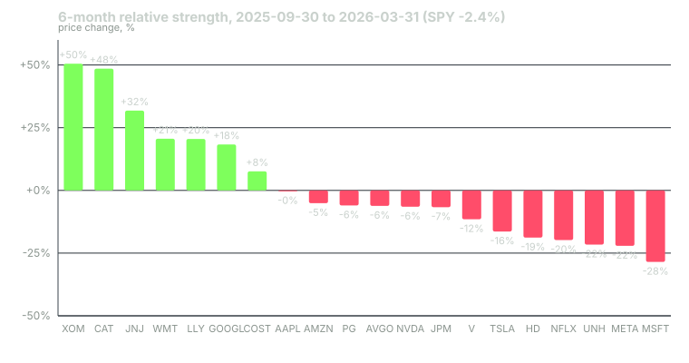

---
{
  "title": "Relative Strength: Ranking a Universe",
  "duration": "16 min",
  "free": false,
  "status": "published",
  "quiz": [
    {"q": "Relative strength, as used in this lesson, is:", "opts": ["A stock's RSI(14) reading", "A stock's price change over a lookback window compared with the same figure for its peers", "The ratio of a stock's volume to its average volume", "A stock's beta to the S&P 500"], "correct": 1, "explain": "Relative strength is a cross-sectional comparison: the same lookback return computed for every name in the universe, then ranked. It has nothing to do with Wilder's RSI oscillator."},
    {"q": "On 2026-03-31, the six-month relative-strength sort of the 20-stock universe put which names on top?", "opts": ["NVDA, AVGO, MSFT", "XOM, CAT, JNJ", "TSLA, META, NFLX", "AAPL, AMZN, GOOGL"], "correct": 1, "explain": "XOM (+50.5%), CAT (+48.5%) and JNJ (+31.8%) led; the large-cap technology names were in the bottom half after a weak six months."},
    {"q": "Why does the academic 12-1 formation skip the most recent month?", "opts": ["Data for the last month is unreliable", "Returns over the most recent month tend to reverse, which would contaminate the ranking", "It reduces the number of trades", "It is required by exchange rules"], "correct": 1, "explain": "One-month returns show short-term reversal (Jegadeesh 1990), so including them in the ranking mixes a reversal effect into a continuation signal."},
    {"q": "Over the three months after the 2026-03-31 ranking, the top-five names averaged +11.3%, the bottom five +6.9% and SPY +14.8%. What is the honest reading?", "opts": ["Relative strength failed completely", "The ranking ordered the names correctly but the whole universe lagged the index, so a long-only book would have underperformed SPY", "The bottom five were the best buys", "SPY's return is irrelevant to the comparison"], "correct": 1, "explain": "The spread between top and bottom was positive, which is what a cross-sectional signal promises. It does not promise to beat the benchmark in any given quarter, and here it did not."},
    {"q": "Which filter is the most defensible addition to a raw relative-strength rank for a swing trader?", "opts": ["Exclude any stock that has already risen more than 20%", "Require the price to be above a rising 50-day average so you are not buying a name whose strength is entirely six months old", "Only rank stocks under $50", "Rank on the last five days only"], "correct": 1, "explain": "A trend filter on the daily chart checks that the strength is current. Capping the lookback return would remove exactly the names momentum research says to hold."}
  ],
  "task": "Pick 20 liquid stocks you can name from memory, download six months of daily closes for each from Yahoo Finance, compute the six-month percentage change and rank them, then note the sector of the top five."
}
---

Momentum research ranks thousands of stocks. You will rank twenty, or fifty, or whatever your watchlist holds. The mechanics are the same and they are simple enough to do in a spreadsheet, which is the point: a ranking you can reproduce by hand is a ranking you will trust when it tells you something you do not want to hear.

## What relative strength measures

Relative strength is a comparison, not an indicator. You compute the same quantity for every stock in a universe, then order the list. The quantity is usually a price change over a lookback window: the close today divided by the close N trading days ago, minus one. A stock is "strong" only in relation to the others on the list, so the same +8% can rank first in a flat tape and last in a roaring one.

Robert Levy's 1967 paper is the origin of the idea in the finance literature. He ranked stocks on the ratio of the current price to the 26-week average price and found that the top-ranked names continued to outperform. Jegadeesh and Titman formalised the same thing as a sort on 3-to-12-month past returns. The lookback is the main choice you make.

Three lookbacks are common and they answer different questions:

- **Three months (about 63 trading days).** Sensitive, turns quickly, catches new leaders early and produces more churn.
- **Six months (about 126 days).** The classic swing-trader horizon and the one this course uses for the capstone.
- **Twelve months skipping the most recent one (12-1).** The academic standard because the last month tends to reverse, and including it would mix a reversal signal into a continuation signal.

You can also blend them. A common blend is the average of the 3-, 6- and 12-month percentile ranks, which rewards a stock that is strong on every horizon and penalises one that made its whole gain in a single week. Blends are more stable but harder to audit, and this course prefers auditable.

## Building the universe

The ranking is only as good as the list you rank. Three rules keep it honest.

First, fix the list before you look at returns. If you add a stock because it "has been strong lately", you have already ranked it in your head, and the formal ranking becomes theatre. Write the list down with a date.

Second, require liquidity. A stock you cannot exit in one session without moving the price does not belong on a swing list. A minimum of a few million dollars of average daily dollar volume is a sensible floor for a retail account.

Third, decide what to do about sector clumping. Momentum rankings often put five names from one sector at the top because a sector theme is what drove them. That is information, not a defect, but it means the top five is one bet, not five. You can cap the number of names per sector or simply size the book knowing the concentration is there.

## Worked example

The universe is the twenty stocks used throughout this course: AAPL, MSFT, NVDA, AMZN, GOOGL, META, TSLA, AVGO, JPM, V, UNH, LLY, XOM, COST, HD, PG, NFLX, CAT, WMT and JNJ. Data are daily closes from Yahoo Finance's chart API (for example `https://query1.finance.yahoo.com/v8/finance/chart/XOM?range=2y&interval=1d`), pulled on 2026-09-24. Yahoo's closes are split-adjusted but not dividend-adjusted, which is fine for a price-based ranking.

The ranking date is 2026-03-31 and the lookback is six months, so the starting close is 2025-09-30. The formula for each stock is:

RS = close(2026-03-31) / close(2025-09-30) − 1

For XOM: 169.66 / 112.75 − 1 = 1.5047 − 1 = **+50.5%**.
For CAT: 708.46 / 477.15 − 1 = 1.4848 − 1 = **+48.5%**.
For MSFT: 370.17 / 517.95 − 1 = 0.7147 − 1 = **−28.5%**.

SPY over the same window went from 665.94 to 649.78 for **−2.4%**, so the whole universe is being ranked inside a flat-to-down six months for the index. Here is the full sort:

| Rank | Ticker | Close 2025-09-30 | Close 2026-03-31 | 6-month RS |
|---|---|---|---|---|
| 1 | XOM | 112.75 | 169.66 | +50.5% |
| 2 | CAT | 477.15 | 708.46 | +48.5% |
| 3 | JNJ | 185.42 | 244.44 | +31.8% |
| 4 | WMT | 103.06 | 124.28 | +20.6% |
| 5 | LLY | 763.00 | 919.77 | +20.5% |
| 6 | GOOGL | 243.10 | 287.56 | +18.3% |
| 7 | COST | 925.63 | 996.43 | +7.6% |
| 8 | AAPL | 254.63 | 253.79 | −0.3% |
| 9 | AMZN | 219.57 | 208.27 | −5.1% |
| 10 | PG | 153.65 | 144.44 | −6.0% |
| 11 | AVGO | 329.91 | 309.51 | −6.2% |
| 12 | NVDA | 186.58 | 174.40 | −6.5% |
| 13 | JPM | 315.43 | 294.16 | −6.7% |
| 14 | V | 341.38 | 302.24 | −11.5% |
| 15 | TSLA | 444.72 | 371.75 | −16.4% |
| 16 | HD | 405.19 | 328.89 | −18.8% |
| 17 | NFLX | 119.89 | 96.15 | −19.8% |
| 18 | UNH | 345.30 | 270.59 | −21.6% |
| 19 | META | 734.38 | 572.13 | −22.1% |
| 20 | MSFT | 517.95 | 370.17 | −28.5% |

Notice the shape. Only seven of twenty names beat zero; the top five is an energy name, an industrial, two defensives and a pharmaceutical; every large technology platform except GOOGL sits in the bottom half. A trader who believed "strong stocks" meant the 2024 leaders would have found the list uncomfortable. That discomfort is the ranking doing its job.

Now the honest part: what happened next. Over the following three months, to 2026-06-30, the top five averaged **+11.3%**, the bottom five averaged **+6.9%**, and SPY returned **+14.8%**. The cross-sectional spread was positive by 4.4 points, so the sort ordered the names in the right direction. But a long-only book of the top five would have lagged the index by 3.5 points, because the rebound that quarter was led by the beaten-down platforms the ranking had put at the bottom. Both statements are true, and you should be able to hold both at once. Relative strength promises that winners beat losers on average over many periods. It does not promise to beat SPY in a given quarter, and on this date it did not.

## Chart

## Filters worth adding, and one that is not

A raw rank tells you where a stock has been. Two cheap filters check that the strength is current:

- **Price above a rising 50-day average.** This removes names whose gain is five months old and that have since rolled over. On 2026-03-31, this filter would have questioned nothing in the top five, but on other dates it routinely removes one or two.
- **Not more than two ATRs below the 20-day high.** This stops you buying a strong-ranked name in the middle of a sharp pullback; you would rather wait for the trigger in lesson 5.

The filter that is not worth adding is a cap on how far a stock has already risen. Traders add it out of instinct ("it has gone too far") and it removes exactly the names that momentum research says continue. If a +50% name worries you, size it smaller. Do not delete it from the list.

## Cadence

Re-rank on a fixed schedule: weekly is typical for a swing book, monthly for a slower one. Between rankings the list does not change, even when a stock in position 12 has a great week. The discipline is not that the schedule is optimal; it is that a fixed schedule cannot be gamed by your mood.

Keep every ranking you produce, with its date. In lesson 12 you will test whether the top-ranked names in your own lists actually went on to do better than the bottom-ranked ones, and you cannot run that test on rankings you did not save.

## Sources

- Levy, R. A. (1967). Relative strength as a criterion for investment selection. *Journal of Finance*, 22(4), 595–610. https://doi.org/10.1111/j.1540-6261.1967.tb00295.x
- Jegadeesh, N. and Titman, S. (1993). Returns to buying winners and selling losers: implications for stock market efficiency. *Journal of Finance*, 48(1), 65–91. https://doi.org/10.1111/j.1540-6261.1993.tb04702.x
- Jegadeesh, N. (1990). Evidence of predictable behavior of security returns. *Journal of Finance*, 45(3), 881–898. https://doi.org/10.1111/j.1540-6261.1990.tb05110.x
- Yahoo Finance historical data, e.g. XOM: https://finance.yahoo.com/quote/XOM/history/
