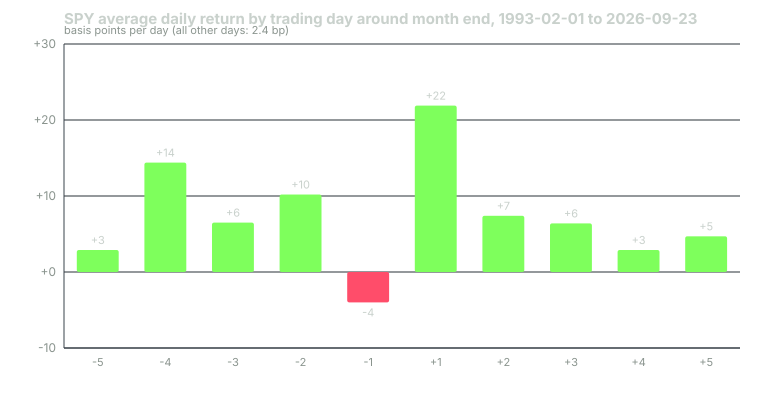

---
{
  "title": "The Calendar: Turn-of-Month and Seasonality",
  "duration": "16 min",
  "free": false,
  "status": "published",
  "quiz": [
    {"q": "In the SPY sample from 1993 to 2026, the single strongest trading day relative to month end was:", "opts": ["The last trading day of the month, at −4.0 basis points", "The first trading day of the new month, at +21.9 basis points", "The fifth day before month end", "The tenth day of the month"], "correct": 1, "explain": "Day +1 averaged +21.9 bp against +2.4 bp for days outside the ten-day window. The last day of the month was actually slightly negative in this sample, which differs from the older Dow-based findings."},
    {"q": "Over the four-day window from the last trading day through the third day of the new month, SPY averaged 7.9 bp per day versus 4.0 bp on all other days. Roughly what share of the sample's total return came from that window?", "opts": ["About 5%", "About a third, from about a fifth of the trading days", "All of it", "None; the window was negative"], "correct": 1, "explain": "7.9 bp × 1,615 days is about 12,760 bp; 4.0 bp × 6,854 days is about 27,420 bp. The window is 19% of the days and 32% of the return."},
    {"q": "Splitting the sample at 2010, the window's advantage over other days was 5.8 bp per day before and 2.0 bp per day after. The honest reading is:", "opts": ["The effect has disappeared", "The effect is still positive but has narrowed, mostly because ordinary days got better rather than the window getting worse", "The effect reversed", "The split is meaningless"], "correct": 1, "explain": "The window averaged 8.4 bp then 7.5 bp; other days averaged 2.6 bp then 5.5 bp. Anomalies that shrink after publication are the norm, and this one shrank."},
    {"q": "By average monthly return in the SPY sample, the only calendar month with a negative mean was:", "opts": ["February", "June", "September", "December"], "correct": 2, "explain": "September averaged −0.45% with 56% of Septembers positive. February was flat at 0.00%. Every other month averaged a gain."},
    {"q": "What does this lesson recommend a swing trader do with calendar effects?", "opts": ["Trade only on the first day of each month", "Treat them as small tilts on timing and risk, never as a reason to enter without a setup or to skip a valid one", "Close all positions every September", "Ignore them entirely"], "correct": 1, "explain": "The effects are real but a few basis points a day. They are worth knowing when you schedule rankings and manage risk into month end; they are not a strategy."}
  ],
  "task": "Using SPY daily closes for the last 36 months from Yahoo Finance, compute the average return on the first trading day of each month and on all other days, and compare."
}
---

Some of the oldest results in empirical finance are about the calendar: returns cluster around the turn of the month, and the winter half of the year has beaten the summer half. Both effects show up in the data this course pulls, and both are smaller than the folklore suggests. This lesson computes them from thirty-three years of SPY so you know their real size, then tells you what a swing trader should and should not do with them.

## What the literature found

Lakonishok and Smidt (1988) examined ninety years of the Dow Jones Industrial Average and found that the last trading day of a month and the first three of the next carried most of the index's gain. McConnell and Xu (2008) updated the finding through 2005 with broader indices and reported that the turn-of-month days accounted for essentially the whole equity premium in their sample; returns on the remaining days were about zero. The proposed mechanisms are institutional: pension contributions, salary-linked retirement plan flows and month-end fund rebalancing arrive on a schedule.

Bouman and Jacobsen (2002) documented the "Halloween indicator": in 36 of 37 countries, returns from November through April exceeded returns from May through October, often by a wide margin. They found no convincing risk-based explanation.

Anomalies published in journals tend to shrink afterwards, sometimes because they were partly chance and sometimes because they get traded away. The right response is to measure them on data you can see, which is what follows.

## Worked example

Data: SPY daily bars from Yahoo Finance's chart API (`https://query1.finance.yahoo.com/v8/finance/chart/SPY?period1=0&period2=<now>&interval=1d`), pulled 2026-09-24, from the first available bar on 1993-01-29 to 2026-09-23. Returns are computed from adjusted closes so that dividends, which are paid on a schedule of their own, do not distort the day-by-day comparison. That gives 8,469 daily returns.

Each day is labelled by its position relative to the month boundary. The last trading day of a month is day −1, the one before it −2, down to −5. The first trading day of the next month is +1, then +2, up to +5. Days outside that ten-day window are "other". The average return in basis points (one basis point is 0.01%) by label:

| Day | −5 | −4 | −3 | −2 | −1 | +1 | +2 | +3 | +4 | +5 | Other |
|---|---|---|---|---|---|---|---|---|---|---|---|
| Mean, bp | +2.9 | +14.4 | +6.5 | +10.2 | −4.0 | +21.9 | +7.4 | +6.4 | +2.9 | +4.7 | +2.4 |
| Days | 403 | 403 | 403 | 403 | 403 | 404 | 404 | 404 | 404 | 404 | 4,434 |

The first trading day of the month, at +21.9 bp, is nine times the average of an ordinary day. Days −4 and −2 are also well above it. The last day of the month, which was strong in the Dow data, is slightly negative here: −4.0 bp. Whatever is driving the effect in this sample, it is not a last-day markup.

Take the classical four-day window, day −1 through day +3, and compare it to everything else:

- Window: 1,615 days, mean **+7.9 bp** per day.
- All other days: 6,854 days, mean **+4.0 bp** per day.

The window is 1,615 / 8,469 = 19.1% of the trading days. Its contribution to the sample's total return is 7.9 × 1,615 = 12,759 bp, against 4.0 × 6,854 = 27,416 bp from the rest, so the window delivered 12,759 / (12,759 + 27,416) = **31.8%** of the return on 19.1% of the days. That is a real effect. It is not the McConnell-Xu result that the other days earn nothing; in this sample they earned 4 bp a day, which compounds to a large number.

Splitting the sample in 2010:

- 1993 to 2009: window +8.4 bp, other days +2.6 bp, a gap of 5.8 bp.
- 2010 to 2026: window +7.5 bp, other days +5.5 bp, a gap of 2.0 bp.

The window barely changed. The ordinary days got much better, because the later period was a stronger bull market. The turn-of-month advantage therefore shrank by two thirds, mostly by the rest of the month catching up. If you are looking for a reason to hold exposure specifically over the turn, the reason is smaller than it used to be and it was never large enough to justify a trade on its own.

Now the months. Using monthly returns built from the same adjusted closes, 1993 to 2026, 33 or 34 observations per calendar month:

| Month | Jan | Feb | Mar | Apr | May | Jun | Jul | Aug | Sep | Oct | Nov | Dec |
|---|---|---|---|---|---|---|---|---|---|---|---|---|
| Mean return | +0.76% | 0.00% | +0.95% | +2.00% | +1.20% | +0.44% | +1.42% | +0.06% | −0.45% | +1.68% | +2.45% | +0.97% |
| Share positive | 61% | 53% | 68% | 74% | 71% | 65% | 65% | 65% | 56% | 64% | 76% | 70% |

November through April averaged **+1.19%** per month; May through October averaged **+0.72%**. So the Halloween gap is there, at 0.47 points per month. But look inside the summer half: May, July and October each beat the all-month average of 0.95%. The whole shortfall sits in June, August and September, and September is the only month with a negative mean. "Sell in May" would have had you out of three of the better months to avoid three weak ones.

## Chart

## What a swing trader does with this

The effects are real, they are small, and they operate on the index. A single stock's own setup will swamp a 20 bp calendar tilt on any given day. So the calendar earns three modest uses and no large ones.

**Scheduling.** If you rank weekly, do it so that new entries can be taken in the two or three sessions before month end rather than immediately after day +1. You are not chasing the effect; you are avoiding paying for it with a worse entry on the strongest day.

**Risk into month end.** Day −1 was flat-to-negative and day +1 strong. A trade sitting at its trailing stop on the last day of the month gets no special treatment; the rule is the rule. But knowing that the next session tends to open firm is a reason not to pre-empt the rule by selling on the last day's weakness.

**September.** The only negative-mean month, and at 56% positive not a reliably down one either. Trade the setups. Keep the heat cap from lesson 7 in mind, because the drawdowns in this sample clustered in the autumn more than elsewhere.

What the calendar does not justify is entering without a trigger because the turn of the month is coming, or skipping a valid breakout because it is August. The expectancy from the setups in lesson 12 is measured in tenths of an R per trade, which is tens of basis points of account per trade; the calendar tilts are a few basis points a day on the index. Keep the sizes in proportion.

## Sources

- Lakonishok, J. and Smidt, S. (1988). Are seasonal anomalies real? A ninety-year perspective. *Review of Financial Studies*, 1(4), 403–425. https://doi.org/10.1093/rfs/1.4.403
- McConnell, J. J. and Xu, W. (2008). Equity returns at the turn of the month. *Financial Analysts Journal*, 64(2), 49–64. https://doi.org/10.2469/faj.v64.n2.11
- Bouman, S. and Jacobsen, B. (2002). The Halloween indicator, "Sell in May and go away": another puzzle. *American Economic Review*, 92(5), 1618–1635. https://doi.org/10.1257/000282802762024683
- Yahoo Finance historical data, SPY: https://finance.yahoo.com/quote/SPY/history/
