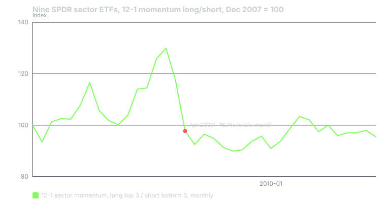

---
{
  "title": "Regime: Bull Tapes, Bear Tapes and the 2009 Momentum Crash",
  "duration": "17 min",
  "free": false,
  "status": "published",
  "quiz": [
    {"q": "In April 2009 the sector-ETF momentum book was long XLV, XLP and XLU and short XLB, XLI and XLF. The longs returned +1.8% and the shorts +18.5%. The book's return was:", "opts": ["+20.3%", "−16.7%", "+1.8%", "0%"], "correct": 1, "explain": "A long/short book earns the long return minus the short return: 1.8% − 18.5% = −16.7%. The strategy was short exactly the sectors that led the rebound."},
    {"q": "Why do momentum strategies crash after bear markets specifically?", "opts": ["Because volume dries up", "Because after a crash the strategy is positioned long the sectors that fell least and short those that fell most, and a rebound reverses both legs at once", "Because dividends are cut", "Because the calendar turns"], "correct": 1, "explain": "The formation window during a bear market ranks defensives at the top and cyclicals and financials at the bottom. The rebound favours the bottom, so both legs lose together."},
    {"q": "Between 2009-03-09 and 2009-05-29, XLF gained about 97% while XLP gained about 20%. For a long-only swing trader who was not short anything, the same episode showed up as:", "opts": ["Nothing; it did not affect long-only traders", "Their top-ranked defensive names stalling while names at the bottom of the ranking ran hardest, so the ranking gave the wrong list for weeks", "A dividend windfall", "A margin call"], "correct": 1, "explain": "Long-only traders do not lose on the short leg, but they hold the wrong list. The ranking lags the rotation by the length of its lookback."},
    {"q": "Over the 2024-12 to 2026-08 backtest, adding a filter that required SPY to be above its 200-day average cut trades from 100 to 80 and expectancy from +0.30R to +0.12R. The lesson's conclusion is:", "opts": ["Regime filters never work", "The 21-month sample contained a V-shaped recovery in which the filter blocked the best entries; the long-run SPY evidence still supports the filter for risk, so the decision should rest on the long evidence", "The filter should be inverted", "The backtest is wrong"], "correct": 1, "explain": "One short sample with one sharp recovery is the kind of period a trend filter is worst at. Judging a regime rule on 21 months would be the same error as judging momentum on one period in lesson 1."},
    {"q": "Conditioning the sector momentum book on whether SPY was above its 10-month average at the prior month end, the mean monthly return was about +0.10% in both states. What differed?", "opts": ["Nothing", "Volatility: 3.3% per month above the average versus 5.6% below, with the crash months all in the 'below' state", "The number of sectors", "The sign of the return"], "correct": 1, "explain": "The regime did not change the average. It changed the spread of outcomes, which is why the practical response is to reduce size rather than to stop trading."}
  ],
  "task": "For the index you trade against, note whether it is above its 200-day average and above its level of twelve months ago today, and write down which of the three sizing states from lesson 2 applies."
}
---

Momentum is a strategy with a good average and a bad tail. Lesson 1 said the tail arrives after bear markets; this lesson shows it with real sector data from 2009 and explains what the same mechanism does to a long-only swing trader who never shorts anything. It also reports, honestly, what a regime filter did to the course's own backtest, which is not what you would hope.

## What the research says about market state

Cooper, Gutierrez and Hameed (2004) sorted months by whether the market had risen or fallen over the prior three years and found that momentum profits were positive after up markets and essentially absent, on average slightly negative, after down markets. Their reading is behavioural: overconfidence builds in rising markets and produces the continuation that momentum harvests.

Daniel and Moskowitz (2016) went further and characterised the crashes. The momentum strategy's worst months, in 1932 and 2009 above all, occur when the market has fallen sharply and then rebounds. At that point the strategy is long whatever fell least, which is defensives, and short whatever fell most, which is cyclicals, small caps and financials. The short leg behaves like a written call option on the market: when the market rips, the losers rip most, and the strategy loses on both sides. They show the crashes are partly forecastable from the market's recent return and volatility, and Barroso and Santa-Clara (2015) show that scaling the strategy down when its own realised volatility is high removes most of the damage.

None of this says momentum stops working in bear markets in the sense of the ranking being useless. It says the strategy's risk changes shape, and the change is concentrated in the recovery.

## Worked example

Data: monthly adjusted closes for the nine original SPDR sector ETFs (XLB, XLE, XLF, XLI, XLK, XLP, XLU, XLV, XLY) from Yahoo Finance's chart API, pulled 2026-09-24, plus daily bars for 2007 to 2010 for two dated checks. The strategy: at each month end, rank the nine on their 12-1 return (the return from twelve months ago to one month ago), go long the top three and short the bottom three, equal weight, hold one month, repeat. Returns are before costs and before any interest on the short proceeds.

The three months of the 2009 crash, with the leg returns:

| Month | Long (top 3) | Long return | Short (bottom 3) | Short return | Book return |
|---|---|---|---|---|---|
| March 2009 | XLP, XLV, XLU | +4.1% | XLI, XLB, XLF | +13.8% | −9.7% |
| April 2009 | XLV, XLP, XLU | +1.8% | XLB, XLI, XLF | +18.5% | −16.7% |
| May 2009 | XLV, XLP, XLK | +4.7% | XLE, XLI, XLF | +10.1% | −5.3% |

The book return is the long return minus the short return: for April, 1.8 − 18.5 = −16.7%. Compounded over the three months: (1 − 0.097) × (1 − 0.167) × (1 − 0.053) − 1 = 0.903 × 0.833 × 0.947 − 1 = **−28.8%**. The longs made money in every one of those months. The book lost 29% because it was short the recovery.

The daily bars show how violent the short leg was. From the market low on 2009-03-09 to 2009-05-29, XLF rose from 4.06 to 8.02 on an adjusted basis, **+97.3%**. XLP, the consumer staples fund at the top of the momentum ranking, rose **+19.8%** over the same eleven weeks. A strategy that was long staples and short financials was long the thing that went up 20% and short the thing that went up 97%.

April 2009 is the worst month in the whole 2000 to 2026 history of this book. The other five worst are instructive because they are all the same shape:

| Month | Book return | Long | Short | What happened |
|---|---|---|---|---|
| 2009-04 | −16.7% | XLV, XLP, XLU | XLB, XLI, XLF | Post-crisis rebound |
| 2001-01 | −13.7% | XLU, XLP, XLF | XLY, XLB, XLK | Surprise rate cut, tech and cyclical rally |
| 2023-01 | −11.2% | XLE, XLP, XLU | XLB, XLK, XLY | Rebound after the 2022 bear |
| 2020-04 | −10.2% | XLK, XLU, XLP | XLI, XLB, XLE | Rebound after the March 2020 crash |
| 2009-03 | −9.7% | XLP, XLV, XLU | XLI, XLB, XLF | The bottom |
| 2012-01 | −9.4% | XLU, XLP, XLV | XLI, XLB, XLF | Rebound after the 2011 correction |

Every one is a rebound in which the book was long defensives and short cyclicals. There is no other kind of bad month in this strategy's history.

Over the full period, February 2000 to September 2026, 321 months: the book finished at 1.045 times its starting value, before costs, with a maximum drawdown of −45%. By sub-period: 2000 to 2007, −7.6%; 2008 alone, +14.5% (short financials in a crash is the strategy's best trade); 2009, −16.4%; 2010 to 2026, +18.1%. Nine sector funds are a poor cross-section, as lesson 2 said, and the result is reported as it came out.

Condition the same book on the index. At each prior month end, was SPY above or below its 10-month moving average? Above (241 months): mean +0.10% per month, standard deviation 3.3%. Below (80 months): mean +0.09%, standard deviation 5.6%. The average did not change. The dispersion did, by a factor of 1.7, and every crash month in the table above fell in the "below" state. Regime is a risk variable, not a return variable.

## Chart

## What this does to a long-only swing trader

You do not short the losers, so you do not lose on the short leg. What you hold instead is the wrong list. In March 2009 a six-month relative-strength ranking of large-cap stocks was topped by the defensives that had fallen least, and the names that were about to double sat at the bottom. Your breakout triggers would have fired in the wrong names or not at all, and the stocks you had dismissed as broken would have gapped past every 20-day high on your screen. The ranking lags the rotation by the length of its lookback, which for a six-month ranking is a long time to hold the wrong list.

The defences are the ones already in the course: size by ATR, because volatility rises before the crash; cap heat; and use the time-series check from lesson 2 as a dial on size. What follows is what one specific regime filter did in the course's own test.

The backtest in lesson 12 was rerun with one addition: no new entries unless SPY closed above its 200-day average on the signal day. Trades fell from 100 to 80 and expectancy fell from +0.30R to **+0.12R**. The filter hurt. The reason is visible in the trade list: AVGO entered 2025-04-28 for +4.62R, and several other strong trades, were taken during the recovery from the spring 2025 correction while SPY was still below its 200-day average. The 21-month sample contained one V-shaped recovery and the filter blocked the best entries in it.

Two things can be true. On this sample the filter cost 0.18R per trade. Over 1994 to 2026 on SPY, the state variable in lesson 2 cut the worst drawdown from 51% to 19% at about the same terminal wealth. Deciding the regime rule on the 21 months would be the same mistake as deciding momentum on the single period in lesson 1. Decide it on the long evidence, and expect it to cost you in every sharp recovery.

## Sources

- Cooper, M. J., Gutierrez, R. C. and Hameed, A. (2004). Market states and momentum. *Journal of Finance*, 59(3), 1345–1365. https://doi.org/10.1111/j.1540-6261.2004.00665.x
- Daniel, K. and Moskowitz, T. J. (2016). Momentum crashes. *Journal of Financial Economics*, 122(2), 221–247. https://doi.org/10.1016/j.jfineco.2015.12.002
- Barroso, P. and Santa-Clara, P. (2015). Momentum has its moments. *Journal of Financial Economics*, 116(1), 111–120. https://doi.org/10.1016/j.jfineco.2014.11.010
- Yahoo Finance historical data, XLF: https://finance.yahoo.com/quote/XLF/history/
