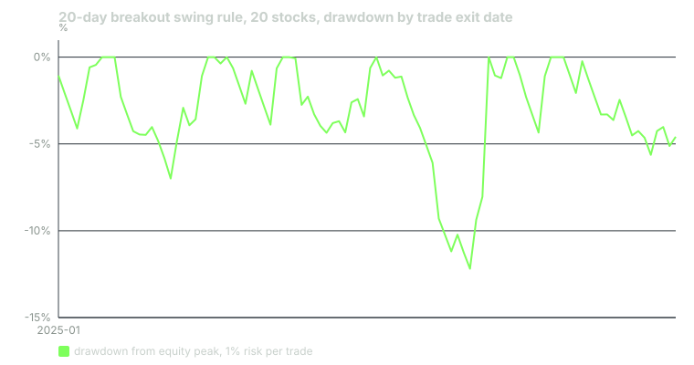

---
{
  "title": "Building and Testing a Swing System on History",
  "duration": "18 min",
  "free": false,
  "status": "published",
  "quiz": [
    {"q": "The backtest charges 0.10% per side. On the NVDA system trade (entry 149.27, exit 175.17, risk 7.66 per share) the cost turned a gross +3.38R into:", "opts": ["+3.38R, costs do not affect R", "+3.34R", "+2.38R", "+1.69R"], "correct": 1, "explain": "Entry becomes 149.27 × 1.001 = 149.42 and exit 175.17 × 0.999 = 174.99; (174.99 − 149.42) / 7.66 = 3.34R. About 0.04R per trade, which across 100 trades was 13% of the edge."},
    {"q": "Across 100 trades the expectancy was +0.30R with a 44% win rate, and the ten best trades contributed 44.4R of the 29.8R total. Therefore:", "opts": ["The other 90 trades were also profitable on balance", "The other 90 trades netted about −14.6R; the system's entire profit came from its tail, which is normal for momentum and means missing a few big trades would have erased the result", "The ten best trades should be excluded as outliers", "The win rate is the important number"], "correct": 1, "explain": "29.8 − 44.4 = −14.6R for the remaining ninety. A skewed distribution is the signature of a trend system and the reason a trailing exit, not a target, is used."},
    {"q": "Trades entered in 2025 produced +32.8R over 58 trades; trades entered in 2026 produced −2.0R over 41. The lesson's reading is:", "opts": ["The system stopped working in 2026", "One 21-month sample contains one good year and one flat stretch; the result is consistent with a positive-expectancy rule and with a lucky one, and only more history or live forward records can tell them apart", "2026 data should be discarded", "The rule needs re-optimising for 2026"], "correct": 1, "explain": "A test this short cannot distinguish edge from a favourable period. Reporting the split by year, rather than only the total, is what makes that visible."},
    {"q": "Why does the backtest fill entries at the next session's open rather than at the signal close?", "opts": ["Opens are more liquid", "Because the signal is only known after the close, so a fill at that close would be a price you could not have obtained; using the next open removes that look-ahead", "Brokers do not trade at the close", "It produces higher returns"], "correct": 1, "explain": "Filling at the signal close is the most common backtest error. It adds the overnight move to every trade in the direction of the signal."},
    {"q": "Bailey, Borwein, López de Prado and Zhu (2014) warn that:", "opts": ["Backtests are always accurate", "Trying enough parameter combinations on the same data will produce an impressive backtest by chance, and the number of trials must be reported for a result to mean anything", "Only annual data should be used", "Costs should be ignored in research"], "correct": 1, "explain": "Backtest overfitting is why this course tests one rule with parameters fixed in advance and reports the variants as variants, not as an optimisation."}
  ],
  "task": "Reproduce the baseline backtest for any five of the twenty stocks over 2025 using daily bars from Yahoo Finance, listing every trade with its entry, stop, exit and R, and compare your expectancy with the lesson's."
}
---

Everything in this course so far has been a component: a ranking, a trigger, a stop, a size, an exit. A system is what you get when you fix all of them in advance, run them over history without changing anything, and count. This lesson specifies one such system in full, runs it over the course's twenty stocks with realistic costs, shows one trade's arithmetic end to end, and reports the result including the part that did not work.

## The rule, fixed before the test

**Universe.** The twenty stocks used throughout: AAPL, MSFT, NVDA, AMZN, GOOGL, META, TSLA, AVGO, JPM, V, UNH, LLY, XOM, COST, HD, PG, NFLX, CAT, WMT, JNJ. Chosen for liquidity and familiarity, not by looking at their returns.

**Data.** Daily bars from Yahoo Finance's chart API, `https://query1.finance.yahoo.com/v8/finance/chart/<TICKER>?range=2y&interval=1d`, pulled 2026-09-24, covering 2024-09-24 to 2026-09-23. Signals are allowed from 2024-12-01, after the 50-day average and 14-day ATR have enough history, through 2026-08-31.

**Entry signal, evaluated on the close.** The close is above the highest high of the prior 20 sessions; the close is above the 50-day simple moving average; and the stock's 6-month return (126 sessions) ranks in the top half of the twenty. All three must be true. Fill at the next session's open.

**Stop.** Entry price minus 2 × ATR(14), where the ATR is taken as of the signal day. Risk per share is entry minus stop. If a session's low touches the stop, exit at the stop price; if a session opens below the stop, exit at that open.

**Exit.** After the entry session, if a close is below the lowest low of the prior 10 sessions, sell at the next open.

**Costs.** 0.10% of the trade value per side: 0.05% for commission and half the spread, 0.05% for slippage. Entry price is raised by 0.10%, exit price lowered by 0.10%.

**Position rules.** One position per stock at a time. Each trade risks 1% of current equity, so the R multiple of each trade maps directly to a percentage of the account.

Nothing above was chosen by looking at the results. The variants reported at the end were run once each, after the baseline, and are reported as variants.

## Worked example

One trade through the machine: NVDA, June 2025.

On 2025-06-24 NVDA closed at 147.90. The highest high of the prior 20 sessions was 146.20 (set 2025-06-20). The 50-day average was below the close and rising. NVDA's 6-month return, from the 2024-12-19 close, ranked fifth of twenty. All three conditions true; signal.

Entry at the 2025-06-25 open: **149.27**. ATR(14) on the signal day: **3.83**. Stop: 149.27 − 2 × 3.83 = 149.27 − 7.66 = **141.61**. Risk per share: **7.66**. On a $50,000 account risking $500, shares = 500 / 7.66 = 65.

The stop was never approached; the lowest low over the holding period was 149.26 on the entry day itself. On 2025-08-19 the close of 175.64 fell below the 10-day low of 175.90. Exit at the 2025-08-20 open: **175.17**.

Gross: (175.17 − 149.27) / 7.66 = 25.90 / 7.66 = **+3.38R**.
With costs: entry 149.27 × 1.001 = 149.42; exit 175.17 × 0.999 = 174.99; (174.99 − 149.42) / 7.66 = 25.57 / 7.66 = **+3.34R**.
Dollars: 65 shares × 25.57 = **$1,662**, or 3.3% of the account. Held 39 sessions.

This is the same trade lessons 5 and 6 entered a day later at 155.98 with the stop at 147.94, for +2.39R. The mechanical rule fired on the first close above the level, not the decisive-looking one, and the earlier entry was worth a full R.

Now the whole sample:

| Statistic | Baseline |
|---|---|
| Trades | 100 |
| Win rate | 44.0% |
| Average winner | +1.95R |
| Average loser | −1.00R |
| Expectancy per trade | **+0.30R** |
| Median trade | −0.39R |
| Total | +29.8R |
| Average hold | 21.5 sessions (median 15.5) |
| Exits: trailing / stop / gap through stop / still open | 58 / 33 / 8 / 1 |
| Average R by exit: trailing / stop / gap | +1.34 / −1.04 / −1.78 |
| Account, 1% risk per trade, compounded | **+32.2%** |
| Maximum drawdown | **−12.2%** |
| SPY, 2024-12-02 to 2026-08-31 | +27.1% |

Expectancy check: 0.44 × 1.95 + 0.56 × (−1.00) = 0.858 − 0.560 = +0.30R.

The median trade lost money. The ten best trades contributed 44.4R; the other ninety netted −14.6R. XOM entered 2025-12-30 made +8.84R and CAT entered 2025-09-17 made +7.28R; remove those two and the expectancy halves. That is not a flaw to fix. It is what a trend system's distribution looks like, and it is why lesson 8 rejected targets.

By year of entry: 2025, 58 trades, +32.8R. 2026, 41 trades, −2.0R. The system made its whole result in one calendar year and was flat in the next eight months. A 21-month test cannot tell you whether 2025 was the edge and 2026 the noise, or the other way round.

Costs: the same rule with zero costs gives +0.34R. The 0.10% per side removed 0.04R per trade, about 13% of the gross edge, and it would remove more for a trader paying a wider spread or trading less liquid names. Novy-Marx and Velikov (2016) found that transaction costs consume most of the paper return of high-turnover anomalies; this system trades about five times per stock per year, which is low turnover by their standards, and the cost still shows.

The variants:

| Change from baseline | Trades | Expectancy |
|---|---|---|
| No relative-strength filter | 147 | +0.16R |
| SPY above 200-day average required | 80 | +0.12R |
| Stop at 3 ATRs | 94 | +0.25R |
| 2R profit target instead of trail | 138 | +0.10R |
| Zero costs | 100 | +0.34R |

The relative-strength filter almost doubled expectancy while removing a third of the trades, which is the single strongest component result in the course. The regime filter hurt on this sample, for the reason given in lesson 10.

## Chart

## Three ways a backtest lies

**Look-ahead.** Filling at the signal close, using an ATR computed with the signal day included when the stop is set before the open, or ranking with returns that were not known at the time. Every fill in this test is at a price available after the signal was known.

**Survivorship.** The twenty stocks were chosen in 2026 and are all still listed and large. A universe chosen in 2024 might have included a name that fell out. The bias flatters the ranking filter in particular, because a stock that collapsed would have been ranked at the bottom and excluded anyway, but it also flatters everything else, and it cannot be removed without a point-in-time universe.

**Overfitting.** Bailey, Borwein, López de Prado and Zhu (2014) showed that with enough parameter trials on one dataset, the best backtest will look excellent by chance, and Harvey, Liu and Zhu (2016) argued that the hurdle for a new result should rise with the number of things that have been tried. This test tried one rule and five variants. If you change the lookbacks until the numbers improve, you have run dozens, and the improvement is the noise you selected.

## What the test supports and what it does not

It supports: the relative-strength filter adds expectancy; the trailing exit beats a target; costs matter but do not dominate; the result is carried by the tail. It does not support: any claim about the next 21 months. A positive expectancy on 100 trades with a −0.39R median and a −2.0R year inside it is consistent with a real edge of modest size and with a lucky sample, and the only things that separate those are more history and a forward record kept the same way. Lesson 13 asks you to produce the first, and the trade journal you keep from now on is the second.

## Sources

- Bailey, D. H., Borwein, J. M., López de Prado, M. and Zhu, Q. J. (2014). Pseudo-mathematics and financial charlatanism: the effects of backtest overfitting on out-of-sample performance. *Notices of the American Mathematical Society*, 61(5), 458–471. https://doi.org/10.1090/noti1105
- Harvey, C. R., Liu, Y. and Zhu, H. (2016). ... and the cross-section of expected returns. *Review of Financial Studies*, 29(1), 5–68. https://doi.org/10.1093/rfs/hhv059
- Novy-Marx, R. and Velikov, M. (2016). A taxonomy of anomalies and their trading costs. *Review of Financial Studies*, 29(1), 104–147. https://doi.org/10.1093/rfs/hhv063
- Yahoo Finance historical data, NVDA: https://finance.yahoo.com/quote/NVDA/history/
